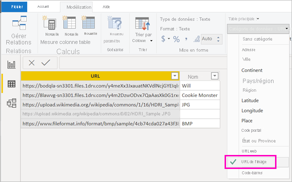

# Afficher des images dans un tableau, une matrice ou un segment dans un rapport

Un bon moyen d’améliorer vos rapports consiste à y ajouter des images. Les images statiques sur la page sont utiles dans certains cas. Mais parfois, vous souhaitez des images liées aux données de votre rapport. Cette rubrique explique comment afficher des images dans un tableau, une matrice, un segment ou une carte à plusieurs lignes. 

## Ajouter des images à votre rapport

1. Créez une colonne avec les URL des images. Pour plus d’informations sur les conditions requises, consultez [Considérations](#considerations) plus loin dans cet article.

1. Sélectionnez cette colonne. Dans le ruban **Modélisation**, pour **Catégorie de données**, sélectionnez **URL d’image**.

    

1. Ajoutez la colonne à une table, une matrice, un segment ou une carte à plusieurs lignes.

    

## Considérations

- L’image doit être dans un des formats de fichier suivants : .bmp, .jpg, .jpeg, .gif, .png ou .svg
- L’URL doit être accessible de manière anonyme, et non sur un site qui requiert une connexion, comme SharePoint. Toutefois, si des images sont hébergées sur SharePoint ou OneDrive, vous pouvez obtenir un code incorporé qui pointe directement vers elles. 

## Étapes suivantes

[Mise en page et mise en forme](/learn/modules/visuals-in-power-bi/12-formatting)

[Fondamentaux pour les concepteurs dans le service Power BI](../fundamentals/service-basic-concepts.md)

D’autres questions ? [Posez vos questions à la communauté Power BI](https://community.powerbi.com/)
