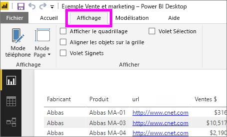
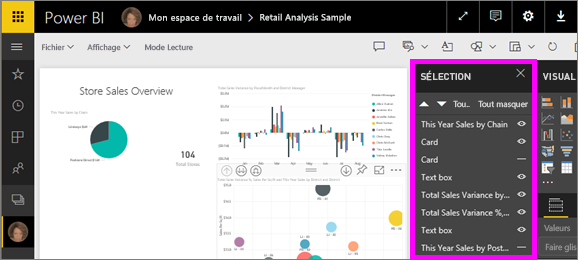
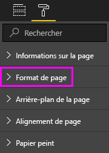

# Appliquer des paramètres d’affichage de page dans un rapport Power BI
Nous sommes conscients qu’il est essentiel de préserver la qualité de présentation de vos rapports. Cela n’est pas toujours évident, car vous et vos collègues pouvez consulter ces rapports sur des écrans de taille et de proportions différentes. 

L’affichage par défaut est **Ajuster à la page** et la taille d’affichage par défaut est **16:9**. Si vous voulez verrouiller des proportions différentes ou présenter votre rapport d’une autre façon, deux outils peuvent vous aider : les paramètres du **_mode Page_* _ et les paramètres de la _*_taille de page_*_.

<iframe width="560" height="315" src="https://www.youtube.com/embed/5tg-OXzxe2g" frameborder="0" allowfullscreen></iframe>

## Emplacement des paramètres de mode Page dans le service Power BI et Power BI Desktop
Les paramètres de mode Page sont disponibles aussi bien dans le service Power BI que dans Power BI Desktop, mais l’interface est un peu différente. Les sections suivantes expliquent où vous pouvez trouver des paramètres d’affichage dans chaque outil Power BI.

### Dans Power BI Desktop
En mode Rapport, sélectionnez l’onglet *Affichage* pour ouvrir les paramètres du mode Page ainsi que les paramètres du mode téléphone.

  

### Dans le service Power BI (app.powerbi.com)
Dans le service Power BI, ouvrez un rapport, puis sélectionnez **Affichage** à partir de la barre de menus supérieure gauche.

Les paramètres de mode Page sont disponibles à la fois en [mode Lecture et en mode Édition](../consumer/end-user-reading-view.md). En mode Édition, le propriétaire d’un rapport peut affecter des paramètres de mode Page à certaines pages d’un rapport. Ces paramètres sont alors enregistrés avec le rapport. Quand un collègue ouvre ce rapport en mode Lecture, il voit les pages du rapport s’afficher avec les paramètres du propriétaire. En mode Lecture, les collègues peuvent modifier *certains* des paramètres de **mode Page**, mais les modifications ne sont pas enregistrées lorsqu’ils quittent le rapport.

## Paramètres de mode Page
Le premier ensemble de paramètres de mode Page contrôle l’affichage de votre page de rapport dans la fenêtre du navigateur. Choisissez parmi les options suivantes :

* **Ajuster à la page** (valeur par défaut) : le contenu est ajusté en fonction de la page
* **Ajuster à la largeur** : le contenu est ajusté en fonction de la largeur de la page
* **Taille réelle** : le contenu est affiché dans sa taille réelle

Le deuxième ensemble de paramètres de mode Page contrôle le positionnement des objets sur le canevas de rapport. Choisissez parmi les options suivantes :

* **Afficher le quadrillage** : activez le quadrillage pour vous aider à positionner les objets sur le canevas de rapport.
* **Aligner sur la grille** : utilisez cette option avec **Afficher le quadrillage** pour positionner et aligner précisément les objets sur le canevas de rapport. 
* **Verrouiller les objets** : verrouillez tous les objets sur le canevas afin qu’ils ne puissent pas être déplacés ni redimensionnés.
* **Volet Sélection** : le volet **Sélection** liste tous les objets sur le canevas. Vous pouvez décider lesquels afficher et masquer.

    

## Paramètres Taille de la page

Les paramètres **Taille de la page** sont disponibles uniquement pour les propriétaires de rapports. Dans le service Power BI (app.powerbi.com), vous devez donc ouvrir le rapport en [mode Édition](../consumer/end-user-reading-view.md). Les paramètres **Taille de la page** figurent dans le volet **Visualisations** et permettent de contrôler les proportions et la taille réelle (en pixels) d’affichage du canevas de rapport :   

* Proportions 4:3
* Proportions 16:9 (par défaut)
* Lettre
* Personnalisé (hauteur et largeur en pixels)

## Étapes suivantes
[Vue Rapport dans Power BI Desktop](desktop-report-view.md)

[Modifier les paramètres de mode Page et Taille de la page dans vos propres rapports Power BI](../consumer/end-user-report-view.md)

En savoir plus sur les [rapports dans Power BI](../consumer/end-user-reports.md)

[Fondamentaux pour les concepteurs dans le service Power BI](../fundamentals/service-basic-concepts.md)

D’autres questions ? [Posez vos questions à la communauté Power BI](https://community.powerbi.com/)
