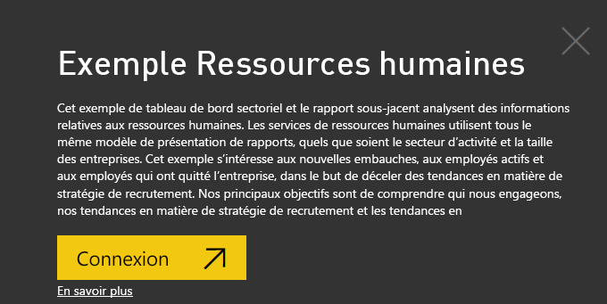
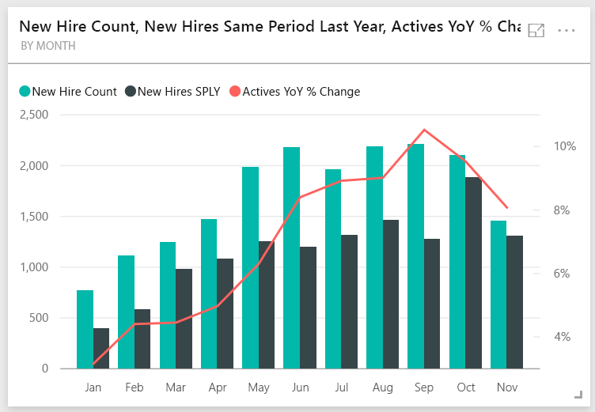
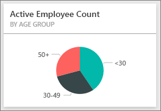
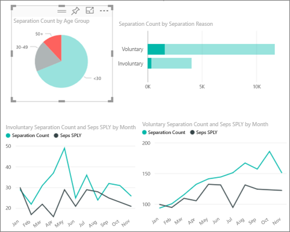
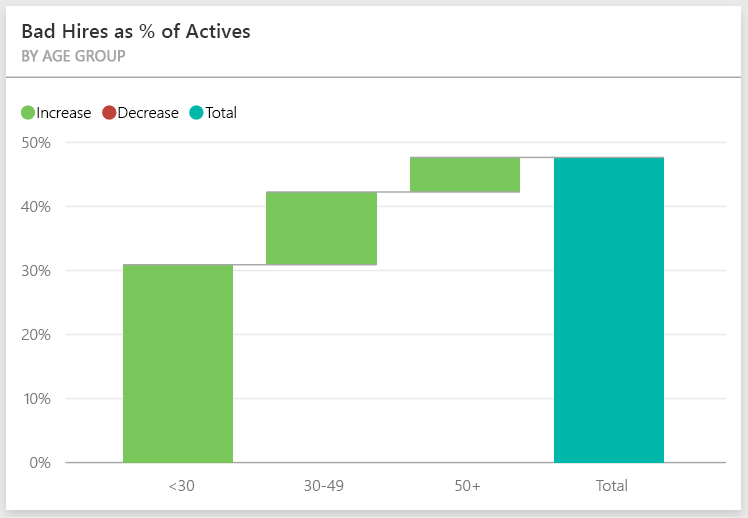
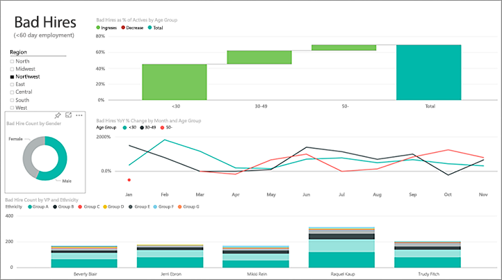
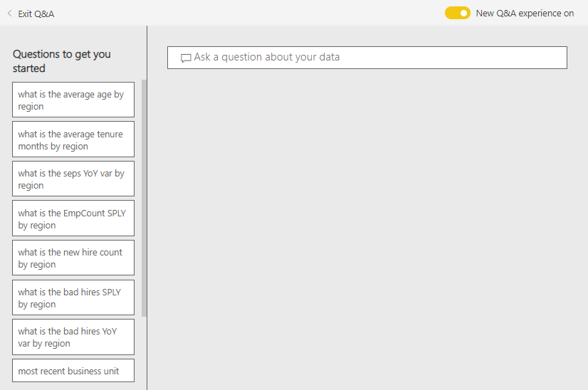

# Exemple Ressources humaines pour Power BI : Visite guidée

Le pack de contenu de l’exemple Ressources humaines contient un tableau de bord, un rapport et un jeu de données pour le service des ressources humaines. Dans cet exemple, les services de ressources humaines utilisent tous le même modèle de présentation de rapports, quels que soient le secteur d’activité et la taille des entreprises. Cet exemple s’intéresse aux nouvelles embauches, aux employés actifs et aux employés qui ont quitté l’entreprise. Il vise à déceler des tendances en matière de stratégie de recrutement. Nos principaux objectifs sont répondre aux questions :

* Qui embauchons-nous ?
* Quelles sont nos tendances en matière de stratégie de recrutement ?
* Quelles sont les tendances en matière de départs volontaires ?

Cet exemple fait partie d’une série d’exemples qui illustre la façon dont vous pouvez utiliser Power BI avec des données, des rapports et des tableaux de bord orientés métier. Il a été créé par [obviEnce](http://www.obvience.com/) avec des données réelles qui sont présentées de façon anonyme. Les données sont disponibles dans plusieurs formats : pack de contenu, fichier .pbix Power BI Desktop ou classeur Excel. Consultez [Exemples pour Power BI](sample-datasets.md). 

Ce tutoriel utilise le pack de contenu Exemple Ressources humaines dans le service Power BI. Les expériences d’utilisation des rapports étant similaires dans Power BI Desktop et dans le service, vous pouvez également poursuivre avec et l’exemple de fichier .pbix dans Power BI Desktop. 

Vous n’avez pas besoin d’une licence Power BI pour explorer les exemples dans Power BI Desktop. Si vous n’avez pas de licence Power BI Pro, vous pouvez enregistrer l’exemple dans votre espace Mon espace de travail du service Power BI. 

## Obtenir l’exemple

Avant de pouvoir utiliser l’exemple, vous devez le télécharger en tant que [pack de contenu](#get-the-content-pack-for-this-sample), [fichier .pbix](#get-the-pbix-file-for-this-sample) ou [classeur Excel](#get-the-excel-workbook-for-this-sample).

### Se procurer le pack de contenu pour cet exemple

1. Ouvrez le service Power BI (app.powerbi.com), connectez-vous et ouvrez l’espace de travail où vous souhaitez enregistrer l’exemple.

   Si vous n’avez pas de licence Power BI Pro, vous pouvez enregistrer l’exemple dans votre espace Mon espace de travail.

2. Dans le coin inférieur gauche, sélectionnez **Obtenir des données**.
   
   
3. Dans la page **Obtenir des données** qui s’affiche, sélectionnez **Exemples**.
   
4. Sélectionnez l’**exemple Ressources humaines**, puis choisissez **Se connecter**.  
   
   

5. Power BI importe le pack de contenu, puis ajoute un tableau de bord, un rapport et un jeu de données à votre espace de travail actuel.
   
   
  
### Se procurer le fichier .pbix pour cet exemple

Vous pouvez également télécharger l’exemple Ressources humaines en tant que [fichier .pbix](https://download.microsoft.com/download/6/9/5/69503155-05A5-483E-829A-F7B5F3DD5D27/Human%20Resources%20Sample%20PBIX.pbix), qui est conçu pour une utilisation avec Power BI Desktop.

### Se procurer le classeur Excel pour cet exemple

Si vous souhaitez afficher la source de données de cet exemple, elle est également disponible en tant que [classeur Excel](https://go.microsoft.com/fwlink/?LinkId=529780). Le classeur contient des feuilles Power View que vous pouvez consulter et modifier. Pour afficher les données brutes, activez les compléments Analyse de données, puis sélectionnez **Power Pivot > Gérer**. Pour plus d’informations sur l’activation des compléments Power View et Power Pivot, consultez [Explorer des échantillons Excel dans Excel](sample-datasets.md#explore-excel-samples-inside-excel).

## Nouvelles recrues
Commençons par explorer les nouvelles recrues.

1. Dans votre espace de travail, sélectionnez l’onglet **Tableaux de bord** , puis ouvrez le tableau de bord **Exemple Ressources humaines**.
2. Dans le tableau de bord, sélectionnez la vignette **New Hire Count, New Hires Same Period Last Year, Actives YoY % Change (Nombre de nouvelles recrues, Nouvelles recrues l’année dernière à la même période, Évolution du nombre d’actifs d’une année sur l’autre (%) par mois)** .  

     

   L’exemple de rapport de ressources humaines s’ouvre à la page **Nouvelles recrues** .  

   

3. Notes ces quelques points intéressants :

    * Le graphique combiné **New Hire Count, New Hires SPLY and Actives YoY % Change by Month** (Nombre de nouvelles recrues, Nouvelles recrues l’année dernière à la même période, Évolution du nombre d’actifs d’une année sur l’autre (%)) montre que nous avons embauché plus de personnes par mois cette année que l’année dernière, et ce, dans des proportions considérables pendant certains mois.
    * Dans le graphique combiné **New Hire Count and Active Employee Count by Region and Ethnicity**(Nouvelles recrues et actifs par région et par origine ethnique), notez que nous embauchons moins de personnes dans la région **East** (Est).
    * Le graphique en cascade **New Hires YoY Var by Age Group** (Variation des nouvelles recrues d’une année sur l’autre par tranche d’âge) montre que nous embauchons principalement des jeunes. Cette tendance est peut-être due au fait qu’il s’agit essentiellement de postes à temps partiel.
    * Le graphique en secteurs **New Hire Count by Gender** (Nombre de nouvelles recrues par sexe) présente une parité assez homogène.

    Pouvez-vous trouver d’autres informations ? Par exemple, existe-t-il une région où il n’y a pas de parité entre hommes et femmes ? 

4. Sélectionnez, dans les graphiques, les différentes tranches d’âge et les sexes pour explorer les rapports entre l’âge, le sexe, la région et l’origine ethnique.

5. Sélectionnez **Human Resource Sample** (Exemple Ressources humaines) dans la barre de navigation supérieure pour revenir au tableau de bord.

   

## Comparaison entre les employés actifs et les anciens employés
Explorons les données pour les employés actifs et les employés qui ne travaillent plus dans l’entreprise.

1. Dans le tableau de bord, sélectionnez la vignette **Active Employee Count by Age Group** (Nombre d’employés actifs par tranche d’âge).

   

   L’exemple de rapport Ressources humaines s’ouvre à la page **Active Employees vs. Separations** (Employés actifs/cessations d’emploi).  

   

 2. Notes ces quelques points intéressants :

    * Les deux graphiques combinés à gauche montrent l’évolution d’une année sur l’autre pour les employés actifs et les cessations d’emploi. Nous avons davantage d’employés actifs cette année en raison de l’accélération du rythme d’embauches, mais il y a aussi plus de cessations d’emploi que l’année dernière.
    * En août, les cessations d’emploi ont été plus nombreuses par rapport aux autres mois. Sélectionnez les différentes tranches d’âge, les sexes ou les régions pour voir si vous pouvez repérer d’autres points aberrants.
    * En examinant les graphiques en secteurs, nous constatons une répartition équitable entre nos employés actifs par sexe et par tranche d’âge. Sélectionnez les différentes tranches d’âge pour voir la répartition des hommes et des femmes par âge. La parité entre hommes et femmes existe-t-elle dans chaque tranche d’âge ?

## Motifs de cessation d’emploi
Examinons le rapport en mode Edition. Vous pouvez modifier les graphiques en secteurs pour afficher les données des personnes ayant quitté l’entreprise plutôt que celles des employés actifs.

1. Sélectionnez **Modifier le rapport** en haut à gauche.

2. Sélectionnez le graphique en secteurs **Active Employee Count by Age Group** (Nombre d’employés actifs par tranche d’âge).

3. Dans **Champs**, sélectionnez **Employees** (Employés) pour développer la table **Employees** (Employés). Décochez la case **Active Employee Count** (Nombre d’employés actifs) pour supprimer ce champ.

4. Sélectionnez **Separation Count** (Nombre de cessations d’emploi) dans la table **Employees** pour l’ajouter à la zone **Values** (Valeurs) dans la zone **Champs**.

5. Dans la zone de dessin, sélectionnez la barre **Voluntary** (Volontaire) dans le graphique à barres **Separation Count by Separation Reason** (Nombre de cessations d’emploi par motif). 

   Cette barre permet de mettre en évidence le nombre de départs volontaires dans les autres visuels du rapport.

6. Sélectionnez le secteur 50+ du graphique **Separation Count by Age Group (Nombre de cessations d’emploi par tranche d’âge)** .

7. Examinez le graphique en courbes en bas à droite. Ce graphique est filtré pour afficher les départs volontaires.  

   

   Avez-vous remarqué la tendance pour la tranche d’âge 50+ ? Durant la dernière partie de l’année, les employés de plus de 50 ans sont plus nombreux à quitter volontairement l’entreprise. Cette tendance mériterait d’être analysée de manière plus approfondie avec des données supplémentaires.

8. Vous pouvez également suivre les mêmes étapes pour le graphique en secteurs **Active Employee Count by Gender** (Nombre d’employés actifs par sexe) en remplaçant les employés actifs par les personnes ayant quitté l’entreprise. Examinez les données sur les départs volontaires par sexe pour voir si vous trouvez d’autres indications.

9. Sélectionnez **Human Resource Sample** (Exemple Ressources humaines) dans la barre de navigation supérieure pour revenir au tableau de bord. Vous pouvez choisir d’enregistrer les modifications apportées au rapport.

## Erreurs de recrutement
Le dernier domaine à explorer est celui des erreurs de recrutement. Les erreurs de recrutement représentent les employés qui ne sont pas restés plus de 60 jours en poste. Nos recrutements s’accélèrent, mais recrutons-nous les bons candidats ?

1. Cliquez sur la vignette de tableau de bord **Bad Hires as % of Actives by Age Group** (Erreurs de recrutement en % d’actifs par tranche d’âge). Le rapport s’ouvre dans le troisième onglet, **Bad Hires** (Erreurs de recrutement).

     
2. Cochez la case **Northwest** (Nord-ouest) dans le segment de la **région** sur la gauche, puis sélectionnez **Male** (Masculin) dans le graphique en anneau **Bad Hire Count by Gender** (Erreurs de recrutement par sexe). Examinez les autres graphiques de la page **Bad Hires** (Erreurs de recrutement). Notez que les erreurs de recrutement concernent plus les hommes que les femmes et touchent souvent le groupe A.

     

3. En examinant le graphique en anneau **Bad Hires by Gender** (Erreurs de recrutement par sexe) et en sélectionnant différentes régions dans le segment **Region** (Région), nous constatons que la région est (« East ») est la seule où les erreurs de recrutement concernent plus les femmes que les hommes.  

4. Sélectionnez le nom du tableau de bord dans le volet de navigation du haut pour revenir au tableau de bord.

## Poser une question dans la zone Q&R du tableau de bord
Dans la [zone Q&R](power-bi-tutorial-q-and-a.md) du tableau de bord, vous pouvez poser une question concernant vos données en utilisant un langage naturel. Q&R reconnaît les mots que vous tapez et cherche l’emplacement dans le jeu de données où se trouve la réponse.

1. Sélectionnez la zone questions des Q&R. Notez qu’avant même que vous commenciez à taper votre question, Q&R affiche des suggestions de formulation de votre question.

   

2. Vous pouvez sélectionner l’une de ces suggestions ou entrer : *show age group, gender and bad hires SPLY where region is east* (afficher le groupe d’âge, le sexe et les mauvais recrutements l’année dernière à la même période dans la région est).  

   

   Notez que la plupart des femmes rentrant dans la catégorie « Erreurs de recrutement » ont moins de 30 ans.

## Étapes suivantes : Vous connecter à vos données
Cet environnement est sécurisé pour y jouer, étant donné que vous pouvez choisir ne pas enregistrer vos modifications. Mais si vous les enregistrez, vous pouvez toujours sélectionner **Obtenir des données** pour obtenir une nouvelle copie de cet exemple.

Nous espérons que cette visite guidée vous a montré comment les tableaux de bord, Questions et réponses et les rapports Power BI peuvent fournir des insights sur des exemples de données. À présent, c’est votre tour : connectez-vous à vos propres données. Avec Power BI, vous pouvez vous connecter à une grande variété de sources de données. Pour en savoir plus, consultez [Prise en main du service Power BI](../fundamentals/service-get-started.md).
