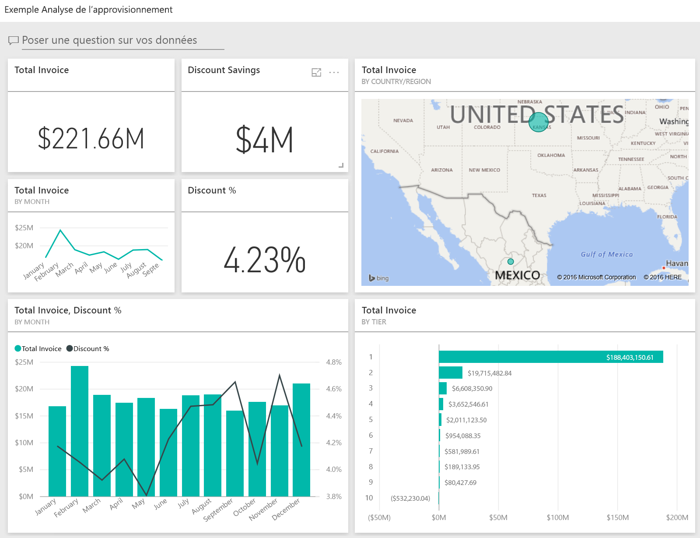
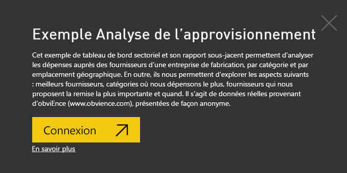
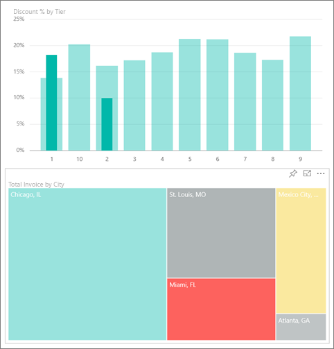

# Exemple Analyse de l’approvisionnement pour Power BI : visite guidée

Le pack de contenu d’échantillons Analyse de l’approvisionnement contient un tableau de bord, un rapport et un jeu de données qui analyse les dépenses d’une entreprise de fabrication auprès des fournisseurs par catégorie et par emplacement. Dans cet exemple, nous explorons les points suivants :

* Quels sont les meilleurs fournisseurs ?
* Dans quelles catégories dépensons-nous le plus ?
* Quels sont les fournisseurs qui nous proposent les plus fortes remises et quand ?

Cet exemple fait partie d’une série d’exemples qui illustre la façon dont vous pouvez utiliser Power BI avec des données, des rapports et des tableaux de bord orientés métier. Il a été créé par [obviEnce](http://www.obvience.com/) avec des données réelles qui sont présentées de façon anonyme. Les données sont disponibles dans plusieurs formats : pack de contenu, fichier .pbix Power BI Desktop ou classeur Excel. Consultez [Exemples pour Power BI](sample-datasets.md). 

Ce tutoriel explore le pack de contenu Exemple Analyse de l’approvisionnement dans le service Power BI. Les expériences d’utilisation des rapports étant similaires dans Power BI Desktop et dans le service, vous pouvez également poursuivre avec et l’exemple de fichier .pbix dans Power BI Desktop. 

Vous n’avez pas besoin d’une licence Power BI pour explorer les exemples dans Power BI Desktop. Si vous n’avez pas de licence Power BI Pro, vous pouvez enregistrer l’exemple dans votre espace Mon espace de travail du service Power BI. 

## Obtenir l’exemple

Avant de pouvoir utiliser l’exemple, vous devez le télécharger en tant que [pack de contenu](#get-the-content-pack-for-this-sample), [fichier .pbix](#get-the-pbix-file-for-this-sample) ou [classeur Excel](#get-the-excel-workbook-for-this-sample).

### Se procurer le pack de contenu pour cet exemple

1. Ouvrez le service Power BI (app.powerbi.com), connectez-vous et ouvrez l’espace de travail où vous souhaitez enregistrer l’exemple. 

    Si vous n’avez pas de licence Power BI Pro, vous pouvez enregistrer l’exemple dans votre espace Mon espace de travail.

2. Dans le coin inférieur gauche, sélectionnez **Obtenir des données**.

    
3. Dans la page **Obtenir des données** qui s’affiche, sélectionnez **Exemples**.

4. Sélectionnez **Exemple Analyse de l’approvisionnement**, puis choisissez **Se connecter**.  
  
   
   
5. Power BI importe le pack de contenu, puis ajoute un tableau de bord, un rapport et un jeu de données à votre espace de travail actuel.
   
   
  
### Se procurer le fichier .pbix pour cet exemple

Vous pouvez aussi télécharger l’exemple Analyse de l’approvisionnement sous forme de [fichier .pbix](https://download.microsoft.com/download/D/5/3/D5390069-F723-413B-8D27-5888500516EB/Procurement%20Analysis%20Sample%20PBIX.pbix), qui est conçu pour être utilisé avec Power BI Desktop. 

### Se procurer le classeur Excel pour cet exemple

Si vous souhaitez afficher la source de données de cet exemple, elle est également disponible en tant que [classeur Excel](https://go.microsoft.com/fwlink/?LinkId=529784). Le classeur contient des feuilles Power View que vous pouvez consulter et modifier. Pour afficher les données brutes, activez les compléments Analyse de données, puis sélectionnez **Power Pivot > Gérer**. Pour plus d’informations sur l’activation des compléments Power View et Power Pivot, consultez [Explorer des échantillons Excel dans Excel](sample-datasets.md#explore-excel-samples-inside-excel).

## Tendances en matière de dépenses
Commençons par rechercher les tendances en matière de dépenses par catégorie et par emplacement.  

1. Dans l’espace de travail où vous avez enregistré l’exemple, ouvrez l’onglet **Tableaux de bord**, puis recherchez le tableau de bord **Exemple Analyse de l’approvisionnement** et sélectionnez-le. 
2. Sélectionnez la vignette du tableau de bord, **Total Invoice by Country/Region**, ce qui ouvre la page **Spend Overview** du rapport **Procurement Analysis Sample**.

    

Notez les points suivants :

* Dans le graphique en courbes **Total Invoice by Month and Category** : la catégorie **Direct** présente des dépenses homogènes, la catégorie **Logistics** présente un pic en décembre et **Other** présente un pic en février.
* Dans la carte **Total Invoice by Country/Region** : la plupart de nos dépenses se font aux États-Unis.
* Dans l’histogramme **Total Invoice by Sub Category** : les sous-catégories **Hardware** et **Indirect Goods & Services** sont les plus importantes.
* Dans le graphique à barres **Total Invoice by Tier**, nous traitons essentiellement avec nos fournisseurs de niveau 1 (les 10 principaux). Procéder ainsi nous permet de mieux gérer les relations avec les fournisseurs.

## Dépenses au Mexique
Explorons les postes de dépenses au Mexique.

1. Dans la carte **Total Invoice by Country/Region**, sélectionnez la bulle **Mexico**. Notez que dans l’histogramme **Total Invoice by Sub Category**, la plupart des dépenses concernent la sous-catégorie **Indirect Goods & Services**.

   
2. Explorez la colonne **Indirect Goods & Services** (Biens et services indirects) :

   * Dans le graphique **Total Invoice by Sub Category**, sélectionnez la flèche d’exploration  dans le coin supérieur droit du graphique.
   * Sélectionnez la colonne **Indirect Goods & Services** (Biens et services indirects).

      Comme vous pouvez le voir, les dépenses les plus élevées sont de loin celles de la sous-catégorie **Sales & Marketing**.
   * Sélectionnez à nouveau **Mexique** dans la carte.

      Pour Mexico, les dépenses les plus élevées sont dans la sous-catégorie **Maintenance & Repair**.

      
3. Sélectionnez la flèche vers le haut dans le coin supérieur gauche du graphique pour remonter d’un niveau.
4. Sélectionnez à nouveau la flèche pour désactiver l’exploration.  
5. Dans le volet de navigation du haut, sélectionnez **Exemple Analyse de l’approvisionnement** pour revenir au tableau de bord.

## Évaluer différentes villes
Nous pouvons utiliser la mise en évidence pour évaluer différentes villes.

1. Sélectionnez la vignette du tableau de bord, **Total Invoice, Discount % By Month**, ce qui ouvre la page **Discount Analysis** du rapport **Procurement Analysis Sample**.
2. Dans le graphique de compartimentage **Total Invoice by City**, sélectionnez chaque ville tour à tour pour les comparer. Notez que presque toutes les factures de Miami proviennent de fournisseurs de niveau 1.

   

## Remises fournisseur
Intéressons-nous aussi aux remises pratiquées par les fournisseurs, ainsi qu’aux périodes où ils les consentent le plus souvent :
* Les remises sont-elles différentes chaque mois ou restent-elles identiques ?
* Certaines villes obtiennent-elles davantage de remises que d’autres ?

### Remises par mois
Si vous examinez le graphique combiné **Total Invoice and Discount % by Month**, vous pouvez observer que février est le mois où l’activité est la plus forte, tandis que septembre est le mois le plus calme. 

Examinez le pourcentage de remise au cours de ces mois : quand le volume augmente, la remise se réduit, et quand le volume est faible, elle augmente. Plus nous avons besoin de remises, moins nous faisons de bonnes affaires.

### Remises par ville
Un autre point à explorer est celui des remises par ville. Sélectionnez chaque ville tour à tour dans le graphique de compartimentage pour voir comment évoluent les autres graphiques :

* Pour Saint-Louis, le total de facturation a connu pic important en février et des remises en forte baisse en avril.
* C’est à Mexico City que le pourcentage de remise est le plus élevé (11,05 %), le plus faible étant constaté à Atlanta (0,08 %).

### Modifier le rapport
Sélectionnez **Modifier le rapport** en haut à gauche et faites une exploration en mode Edition :

* Regardez comment les pages sont faites.
* Ajoutez des pages et des graphiques basés sur les mêmes données.
* Changez le type de visualisation pour un graphique : par exemple, changez le graphique de compartimentage en graphique en anneau.
* Épinglez des graphiques à votre tableau de bord.

## Étapes suivantes : Connexion à vos données
Cet environnement est sécurisé pour y jouer, étant donné que vous pouvez choisir ne pas enregistrer vos modifications. Mais si vous les enregistrez, vous pouvez toujours sélectionner **Obtenir des données** pour obtenir une nouvelle copie de cet exemple.

Nous espérons que cette visite guidée vous a montré comment les tableaux de bord, Questions et réponses et les rapports Power BI peuvent fournir des insights sur des exemples de données. À présent, c’est votre tour : connectez-vous à vos propres données. Avec Power BI, vous pouvez vous connecter à une grande variété de sources de données. Pour en savoir plus, consultez [Prise en main du service Power BI](../fundamentals/service-get-started.md).
