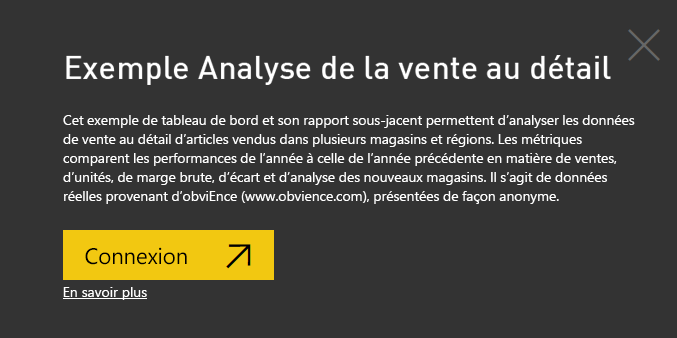
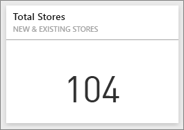
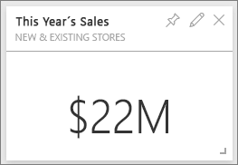
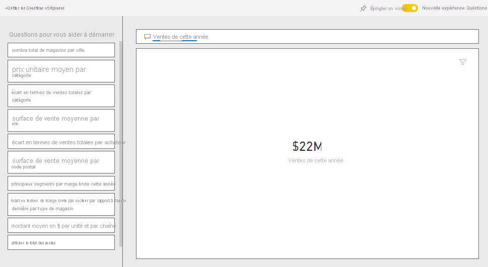
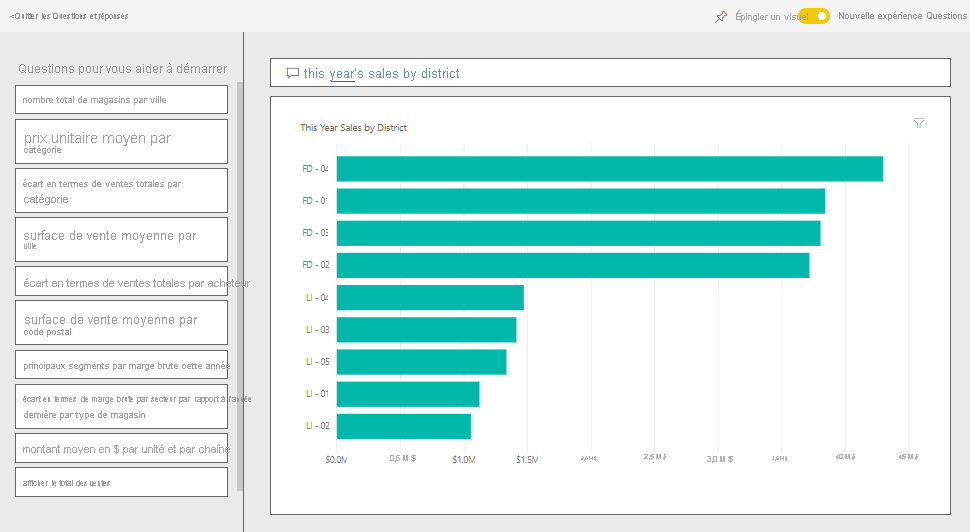
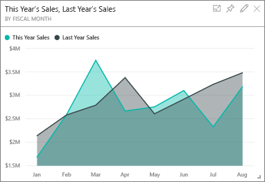
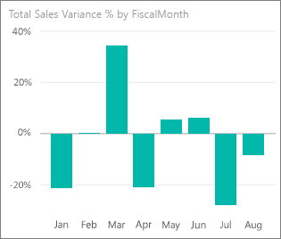
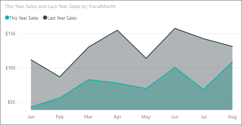
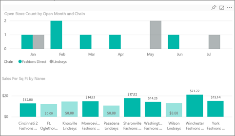

# Retail Analysis sample pour Power BI : Visite guidée

Le pack de contenu Exemple Analyse de la vente au détail contient un tableau de bord, un rapport et un jeu de données qui analyse les données de ventes au détail d’articles vendus dans plusieurs magasins et régions. Les mesures comparent les performances de cette année à celles de l’année précédente en matière de volume des ventes, d’unités, de marge brute et d’écart et permettent une analyse des nouveaux magasins. 

Cet exemple fait partie d’une série d’exemples qui illustre la façon dont vous pouvez utiliser Power BI avec des données, des rapports et des tableaux de bord orientés métier. Il a été créé par [obviEnce](http://www.obvience.com/) avec des données réelles qui sont présentées de façon anonyme. Les données sont disponibles dans plusieurs formats : pack de contenu, fichier .pbix Power BI Desktop ou classeur Excel. Consultez [Exemples pour Power BI](sample-datasets.md). 

Ce tutoriel explore le pack de contenu Exemple Analyse de la vente au détail dans le service Power BI. Les expériences d’utilisation des rapports étant similaires dans Power BI Desktop et dans le service, vous pouvez également poursuivre avec et l’exemple de fichier .pbix dans Power BI Desktop. 

Vous n’avez pas besoin d’une licence Power BI pour explorer les exemples dans Power BI Desktop. Si vous n’avez pas de licence Power BI Pro, vous pouvez enregistrer l’exemple dans votre espace Mon espace de travail du service Power BI. 

## Obtenir l’exemple

 Avant de pouvoir utiliser l’exemple, vous devez le télécharger en tant que [pack de contenu](#get-the-content-pack-for-this-sample), [fichier .pbix](#get-the-pbix-file-for-this-sample) ou [classeur Excel](#get-the-excel-workbook-for-this-sample).

### Se procurer le pack de contenu pour cet exemple

1. Ouvrez le service Power BI (app.powerbi.com), connectez-vous et ouvrez l’espace de travail où vous souhaitez enregistrer l’exemple. 

    Si vous n’avez pas de licence Power BI Pro, vous pouvez enregistrer l’exemple dans votre espace Mon espace de travail.

2. Dans le coin inférieur gauche, sélectionnez **Obtenir des données**.

    
3. Dans la page **Obtenir des données** qui s’affiche, sélectionnez **Exemples**.
   
4. Sélectionnez **Exemple Analyse de la vente au détail**, puis choisissez **Se connecter**.  
  
   
   
5. Power BI importe le pack de contenu, puis ajoute un tableau de bord, un rapport et un jeu de données à votre espace de travail actuel.
   
   
  
### Se procurer le fichier .pbix pour cet exemple

Vous pouvez aussi télécharger l’Exemple Analyse de la vente au détails en tant que [fichier .pbix](https://download.microsoft.com/download/9/6/D/96DDC2FF-2568-491D-AAFA-AFDD6F763AE3/Retail%20Analysis%20Sample%20PBIX.pbix), qui est conçu pour être utilisé avec Power BI Desktop. 

### Se procurer le classeur Excel pour cet exemple

Si vous souhaitez afficher la source de données de cet exemple, elle est également disponible en tant que [classeur Excel](https://go.microsoft.com/fwlink/?LinkId=529778). Le classeur contient des feuilles Power View que vous pouvez consulter et modifier. Pour afficher les données brutes, activez les compléments Analyse de données, puis sélectionnez **Power Pivot > Gérer**. Pour plus d’informations sur l’activation des compléments Power View et Power Pivot, consultez [Explorer des échantillons Excel dans Excel](sample-datasets.md#explore-excel-samples-inside-excel).

## Démarrer sur le tableau de bord et ouvrir le rapport

1. Dans l’espace de travail où vous avez enregistré l’exemple, ouvrez l’onglet **Tableaux de bord**, puis recherchez le tableau de bord **Exemple Analyse de la vente au détail** et sélectionnez-le. 
2. Dans le tableau de bord, sélectionnez la vignette **Total Stores New & Existing Stores**, qui s’ouvre dans la page **Store Sales Overview** du rapport Retail Analysis Sample. 

     

   Dans cette page du rapport, vous voyez que nous avons un total de 104 magasins, 10 d’entre eux étant nouveaux. Nous avons deux chaînes, Fashions Direct et Lindseys. Les magasins Fashions Direct sont en moyenne plus grands.
3. Dans le graphique en secteurs **This Year Sales by Chain**, sélectionnez **Fashions Direct**.

     

   Notez le résultat dans le graphique en bulles **Total Sales Variance %**  :

     

   La région **FD-01** a la moyenne la plus élevée pour **Sales per Square Foot**, et FD-02 a **Total Sales Variance** le plus faible par rapport à l’année dernière. FD-03 et FD-04 sont au global les régions les moins performantes.
4. Sélectionnez des bulles individuelles ou d’autres graphiques pour mettre en évidence des informations croisées, reflétant l’impact de vos sélections.
5. Pour revenir au tableau de bord, sélectionnez **Exemple Analyse de la vente au détail** dans le volet de navigation du haut.

   
6. Dans le tableau de bord, sélectionnez la vignette **This Year’s Sales New & Existing Stores**, ce qui équivaut à taper *This year sales* dans la zone Questions et réponses.

   

   Les résultats de Questions et réponses apparaissent :

   

## Examiner une vignette créée avec Q&R de Power BI
Effectuons une étude plus détaillée.

1. Changez la question en _this year sales **by district**_ . Observez le résultat : Questions et réponses met automatiquement la réponse dans un graphique à barres et suggère d’autres expressions :

   
2. Changez maintenant la question en _this year sales **by zip and chain**_ .

   Notez comment Power BI répond à la question au fil de la frappe et affiche le graphique approprié.
3. Essayez avec d’autres questions pour voir quel type de résultats vous obtenez.
4. Lorsque vous êtes prêt, retournez au tableau de bord.

## Explorer plus en détail les données
Effectuons maintenant un examen encore plus détaillé, en observant les performances des régions.

1. Dans le tableau de bord, sélectionnez la vignette **This Year’s Sales, Last Year’s Sales**, qui ouvre la page **District Monthly Sales** du rapport.

   

   Dans le graphique **Total Sales Variance % by Fiscal Month**, notez l’importance de la variation de l’écart en % par rapport à l’année dernière, janvier, avril et juillet étant des mois particulièrement mauvais.

   

   Voyons si nous pouvons cerner avec précision les problèmes.
2. Dans le graphique en bulles, sélectionnez la bulle **020-Mens**.

     

   Notez que même si la catégorie des hommes n’a pas été aussi durement touchée en avril que l’ensemble de l’activité, janvier et juillet restent quand même des mois problématiques.
1. Sélectionnez la bulle **010-Womens**.

   

   Notez aussi que la catégorie des femmes s’est comportée d’une façon bien pire que l’activité globale pour tous les mois, et d’une façon bien pire également dans presque tous les mois en comparaison avec l’année précédente.
1. Sélectionnez à nouveau la bulle pour effacer le filtre.

## Essayer le segment
Examinons les performances des différentes régions.

1. Sélectionnez **Allan Guinot** dans le sélecteur **District Manager** situé en haut à gauche.

   

   Notez que la région d’Allan a obtenu les meilleures performances en mars et en juin, en comparaison avec l’année dernière.
2. Avec **Allan Guinot** toujours sélectionné, sélectionnez la bulle **Womens-10** dans le graphique en bulles.

   

   Notez que pour la catégorie Womens-10, la région d’Allan n’a pas atteint le volume de l’année dernière.
3. Examinez les autres responsables de région et catégories : quels autres insights êtes-vous susceptible de trouver ?
4. Quand vous êtes prêt, revenez au tableau de bord.

## Ce que disent les données sur l’augmentation des ventes cette année
Le dernier domaine que nous voulons explorer est notre croissance, en examinant les nouveaux magasins ouverts cette année.

1. Sélectionnez la vignette **Stores Opened This Year by Open Month, Chain**, qui ouvre la page **New Stores Analysis** du rapport.

   

   Comme le montre clairement la vignette, il s’est ouvert cette année davantage de magasins Fashions Direct que de magasins Lindseys.
2. Observez le graphique **Sales Per Sq Ft by Name** :

   

    Notez la différence dans la moyenne des ventes rapportée à la surface pour les nouveaux magasins.
3. Sélectionnez l’élément de légende **Fashions Direct** dans le graphique **Open Store Count by Open Month and Chain** en haut à droite. Notez que, même pour la même chaîne, le meilleur magasin (Winchester Fashions Direct) a été nettement plus performant que le plus mauvais magasin (Cincinnati 2 Fashions Direct), avec respectivement 21,22 $ contre 12,86 $.

   
4. Sélectionnez **Winchester Fashions Direct** dans le sélecteur **Name**, puis observez le graphique en courbes. Les premiers chiffres de ventes ont été rapportés en février.
5. Sélectionnez **Cincinnati 2 Fashions Direct** dans le sélecteur : vous voyez dans le graphique en courbes qu’il a été ouvert en juin et qu’il est le magasin le moins performant.
6. Explorez en sélectionnant d’autres barres, lignes et bulles dans les graphiques afin de découvrir d’autres insights.

## Étapes suivantes : Vous connecter à vos données
Cet environnement est sécurisé pour y jouer, étant donné que vous pouvez choisir ne pas enregistrer vos modifications. Mais si vous les enregistrez, vous pouvez toujours sélectionner **Obtenir des données** pour obtenir une nouvelle copie de cet exemple.

Nous espérons que cette visite guidée vous a montré comment les tableaux de bord, Questions et réponses et les rapports Power BI peuvent fournir des insights sur des exemples de données. À présent, c’est votre tour : connectez-vous à vos propres données. Avec Power BI, vous pouvez vous connecter à une grande variété de sources de données. Pour en savoir plus, consultez [Prise en main du service Power BI](../fundamentals/service-get-started.md).
