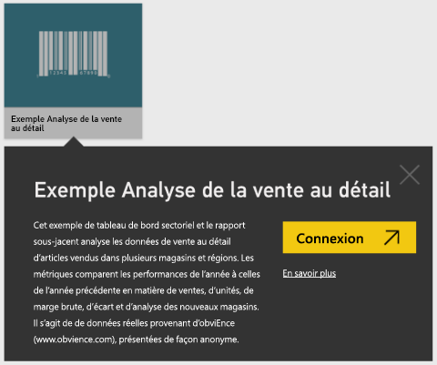
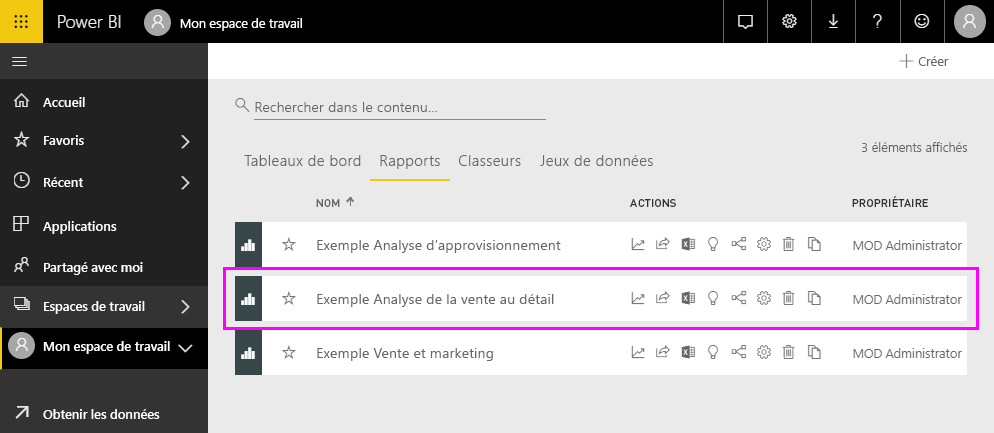
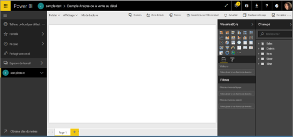
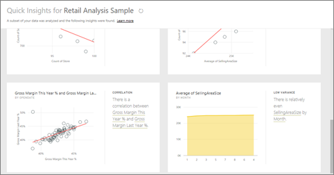
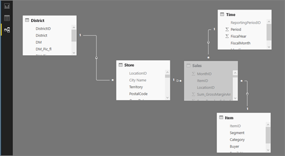

# Explorer l’échantillon Analyse de la vente au détail

Ce didacticiel montre comment : 
- Importez le pack de contenu de l’échantillon Analyse de la vente au détail, ajoutez-le au service Power BI et ouvrez le contenu. Un *pack de contenu* est un type d’exemple où le jeu de données est fourni avec un tableau de bord et un rapport. 
- Ouvrez le fichier .pbix de l’échantillon Analyse de la vente au détail dans Power BI Desktop.

Si vous souhaitez plus d’informations générales, consultez l’article [Exemples de jeux de données pour Power Bi](sample-datasets.md). Celui-ci présente ce qu’il vous faut savoir sur les exemples : comment les obtenir, où les enregistrer, comment les utiliser, ainsi que certains récits que les exemples peuvent illustrer. 

## Prérequis
Les exemples sont disponibles pour le service Power BI et pour Power BI Desktop. Nous utilisons l’échantillon Analyse de la vente au détail si vous souhaitez vous y référer.

Le pack de contenu de l’exemple *Analyse de la vente au détail* utilisé dans ce didacticiel comprend un tableau de bord, un rapport et un jeu de données.
Pour vous familiariser avec ce pack de contenu et son scénario, consultez l’article [Retail Analysis sample for Power BI: Take a tour](sample-retail-analysis.md) (Exemple Analyse de la vente au détail : visite guidée) avant de commencer.

## Importez l’échantillon dans le service Power BI

1. Ouvrez le service Power BI (app.powerbi.com), connectez-vous et ouvrez l’espace de travail où vous souhaitez enregistrer l’exemple. 

    Si vous n’avez pas de licence Power BI Pro, vous pouvez enregistrer l’exemple dans votre espace Mon espace de travail.

2. Sélectionnez **Obtenir des données** en bas du volet de navigation. 

   

   Si vous ne voyez pas **Obtenir des données**, développez le volet de navigation en sélectionnant l’icône suivante en haut du volet : .

5. Dans la page **Obtenir des données** qui s’affiche, sélectionnez **Exemples**.
   
6. Sélectionnez **Exemple Analyse de la vente au détail**, puis choisissez **Se connecter**.   
   
   

## Qu’est-ce qui a été importé?
Lorsque vous sélectionnez **Se connecter** en utilisant un exemple de pack de contenu, Power BI obtient une copie de ce pack de contenu et la stocke pour vous dans le cloud. Comme la personne qui a créé le pack de contenu y a inclus un jeu de données, un rapport et un tableau de bord, vous obtenez ces éléments lorsque vous sélectionnez **Se connecter**. 

1. Lorsque vous sélectionnez **Se connecter**, Power BI crée le tableau de bord et le répertorie dans l’onglet **Tableaux de bord**. 
   
   
2. Ouvrez l’onglet **Rapports**. Vous pouvez constater la présence d’un nouveau rapport nommé *Exemple Analyse de la vente au détail*.
   
   
   
   Découvrez le contenu de l’onglet **Jeux de données** ; il contient un nouveau jeu de données.
   
   

## Explorer votre nouveau contenu
À présent, vous pouvez explorer le tableau de bord, le jeu de données et le rapport. Il existe différentes manières d’accéder à vos tableaux de bord, rapports et jeux de données. L’une de ces méthodes est décrite dans la procédure suivante.  

1. Revenez à l’onglet **Tableaux de bord**, puis sélectionnez le tableau de bord **Exemple Analyse de la vente au détail** pour l’ouvrir.       

   Le tableau de bord s’ouvre ; il comporte différentes vignettes de visualisation.   
 
1. Dans le tableau de bord, sélectionnez une vignette pour ouvrir le rapport sous-jacent. Dans cet exemple, nous allons sélectionner le graphique en aires **Ventes de cette année, ventes de l’année dernière par mois fiscal**.  

   

   Le rapport s’ouvre sur la page qui contient le graphique en aires que vous avez sélectionné. Ici, il s’agit de la page **Ventes mensuelles du district** du rapport.
   
   
   
   > [!NOTE]
   > Si la vignette a été créée à l’aide de [Questions et réponses Power BI](power-bi-tutorial-q-and-a.md), c’est la page Questions et réponses qui s’ouvre. Si la vignette a été [épinglée à partir d’Excel](service-dashboard-pin-tile-from-excel.md), c’est Excel Online qui s’ouvre dans Power BI.
   > 
   > 
1. Lorsqu’un utilisateur partage un pack de contenu avec des collègues, il souhaite généralement partager uniquement les insights, et non permettre un accès direct aux données. Dans l’onglet **Jeux de données**, vous disposez de plusieurs options pour l’exploration de votre jeu de données. Toutefois, vous ne pouvez pas afficher les lignes et colonnes de vos données, comme vous pouvez le faire dans Power BI Desktop ou Excel. 
   
   
   
1. L’une des méthodes employées pour l’exploration d’un jeu de données consiste à créer vos propres visualisations et rapports à partir de zéro. Sélectionnez l’icône de graphique  pour ouvrir le jeu de données en mode Édition de rapports.
     
   

1. Une autre méthode d’exploration d’un jeu de données consiste à exécuter la fonctionnalité [Quick Insights](../consumer/end-user-insights.md). Sélectionnez **Plus d’options** (...), puis choisissez **Obtenir des insights rapides**. Lorsque les informations sont prêtes, sélectionnez **Afficher les informations**.
     
    

## Télécharger l’échantillon dans Power BI Desktop 
À la première ouverture du fichier .pbix d’exemple dans Power BI Desktop, la vue Rapport s’affiche. Elle permet d’explorer, de créer et de modifier les pages de rapport souhaitées avec des visualisations. La vue Rapport offre pratiquement la même expérience de conception que le mode Édition d’un rapport dans le service Power BI. Vous pouvez déplacer des visualisations et effectuer des opérations comme copier-coller, fusionner, etc. 

Contrairement à la modification d’un rapport dans le service Power BI, dans Power BI Desktop, vous pouvez également utiliser vos requêtes et modéliser vos données pour obtenir les meilleures analyses possibles dans les rapports. Vous pouvez ensuite enregistrer votre fichier Power BI Desktop à l’emplacement de votre choix (lecteur local ou cloud).

1. Téléchargez le [fichier .pbix de l’exemple Analyse de la vente au détail](https://download.microsoft.com/download/9/6/D/96DDC2FF-2568-491D-AAFA-AFDD6F763AE3/Retail%20Analysis%20Sample%20PBIX.pbix) et ouvrez-le dans Power BI Desktop. 

    

1. Le fichier s’ouvre dans l’affichage Rapport. Notez les quatre onglets situés au bas de l’éditeur de rapport. Ces onglets représentent les quatre pages de ce rapport. Pour cet exemple, la page **Nouveaux magasins** est actuellement sélectionnée. 

    .

1. Pour procéder à un examen plus approfondi de l’éditeur de rapport, consultez la section [Visite guidée de l’éditeur de rapport](service-the-report-editor-take-a-tour.md).

## Contenu de votre rapport
Lorsque vous téléchargez un exemple de fichier .pbix, vous téléchargez non seulement un rapport, mais aussi le *jeu de données sous-jacent*. Lorsque vous ouvrez le fichier, Power BI Desktop charge les données avec les requêtes et les relations qui leur sont associées. Vous pouvez afficher les données et les relations sous-jacentes, mais pas les requêtes sous-jacentes dans l’éditeur de requête.

1. Basculez dans la [vue Données](../connect-data/desktop-data-view.md) en sélectionnant l’icône de table .
 
    

    Dans la vue Données, vous pouvez inspecter, explorer et comprendre les données de votre modèle Power BI Desktop. Elle diffère de la façon dont vous affichez les données, les colonnes et les tables dans l’éditeur de requête. Les données de la vue Données sont déjà chargées dans le modèle.

    Quand vous modélisez vos données, il arrive que vous souhaitiez consulter le contenu réel des lignes et des colonnes d’une table sans créer de visuel sur le canevas de rapport. Cela est particulièrement vrai lorsque vous créez des mesures et des colonnes calculées ou quand vous devez identifier un type de données ou une catégorie de données.

1. Basculez vers la [vue Relation](../transform-model/desktop-relationship-view.md) en sélectionnant l’icône suivante : .
 
    

    La Vue de relations présente toutes les tables, colonnes et relations du modèle. Elle permet d’afficher, de modifier et de créer des relations.

## Étapes suivantes
Cet environnement est sécurisé pour y jouer, étant donné que vous pouvez choisir ne pas enregistrer vos modifications. Mais si vous les enregistrez, vous pouvez toujours sélectionner **Obtenir des données** pour obtenir une nouvelle copie de cet exemple.

Nous espérons que cette visite guidée vous a montré comment les tableaux de bord, jeux de données, relations et rapports Power BI peuvent fournir des insights sur des exemples de données. À présent, c’est votre tour : connectez-vous à vos propres données. Avec Power BI, vous pouvez vous connecter à une grande variété de sources de données. Pour en savoir plus, consultez les articles [Tutoriel : Bien démarrer avec le service Power BI](../fundamentals/service-get-started.md) et [Prise en main de Power BI Desktop](../fundamentals/desktop-getting-started.md).  

Pour plus d’informations, consultez :  
- [Fondamentaux pour les concepteurs dans le service Power BI](../fundamentals/service-basic-concepts.md)
- [Exemples pour Power BI](sample-datasets.md)
- [Sources de données pour Power BI](../connect-data/service-get-data.md)

D’autres questions ? [Posez vos questions à la communauté Power BI](https://community.powerbi.com/)
