# Créer un tableau de bord à partir d’un rapport
Vous avez lu [Présentation des tableaux de bord dans Power BI](service-dashboards.md) et souhaitez maintenant créer les vôtres. Il existe différentes façons de créer un tableau de bord. Par exemple, vous pouvez créer un tableau de bord à partir d’un rapport, à partir de rien, à partir d’un jeu de données, en dupliquant un tableau de bord existant.  

Nous allons commencer par créer un tableau de bord simple et rapide affichant des visualisations d’un rapport déjà généré. 

Après avoir lu cet article, vous aurez une bonne compréhension des aspects suivants :
- Relation entre les tableaux de bord et les rapports
- Comment ouvrir le Mode Édition dans l’éditeur de rapport
- Comment épingler des vignettes 
- Comment naviguer entre un tableau de bord et un rapport 
 
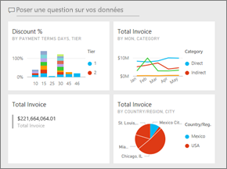

> [!NOTE] 
> Les tableaux de bord sont une fonctionnalité du service Power BI et non de Power BI Desktop. Vous ne créez pas de tableaux de bord dans les apps mobiles Power BI, mais vous pouvez [les afficher et les partager](../consumer/mobile/mobile-apps-view-dashboard.md) à cet endroit.
>
> 

## Vidéo : Créer un tableau de bord en épinglant des éléments visuels et des images provenant d’un rapport
Regardez Amanda créer un tableau de bord en épinglant des visualisations et des images provenant d’un rapport. Ensuite, suivez les étapes décrites dans la section suivant [Importer un jeu de données avec un rapport](#import-a-dataset-with-a-report) pour essayer par vous-même avec l’exemple Analyse de l’approvisionnement.
    

<iframe width="560" height="315" src="https://www.youtube.com/embed/lJKgWnvl6bQ" frameborder="0" allowfullscreen></iframe>

## Importer un jeu de données avec un rapport
Dans cette procédure étape par étape, nous allons importer l’un des exemples de jeu de données Power BI et l’utiliser pour créer notre tableau de bord. L’exemple que nous allons utiliser est un classeur Excel avec deux feuilles PowerView. Lorsque Power BI importe le classeur, il ajoute un jeu de données et un rapport à votre espace de travail. Le rapport est automatiquement créé à partir des feuilles PowerView.

1. Téléchargez le [fichier Excel](https://go.microsoft.com/fwlink/?LinkId=529784) exemple Analyse de l’approvisionnement. Nous vous recommandons de l’enregistrer dans votre OneDrive Entreprise.
2. Ouvrez le service Power BI dans votre navigateur (app.powerbi.com).
3. Dans le volet de navigation, sélectionnez **Mon espace de travail**, puis **Obtenir les données**.

    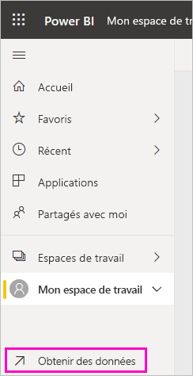
5. Sous **Fichiers**, sélectionnez **Obtenir**.

   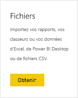
6. Naviguez jusqu'à l’emplacement où vous avez enregistré le fichier Excel de l’exemple Analyse de l’approvisionnement. Sélectionnez-le et choisissez **Connecter**.

   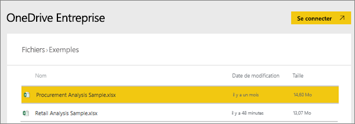
7. Dans cet exercice, sélectionnez **Importer**.

    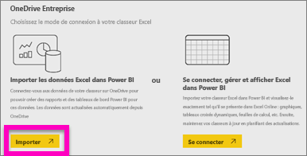
8. Lorsque le message de réussite s’affiche, sélectionnez **x** pour l’ignorer.

   

> [!TIP]
> Le saviez-vous ? Vous pouvez réduire le volet de navigation en sélectionnant l’icône avec trois lignes en haut . Vous disposez ainsi de plus d’espace pour le rapport lui-même.

### Ouvrir le rapport et épingler des vignettes à votre tableau de bord
1. Dans le même espace de travail, sélectionnez l’onglet **Rapports**, puis l’**Exemple Analyse de l’approvisionnement** pour ouvrir le rapport.

     Le rapport s’ouvre en mode Lecture. Notez qu’il comporte deux onglets sur la gauche : **Discount Analysis** (Analyse des remises) et **Spend Overview** (Vue d’ensemble des dépenses). Chaque onglet représente une page du rapport.

2. Sélectionnez **Plus d’options (...)**  > **Modifier le rapport** pour ouvrir le rapport en Mode Édition.

    
3. Pointez sur une visualisation pour afficher les options disponibles. Pour ajouter une visualisation à un tableau de bord, sélectionnez l’icône d’épingle .

    
4. Étant donné que nous créons un tableau de bord, sélectionnez l’option **Nouveau tableau de bord** et donnez-lui un nom.

    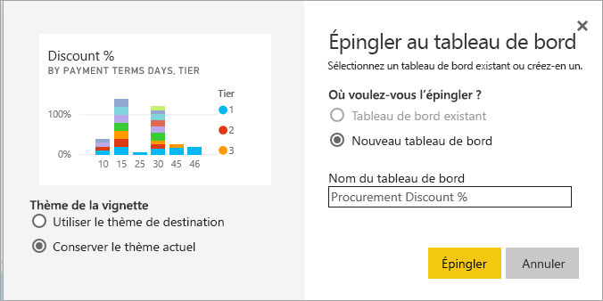
5. Lorsque vous sélectionnez **Épingler**, Power BI crée un nouveau tableau de bord dans l’espace de travail actuel. Lorsque le message **Épinglé au tableau de bord** s’affiche, sélectionnez **Accéder au tableau de bord**. Si vous êtes invité à enregistrer le rapport, choisissez **Enregistrer**.

    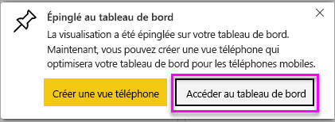

    Power BI ouvre le nouveau tableau de bord. Il comporte une vignette, la visualisation que vous venez d’épingler.

   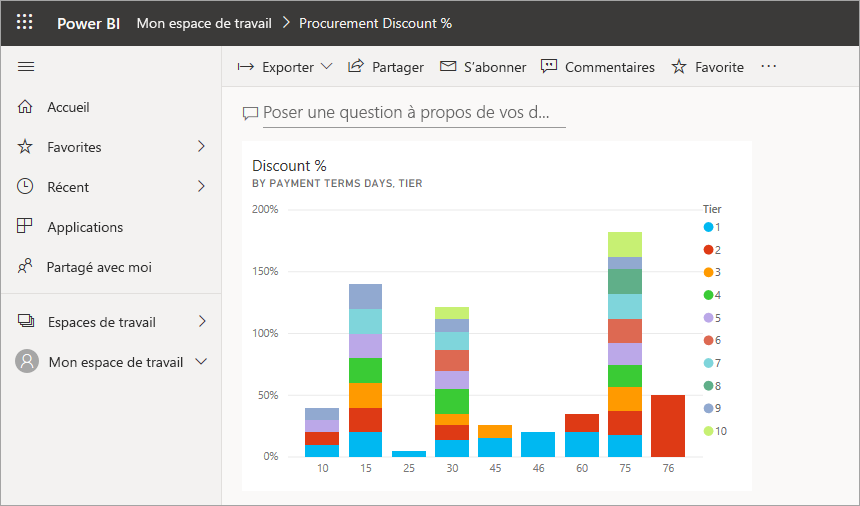
7. Pour revenir au rapport, sélectionnez la vignette. Épinglez d’autres vignettes au nouveau tableau de bord. Lorsque la fenêtre **Épingler au tableau de bord** s’affiche, sélectionnez **Tableau de bord existant**.  

   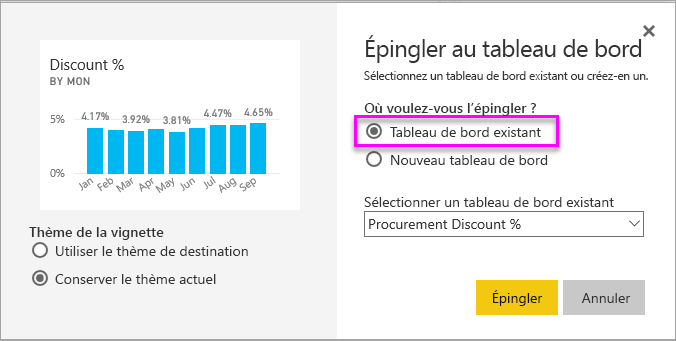

## Épingler la totalité d’une page de rapport à un tableau de bord
Au lieu d’épingler un visuel à la fois, vous pouvez [épingler une page de rapport tout entière comme *vignette dynamique*](service-dashboard-pin-live-tile-from-report.md). C’est parti.

1. Dans l’éditeur de rapport, sélectionnez l’onglet **Vue d’ensemble des dépenses** pour ouvrir la deuxième page du rapport.

   

2. Nous souhaitons afficher tous visuels du rapport sur votre tableau de bord. Dans le coin supérieur droit de la barre de menus, sélectionnez **Épingler une page dynamique**. Dans un tableau de bord, les vignettes de pages dynamiques se mettent à jour à chaque fois que la page est actualisée.

   

3. Lorsque la fenêtre **Épingler au tableau de bord** s’affiche, sélectionnez **Tableau de bord existant**.

   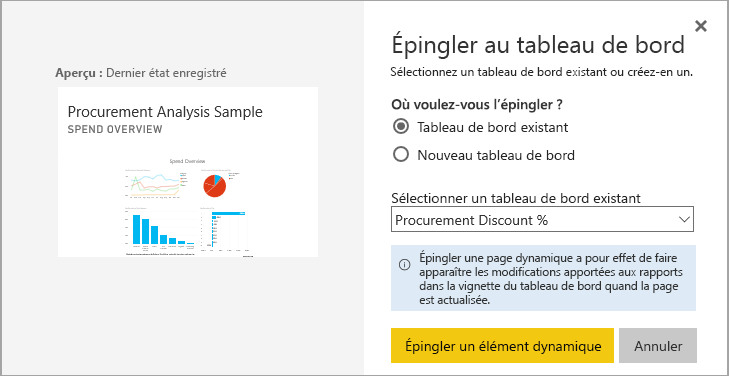

4. Dès que le message de réussite s’affiche, sélectionnez **Accéder au tableau de bord**. Les vignettes que vous avez épinglées à partir du rapport apparaîtront. Dans l’exemple ci-dessous, nous avons épinglé deux vignettes provenant de la première page du rapport et une vignette dynamique correspondant à la deuxième page du rapport.

   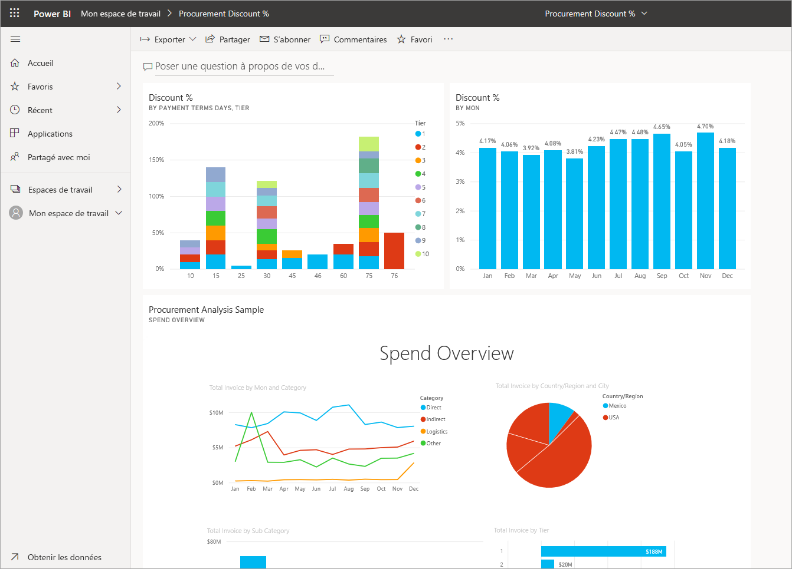

## Étapes suivantes
Félicitations pour la création de votre premier tableau de bord ! Maintenant que vous avez un tableau de bord, vous pouvez vous en servir pour de multiples usages. Suivez l’un des articles suggérés ci-dessous, ou commencez à explorer par vous-même : 

* [Redimensionner et déplacer des vignettes](service-dashboard-edit-tile.md)
* [Toutes les informations dont vous avez besoin sur les vignettes du tableau de bord](service-dashboard-tiles.md)
* [Partager votre tableau de bord en créant une application](../collaborate-share/service-create-workspaces.md)
* [Power BI – Concepts de base](../fundamentals/service-basic-concepts.md)
* [Conseils pour la conception d’un tableau de bord réussi](service-dashboards-design-tips.md)

D’autres questions ? [Posez vos questions à la Communauté Power BI](https://community.powerbi.com/).
