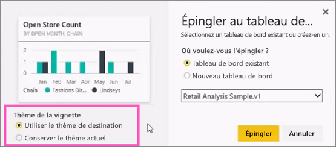
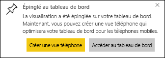

# Épingler une vignette à un tableau de bord Power BI à partir d’un rapport

Vous pouvez ajouter une [vignette de tableau de bord](../consumer/end-user-tiles.md) à partir d’un [rapport Power BI](../consumer/end-user-reports.md). Lorsque vous sélectionnez l’une de ces vignettes, elle s’ouvre dans le rapport.

Une page de rapport entière peut être épinglée à un tableau de bord. C’est ce qu’on appelle un épinglage de vignette *dynamique*. On parle de vignette dynamique parce qu’il est possible d’interagir avec elle sur le tableau de bord. Contrairement aux vignettes de visualisation individuelles, les modifications apportées au rapport sont automatiquement synchronisées avec le tableau de bord. Pour plus d’informations, voir [Épingler une page de rapport entière](#pin-an-entire-report-page).

Vous ne pouvez pas épingler des vignettes provenant de rapports partagés avec vous ou de Power BI Desktop. 

> [!TIP]
> Étant donné que certaines visualisations utilisent des images d’arrière-plan, l’épinglage peut ne pas fonctionner si l’image d’arrière-plan est trop grande. Essayez de réduire la taille de l’image ou de la compresser.  
> 
> 

## Ajouter une vignette à partir d’un rapport
Regardez Amanda créer un tableau de bord en épinglant des éléments visuels et des images provenant d’un rapport Power BI.
    

<iframe width="560" height="315" src="https://www.youtube.com/embed/lJKgWnvl6bQ" frameborder="0" allowfullscreen></iframe>

À présent, créez votre propre tableau de bord à l’aide de l’un des exemples de rapports Power BI.

1. Pointez sur la visualisation que vous voulez épingler, puis sélectionnez l’icône représentant d’épingle. . Power BI ouvre l’écran **Épingler au tableau de bord** .
   
     
2. Choisissez d’épingle la vignette à un tableau de bord existant ou à un nouveau tableau de bord.
   
   * **Tableau de bord existant** : sélectionnez le nom du tableau de bord dans la liste déroulante. Les tableaux de bord qui ont été partagés avec vous n’apparaissent pas dans la liste déroulante.
   * **Nouveau tableau de bord** : entrez le nom du nouveau tableau de bord.
3. Dans certains cas, l’élément que vous épinglez peut avoir un *thème* déjà appliqué. Par exemple, les éléments visuels épinglés à partir d’un classeur Excel. Dans ce cas, sélectionnez le thème à appliquer à la vignette.
4. Sélectionnez **Épingler**.
   
   Un message de réussite (en haut à droite) vous indique que la visualisation a été ajoutée, sous forme de vignette, à votre tableau de bord.
   
   
5. Dans le volet de navigation, sélectionnez le tableau de bord avec la nouvelle vignette. [Modifiez l’affichage et le comportement de la vignette](service-dashboard-edit-tile.md), ou sélectionnez la vignette pour revenir au rapport.

## Épingler une page de rapport entière
Une autre option consiste à épingler une page de rapport entière à un tableau de bord, ce qui constitue un moyen simple d’épingler plusieurs visualisations à la fois. Lorsque vous épinglez une page entière, les vignettes sont *dynamiques*. Cela signifie que vous pouvez interagir avec elles directement sur le tableau de bord. Les modifications apportées aux visualisations dans l’éditeur de rapports, comme ajouter un filtre ou changer les champs utilisés dans le graphique, sont également répercutées dans la vignette du tableau de bord.  

Pour plus d’informations, voir [Épingler une page de rapport entière](service-dashboard-pin-live-tile-from-report.md).

## Limites
Certaines options de mise en forme des rapports ou des thèmes ne sont pas appliquées aux visuels quand vous les épinglez à un tableau de bord.
- Les paramètres de bordure, d’ombre et d’arrière-plan sont ignorés dans la vignette épinglée.
- Pour les visuels de type carte, le texte utilisé pour la valeur apparaît dans les tableaux de bord avec la famille de polices « DIN » et le texte en noir. Vous pouvez changer la couleur de texte pour toutes les vignettes d’un tableau de bord en [créant un thème de tableau de bord personnalisé](service-dashboard-themes.md).
- La mise en forme conditionnelle n’est pas appliquée.
- Les visuels ajustent leur taille en fonction de la taille de la vignette. Ceci peut entraîner des différences de disposition comme si le visuel avait été redimensionné sur le rapport.

## Étapes suivantes
- [Tableau de bord pour les consommateurs du service Power BI](../consumer/end-user-dashboards.md)
- [Vignettes d’un tableau de bord dans Power BI](../consumer/end-user-tiles.md)
- [Rapports dans Power BI](../consumer/end-user-reports.md)
- [Actualisation des données dans Power BI](../connect-data/refresh-data.md)
- [Fondamentaux pour les concepteurs dans le service Power BI](../fundamentals/service-basic-concepts.md)

D’autres questions ? [Posez vos questions à la communauté Power BI](https://community.powerbi.com/)
