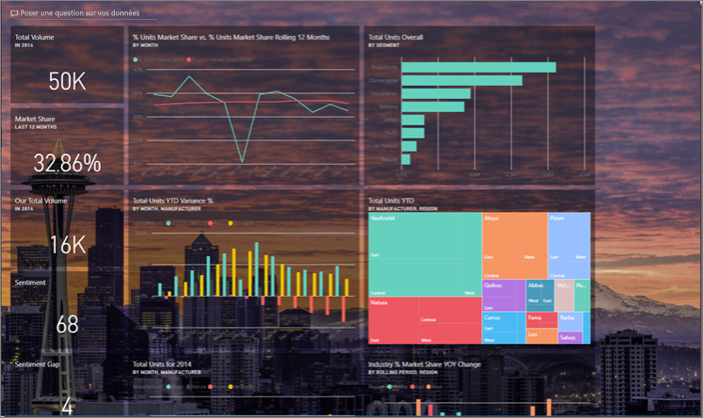
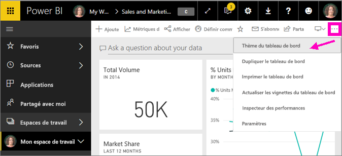
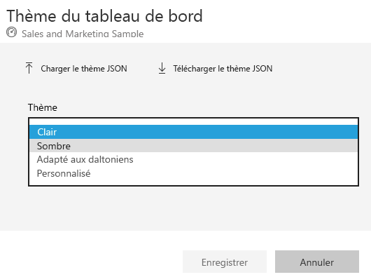
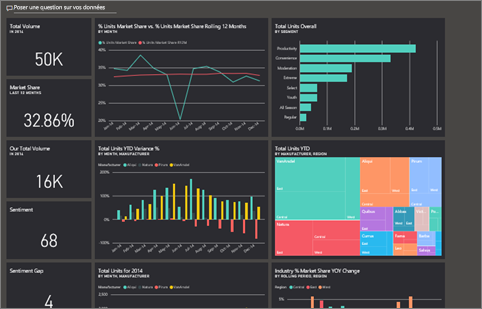
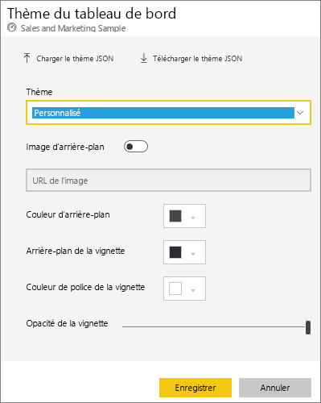
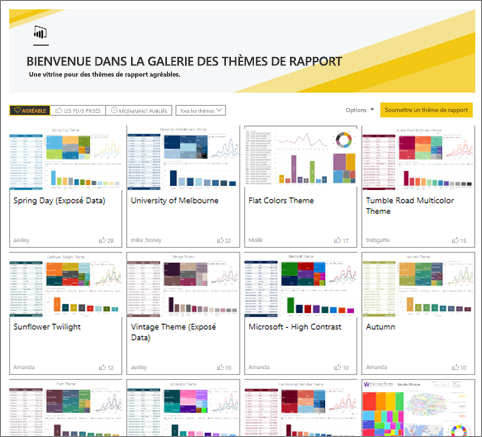
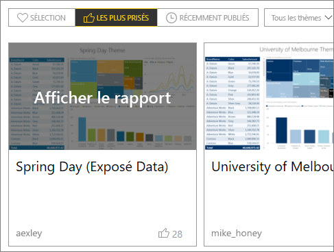
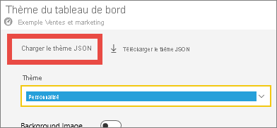
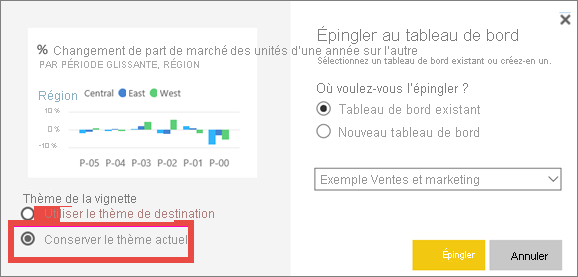
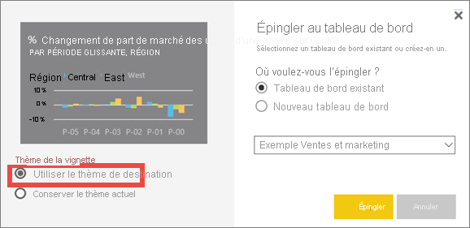

# <a name="use-dashboard-themes-in-the-power-bi-service"></a>Utiliser des thèmes de tableau de bord dans le service Power BI
Les **thèmes de tableau de bord** vous permettent d’appliquer un thème de couleur à tout un tableau de bord. Il peut s’agir des couleurs de votre organisation, de teintes liées à la saison ou de tout autre thème de votre choix. Quand vous appliquez un thème de tableau de bord, tous les visuels du tableau de bord utilisent les couleurs du thème sélectionné. Quelques exceptions s’appliquent, qui sont décrites dans la section [Considérations et limitations](#considerations-and-limitations) de cet article.



Le changement des couleurs des visuels du tableau de bord n’affectent pas les visuels dans le rapport associé. De plus, quand vous épinglez des vignettes d’un rapport auquel un [thème de rapport est déjà appliqué](desktop-report-themes.md), vous pouvez choisir de conserver le thème actuel ou d’utiliser le thème du tableau de bord.


## <a name="prerequisites"></a>Prérequis
* Pour suivre la procédure, ouvrez [l’exemple de tableau de bord Sales and Marketing](sample-datasets.md).


## <a name="how-dashboard-themes-work"></a>Fonctionnement des thèmes de tableau de bord
Pour commencer, ouvrez un tableau de bord que vous avez créé ou que vous pouvez modifier. Sélectionnez **Modifier** > **Thème du tableau de bord**. 



Dans le volet du tableau de bord qui apparaît, sélectionnez un des thèmes prédéfinis.  Dans l’exemple ci-dessous, nous avons sélectionné **Foncé**.





## <a name="create-a-custom-theme"></a>Créer un thème personnalisé

Le thème par défaut pour les tableaux de bord Power BI est **Clair**. Si vous voulez personnaliser les couleurs ou créer votre propre thème, sélectionnez **Personnalisé** dans la liste déroulante. 



Utilisez les options de personnalisation pour créer votre propre thème de tableau de bord. Si vous ajoutez une image d’arrière-plan, nous vous recommandons d’utiliser une image avec une résolution d’au moins 1 920 x 1 080. Pour utiliser une image comme arrière-plan, chargez-la sur un site web public, copiez l’URL et collez-la dans le champ **URL de l’image**. 

## <a name="use-a-json-theme"></a>Utiliser un thème JSON
Une autre façon de créer un thème personnalisé consiste à télécharger un fichier JSON qui contient des paramètres pour toutes les couleurs que vous voulez utiliser pour votre tableau de bord. Dans Power BI Desktop, les créateurs de rapports utilisent des fichiers JSON pour [créer des thèmes pour les rapports](desktop-report-themes.md). Vous pouvez charger ces mêmes fichiers JSON pour les tableaux de bord, ou vous pouvez rechercher et charger des fichiers JSON à partir de la [page Galerie de thèmes](https://community.powerbi.com/t5/Themes-Gallery/bd-p/ThemesGallery) dans la Communauté Power BI. 



Vous pouvez également enregistrer votre thème personnalisé comme fichier JSON et le partager avec d’autres créateurs de tableau de bord. 

### <a name="use-a-theme-from-the-theme-gallery"></a>Utiliser un thème de la galerie de thèmes

Comme avec les options prédéfinies et personnalisées, quand vous chargez un thème, les couleurs sont appliquées automatiquement à toutes les vignettes du tableau de bord. 

1. Pointez sur un thème et choisissez **Afficher le rapport**.

    

2. Faites défiler vers le bas et recherchez le lien vers le fichier JSON.  Sélectionnez l’icône de téléchargement, puis enregistrez le fichier.

    

3. Revenez dans le service Power BI et, dans la fenêtre de thème Tableau de bord personnalisé, sélectionnez **Charger le thème JSON**.

    

4. Accédez à l’emplacement où vous avez enregistré le fichier de thème JSON et sélectionnez **Ouvrir**.

5. Dans la page Thème du tableau de bord, sélectionnez **Enregistrer**. Le nouveau thème est appliqué à votre tableau de bord.

    

## <a name="reports-and-dashboards-with-different-themes"></a>Rapports et tableaux de bord avec des thèmes différents

Si votre rapport n’utilise pas le même thème que celui du tableau de bord, dans la plupart des cas, vous pouvez déterminer si le visuel conserve le thème actuel du rapport ou s’il utilise le thème du tableau de bord. Cependant, les visuels de carte dans les tableaux de bord utilisent la famille de polices « DIN » avec du texte noir. Vous pouvez changer la couleur de texte pour toutes les vignettes d’un tableau de bord, y compris les cartes, en créant un thème de tableau de bord personnalisé.

- Lors de l’épinglage d’une vignette au tableau de bord, pour conserver le thème du rapport, sélectionnez **Conserver le thème actuel**. Le visuel du tableau de bord conserve le thème du rapport, notamment les paramètres de transparence.

    Le seul moment où les options **Thème de la vignette** apparaissent est dans le cas suivant : vous avez créé le rapport dans Power BI Desktop, vous avez [ajouté un thème de rapport](desktop-report-themes.md), puis vous avez publié le rapport sur le service Power BI.

    

- Essayez en réépinglant la vignette et en sélectionnant **Utiliser le thème du tableau de bord**.

    

## <a name="dashboard-theme-json-file-format"></a>Format de fichier JSON des thèmes de tableau de bord

Au niveau le plus basique, le fichier JSON du thème n’a qu’une seule ligne obligatoire : le **nom**.

```json
{
    "name": "Custom Theme"
}
```

À part **name**, tout le reste est facultatif. Vous pouvez simplement ajouter au fichier de thème les propriétés que vous voulez spécifiquement mettre en forme et continuer à utiliser les valeurs par défaut de Power BI pour le reste.

Le fichier JSON pour les thèmes de tableau de bord comprend les éléments suivants :

- name : Nom du thème (le seul champ obligatoire).
- foreground et background : Couleurs pour le tableau de bord.
- dataColors : Liste de codes hexadécimaux à utiliser pour les données dans les graphiques. Vous pouvez inclure autant de couleurs que vous le souhaitez.
- tiles : Configurations d’arrière-plan et de couleur pour les tableaux de bord.
- visualStyles : Mise en forme détaillée des visuels.

Voici un exemple de fichier JSON de thème pour le thème Clair par défaut :

```json
{

"name":"Light",

"foreground":"#000000",

"background":"#EAEAEA",

"dataColors":["#01B8AA","#374649","#FD625E","#F2C80F","#5F6B6D","#8AD4EB","#FE9666","#A66999"],

"tiles":{"background":"#FFFFFF","color":"#000000"},

"visualStyles":{"*":{"*":{"*":[{"color":{"solid":{"color":"#000000"}}}]}}}

}
```

## <a name="considerations-and-limitations"></a>Observations et limitations

* Vous ne pouvez pas appliquer des thèmes de tableau de bord à des pages de rapport dynamique épinglées, à des vignettes iframe, à des vignettes SSRS, à des vignettes de classeur ou à des images.
* Vous voyez les thèmes de tableau de bord sur les appareils mobiles, mais vous pouvez les créer seulement dans le service Power BI.
* Les thèmes personnalisés de tableau de bord fonctionnent seulement avec les vignettes épinglées à partir des rapports.

## <a name="next-steps"></a>Étapes suivantes

- [Appliquer des thèmes aux rapports](desktop-report-themes.md)
