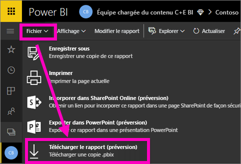
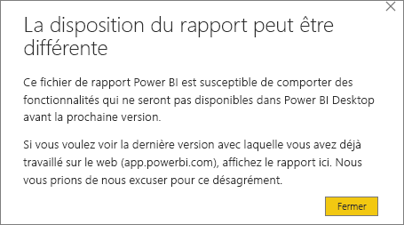

# Télécharger un rapport du service Power BI dans Power BI Desktop (préversion)
Dans Power BI Desktop, vous pouvez publier un rapport (un *fichier .pbix*) dans le service Power BI, à partir de votre ordinateur local. Les rapports Power BI peuvent également aller dans l’autre sens : Vous pouvez télécharger un rapport du service Power BI dans Power BI Desktop. Dans les deux cas, l’extension d’un rapport Power BI, est .pbix.

Il existe quelques limites à prendre en compte, discutées dans la section [Considérations et résolution des problèmes](#considerations-and-troubleshooting) de cet article.

## Télécharger le rapport dans un fichier .pbix

Vous pouvez uniquement télécharger les rapports [créés avec Power BI Desktop](/learn/modules/publish-share-power-bi/2-publish-reports) après le 23 novembre 2016 ou mis à jour depuis. Si le rapport a été créé avant cette date, l’option de menu **Télécharger le rapport** dans le service Power BI apparaît grisée.

Pour télécharger le fichier .pbix, procédez comme suit :

1. Dans le service Power BI, ouvrez le rapport que vous souhaitez télécharger en [mode Edition](https://docs.microsoft.com/power-bi/service-interact-with-a-report-in-editing-view).

2. Dans le volet de navigation du haut, sélectionnez **Fichier > Télécharger le rapport**.
   
3. Pendant le téléchargement du rapport, une bannière d’état affiche sa progression. Lorsque le fichier est prêt, vous êtes invité à l’enregistrer au format .pbix. Le nom par défaut du fichier correspond au titre du rapport.
   
4. Si ce n’est déjà fait, [installez Power BI Desktop](../fundamentals/desktop-get-the-desktop.md), puis ouvrez le fichier .pbix dans Power BI Desktop.
   
    Lorsque vous ouvrez le rapport dans Power BI Desktop, un message d’avertissement peut vous faire savoir que certaines fonctionnalités disponibles dans le rapport du service Power BI ne sont pas disponibles dans Power BI Desktop.
   
    

5. L’éditeur de rapport de Power BI Desktop est similaire à celui du service Power BI.  
   
    

## Considérations et résolution des problèmes
Voici les points importants et les limitations à prendre en compte pour le téléchargement d’un fichier .pbix à partir du service Power BI.

* Pour télécharger le fichier, vous devez disposer des droits de modification sur le rapport.
* Le rapport doit avoir été créé avec Power BI Desktop et avoir été *publié* sur le service Power BI. Sinon, le fichier .pbix doit avoir été *chargé* dans le service Power BI.
* Les rapports doivent être publiés ou mis à jour après le 23 novembre 2016. Les rapports publiés avant cette date ne sont pas téléchargeables.
* Cette fonctionnalité ne fonctionne pas avec les rapports et les packs de contenu créés à l’origine dans le service Power BI.
* Vous devez toujours utiliser la dernière version de Power BI Desktop lorsque vous ouvrez des fichiers téléchargés. Il se peut que les fichiers .pbix téléchargés ne s’ouvrent pas dans les anciennes versions de Power BI Desktop.
* Si votre administrateur a désactivé la possibilité de télécharger des données, cette fonctionnalité ne sera pas visible dans le service Power BI.
* Les jeux de données avec actualisation incrémentielle ne peuvent pas être téléchargés dans un fichier .pbix.
* Si vous créez un rapport Power BI basé sur un jeu de données dans un espace de travail et que vous publiez dans un autre espace de travail, vous et vos utilisateurs ne pourrez pas le télécharger. Cette caractéristique téléchargée n’est pas actuellement prise en charge dans ce scénario.

## Étapes suivantes
Regardez la vidéo d’une minute **Guy in a Cube** qui présente cette fonctionnalité :

<iframe width="560" height="315" src="https://www.youtube.com/embed/ymWqU5jiUl0" frameborder="0" allowfullscreen></iframe>

Voici quelques articles supplémentaires qui peuvent vous aider à utiliser le service Power BI :

* [Rapports dans Power BI](../consumer/end-user-reports.md)
* [Fondamentaux pour les concepteurs dans le service Power BI](../fundamentals/service-basic-concepts.md)

Une fois Power BI Desktop installé, consultez l’article suivant pour apprendre à maîtriser l’application :

* [Prise en main de Power BI Desktop](../fundamentals/desktop-getting-started.md)

D’autres questions ? [Posez vos questions à la Communauté Power BI](https://community.powerbi.com/).
