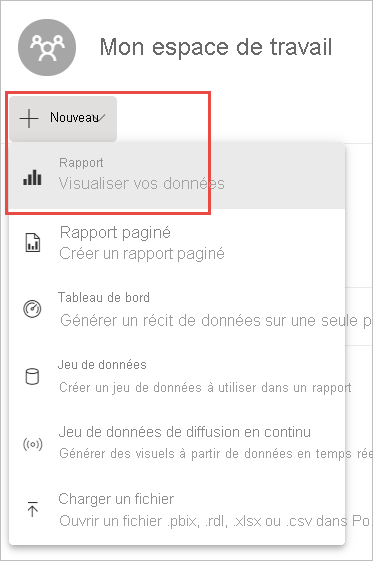
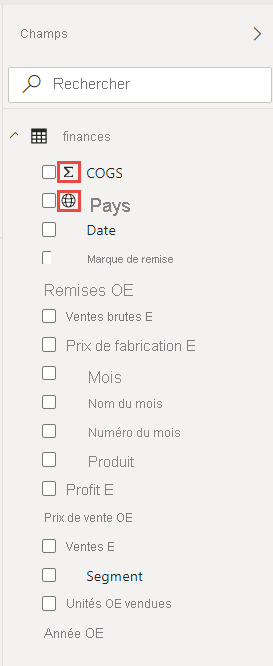
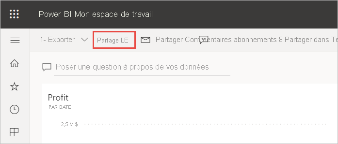
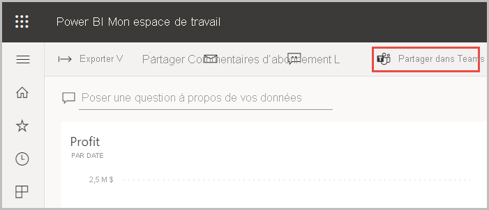

# Tutoriel : Générer un rapport à partir d’un classeur Excel dans le service Power BI vers Microsoft Teams
Votre responsable souhaite voir un rapport sur vos derniers chiffres de ventes et bénéfices d’ici la fin de la journée. Toutefois, vos données les plus récentes sont stockées dans différents fichiers et systèmes tiers sur votre ordinateur portable. Auparavant, plusieurs heures étaient nécessaires pour créer des visuels et mettre en forme un rapport. Vous êtes donc inquiet.

Tout va bien de passer. Avec Power BI, vous pouvez créer un rapport exceptionnel et le partager avec Microsoft Teams en un rien de temps !

:::image type="content" source="media/service-from-excel-to-stunning-report/power-bi-financial-report-service.png" alt-text="Capture d’écran de l’exemple de rapport financier généré":::

Dans ce tutoriel, vous allez charger un fichier Excel, créer un rapport et le partager avec vos collègues dans Microsoft Teams, tout cela dans Power BI. Vous allez découvrir comment :

> [!div class="checklist"]
> * Préparer vos données dans Excel.
> * Télécharger les exemples de données.
> * Créer un rapport dans le service Power BI.
> * Épingler les visuels de rapport à un tableau de bord.
> * Partager un lien vers le tableau de bord.
> * Partager le tableau de bord dans Microsoft teams.

## Préparer les données dans Excel
Prenons un simple fichier Excel comme exemple. 

1. Avant de charger votre fichier Excel dans Power BI, vous devez organiser vos données dans un « tableau plat ». Dans une table plate, chaque colonne contient le même type de données, par exemple, du texte, des dates, des chiffres ou des devises. Votre table doit comprendre une ligne d’en-tête, mais pas de colonnes ni de lignes qui affichent des totaux.

   

2. Mettez ensuite en forme vos données sous forme de tableau : Dans Excel, sous l’onglet **Accueil**, dans le groupe **Styles**, sélectionnez **Mettre sous forme de tableau**. 

3. Sélectionnez un style de tableau à appliquer à votre feuille de calcul. 

   Votre feuille de calcul Excel peut maintenant être chargée dans Power BI.

   

## Charger un fichier Excel dans le service Power BI
Le service Power BI se connecte à de nombreuses sources de données, y compris des fichiers Excel stockés sur votre ordinateur. 

 > [!NOTE] 
 > Pour suivre le reste de ce tutoriel, téléchargez le [classeur Financial Sample](https://go.microsoft.com/fwlink/?LinkID=521962).

1. Pour commencer, connectez-vous au service Power BI. Si vous n’êtes pas encore inscrit, [vous pouvez le faire gratuitement](https://powerbi.com).
1. Dans **Mon espace de travail**, sélectionnez **Nouveau** > **Charger un fichier**.

    :::image type="content" source="media/service-from-excel-to-stunning-report/power-bi-new-upload.png" alt-text="Capture d’écran de l’option Charger un fichier.":::

1. Sélectionnez **Fichier local**, accédez à l’emplacement où vous avez enregistré le fichier Excel « Financial Sample », puis sélectionnez **Ouvrir**.
7. Dans la page **Fichier local**, sélectionnez **Importer**.

    Vous disposez maintenant d’un jeu de données Financial Sample. Power BI a également créé automatiquement un tableau de bord vide. Si vous ne le voyez pas, actualisez votre navigateur.

    :::image type="content" source="media/service-from-excel-to-stunning-report/power-bi-financial-dataset.png" alt-text="Capture d’écran de Mon espace de travail avec le jeu de données Financial Sample.":::

2. Vous souhaitez créer un rapport. Toujours dans **Mon espace de travail**, sélectionnez **Nouveau** > **Rapport**.

   

3. Dans la boîte de dialogue **Sélectionner un jeu de données pour créer un rapport**, sélectionnez votre jeu de données **Financial Sample** > **Créer**.

   

## Créer votre rapport
 
Le rapport s’ouvre en mode Édition et affiche le canevas de rapport vide. À droite figurent les volets **Visualisations**, **Filtres** et **Champs**. Les données du tableau de votre classeur Excel s’affichent dans le volet **Champs**. En haut figure le nom de la table, **financials**. En-dessous, Power BI liste les en-têtes de colonne en tant que champs individuels.

Vous voyez les symboles Sigma dans la liste Champs ? Power BI a détecté que ces champs sont numériques. Power BI indique également un champ géographique avec un symbole de globe.

1. Pour disposer de davantage d’espace pour le canevas de rapport, sélectionnez **Masquer le volet de navigation** et réduisez le volet **Filtres**.

    :::image type="content" source="media/service-from-excel-to-stunning-report/power-bi-hide-nav-pane.png" alt-text="Capture d’écran de la réduction du volet de navigation."::: 

1. Vous pouvez maintenant commencer à créer des visualisations. Supposons que votre responsable veuille voir l’historique des bénéfices. Dans le volet **Champs**, faites glisser **Bénéfices** dans le canevas du rapport. 

   Par défaut, Power BI affiche un histogramme avec une colonne. 

    :::image type="content" source="media/service-from-excel-to-stunning-report/power-bi-profit-column.png" alt-text="Capture d’écran d’un histogramme avec une colonne.":::

3. Faites glisser **Date** dans le canevas du rapport. 

   Power BI met à jour l’histogramme pour afficher les bénéfices par date.

   

    Le mois de décembre 2014 était le mois le plus rentable.
   
    > [!TIP]
    > Si les valeurs de votre graphique ne ressemblent pas à celles attendues, vérifiez vos agrégations. Par exemple, dans la zone **Valeur**, sélectionnez le champ **Profit** que vous venez d’ajouter et vérifiez que les données sont agrégées comme vous le souhaitez. Dans notre exemple, nous utilisons **Somme**.
    > 

### Créer une carte

Votre responsable veut savoir quels pays sont les plus rentables. Impressionnez votre responsable avec une visualisation de type Carte. 

1. Sélectionnez une zone vide dans le canevas de rapport. 

2. Dans le volet **Champs**, faites glisser le champ **Country** vers le canevas de rapport, puis faites glisser le champ **Profit** sur la carte.

   Power BI crée un élément visuel de type Carte dont les bulles représentent les bénéfices relatifs de chaque emplacement.

   

    Il semble que les performances des pays européens soient supérieures à celles d’Amérique du Nord.

### Créer un visuel présentant les ventes

Vous voulez afficher un visuel montrant les ventes par produit et segment ? C’est facile. 

1. Sélectionnez le canevas vide.

1. Dans le volet **Champs**, sélectionnez les champs **Vente**, **Bénéfices** et **Segment**. 
   
   Power BI crée un histogramme groupé. 

2. Modifiez le type de graphique en choisissant une icône du menu **Visualisations**. Par exemple, remplacez-le par un **histogramme empilé**. 

   

3. Pour trier le graphique, sélectionnez **Plus d’options** (...) > **Trier par**.

### Embellir les visuels

Apportez les modifications suivantes sous l’onglet **Format** dans le volet Visualisations.

:::image type="content" source="media/desktop-excel-stunning-report/power-bi-format-tab-visualizations.png" alt-text="Capture d’écran de l’onglet Format dans le volet Visualisations.":::

1. Sélectionnez l’histogramme **Profit by Date**. Dans la section **Titre**, choisissez une **Taille du texte** de **16 pt**. Basculez **Ombre** sur **Activé**. 

1. Sélectionnez l’histogramme empilé **Sales by Product and Segment**. Dans la section **Titre**, choisissez une **Taille du texte** de **16 pt**. Basculez **Ombre** sur **Activé**.

1. Sélectionnez la carte **Profit by Country**. Dans la section **Styles de la carte**, choisissez **Nuances de gris** comme **Thème**. Dans la section **Titre**, choisissez une **Taille du texte** de **16 pt**. Basculez **Ombre** sur **Activé**.

## Épingler à un tableau de bord

Vous pouvez maintenant épingler tous vos visuels au tableau de bord vide que Power BI a créé par défaut. 

1. Pointez sur un visuel et sélectionnez **Épingler un élément visuel**.

   

1. Vous devez enregistrer votre rapport avant de pouvoir épingler un visuel au tableau de bord. Attribuez un nom à votre rapport et sélectionnez **Enregistrer**.
1. Épinglez chaque visuel au tableau de bord que Power BI a créé, **Financial Sample.xlsx**.
1. Quand vous épinglez le dernier visuel, sélectionnez **Accéder au tableau de bord**.
1. Power BI a ajouté automatiquement une vignette d’espace réservé Financial Sample.xlsx au tableau de bord. Sélectionnez **Plus d’options (...)**  > **Supprimer la vignette**.

    :::image type="content" source="media/service-from-excel-to-stunning-report/power-bi-tile-more-options.png" alt-text="Capture d’écran de Plus d’options pour une vignette.":::

1. Réorganisez et redimensionnez les vignettes comme vous le souhaitez.

Le tableau de bord et le rapport sont prêts.

## Partager un lien vers votre tableau de bord

Il est maintenant temps de partager votre tableau de bord avec votre responsable. Vous pouvez partager votre tableau de bord et le rapport sous-jacent avec vos collègues disposant d’un compte Power BI. Ceux-ci peuvent interagir avec votre rapport, mais ne peuvent pas enregistrer de modifications. Si vous l’autorisez, ils peuvent le partager avec d’autres personnes ou créer un nouveau rapport basé sur le jeu de données sous-jacent.

1. Pour partager votre rapport, en haut du tableau de bord, sélectionnez **Partager**.

   

2. Dans la page **Partager le tableau de bord**, entrez les adresses e-mail des destinataires dans la zone **Entrer les adresses de messagerie**, puis ajoutez un message dans la zone située en dessous. 

3. Choisissez les options de votre choix parmi les suivantes, le cas échéant :

    - **Autoriser les destinataires à partager votre tableau de bord** 
    - **Autoriser les destinataires à générer du nouveau contenu à partir des jeux de données sous-jacents**
    - **Envoyer une notification par e-mail aux destinataires**

   

1. Sélectionnez **Partager**.

## Partager avec Microsoft Teams

Vous pouvez également partager des rapports et des tableaux de bord directement avec vos collègues dans Microsoft Teams.

1. Pour partager dans Teams, en haut du tableau de bord, sélectionnez **Partager dans Teams**.

   

2. Power BI affiche la boîte de dialogue **Partager dans Teams**. Entrez le nom d’une personne, d’un groupe ou d’un canal, puis sélectionnez **Partager**. 
   
    :::image type="content" source="media/service-from-excel-to-stunning-report/power-bi-share-teams-dialog.png" alt-text="Capture d’écran de la boîte de dialogue Partager dans Teams":::

3. Le lien apparaît dans les **Publications** pour cette personne, ce groupe ou ce canal.

   

## Étapes suivantes

* [Prise en main du service Power BI](../fundamentals/service-get-started.md)
* [Prise en main de Power BI Desktop](../fundamentals/desktop-getting-started.md)
* [Fondamentaux pour les concepteurs dans le service Power BI](../fundamentals/service-basic-concepts.md)

D’autres questions ? [Posez vos questions à la Communauté Power BI](https://community.powerbi.com/).
