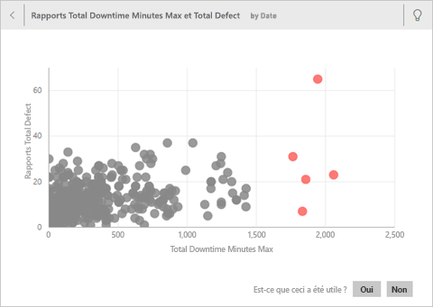
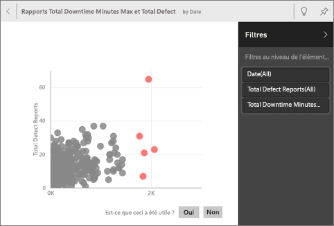
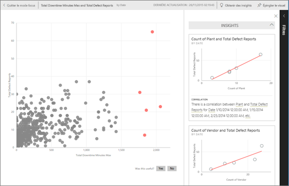
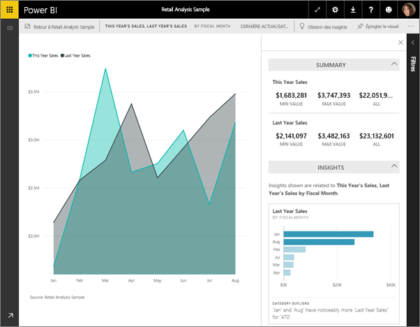

# Générer automatiquement des insights sur les données avec Power BI
Vous disposez d’un nouveau jeu de données et vous ne savez pas trop par quoi commencer ?  Vous voulez créer rapidement un tableau de bord ?  Vous souhaitez rechercher des informations que vous auriez manquées ?

Exécutez un aperçu rapide pour générer des visualisations interactives intéressantes basées sur vos données. L’aperçu rapide peut être exécuté sur un jeu de données entier (aperçu rapide) ou sur une vignette de tableau de bord spécifique (aperçu délimité). Vous pouvez même exécuter un aperçu rapide sur un aperçu !

> [!NOTE]
> Les insights ne fonctionnent pas avec DirectQuery, seulement avec les données chargées dans Power BI.
> 

La fonctionnalité d’aperçu repose sur un [ensemble croissant d’algorithmes analytiques avancés](../consumer/end-user-insight-types.md) développés conjointement avec Microsoft Research, que nous continuerons d’utiliser pour permettre à davantage de personnes de tirer des informations de leurs données de façon innovante et intuitive.

## Exécuter un aperçu rapide sur un jeu de données
Regardez Amanda exécuter un aperçu rapide sur un jeu de données, ouvrir une information en mode Focus, épingler l’une de ces informations en tant que vignette à son tableau de bord, et obtenir des informations sur une vignette de tableau de bord.

<iframe width="560" height="315" src="https://www.youtube.com/embed/et_MLSL2sA8" frameborder="0" allowfullscreen></iframe>

Maintenant, à vous de jouer. Explorez les insights en vous appuyant sur l’[exemple Analyse de la qualité des fournisseurs](sample-supplier-quality.md).

1. Sous l’onglet **Jeux de données**, sélectionnez **Autres options** (...), puis choisissez **Obtenir des insights rapides**.
   
    
   
    
2. Power BI utilise [différents algorithmes](../consumer/end-user-insight-types.md) pour rechercher des tendances dans votre jeu de données.
   
    
3. En quelques secondes, vos informations sont prêtes.  Sélectionnez **Afficher les informations** pour afficher des visualisations.
   
    
   
    > [!NOTE]
    > Certains jeux de données ne peuvent pas générer d’informations, car les données ne sont pas significatives d’un point de vue statistique.  Pour en savoir plus, consultez [Optimiser vos données pour obtenir des informations](service-insights-optimize.md).
    > 
    
4. Les visualisations s’affichent dans une zone de dessin **Informations rapides** spéciale comprenant jusqu’à 32 cartes d’information distinctes. Chaque carte possède un graphique et une brève description.
   
    

## Interagir avec les cartes d’informations

1. Pointez le curseur sur une carte, puis sélectionnez l’icône en forme d’épingle pour ajouter la visualisation à un tableau de bord.

2. Pointez sur une carte, sélectionnez **Autres options** (...), puis choisissez **Voir les insights**. 

    L’écran Insight s’ouvre en mode Focus.
   
    
3. Dans le mode Focus, vous pouvez :
   
   * Filtrez les visualisations. Si le volet **Filtres** n’est pas déjà ouvert, développez-le en sélectionnant la flèche sur le côté droit de la fenêtre.

       
   * Épinglez la carte d’insight à un tableau de bord en sélectionnant **Épingler un élément visuel**.
   * Exécutez les insights sur la carte proprement dite, ce qui permet d’obtenir des *insights avec étendue*. En haut à droite, sélectionnez l’icône en forme d’ampoule  ou **Obtenir des insights**.
     
       
     
     L’aperçu s’affiche à gauche et de nouvelles cartes, basées uniquement sur les données de cet aperçu, s’affichent à droite.
     
       
4. Pour revenir au canevas d’aperçu d’origine, dans le coin supérieur gauche, sélectionnez **Quitter le mode Focus**.

## Exécuter un aperçu sur une vignette de tableau de bord
Au lieu de rechercher des insights dans un jeu de données entier, limitez votre recherche pour obtenir des insights avec étendue sur les données ayant servi à créer une vignette de tableau de bord. 

1. Ouvrez un tableau de bord.
2. Pointez sur une vignette, Sélectionnez **Autres options** (...), puis choisissez **Voir les insights**. La vignette s’ouvre en [mode Focus](../consumer/end-user-focus.md), qui présente les cartes d’informations à droite.    
   
        
3. Une information suscite votre intérêt ? Sélectionnez la carte d’informations pour en savoir plus. L’information sélectionnée s’affiche à gauche et les nouvelles cartes d’informations, basées uniquement sur les données de cette information, s’affichent à droite.    
4. Continuez à explorer vos données et, dès que vous trouvez une information intéressante, épinglez-la à votre tableau de bord en sélectionnant **Épingler un élément visuel** en haut à droite.

## Étapes suivantes
- Si vous possédez un jeu de données, [optimisez-le pour Quick Insights](service-insights-optimize.md).
- En savoir plus sur les [types d’insights rapides disponibles](../consumer/end-user-insight-types.md).

D’autres questions ? [Posez vos questions à la Communauté Power BI](https://community.powerbi.com/).
