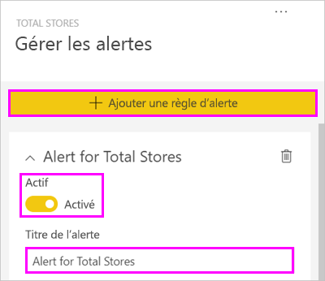
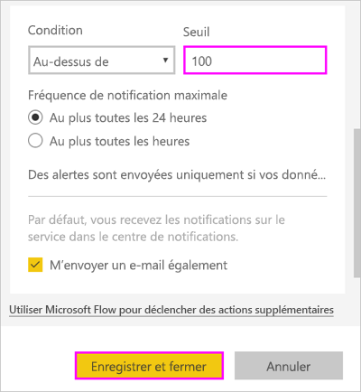
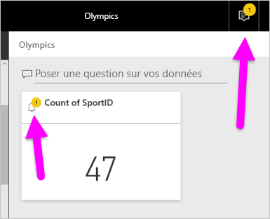
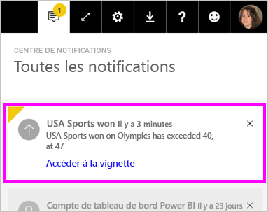
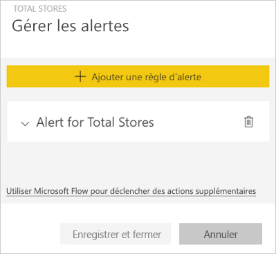
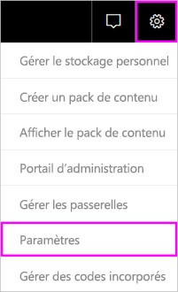

# Alertes de données dans le service Power BI

Définissez des alertes pour vous avertir quand des données de vos tableaux de bord changent au-delà des limites que vous définissez.

Vous pouvez définir des alertes sur des vignettes dans Mon espace de travail. Vous pouvez également définir des alertes si quelqu’un partage un tableau de bord qui se trouve dans une [capacité Premium](../admin/service-premium-what-is.md). Si vous disposez d’une licence Power BI Pro, vous pouvez également définir des alertes sur des vignettes dans un autre espace de travail. Des alertes ne peuvent être définies que sur des vignettes épinglées à partir de visuels de rapport, et uniquement sur des jauges, des indicateurs de performance clés et des cartes. Des alertes peuvent être définies sur des visuels créés à partir de jeux de données de streaming que vous épinglez d’un rapport vers un tableau de bord. Vous ne pouvez pas définir d’alertes sur des vignettes de streaming créées directement sur le tableau de bord à l’aide de **Ajouter une vignette** > **Données de streaming personnalisées**.

Vous seul pouvez voir les alertes que vous définissez, même si vous partagez votre tableau de bord. Même le propriétaire du tableau de bord ne peut pas voir les alertes que vous définissez sur votre vue de son tableau de bord. Les alertes de données sont entièrement synchronisées entre plateformes. Définissez et affichez les alertes de données [dans les applications mobiles Power BI](../consumer/mobile/mobile-set-data-alerts-in-the-mobile-apps.md) et dans le service Power BI. Elles ne sont pas disponibles dans Power BI Desktop. Vous pouvez même automatiser et intégrer des alertes avec Power Automate. Vous pouvez essayer vous-même dans cet article : [Power Automate et Power BI](../collaborate-share/service-flow-integration.md).

> [!WARNING]
> Les notifications d’alerte pilotées par les données fournissent des informations sur vos données. Si vous affichez vos données Power BI sur un appareil mobile et que celui-ci est perdu ou volé, nous vous recommandons d’utiliser le service Power BI pour désactiver toutes les règles d’alerte de données.

## Définir des alertes de données dans le service Power BI

Regardez Amanda ajouter certaines alertes à des vignettes sur le tableau de bord. Suivez ensuite les instructions détaillées sous la vidéo pour essayer vous-même.

<iframe width="560" height="315" src="https://www.youtube.com/embed/JbL2-HJ8clE" frameborder="0" allowfullscreen></iframe>

Cet exemple utilise une vignette de carte de l’exemple de tableau Retail Analysis (Analyse de vente au détail). [Obtenir l’exemple Retail Analysis (Analyse de la vente au détail)](sample-retail-analysis.md#get-the-content-pack-for-this-sample) si vous voulez effectuer la procédure.

1. Commencez sur un tableau de bord. Dans la vignette **Total Stores** (Nombre total de magasins), sélectionnez les points de suspension.

   

1. Sélectionnez l’icône en forme de cloche  pour ajouter une ou plusieurs alertes pour **Total stores** (Nombre total de magasins).

1. Pour commencer, sélectionnez **+ Ajouter une règle d’alerte**, vérifiez que le curseur **Actif** est défini sur **Activé**, puis donnez un titre à votre alerte. Les titres vous aident à reconnaître facilement vos alertes.

   

1. Faites défiler vers le bas, puis entrez les détails de l’alerte.  Dans cet exemple, vous allez créer une alerte qui vous avertit une fois par jour si le nombre total de magasins est supérieur à 100.

   

    Les alertes s’affichent dans votre **centre de notification**. Si vous cochez la case à cocher correspondante, Power BI vous envoie également un e-mail à propos de l’alerte.

1. Sélectionnez **Enregistrer et fermer**.

## Recevoir des alertes

Quand les données suivies atteignent l’un des seuils définis, plusieurs choses se produisent. Tout d’abord, Power BI vérifie si plus d’une heure ou plus de 24 heures (selon l’option sélectionnée) se sont écoulées depuis la dernière alerte. Si les données se trouvent au-delà du seuil, vous recevez une alerte.

Ensuite, Power BI envoie une alerte à votre **centre de notification** et, éventuellement, un e-mail. Chaque alerte contient un lien direct vers vos données. Sélectionnez le lien pour afficher la vignette pertinente, dans laquelle vous pouvez explorer, partager et apprendre des informations supplémentaires.  

* Si vous avez défini l’alerte de façon à recevoir un courrier électronique, vous recevez un message semblable à celui-ci dans votre boîte de réception.

   

* Power BI ajoute un message à votre **centre de notification** et ajoute une nouvelle icône d’alerte à la vignette applicable.

   

* Votre **centre de notification** affiche les détails de l’alerte.

    

   > [!NOTE]
   > Les alertes fonctionnent uniquement sur des données actualisées. Lorsque les données sont actualisées, Power BI vérifie si une alerte est définie pour celles-ci. Si les données ont atteint un seuil d’alerte, Power BI déclenche une alerte.

## Gestion des alertes

Il existe de nombreuses façons de gérer vos alertes :

* À partir de la vignette de tableau de bord.

* Dans le menu Paramètres de Power BI.

* Sur une vignette dans les [applications mobiles Power BI](../consumer/mobile/mobile-set-data-alerts-in-the-mobile-apps.md).

### À partir de la vignette de tableau de bord

1. Si vous devez changer ou supprimer une alerte pour une vignette, rouvrez la fenêtre **Gérer les alertes** en sélectionnant l’icône en forme de cloche .

    Power BI affiche la ou les alertes que vous avez définies pour cette vignette.

    

1. Pour modifier une alerte, sélectionnez la flèche à gauche du nom de l’alerte.

    

1. Pour supprimer une alerte, sélectionnez la poubelle à droite du nom de l’alerte.

      

### Dans le menu Paramètres de Power BI

1. Sélectionnez l’icône en forme d’engrenage dans la barre de menus de Power BI, puis sélectionnez **Paramètres**.

    .

1. Sous **Paramètres**, sélectionnez **Alertes**.

    

1. À ce stade, vous pouvez activer et désactiver les alertes, ouvrir la fenêtre **Gérer les alertes** pour apporter des modifications ou supprimer l’alerte.

## Considérations et résolution des problèmes

* Les alertes ne sont pas prises en charge pour les vignettes de carte avec des mesures au format date/heure.
* Les alertes fonctionnent uniquement avec des données numériques.
* Les alertes fonctionnent uniquement sur des données actualisées. (pas sur les données statiques).
* Les alertes fonctionnent uniquement sur des jeux de données de streaming si vous générez un visuel de rapport de type KPI, carte ou jauge, puis que vous épinglez ce visuel au tableau de bord.

## Étapes suivantes

* [Créer un workflow Power Automate qui inclut une alerte de données](../collaborate-share/service-flow-integration.md).

* [Définir des alertes de données sur votre appareil mobile](../consumer/mobile/mobile-set-data-alerts-in-the-mobile-apps.md).

* [Qu’est-ce que Power BI ?](../fundamentals/power-bi-overview.md)

D’autres questions ? [Essayez d’interroger la communauté Power BI](https://community.powerbi.com/)
