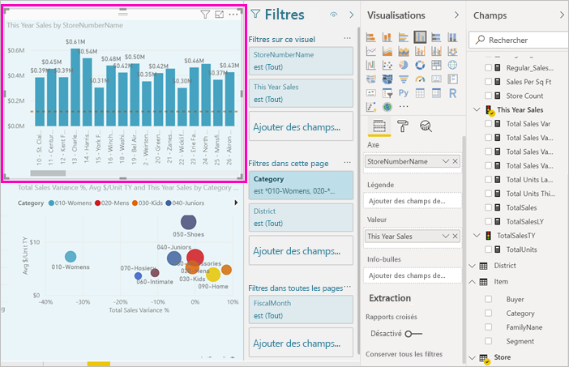
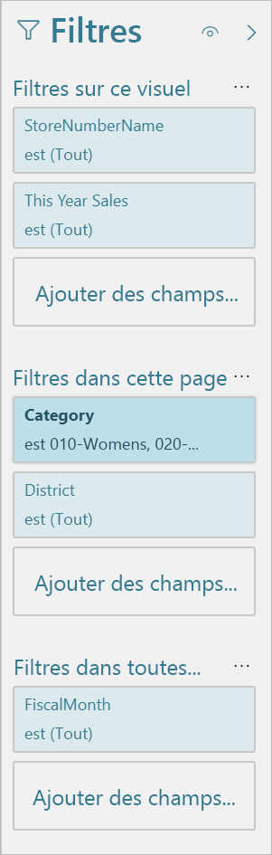
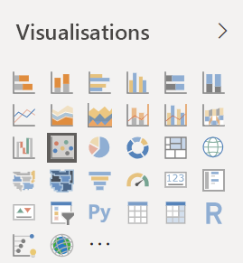
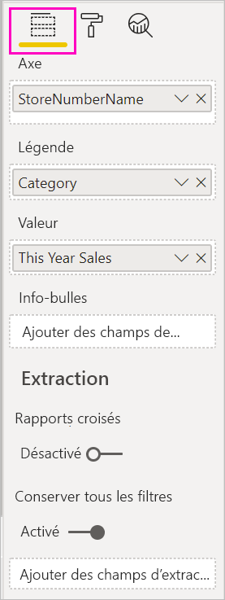
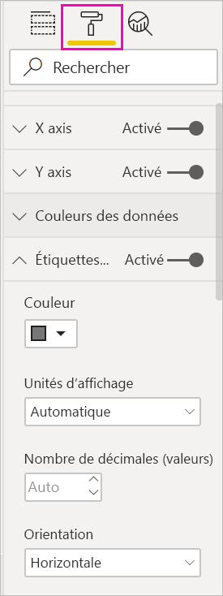
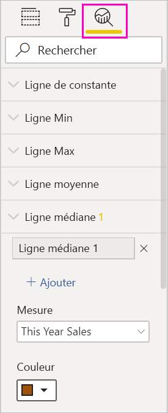
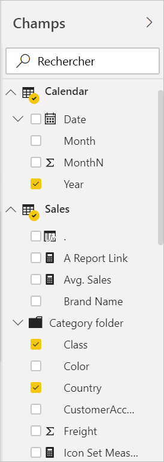

# Visite guidée de l’éditeur de rapport de Power BI

Dans Power BI Desktop et dans le service Power BI, l’*éditeur de rapport* vous permet de concevoir les rapports que vos utilisateurs finaux voient, en y ajoutant notamment des graphiques, des tableaux, des cartes et autres visuels. Il s’agit quasiment du même éditeur dans les deux environnements. Généralement, vous commencez par créer un rapport dans Power BI Desktop. Vous le publiez ensuite sur le service Power BI, où vous pouvez continuer de le modifier. C’est également dans ce service que vous créez des tableaux de bord en fonction de vos rapports.

Après avoir créé vos tableaux de bord et vos rapports, vous les distribuez à vos consommateurs de rapports. En fonction de la façon dont vous les partagez, vos utilisateurs finaux peuvent interagir avec eux dans le mode Lecture du service Power BI, mais ils ne peuvent pas les modifier. En savoir plus sur [ce que les consommateurs de rapports peuvent faire dans le service Power BI](../consumer/end-user-reading-view.md). 

Cette vidéo montre l’éditeur de rapports dans Power BI Desktop. Cet article montre l’éditeur de rapport dans Power BI Desktop. 

<iframe width="560" height="315" src="https://www.youtube.com/embed/IkJda4O7oGs" frameborder="0" allowfullscreen></iframe>

Dans le service Power BI, l’éditeur de rapport est uniquement disponible en mode Édition. Pour ouvrir un rapport en mode Edition, vous devez être le propriétaire ou l’auteur de ce rapport, ou bien un contributeur au sein de l’espace de travail qui héberge ce rapport.

L’éditeur de rapport Power BI est divisé en plusieurs sections principales :  

1. Le ruban
1. Canevas du rapport
1. Volet Filtres
1. volet Visualisations
1. Volet Champs

## 1. Le ruban
Les actions disponibles dans le ruban sont nombreuses, et de nouvelles actions sont ajoutées en permanence. Pour plus d’informations sur une action en particulier, utilisez la zone de recherche ou la table des matières de la documentation Power BI.

## 2. Canevas de rapport
Le canevas de rapport est l’emplacement où votre travail s’affiche. Lorsque vous utilisez les volets Champs, Filtres et Visualisations pour créer des visuels, ceux-ci sont générés et affichés sur le canevas de rapport. Chaque onglet au bas du canevas représente une page du rapport. Sélectionnez un onglet pour ouvrir cette page. 

## Volets de l’éditeur de rapport

Trois volets sont visibles lorsque vous ouvrez un rapport : Filtres, Visualisations et Champs Les deux premiers volets du côté gauche, Filtres et Visualisations, contrôlent l’aspect de vos visualisations : type, couleurs, filtrage et mise en forme. Le volet du côté droit (Champs) gère les données sous-jacentes qui sont utilisées dans les visualisations. Le contenu affiché dans l’éditeur de rapport varie en fonction des sélections effectuées dans le canevas de rapport. 

Par exemple, quand vous sélectionnez un visuel tel que cet histogramme :

Le **volet Filtres** affiche tous les filtres du visuel, de la page ou de toutes les pages. Dans ce cas, il existe des filtres au niveau de la page, mais aucun filtre au niveau du visuel.

La **partie supérieure du volet Visualisations** identifie le type du visuel actuellement utilisé. Dans cet exemple, il s’agit d’un histogramme groupé. 

Le **bas du volet Visualisations** comprend trois onglets :

Les  **Champs** affichent les champs du visuel. Vous devrez peut-être faire défiler la page pour afficher tous les détails. Ce graphique utilise StoreNumberName et « This Year Sales ».

 **Format** Pour afficher le volet de mise en forme de la visualisation sélectionnée, sélectionnez l’icône en forme de rouleau à peinture.

 **Analytics** Pour afficher le volet Analytique, sélectionnez l’icône Loupe.

Le **volet Champs** liste toutes les tables disponibles dans le modèle de données. Lorsque vous développez une table, vous voyez les champs qu’elle contient. La coche de couleur jaune indique qu’au moins un champ de cette table se trouve dans la visualisation.

Pour plus d’informations sur chaque volet, lisez ce qui suit.

## 3. Le volet Filtres
Utilisez le volet Filtres pour afficher, définir et modifier des filtres permanents sur vos rapports au niveau de la page, du rapport, de l’extraction et du visuel. Certes, vous pouvez effectuer un filtrage ad hoc sur les pages et les visuels des rapports en sélectionnant certains éléments ou en utilisant des outils comme les segments. Le volet Filtres permet d’enregistrer l’état des filtres dans le rapport. 

Le volet Filtres comprend une autre fonctionnalité puissante : il permet de filtrer selon un champ qui *n’est pas encore utilisé dans les visuels du rapport*. Qu’est-ce que cela signifie ? Lorsque vous créez une visualisation, Power BI ajoute automatiquement tous les champs utilisés dans la visualisation au volet Filtres, dans la zone correspondant aux filtres des visuels. Pour définir un visuel, une page, une extraction ou un filtre de rapport à l’aide d’un champ qui n’est pas utilisé actuellement dans une visualisation, il suffit de le faire glisser dans l’un des compartiments Filtres.

La nouvelle fonctionnalité de filtrage offre plus de souplesse. Par exemple, vous pouvez mettre en forme les filtres pour qu’ils ressemblent au rapport. Vous pouvez aussi verrouiller les filtres ou les masquer pour qu’ils ne puissent être vus par les consommateurs de rapports. 

En savoir plus sur [la nouvelle expérience de filtre](power-bi-report-filter.md).

## 4. Volet Visualisations

Le volet Visualisations comporte quatre sections. Nous allons commencer en haut du volet.

Voici où sélectionner le type de visualisation. Les petites icônes affichent les différents types de visualisations que vous pouvez créer. Dans l’image ci-dessus, le graphique en bulles est sélectionné. Lorsque vous créez une visualisation, si vous sélectionnez des champs avant de sélectionner un type de visualisation, Power BI choisit le type de visualisation à votre place. Vous pouvez conserver la sélection de Power BI ou modifier le type en sélectionnant une autre icône.

Vous pouvez télécharger des visualisations personnalisées dans Power BI Desktop. Leurs icônes s’afficheront également dans ce volet. 

### Gérer les champs dans une visualisation

Les compartiments (parfois appelés *puits*) de ce volet varient en fonction du type de visualisation sélectionné.  Par exemple, si vous avez sélectionné un graphique à barres, vous verrez Axe, Légende et Valeurs. Lorsque vous sélectionnez un champ, ou que vous le faites glisser sur le canevas, Power BI ajoute ce champ à l’un des compartiments.  Vous pouvez également faire glisser des champs de la liste Champs directement vers les compartiments.  Certains compartiments sont limités à certains types de données.  Par exemple, **Valeurs** n’accepte pas les champs non numériques. Par conséquent, si vous faites glisser un champ **Catégorie** dans le compartiment **Valeurs**, Power BI le remplace par **Nombre de catégories**.

Pour plus d’informations, consultez [Ajouter des visualisations à un rapport Power BI](../visuals/power-bi-report-add-visualizations-i.md).

Cette partie du volet contient également des options pour contrôler le comportement de filtrage et d’[extraction](desktop-drillthrough.md).

### Mettre en forme vos éléments visuels
Sélectionnez l’icône Rouleau de peinture pour afficher le volet de mise en forme. Les options disponibles varient selon le type de visualisation sélectionné.

Les possibilités de mise en forme sont très nombreuses.  Pour en savoir plus, explorez par vous-même ou consultez les articles suivants :

* [Personnalisation du titre, de l’arrière-plan et de la légende de la visualisation](../visuals/power-bi-visualization-customize-title-background-and-legend.md)
* [Mise en forme des couleurs](../visuals/service-getting-started-with-color-formatting-and-axis-properties.md)
* [Personnalisation des propriétés des axes X et Y](../visuals/power-bi-visualization-customize-x-axis-and-y-axis.md)

### Ajouter des analyses à vos visualisations
Sélectionnez l’icône Loupe pour afficher le volet Analyse. Les options disponibles varient selon le type de visualisation sélectionné.

Le volet Analyse du service Power BI vous permet d’ajouter des lignes de référence dynamiques aux visualisations et de vous focaliser sur les tendances ou informations importantes. Pour plus d’informations, consultez [Volet Analytique dans Power BI Desktop](../transform-model/desktop-analytics-pane.md).

## 5. Le volet Champs
Le volet Champs affiche les tables, les dossiers et les champs de vos données qui sont disponibles pour la création de visualisations.

:::row:::
    :::column:::
        
    :::column-end:::
    :::column:::
        <ul><li>Faites glisser un champ sur la page pour démarrer une nouvelle visualisation.  Vous pouvez également faire glisser un champ sur une visualisation existante pour y ajouter ce champ.  </li> <li>Lorsque vous ajoutez une coche en regard d’un champ, Power BI ajoute ce champ à la visualisation active (ou nouvelle). Il choisit également le compartiment dans lequel placer ce champ.  Par exemple, le champ doit-il être utilisé comme légende, axe ou valeur ? Power BI fait la meilleure hypothèse et vous pouvez déplacer le champ de ce compartiment vers un autre si nécessaire.   </li><li>Dans les deux cas, chaque champ sélectionné est ajouté au volet Visualisations dans l’éditeur de rapport.</li></ul>
    :::column-end:::
:::row-end:::

Dans Power BI Desktop, vous pouvez également afficher ou masquer des champs, ajouter des calculs, etc.

## Icônes des champs

Power BI utilise différentes icônes pour désigner les types de champs d’un rapport. Le fait de connaître ces icônes vous permet de comprendre comment fonctionnent les champs dans les différents visuels. Pour obtenir la liste complète, consultez la [section Icônes de la liste de champs de la rubrique Utilisation de la liste de champs dans Power BI Desktop](../transform-model/desktop-field-list.md#field-list-changes).

## Étapes suivantes
[Créer un rapport](service-report-create-new.md)

Découvrez plus en détail les rapports dans le [service Power BI](service-report-create-new.md), [Power BI Desktop](desktop-report-view.md) et les [applications mobiles Power BI](../consumer/mobile/mobile-apps-view-phone-report.md).

[Fondamentaux pour les concepteurs Power BI](../fundamentals/service-basic-concepts.md)

D’autres questions ? [Posez vos questions à la communauté Power BI](https://community.powerbi.com/)
