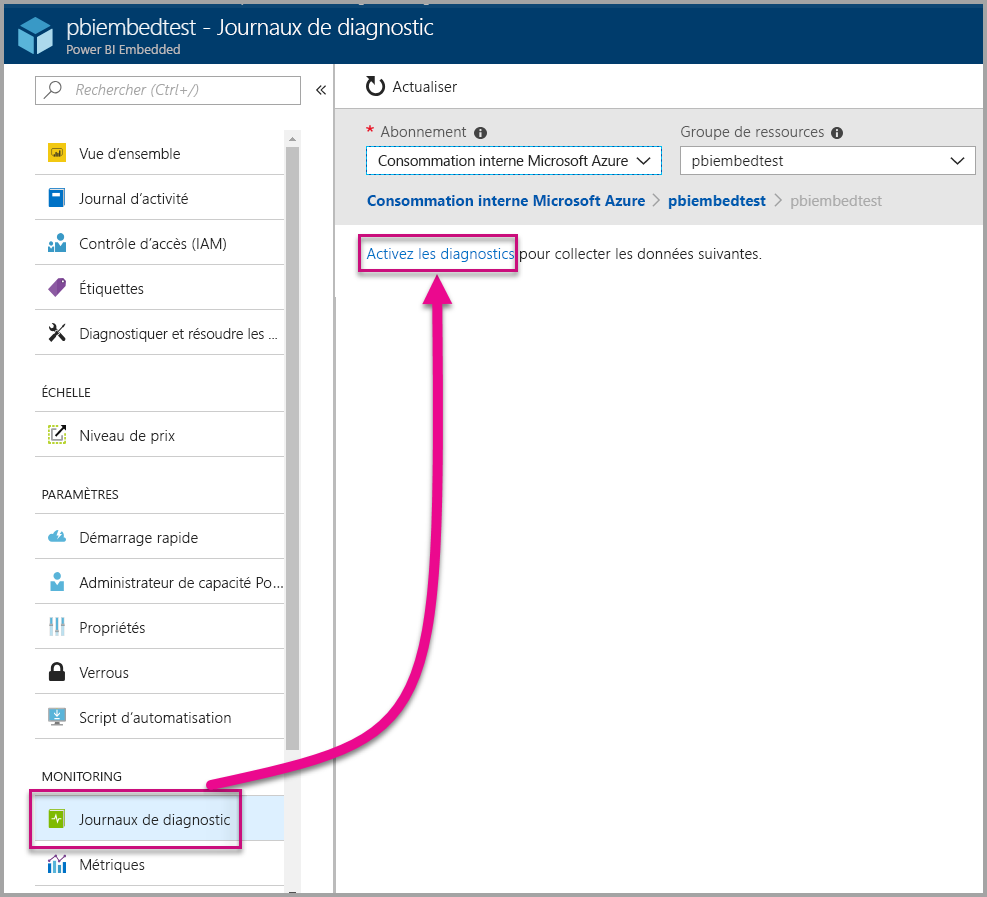
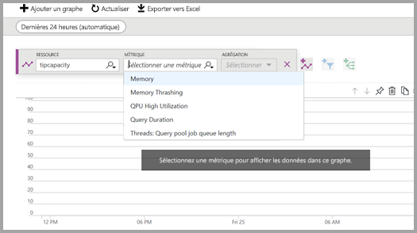
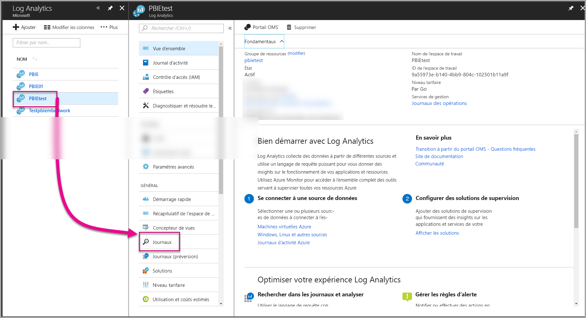
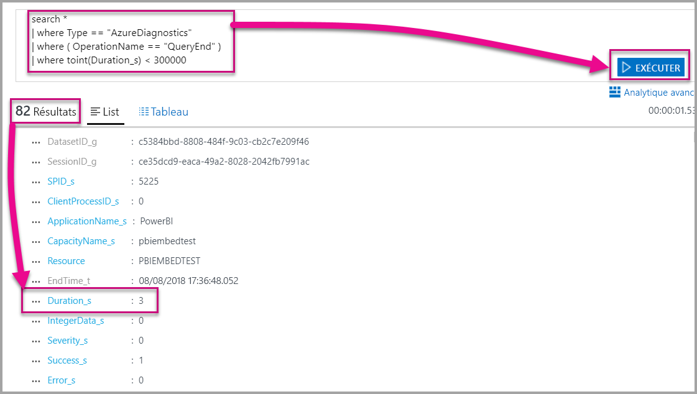

# <a name="diagnostic-logging-for-power-bi-embedded-in-azure"></a>Journalisation des diagnostics pour Power BI Embedded dans Azure

Avec les [journaux de diagnostic des ressources Azure](https://docs.microsoft.com/azure/monitoring-and-diagnostics/monitoring-overview-of-diagnostic-logs), vous pouvez journaliser un grand nombre d’événements à partir de votre capacité, les introduire dans un outil analytique et obtenir des insights sur le comportement de votre ressource.

L’utilisation des Diagnostics peut répondre à certains scénarios, tels que :

* Détection des requêtes longues ou problématiques.
* Dérivation des [métriques de capacité](https://powerbi.microsoft.com/blog/power-bi-developer-community-april-update/).
* Suivi de l’utilisation de jeux de données spécifiques.

## <a name="set-up-diagnostics-logging"></a>Configurer la journalisation des diagnostics

### <a name="azure-portal"></a>Portail Azure

1. Dans le [portail Azure](https://portal.azure.com) > Ressource Power BI Embedded, sélectionnez **Journaux de diagnostic** dans le volet de navigation, puis sélectionnez **Activer les diagnostics**.

    

2. Dans les **Paramètres de diagnostic**, spécifiez les options suivantes :

    * **Nom** : entrez un nom pour le paramètre de diagnostic à créer.

    * **Archiver dans un compte de stockage** : pour utiliser cette option, vous devez vous connecter à un compte de stockage existant. Consultez [Créer un compte de stockage](https://docs.microsoft.com/azure/storage/common/storage-create-storage-account) et suivez les instructions pour créer un compte de stockage. Puis, sélectionnez votre compte de stockage en retournant sur cette page dans le portail. L’affichage des comptes de stockage nouvellement créés dans le menu déroulant peut prendre plusieurs minutes. Le fichier journal est stocké au format JSON.
    * **Diffuser vers Event Hub** : pour utiliser cette option, vous devez vous connecter à un espace de noms Event Hub et à un Event Hub existants. Pour plus d’informations, consultez [Créer un espace de noms Event Hubs et un Event Hub à l’aide du portail Azure](https://docs.microsoft.com/azure/event-hubs/event-hubs-create).
    * **Envoyer à Log Analytics** : pour utiliser cette option, utilisez un espace de travail existant ou créez un nouvel espace de travail Log Analytics en suivant les étapes permettant de [créer un espace de travail](https://docs.microsoft.com/azure/log-analytics/log-analytics-quick-collect-azurevm#create-a-workspace) dans le portail. Cette option tire parti [d’Azure Log Analytics](https://docs.microsoft.com/azure/log-analytics/log-analytics-overview), qui fournit des fonctionnalités intégrées d’analyse, de tableaux de bord et de notification. Vous pouvez utiliser Log Analytics pour vous connecter à davantage de données à partir d’autres ressources, et obtenir une vue unique et complète des données dans toutes les ressources de votre application. Il est également possible de connecter Log Analytics à [Power BI en un seul clic](https://docs.microsoft.com/azure/log-analytics/log-analytics-powerbi).
    Pour plus d’informations sur l’affichage de vos journaux dans Log Analytics, consultez [Afficher les journaux dans Log Analytics](https://docs.microsoft.com/azure/log-analytics/log-analytics-activity).
    * **Moteur** : sélectionnez cette option pour journaliser l’ensemble des [événements moteur répertoriés](#whats-logged) ci-dessous.
    * **AllMetrics** : sélectionnez cette option pour stocker des données détaillées dans [Métriques](https://docs.microsoft.com/azure/analysis-services/analysis-services-monitor#server-metrics). Si vous archivez vers un compte de stockage, vous pouvez sélectionner la période de conservation pour les journaux de diagnostic. Les journaux sont automatiquement supprimés après l’expiration de la période de conservation.

3. Sélectionnez **Save (Enregistrer)** .

    Pour modifier la façon dont vos journaux de diagnostic sont enregistrés, vous pouvez revenir sur cette page pour modifier les paramètres.

    

### <a name="using-powershell-to-enable-diagnostics"></a>Utilisation de PowerShell pour activer les diagnostics

Pour activer la journalisation des métriques et des diagnostics à l’aide de PowerShell, utilisez les commandes suivantes :

* Pour activer le stockage des journaux de diagnostic dans un compte de stockage, utilisez cette commande :

    ```powershell
    Set-AzureRmDiagnosticSetting -ResourceId [your resource id] -StorageAccountId [your storage account id] -Enabled $true
    ```
    L’ID de compte de stockage est l’ID de ressource du compte de stockage vers lequel vous souhaitez envoyer les journaux.

* Pour activer le streaming des journaux de diagnostic vers un Event Hub, utilisez cette commande :

    ```powershell
    Set-AzureRmDiagnosticSetting -ResourceId [your resource id] -ServiceBusRuleId [your service bus rule id] -Enabled $true
    ```
* L’ID de règle Azure Service Bus est une chaîne au format suivant :

    ```powershell
    {service bus resource ID}/authorizationrules/{key name}
    ```

* Pour activer l’envoi des journaux de diagnostics à un espace de travail Log Analytics, utilisez cette commande :

    ```powershell
        Set-AzureRmDiagnosticSetting -ResourceId [your resource id] -WorkspaceId [resource id of the log analytics workspace] -Enabled $true
    ```

* Vous pouvez obtenir l’ID de ressource de votre espace de travail Log Analytics à l’aide de la commande suivante :

    ```powershell
    (Get-AzureRmOperationalInsightsWorkspace).ResourceId
    ```

Vous pouvez combiner ces paramètres pour activer plusieurs options de sortie.

### <a name="rest-api"></a>API REST

Découvrez comment [modifier les paramètres de diagnostic à l’aide de l’API REST Azure Monitor](https://docs.microsoft.com/rest/api/monitor/). 

### <a name="resource-manager-template"></a>Modèle Resource Manager

Découvrez comment [activer les paramètres de diagnostic lors de la création de la ressource à l’aide d’un modèle Resource Manager](https://docs.microsoft.com/azure/monitoring-and-diagnostics/monitoring-enable-diagnostic-logs-using-template).

## <a name="whats-logged"></a>Quels sont les éléments journalisés ?

Vous pouvez sélectionner les catégories **Moteur** et/ou **AllMetrics**.

### <a name="engine"></a>Moteur

La catégorie de moteur indique à la ressource de journaliser les événements suivants, et il existe des propriétés sur chacun des événements :

|     Nom de l'événement     |     Description de l'événement     |
|----------------------------|----------------------------------------------------------------------------------|
|    Audit de connexion    |    Enregistre toutes les nouvelles connexions aux événements moteur depuis le démarrage de la trace.    |
|    Initialisation de la session    |    Enregistre tous les événements d’initialisation de session depuis le démarrage de la trace.    |
|    Début de la requête Vertipaq    |    Enregistrements tous les événements de début de la requête VertiPaq SE depuis le démarrage de la trace.    |
|    Début de la requête    |    Enregistrements tous les événements de début de la requête depuis le démarrage de la trace.    |
|    Fin de la requête    |    Enregistrements tous les événements de fin de la requête depuis le démarrage de la trace.    |
|    Fin de la requête Vertipaq    |    Enregistrements tous les événements de fin de la requête VertiPaq SE depuis le démarrage de la trace.    |
|    Audit de déconnexion    |    Enregistre toutes les déconnexions des événements moteur depuis le démarrage de la trace.    |
|    Erreur    |    Enregistrements tous les événements d’erreur moteur depuis le démarrage de la trace.    |

<br>
<br>

| Nom de la propriété | Fin de la requête Vertipaq - Exemple | Description de la propriété |
|-------------------|---------------------------------------------------------------------------------------------------------------------------------------------------------------------------------------------------------|--------------------------------------------------------------------------------------------------------------------------|
| EventClass | XM_SEQUERY_END | La classe Événements sert à catégoriser les événements. |
| EventSubclass | 0 | La sous-classe Événements fournit des informations supplémentaires sur chaque classe d'événements. (par exemple, 0: VertiPaq Scan) |
| RootActivityId | ff217fd2-611d-43c0-9c12-19e202a94f70 | ID de l'activité racine. |
| CurrentTime | 2018-04-06T18:30:11.9137358Z | Heure à laquelle l'événement a démarré, si disponible. |
| StartTime | 2018-04-06T18:30:11.9137358Z | Heure à laquelle l'événement a démarré, si disponible. |
| JobID | 0 | ID de travail pour la progression. |
| ObjectID | 464 | ID objet |
| ObjectType | 802012 | ObjectType |
| EndTime | 2018-04-06T18:30:11.9137358Z | Heure à laquelle l'événement s'est terminé. |
| Duration | 0 | Temps (en millisecondes) pris par l'événement. |
| SessionType | User | Type de session (quelle entité a provoqué l'opération). |
| ProgressTotal | 0 | Total de progression. |
| IntegerData | 0 | Données de type integer. |
| Gravité | 0 | Niveau de gravité d'une exception. |
| Réussite | 1 | 1 = réussite. 1 = échec (par exemple, 0 signifie le succès d'une vérification des autorisations, et 0 signifie l'échec de cette vérification). |
| Erreur | 0 | Numéro d'erreur d'un événement donné. |
| ConnectionID | 3 | ID de connexion unique. |
| DatasetID | 5eaa550e-06ac-4adf-aba9-dbf0e8fd1527 | ID du jeu de données dans lequel l'instruction de l'utilisateur s'exécute. |
| SessionID | 3D063F66-A111-48EE-B960-141DEBDA8951 | GUID de session. |
| SPID | 180 | ID de processus du serveur. Cela identifie de façon unique une session utilisateur. Cela correspond directement au GUID de session utilisé par XML/A. |
| ClientProcessID | null | ID de traitement de l'application cliente. |
| ApplicationName | null | Nom de l’application cliente qui a créé la connexion au serveur. |
| CapacityName | pbi641fb41260f84aa2b778a85891ae2d97 | Nom de la ressource de la capacité Power BI Embedded. |


### <a name="allmetrics"></a>AllMetrics

L’activation de l’option **AllMetrics** journalise les données de toutes les métriques que vous pouvez utiliser avec une ressource Power BI Embedded.

   

## <a name="manage-your-logs"></a>Gérer vos journaux

Les journaux sont généralement disponibles dans un délai de deux heures une fois la journalisation configurée. C’est à vous de gérer vos journaux dans votre compte de stockage :

* Utilisez les méthodes de contrôle d’accès Azure standard pour sécuriser vos journaux en limitant qui y a accès.
* Supprimez les journaux que vous ne souhaitez plus conserver dans votre compte de stockage.
* Veillez à définir une période de conservation, afin que les anciens journaux soient supprimés de votre compte de stockage.

## <a name="view-logs-in-log-analytics"></a>Afficher les journaux dans Log Analytics

Les métriques et les événements serveur sont intégrés à xEvents dans Log Analytics pour une analyse côte à côte. Log Analytics peut également être configuré pour recevoir des événements à partir d’autres services Azure qui fournissent une vue holistique des données de journalisation de diagnostic au sein de votre architecture.

Pour afficher vos données de diagnostic dans Log Analytics, ouvrez la page **Journaux** dans le menu de gauche ou la zone de gestion, comme indiqué ci-dessous.



Maintenant que vous avez activé la collecte de données, dans **Journaux**, sélectionnez **Toutes les données collectées**.


Dans **Type**, sélectionnez **AzureDiagnostics**, puis sélectionnez **Appliquer**. AzureDiagnostics inclut les événements du moteur. Notez qu'une requête Log Analytics est créée à la volée.


Sélectionnez **EventClass\_s** ou un des noms d’événements et Log Analytics poursuit la création d’une requête. Veillez à enregistrer vos requêtes pour les réutiliser ultérieurement.

N’oubliez pas de consulter [Log Analytics](https://docs.microsoft.com/azure/log-analytics/), qui fournit un site web avec des fonctionnalités améliorées en termes de requête, tableau de bord et alerte sur les données collectées.

### <a name="queries"></a>les requêtes

Il existe des centaines de requêtes que vous pouvez utiliser. En voici quelques-unes pour vous aider à démarrer. Pour en savoir plus sur l’utilisation du nouveau langage de requête Recherche dans les journaux, consultez [Comprendre les recherches dans les journaux dans Log Analytics](https://docs.microsoft.com/azure/log-analytics/log-analytics-log-search).

* Retour de requête ayant pris moins de cinq minutes (300 000 millisecondes) pour s’exécuter.

    ```
    search *
    | where Type == "AzureDiagnostics"
    | where ( OperationName == "QueryEnd" )
    | where toint(Duration_s) < 300000
    ```

    

* Identifiez les noms de capacité.

    ```
    search *
    | where ( Type == "AzureDiagnostics" )
    | summarize count() by CapacityName_s 
    ```

    

## <a name="next-steps"></a>Étapes suivantes

Vous pouvez en savoir plus sur la journalisation de diagnostic des ressources Azure.

> [!div class="nextstepaction"]
> [Journalisation de diagnostic de ressource Azure](https://docs.microsoft.com/azure/monitoring-and-diagnostics/monitoring-overview-of-diagnostic-logs)

> [!div class="nextstepaction"]
> [Set-AzureRmDiagnosticSetting](https://docs.microsoft.com/powershell/module/azurerm.insights/Set-AzureRmDiagnosticSetting)
