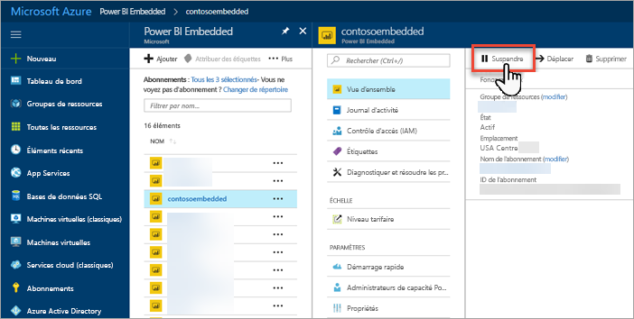
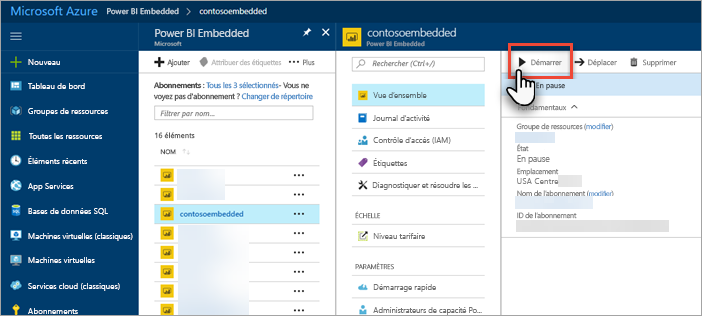

# Suspendre et démarrer une capacité Power BI Embedded dans le Portail Microsoft Azure

Cet article explique pas à pas comment suspendre et démarrer une capacité Power BI Embedded dans Microsoft Azure. Vous êtes censé avoir créé une capacité Power BI Embedded. Si ce n’est pas le cas, consultez [Créer une capacité Power BI Embedded dans le Portail Microsoft Azure](azure-pbie-create-capacity.md) pour commencer.

Si vous n’avez pas d’abonnement Azure, créez un [compte gratuit](https://azure.microsoft.com/free/) avant de commencer.

## Suspendre votre capacité

La suspension de votre capacité vous évite d’être facturé. Cela s’avère utile si vous n’avez pas besoin d’utiliser la capacité pendant un certain temps. Pour suspendre votre capacité, effectuez les étapes suivantes.

> [!NOTE]
> La suspension d’une capacité peut rendre le contenu indisponible dans Power BI. Pour éviter toute interruption, veillez à supprimer l’affectation d’espaces de travail dans votre capacité avant de procéder à la suspension.

1. Connectez-vous au [portail Azure](https://portal.azure.com/).

2. Sélectionnez **Tous les services** > **Power BI Embedded** pour voir vos capacités.

    

3. Sélectionnez la capacité que vous voulez suspendre.

    

4. Sélectionnez **Suspendre** dans les détails de la capacité.

    

5. Sélectionnez **Oui** pour confirmer votre volonté de suspendre la capacité.

    

## Démarrer votre capacité

Rétablissez l’utilisation en démarrant votre capacité. Le démarrage de la capacité rétablit aussi la facturation.

1. Connectez-vous au [portail Azure](https://portal.azure.com/).

2. Sélectionnez **Tous les services** > **Power BI Embedded** pour voir vos capacités.

    

3. Sélectionnez la capacité que vous voulez démarrer.

    

4. Sélectionnez **Démarrer** dans les détails de la capacité.

    

5. Sélectionnez **Oui** pour confirmer votre volonté de démarrer la capacité.

    

Si du contenu est affecté à cette capacité, il devient disponible une fois celle-ci démarrée.

## Étapes suivantes

Si vous souhaitez faire monter ou descendre en puissance votre capacité, consultez [Mettre à l'échelle votre capacité Power BI Embedded](azure-pbie-scale-capacity.md).

Pour commencer à incorporer du contenu Power BI dans votre application, consultez [Guide pratique pour incorporer vos tableaux de bord, rapports et vignettes Power BI](https://powerbi.microsoft.com/documentation/powerbi-developer-embedding-content/).

D’autres questions ? [Essayez d’interroger la communauté Power BI](https://community.powerbi.com/)