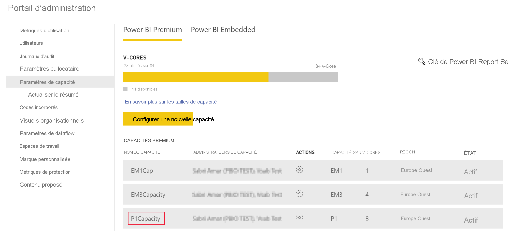
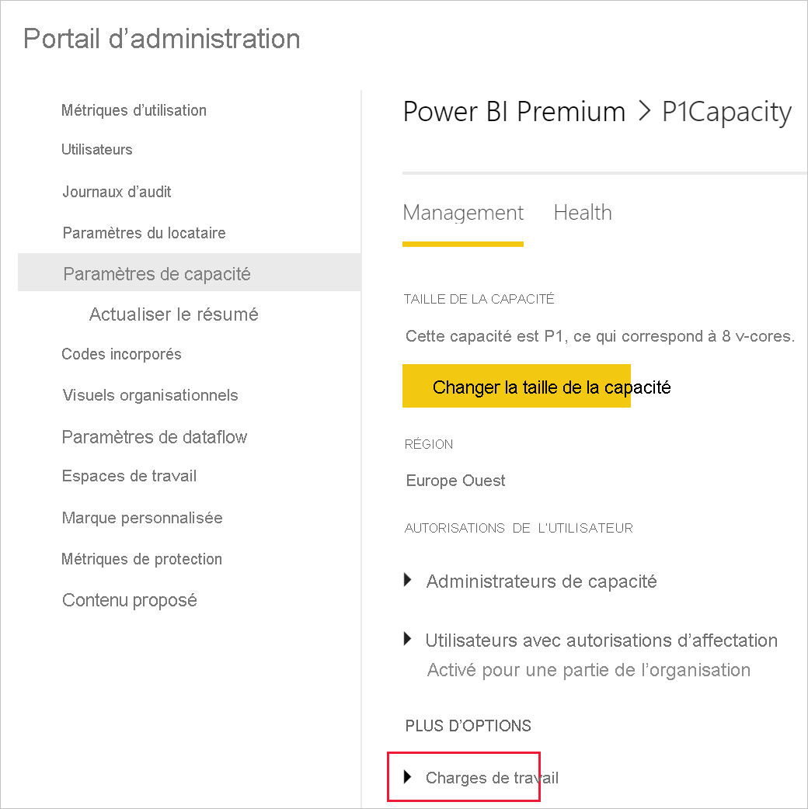
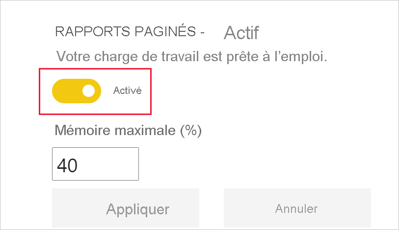
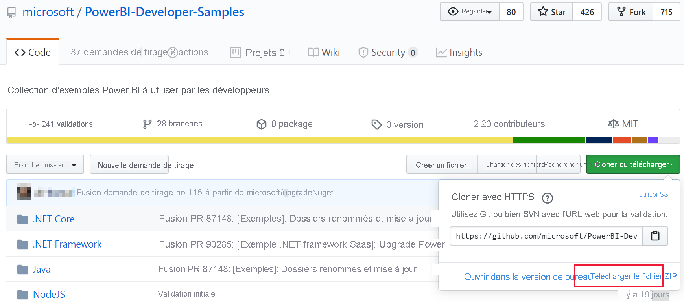

# <a name="tutorial-embed-power-bi-paginated-reports-into-an-application-for-your-organization"></a>Tutoriel : Incorporer des rapports paginés Power BI dans une application pour votre organisation

Dans **Power BI**, vous pouvez incorporer des rapports paginés dans une application pour votre organisation à l’aide du scénario *l’utilisateur possède les données*.

Les rapports paginés sont des rapports conçus pour une impression haute qualité. En général, ces rapports contiennent beaucoup de données, rendues de manière à ce qu’elles tiennent sur les pages imprimées.
Pour comprendre comment Power BI prend en charge les rapports paginés, consultez [Présentation des rapports paginés dans Power BI Premium](https://docs.microsoft.com/power-bi/paginated-reports-report-builder-power-bi)

**User owns data** permet à votre application d’étendre le service Power BI afin qu’elle puisse utiliser l’analytique incorporée. Ce tutoriel montre comment intégrer un rapport paginé dans une application.

Vous utiliserez le kit de développement logiciel (SDK) .NET Power BI avec l’API JavaScript Power BI pour incorporer Power BI dans une application de votre organisation.


Ce tutoriel vous montre comment effectuer les tâches suivantes :
> [!div class="checklist"]
> * inscrire une application dans Azure ;
> * incorporer un rapport paginé Power BI dans une application à l’aide de votre locataire Power BI.

## <a name="prerequisites"></a>Prérequis
Pour commencer, vous devez disposer des éléments suivants :

* Un [compte Power BI Pro](../../admin/service-admin-purchasing-power-bi-pro.md).

* Vous avez besoin de votre propre installation d’un [locataire Azure Active Directory](create-an-azure-active-directory-tenant.md).

* Au moins une capacité P1. Consultez [De quelle taille de capacité Premium ai-je besoin pour des rapports paginés ?](../../paginated-reports/paginated-reports-faq.md#what-size-premium-capacity-do-i-need-for-paginated-reports)

Si vous n’avez pas d’abonnement à **Power BI Pro**, [inscrivez-vous à un essai gratuit](https://powerbi.microsoft.com/pricing/) avant de commencer.

## <a name="set-up-your-power-bi-environment"></a>Configurer votre environnement Power BI

Suivez les instructions de cette section afin de configurer Power BI pour l’incorporation de vos rapports paginés.

### <a name="register-a-server-side-web-application-app"></a>Inscrire une application web côté serveur

Suivez les instructions sous [Inscrire une application Azure AD à utiliser avec Power BI](register-app.md) pour inscrire une application web côté serveur.

>[!NOTE]
>Lors de l’inscription de l’application, assurez-vous d’effectuer les opérations suivantes :
>* Obtenir le secret de l’application
>* Appliquez les autorisations **Report.ReadAll** (étendue) à votre application.

### <a name="create-a-dedicated-capacity"></a>Créer une capacité dédiée

En créant une capacité dédiée, vous pouvez mettre à profit le fait que vous disposez d’une ressource dédiée pour le contenu de votre espace de travail d’application. Pour les rapports paginés, vous devez sauvegarder votre espace de travail d’application avec au minimum une capacité P1. Vous pouvez créer une capacité dédiée avec [Power BI Premium](../../admin/service-premium-what-is.md).

Le tableau suivant répertorie les références (SKU) Power BI Premium qui peuvent être utilisées pour créer une capacité dédiée pour les rapports paginés dans [Microsoft Office 365](../../admin/service-admin-premium-purchase.md) :

| Nœud de capacité | Nb total de vCores<br/>(backend + frontend) | vCores backend | vCores frontend | Limites de connexions actives/DirectQuery |
| --- | --- | --- | --- | --- | --- |
| P1 |8 vCores |4 vCores, 25 Go de RAM |4 vCores |30 par seconde |
| P2 |16 vCores |8 vCores, 50 Go de RAM |8 vCores |60 par seconde |
| P3 |32 vCores |16 vCores, 100 Go de RAM |16 vCores |120 par seconde |
| P4 |64 vCores |32 vCores, 200 Go de RAM |32 vCores |240 par seconde |
| P5 |128 vCores |64 vCores, 400 Go de RAM |64 vCores |480 par seconde |
|||||

### <a name="enable-paginated-reports-workload"></a>Activer la charge de travail des rapports paginés

Vous devez activer la charge de travail des rapports paginés sur votre capacité dédiée.

1. Connectez-vous à [Power BI > Portail d’administration > Paramètres de capacité](https://app.powerbi.com/admin-portal/capacities).

2. Sélectionnez la capacité contenant l’espace de travail vers lequel vous souhaitez charger le rapport paginé.

    

3. Développez **Charges de travail**.

    

4. Activez la charge de travail des rapports paginés.

    

### <a name="assign-an-app-workspace-to-a-dedicated-capacity"></a>Affecter un espace de travail d’application à une capacité dédiée

Après avoir créé une capacité dédiée, vous pouvez lui affecter l’espace de travail de votre application. Pour ce faire, effectuez les étapes suivantes :

1. Dans le service Power BI, développez les espaces de travail, puis sélectionnez **Plus** pour l’espace de travail que vous utilisez pour incorporer votre contenu. Sélectionnez ensuite **Paramètres de l’espace de travail**.

    

2. Sélectionnez **Premium** et activez **Capacité dédiée**. Sélectionnez la capacité dédiée que vous avez créée. Ensuite, sélectionnez **Enregistrer**.

    

3. Après avoir sélectionné **Enregistrer**, vous devez voir un losange à côté du nom de l’espace de travail de l’application.

    

### <a name="create-and-publish-your-power-bi-paginated-reports"></a>Créer et publier vos rapports paginés Power BI

Vous pouvez créer vos rapports paginés avec le [Générateur de rapports Power BI](../../paginated-reports/paginated-reports-report-builder-power-bi.md#create-reports-in-power-bi-report-builder). Ensuite, vous pouvez [charger le rapport](../../paginated-reports/paginated-reports-quickstart-aw.md#upload-the-report-to-the-service) dans un espace de travail d’application auquel est affecté au minimum une capacité P1 et activer la [charge de travail des rapports paginés](#enable-paginated-reports-workload). L’utilisateur final qui charge le rapport doit avoir une licence Power BI Pro pour publier dans un espace de travail d’application.
   
## <a name="embed-your-content-by-using-the-sample-application"></a>Incorporer votre contenu en utilisant l’exemple d’application

Cet exemple est intentionnellement simple pour faciliter la démonstration.

Suivez les étapes ci-dessous pour commencer l’incorporation de votre contenu en utilisant l’exemple d’application.

1. Téléchargez [Visual Studio](https://www.visualstudio.com/) (version 2013 ou ultérieure). Veillez à télécharger le dernier [package NuGet](https://www.nuget.org/profiles/powerbi).

2. Téléchargez [PowerBI-Developer-Samples](https://github.com/Microsoft/PowerBI-Developer-Samples) et ouvrez .NET Framework > Incorporer pour votre organisation > integrate-web-app > **PBIWebApp**.

    

3. Ouvrez le fichier **Cloud.config** dans l’exemple d’application et renseignez les champs suivants pour exécuter votre application :
    * [ID de l’application](#application-id)
    * [ID de l’espace de travail](#workspace-id)
    * [ID du rapport](#report-id)
    * [AADAuthorityUrl](#aadauthorityurl)

    

### <a name="application-id"></a>ID de l’application

Dans le champ **applicationId**, indiquez **l’ID d’application** **d’Azure**. L’information **applicationId** est utilisée par l’application pour s’identifier auprès des utilisateurs auxquels vous demandez des autorisations.

Pour récupérer la valeur **applicationId**, suivez ces étapes :

1. Connectez-vous au [portail Azure](https://portal.azure.com).

2. Dans le volet de navigation de gauche, sélectionnez **Tous les services**, puis **Inscriptions d’applications**.

3. Sélectionnez l’application ayant besoin de la valeur **applicationId**.

    

4. Un **ID d’application** est listé au format GUID. Utilisez cet **ID d’application** comme **applicationId** de l’application.

    

### <a name="workspace-id"></a>ID de l’espace de travail

Dans **workspaceId**, indiquez le GUID d’espace de travail d’application (groupe) provenant de Power BI. Vous pouvez obtenir ces informations à partir de l’URL quand vous êtes connecté au service Power BI ou à l’aide de PowerShell.

URL <br>


PowerShell <br>

```powershell
Get-PowerBIworkspace -name "User Owns Embed Test"
```

   

### <a name="report-id"></a>ID du rapport

Dans **reportId**, indiquez le GUID de rapport provenant de Power BI. Vous pouvez obtenir ces informations à partir de l’URL quand vous êtes connecté au service Power BI ou à l’aide de PowerShell.


PowerShell <br>

```powershell
Get-PowerBIworkspace -name "User Owns Embed Test" | Get-PowerBIReport -Name "Sales Paginated Report"
```


### <a name="aadauthorityurl"></a>AADAuthorityUrl

Remplissez les informations **AADAuthorityUrl** avec l’URL qui vous permet d’effectuer l’incorporation dans votre locataire organisationnel ou d’effectuer l’incorporation avec un utilisateur invité.

Pour l’incorporation avec votre locataire organisationnel, utilisez l’URL *https://login.microsoftonline.com/common/oauth2/authorize* .

Pour l’incorporation avec un invité, utilisez l’URL *`https://login.microsoftonline.com/report-owner-tenant-id`* , où vous ajoutez l’ID de locataire du propriétaire du rapport à la place de *report-owner-tenant-id*.

### <a name="run-the-application"></a>Exécuter l’application

1. Sélectionnez **Exécuter** dans **Visual Studio**.

    

2. Ensuite, sélectionnez **Incorporer un rapport**. Sélectionnez l’option correspondant au contenu choisi pour le test (rapports, tableaux de bord ou vignettes) dans l’application.

    

3. Vous pouvez à présent voir le rapport dans l’exemple d’application.

    

## <a name="next-steps"></a>Étapes suivantes

Dans ce tutoriel, vous avez appris à incorporer des rapports paginés Power BI dans une application à l’aide de votre compte d’organisation Power BI. 

> [!div class="nextstepaction"]
> [Incorporer à partir d’applications](embed-from-apps.md)

> [!div class="nextstepaction"]
>[Incorporer du contenu Power BI pour vos clients](embed-sample-for-customers.md)

> [!div class="nextstepaction"]
>[Incorporer des rapports paginés Power BI pour vos clients](embed-paginated-reports-customers.md)

Si vous avez d’autres questions, [essayez d’interroger la communauté Power BI](http://community.powerbi.com/).
