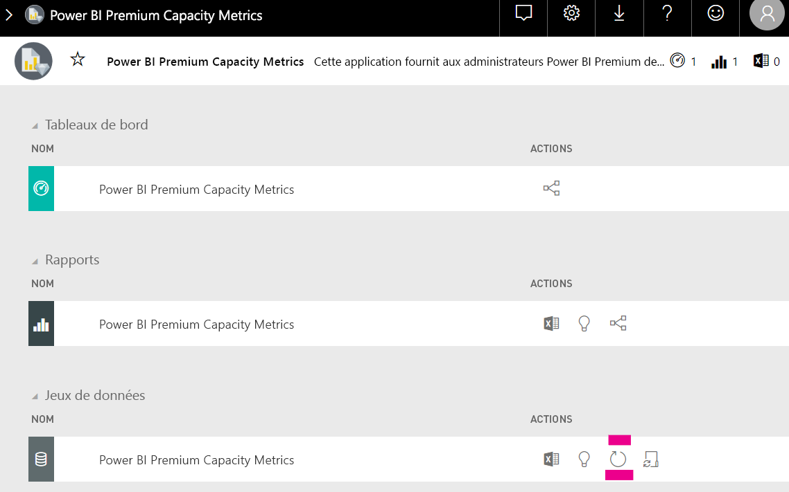

# Planification d’une capacité dans l’analytique incorporée de Power BI

Il peut être compliqué de calculer le type de capacité nécessaire pour un déploiement de l’analytique incorporée de Power BI. Cela est dû au fait que ce calcul est basé sur plusieurs paramètres, dont certains sont difficiles à prédire.

Voici quelques éléments à prendre en considération lors de la planification de votre capacité :

* Les modèles de données que vous utilisez
* Le nombre et la complexité des requêtes requises
* La distribution horaire de l’utilisation de votre application
* Les taux d’actualisation des données
* Les modèles d’utilisation supplémentaires difficiles à prédire.

Cet article est conçu pour faciliter la planification de la capacité pour l’analytique intégrée de Power BI, en introduisant [l’outil d’évaluation de la charge de la capacité Power BI](https://github.com/microsoft/PowerBI-Tools-For-Capacities/tree/master/LoadTestingPowerShellTool/), créé pour automatiser les tests de charge pour les capacités d’analytique intégrée de Power BI (références SKU *A*, *EM* ou *P*).

## Outil de planification

 [L’outil d’évaluation de la charge de la capacité Power BI](https://github.com/microsoft/PowerBI-Tools-For-Capacities/tree/master/LoadTestingPowerShellTool/) peut vous aider à comprendre quelle charge utilisateur votre capacité peut gérer. Il utilise PowerShell pour créer des tests de charge automatisés sur vos capacités et vous permet de choisir les rapports à tester et le nombre d’utilisateurs simultanés à simuler.

L’outil génère une charge sur une capacité en effectuant en continu un rendu de chaque rapport avec de nouvelles valeurs de filtre (pour éviter l’obtention de bonnes performances irréalistes dues à la mise en cache des rapports), jusqu’à ce que le jeton requis pour l’authentification de l’outil sur le service expire.

### Utilisation de l’outil de planification

Lors de l’exécution de l’outil, gardez à l’esprit la charge existante sur vos capacités et veillez à ne pas exécuter les tests de charge pendant les périodes d’utilisation les plus importantes.

Voici quelques exemples de la façon dont vous pouvez utiliser l’outil de planification.

* Les administrateurs de capacité peuvent avoir une meilleure compréhension du nombre d’utilisateurs que leur capacité peut gérer dans un laps de temps donné.
* Les auteurs de rapports peuvent comprendre l’effet de la charge utilisateur, tel qu’elle est mesurée avec [l’analyseur de performances](../../create-reports/desktop-performance-analyzer.md) de Power BI Desktop.
* Vous pouvez voir les rendus en temps réel dans votre navigateur.
* À l’aide de SQL Server Profiler, vous pouvez [vous connecter aux points de terminaison XMLA](https://powerbi.microsoft.com/blog/power-bi-open-platform-connectivity-with-xmla-endpoints-public-preview/) des capacités mesurées, afin de voir les requêtes en cours d’exécution.
* Les effets du test de charge sont visibles dans la page Jeux de données de l’application des métriques de la capacité Premium. Les administrateurs de capacité peuvent utiliser cet outil pour générer la charge et voir comment elle s’affiche.

### Examen des résultats des tests

Pour voir les effets du test de charge dans l’application des métriques après l’exécution du test, procédez comme suit. Attendez-vous à un délai pouvant aller jusqu’à 15 minutes entre le moment où le test commence à générer la charge et le moment où la charge est visible dans les métriques.

1. Développez l’onglet **Jeux de données** de la page d’accueil de votre [application des métriques](../../admin/service-admin-premium-monitor-capacity.md).
2. Lancez une actualisation à la demande en cliquant sur **actualiser maintenant**. Les administrateurs doivent.

    

## Référentiel GitHub des outils de capacité Power BI

Le [référentiel GitHub des outils de capacité Power BI](https://github.com/microsoft/PowerBI-Tools-For-Capacities) a été créé pour héberger l’outil de planification de la capacité et d’autres outils et utilitaires à venir.

Le référentiel est open source et les utilisateurs sont encouragés à y contribuer, à ajouter d’autres outils liés aux capacités Power BI Premium et Embedded, et à améliorer les capacités existantes.

## Étapes suivantes

> [!div class="nextstepaction"]
>[Capacité et références SKU dans l’analytique intégrée de Power BI](embedded-capacity.md)

> [!div class="nextstepaction"]
>[Bonnes pratiques relatives aux performances de Power BI Embedded](embedded-performance-best-practices.md)