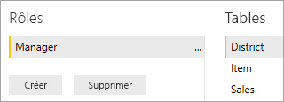
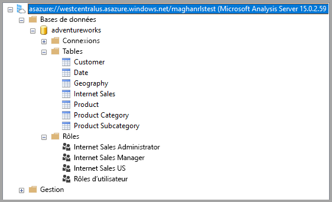
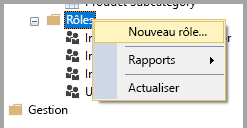
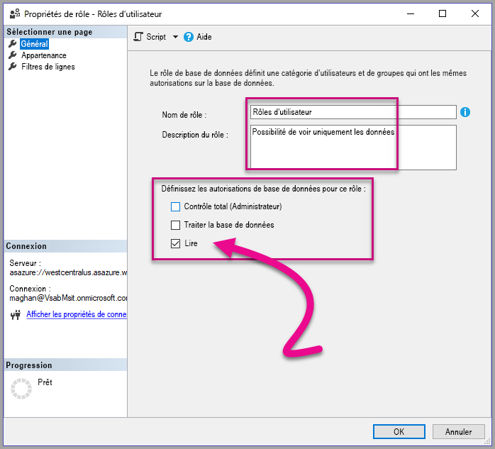
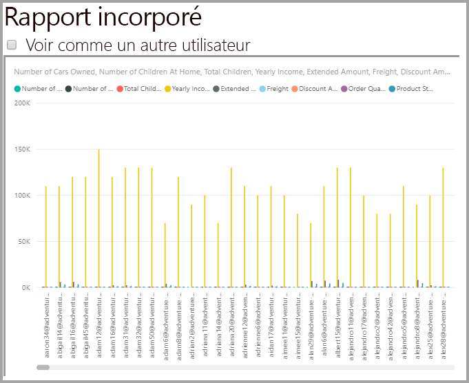

# <a name="row-level-security-with-power-bi-embedded"></a>Sécurité au niveau des lignes avec Power BI Embedded

La **sécurité au niveau des lignes** peut être utilisée pour restreindre l’accès aux données dans des tableaux de bord, vignettes, rapports et jeux de données. Différents utilisateurs peuvent travailler sur ces mêmes artefacts tout en voyant des données différentes. L’incorporation prend en charge la sécurité au niveau des lignes.

Si vous incorporez un rapport pour les utilisateurs non-Power BI (l’application possède les données), en général un scénario ISV, cet article est fait pour vous. Configurez le jeton d’incorporation pour prendre en compte l’utilisateur et le rôle.

Si vous incorporez des rapports pour des utilisateurs Power BI (l’utilisateur possède les données) au sein de votre organisation, la sécurité au niveau des lignes fonctionne de la même façon que dans le service Power BI directement. Il n’y a rien de plus à faire dans votre application. Pour plus d’informations, consultez [Sécurité au niveau des lignes avec Power BI](../../admin/service-admin-rls.md).


Pour tirer parti de la sécurité au niveau des lignes, il est important de comprendre trois concepts principaux : les utilisateurs, les rôles et les règles. Examinons plus en détail ces concepts :

**Utilisateurs** : utilisateurs finaux qui voient l’artefact (tableau de bord, vignette, rapport ou jeu de données). Dans Power BI Embedded, les utilisateurs sont identifiés par la propriété de nom d’utilisateur dans un jeton d’incorporation.

**Rôles** : les utilisateurs appartiennent à des rôles. Un rôle est un conteneur de règles et peut être nommé en *Directeur des ventes* ou *Commercial*. Vous créez des rôles dans Power BI Desktop. Pour plus d’informations, consultez [Sécurité au niveau des lignes avec Power BI Desktop](../../create-reports/desktop-rls.md).

**Règles** : les rôles ont des règles et ces dernières sont les filtres réels qui vont être appliqués aux données. Les règles peuvent être aussi simples que « Pays = États-Unis » ou quelque chose de beaucoup plus dynamique.
Dans le reste de cet article, vous verrez un exemple de création de sécurité au niveau des lignes et de consommation au sein d’une application incorporée. Cet exemple utilise le fichier PBIX [Exemple Analyse de la vente au détail](https://go.microsoft.com/fwlink/?LinkID=780547).


## <a name="adding-roles-with-power-bi-desktop"></a>Ajout de rôles dans Power BI Desktop

Notre **exemple Analyse de la vente au détail** affiche les ventes pour tous les magasins d’une chaîne de distribution. Sans la sécurité au niveau des lignes, tous les directeurs régionaux qui se connectent au rapport pour le consulter voient les mêmes données. La direction a déterminé que chaque directeur régional devait voir uniquement les ventes des magasins qu’il gère. La sécurité au niveau des lignes permet à la direction de limiter les données en fonction d’un directeur régional.

La sécurité au niveau des lignes est créée dans Power BI Desktop. Lorsque le jeu de données et les rapports sont ouverts, vous pouvez basculer vers la vue de diagramme pour voir le schéma :


Il convient de noter quelques points avec ce schéma :

* Toutes les mesures, telles que **Total Sales (Total des ventes)** , sont stockées dans la table de faits **Sales (Ventes)** .
* Il existe quatre tables de dimension connexes supplémentaires : **Item (Article)** , **Time (Temps)** , **Store (Magasin)** et **District (Secteur)** .
* Les flèches sur les lignes de relation indiquent dans quel sens les filtres peuvent transiter d’une table à une autre. Par exemple, si un filtre est placé sur **Time[Date]** , dans le schéma actuel, il permet uniquement de filtrer les valeurs de la table **Sales (Ventes)** . Aucune autre table n’est affectée par ce filtre, car toutes les flèches des lignes de relation pointent vers la table Sales et n’en partent pas.
* La table **District (Secteur)** indique qui est le directeur de chaque région :
  
    

En fonction de ce schéma, si vous appliquez un filtre à la colonne **District Manager** (Directeur régional) dans la table **District** (Secteur), et si ce filtre correspond à l’utilisateur qui consulte le rapport, il filtre les tables **Store** (Magasin) et **Sales** (Ventes) pour afficher les données de ce directeur régional.

Voici comment procéder :

1. Sous l’onglet **Modélisation**, sélectionnez **Gérer les rôles**.

    
2. Créez un rôle nommé **Directeur**.

    
3. Dans la table **District (Secteur)** , entrez cette expression DAX : **[District Manager] = USERNAME()** .

    
4. Pour vérifier que les règles fonctionnent, sous l’onglet **Modélisation**, sélectionnez **Afficher comme rôles**, puis sélectionnez le rôle **Manager (Directeur)** que vous avez créé ainsi que **Autres utilisateurs**. Entrez **Andrew Ma** pour l’utilisateur.

    

    Les rapports affichent les données comme si vous étiez connecté en tant que **Andrew Ma**.

En appliquant le filtre comme vous l’avez fait ici, tous les enregistrements des tables **District** (Secteur), **Store** (Magasin) et **Sales** (Ventes) sont filtrés. Toutefois, en raison de la direction du filtrage sur les relations entre **Sales** et **Time**, **Sales** et **Item**, et **Item** et **Time**, les tables ne sont pas filtrées. Pour en savoir plus sur le filtrage croisé bidirectionnel, téléchargez le livre blanc [Bidirectional cross-filtering in SQL Server Analysis Services 2016 and Power BI Desktop](https://download.microsoft.com/download/2/7/8/2782DF95-3E0D-40CD-BFC8-749A2882E109/Bidirectional%20cross-filtering%20in%20Analysis%20Services%202016%20and%20Power%20BI.docx).

## <a name="applying-user-and-role-to-an-embed-token"></a>Application de l’utilisateur et du rôle à un jeton d’incorporation

Maintenant que vous avez configuré vos rôles Power BI Desktop, vous devez effectuer certaines tâches dans votre application pour tirer parti des rôles.

Les utilisateurs sont authentifiés et autorisés par votre application et les jetons d’incorporation sont utilisés pour accorder l’accès utilisateur à un rapport Power BI Embedded spécifique. Power BI Embedded n’a pas d’informations spécifiques sur l’utilisateur. Pour que la sécurité au niveau des lignes fonctionne, vous devez transmettre un contexte supplémentaire dans le cadre de votre jeton d’incorporation sous la forme d’identités. Vous pouvez passer les identités à l’aide de l’API [Jeton d’incorporation](/rest/api/power-bi/embedtoken).

L’API accepte une liste des identités avec l’indication des jeux de données pertinents. Pour que la sécurité au niveau des lignes fonctionne, vous devez transmettre les éléments suivants dans le cadre de l’identité.

* **Nom d’utilisateur (obligatoire)**  : chaîne qui peut être utilisée pour identifier l’utilisateur lors de l’application des règles de sécurité au niveau des lignes. Un seul utilisateur peut être répertorié. Votre nom d’utilisateur peut être créé avec des caractères *ASCII*.
* **Rôles (obligatoire)** : chaîne contenant les rôles à sélectionner lors de l’application des règles de sécurité au niveau des lignes. Si vous transmettez plusieurs rôles, ceux-ci doivent l’être en tant que tableau de chaînes.
* **Jeu de données (obligatoire)**  : jeu de données applicable à l’artefact que vous incorporez.

Vous pouvez créer le jeton d’incorporation à l’aide de la méthode **GenerateTokenInGroup** sur **PowerBIClient.Reports**.

Par exemple, vous pourriez modifier l’exemple *[PowerBI-Developer-Samples](https://github.com/Microsoft/PowerBI-Developer-Samples) > .NET Framework > Incorporer pour vos clients > **PowerBIEmbedded_AppOwnsData** _.

_ *Avant la modification**

```csharp
// Generate Embed Token with effective identities.
generateTokenRequestParameters = new GenerateTokenRequest(accessLevel: "view", identities: new List<EffectiveIdentity> { rls });

// Generate Embed Token for reports without effective identities.
generateTokenRequestParameters = new GenerateTokenRequest(accessLevel: "view");
```

**Après la modification**

```csharp
var generateTokenRequestParameters = new GenerateTokenRequest("View", null, identities: new List<EffectiveIdentity> { new EffectiveIdentity(username: "username", roles: new List<string> { "roleA", "roleB" }, datasets: new List<string> { "datasetId" }) });

var tokenResponse = await client.Reports.GenerateTokenInGroupAsync("groupId", "reportId", generateTokenRequestParameters);
```

Si vous appelez l’API REST, l’API mise à jour accepte maintenant un tableau JSON supplémentaire, nommé **Identités**, qui contient un nom d’utilisateur, la liste des rôles de chaîne et la liste des jeux de données de chaîne. 

Utilisez le code suivant en guise d’exemple :

```json
{
    "accessLevel": "View",
    "identities": [
        {
            "username": "EffectiveIdentity",
            "roles": [ "Role1", "Role2" ],
            "datasets": [ "fe0a1aeb-f6a4-4b27-a2d3-b5df3bb28bdc" ]
        }
    ]
}
```

Maintenant, quand une personne se connecte à votre application pour afficher cet artefact, elle voit les données qu’elle est autorisée à voir, en fonction de ce qui a été défini par la sécurité au niveau des lignes.

## <a name="working-with-analysis-services-live-connections"></a>Utilisation des connexions actives d’Analysis Services

Vous pouvez utiliser la sécurité au niveau des lignes avec les connexions actives Analysis Services pour les serveurs locaux. Lorsque vous utilisez ce type de connexion, vous devez comprendre quelques concepts spécifiques.

L’identité effective fournie pour la propriété de nom d’utilisateur doit être celle d’un utilisateur Windows disposant d’autorisations sur le serveur Analysis Services.

>[!NOTE]
> Quand vous utilisez un principal de service avec une source de données [Azure Analysis Services](/azure/analysis-services/analysis-services-overview), le principal de service doit lui-même disposer d’autorisations d’instance Azure Analysis Services. L’utilisation d’un groupe de sécurité qui contient le principal du service à cet effet ne fonctionne pas.

### <a name="on-premises-data-gateway-configuration"></a>Configuration d’une passerelle de données locale

Une [passerelle de données locale](../../connect-data/service-gateway-onprem.md) est utilisée lors de l’utilisation des connexions actives d’Analysis Services. Lorsque vous générez un jeton incorporé, avec une identité répertoriée, le compte principal doit être répertorié en tant qu’administrateur de la passerelle. Si le compte principal n’est pas listé, la sécurité au niveau des lignes n’est pas appliquée à la propriété des données. Une personne qui n’est pas administrateur de la passerelle peut fournir des rôles, mais doit spécifier son propre nom d’utilisateur en tant qu’identité effective.

### <a name="use-of-roles"></a>Utilisation des rôles

Des rôles peuvent être fournis avec l’identité dans un jeton d’incorporation. Si aucun rôle n’est fourni, le nom d’utilisateur fourni peut être utilisé pour résoudre les rôles associés.

### <a name="using-the-customdata-feature"></a>Utilisation de la fonctionnalité CustomData

CustomData fonctionne uniquement pour les modèles qui résident dans **Azure Analysis Services** et uniquement en mode **Connexion directe**. Contrairement aux utilisateurs et aux rôles, la fonctionnalité de données personnalisées ne peut pas être définie dans un fichier .pbix. Lors de la génération d’un jeton avec la fonctionnalité Custom data, vous devez avoir un nom d’utilisateur.

>[!NOTE]
>Le nom d’utilisateur CustomData ne peut pas comporter plus de 256 caractères.

La fonctionnalité CustomData vous permet d’ajouter un filtre de lignes lors de l’affichage des données Power BI dans votre application quand vous utilisez **Azure Analysis Services** comme source de données (affichage de données Power BI connectées à Azure Analysis Services dans votre application).

La fonctionnalité CustomData permet de passer du texte libre (chaîne) à l’aide de la propriété de chaîne de connexion CustomData. Analysis Services utilise cette valeur par le biais de la fonction *CUSTOMDATA()* .

Le seul moyen de disposer d’une sécurité au niveau des lignes dynamique (qui utilise des valeurs dynamiques pour l’évaluation de filtre) dans **Azure Analysis Services** consiste à utiliser la fonction *CUSTOMDATA()* .

Vous pouvez l’utiliser à l’intérieur de la requête DAX de rôle, de même que sans aucun rôle dans une requête DAX de mesure.
La fonctionnalité CustomData fait partie de nos fonctionnalités de génération de jetons pour les artefacts suivants : tableau de bord, rapport et vignette. Les tableaux de bord peuvent avoir plusieurs identités CustomData (une par vignette/modèle).

#### <a name="customdata-sdk-additions"></a>Ajouts du SDK CustomData

La propriété de chaîne CustomData a été ajoutée à notre identité effective dans le scénario de génération de jetons.

```json
[JsonProperty(PropertyName = "customData")]
public string CustomData { get; set; }
```

L’identité peut être créée avec des données personnalisées à l’aide de l’appel suivant :

```csharp
public EffectiveIdentity(string username, IList<string> datasets, IList<string> roles = null, string customData = null);
```

#### <a name="customdata-sdk-usage"></a>Utilisation du SDK CustomData

Si vous appelez l’API REST, vous pouvez ajouter des données personnalisées dans chaque identité, par exemple :

```json
{
    "accessLevel": "View",
    "identities": [
        {
            "username": "EffectiveIdentity",
            "roles": [ "Role1", "Role2" ],
            "customData": "MyCustomData",
            "datasets": [ "fe0a1aeb-f6a4-4b27-a2d3-b5df3bb28bdc" ]
        }
    ]
}
```

Voici les étapes pour commencer à configurer la fonctionnalité CustomData() avec votre application Power BI Embedded.

1. Créez votre base de données Azure Analysis Services. Ensuite, connectez-vous à votre serveur Azure Analysis Services par le biais de [SQL Server Management Studio](/sql/ssms/download-sql-server-management-studio-ssms).

    

    

2. Créez un rôle dans le serveur Analysis Services.

    

3. Définissez vos paramètres **Généraux**.  Ici, vous attribuez le **Nom du rôle** et définissez les autorisations de base de données sur **Lecture** uniquement.

    

4. Définissez les paramètres d’**Appartenance**. Ici, vous ajoutez les utilisateurs qui sont concernés par ce rôle.

    

5. Définissez votre requête DAX **Filtres de lignes** à l’aide de la fonction *CUSTOMDATA()* .

    

6. Générez un rapport PBI et publiez-le sur un espace de travail avec une capacité.

    

7. Utilisez les API Power BI pour utiliser la fonctionnalité CustomData dans votre application.  Lors de la génération d’un jeton avec la fonctionnalité Custom data, vous devez avoir un nom d’utilisateur. Le nom d’utilisateur doit être identique à l’UPN de l’utilisateur principal. L’utilisateur principal doit être un membre du ou des rôles que vous avez créés. Si aucun rôle n’est spécifié, tous les rôles dont l’utilisateur principal est membre sont utilisés pour l’évaluation de la fonction de sécurité au niveau des lignes.

    Lorsque vous utilisez un [principal de service](embed-service-principal.md), vous devez également effectuer les étapes ci-dessus au lieu d’utiliser un compte principal. Lorsque vous générez un jeton incorporé, utilisez l’[ID d’objet du principal de service](embed-service-principal.md) comme nom d’utilisateur.

    > [!Note]
    > Quand vous êtes prêt à déployer votre application en production, l’option ou le champ de compte d’utilisateur principal ne doit pas être visible par l’utilisateur final.

    Affichez le [code](#customdata-sdk-additions) pour ajouter la fonctionnalité CustomData.

8. Vous pouvez maintenant afficher le rapport dans votre application avant d’appliquer les valeurs Custom data pour voir toutes les données contenues dans votre rapport.

    

    Appliquez ensuite les valeurs Custom data pour vérifier que le rapport affiche un ensemble de données différent.
    

## <a name="using-rls-vs-javascript-filters"></a>Utilisation de la sécurité au niveau des lignes ou de filtres JavaScript

Quand vous décidez de filtrer vos données dans un rapport, vous pouvez utiliser la **sécurité au niveau des lignes** ou des **filtres JavaScript**.

La [sécurité au niveau des lignes](../../admin/service-admin-rls.md) est une fonctionnalité qui filtre les données au niveau du modèle de données. Votre source de données back-end contrôle vos paramètres de sécurité au niveau des lignes. En fonction de votre modèle de données, la génération de jeton d’incorporation définit le nom d’utilisateur et les rôles pour la session. Ces informations ne peuvent pas être substituées, supprimées ni contrôlées par le code côté client, c’est pourquoi elles sont considérées comme sécurisées. Nous vous recommandons d’utiliser la sécurité au niveau des lignes pour filtrer les données en toute sécurité. Vous pouvez filtrer les données avec la sécurité au niveau des lignes en utilisant l’une des options ci-dessous.

* [Configuration des rôles dans un rapport Power BI](../../create-reports/desktop-rls.md).
* Configuration des rôles au niveau de la source de données (connexion active Analysis Services uniquement).
* Par programmation avec un [jeton d’incorporation](/rest/api/power-bi/embedtoken/datasets_generatetokeningroup) à l’aide de `EffectiveIdentity`. Quand vous utilisez un jeton d’incorporation, le filtre réel traverse le jeton d’incorporation pour une session spécifique.

Les [filtres de JavaScript](https://github.com/Microsoft/PowerBI-JavaScript/wiki/Filters#page-level-and-visual-level-filters) servent à autoriser l’utilisateur à consommer une vue des données filtrée, réduite ou à portée spécifique. Toutefois, l’utilisateur a quand même accès aux tables, colonnes et mesures du schéma de modèle, et il peut potentiellement accéder à toutes les données qui s’y trouvent. L’accès restreint aux données peut uniquement être appliqué avec la sécurité au niveau des lignes, et non par le biais des API de filtrage côté client.

## <a name="token-based-identity-with-azure-sql-database"></a>Identité basée sur les jetons avec Azure SQL Database

**L’identité basée sur les jetons** vous permet de spécifier l’identité effective pour un jeton incorporé à l’aide d’un jeton d’accès **Azure Active Directory (AAD)** pour une base de données **Azure SQL Database**.

Les clients qui conservent leurs données dans **Azure SQL Database** bénéficient désormais d’une nouvelle fonctionnalité permettant de gérer les utilisateurs et leur accès aux données dans Azure SQL lors de l’intégration avec **Power BI Embedded**.

Lorsque vous générez le jeton d’incorporation, vous pouvez spécifier l’identité effective d’un utilisateur dans Azure SQL. Vous pouvez spécifier l’identité effective d’un utilisateur en passant le jeton d’accès AAD au serveur. Le jeton d’accès est utilisé pour extraire uniquement les données pertinentes pour cet utilisateur à partir d’Azure SQL pour cette session spécifique.

Il peut être utilisé pour gérer l’affichage de chaque utilisateur dans Azure SQL ou se connecter à Azure SQL en tant que client spécifique dans une base de données multi-locataire. Il peut également appliquer la sécurité au niveau des lignes sur cette session dans Azure SQL et récupérer uniquement les données pertinentes pour cette session, ce qui évite d’avoir à gérer la SNL dans Power BI.

Ces problèmes d’identité effective s’appliquent à des règles SNL directement sur le serveur Azure SQL. Power BI Embedded utilise le jeton d’accès fourni lors de l’interrogation des données à partir du serveur Azure SQL. L’UPN de l’utilisateur (pour lequel le jeton d’accès a été fourni) est accessible suite à la fonction SQL USER_NAME().

L’identité basée sur les jetons fonctionne uniquement pour les modèles DirectQuery sur une capacité, connectée à Azure SQL Database, qui est configuré pour autoriser l’authentification AAD ([en savoir plus sur l’authentification AAD pour Azure SQL Database](/azure/sql-database/sql-database-manage-logins)). La source de données du jeu de données doit être configurée pour utiliser les informations d’identification OAuth2 des utilisateurs finaux, en vue d’utiliser l’identité basée sur les jetons.

   

### <a name="token-based-identity-sdk-additions"></a>Ajouts au SDK de l’identité basée sur les jetons

La propriété de blob d’identité a été ajoutée à notre identité effective dans le scénario de génération de jetons.

```JSON
[JsonProperty(PropertyName = "identityBlob")]
public IdentityBlob IdentityBlob { get; set; }
```

Le type IdentityBlob est une structure JSON simple contenant une propriété de chaîne de valeur

```JSON
[JsonProperty(PropertyName = "value")]
public string value { get; set; }
```

EffectiveIdentity peut être créé avec le blob d’identité à l’aide de l’appel suivant :

```C#
public EffectiveIdentity(string username, IList<string> datasets, IList<string> roles = null, string customData = null, IdentityBlob identityBlob = null);
```

Le blob d’identité peut être créé à l’aide de l’appel suivant.

```C#
public IdentityBlob(string value);
```

### <a name="token-based-identity-rest-api-usage"></a>Utilisation de l’API REST de l’identité basée sur les jetons

Si vous appelez [l’API REST](/rest/api/power-bi/embedtoken/reports_generatetokeningroup#definitions), vous pouvez ajouter le blob d’identité dans chaque identité.

```JSON
{
    "accessLevel": "View",
    "identities": [
        {
            "datasets": ["fe0a1aeb-f6a4-4b27-a2d3-b5df3bb28bdc"],
        "identityBlob": {
            "value": "eyJ0eXAiOiJKV1QiLCJh…."
         }
        }
    ]
}
```

La valeur fournie dans le blob d’identité doit être un jeton d’accès valide à Azure SQL Server (avec une URL de ressource de (<https://database.windows.net/>).

   > [!Note]
   > Pour pouvoir créer un jeton d’accès pour Azure SQL, l’application doit avoir l’autorisation déléguée **Accéder à Azure SQL Database et Data Warehouse** à l’API **Azure SQL Database** sur la configuration de l’inscription d’application AAD dans le portail Azure.

   

## <a name="on-premises-data-gateway-with-service-principal"></a>Passerelle de données locale avec principal de service

Les clients qui configurent la sécurité au niveau des lignes (SNL) à l’aide d’une source de données à connexion active locale SSAS (SQL Server Analysis Services) peuvent bénéficier de la nouvelle fonctionnalité du [principal de service](embed-service-principal.md) pour gérer les utilisateurs et leur accès aux données dans SSAS lors de l’intégration à **Power BI Embedded**.

L’utilisation des [API REST Power BI](/rest/api/power-bi/) vous permet de spécifier l’identité effective des connexions actives locales SSAS pour un jeton d’incorporation à l’aide d’un [objet de principal de service](/azure/active-directory/develop/app-objects-and-service-principals#service-principal-object).

Jusqu’à présent, pour pouvoir spécifier l’identité effective d’une connexion active locale SSAS, l’utilisateur principal générant le jeton d’incorporation devait être administrateur de passerelle. Désormais, au lieu d’exiger que l’utilisateur soit administrateur de passerelle, ce dernier peut accorder à l’utilisateur une autorisation dédiée à cette source de données. L’utilisateur peut ainsi remplacer l’identité effective au moment de la génération du jeton d’incorporation. Cette nouvelle fonctionnalité permet l’incorporation de contenu avec un principal de service pour une connexion SSAS active.

Pour activer ce scénario, l’administrateur de passerelle utilise l’[API REST d’ajout d’utilisateur à la source de données](/rest/api/power-bi/gateways/adddatasourceuser) afin de donner au principal de service l’autorisation *ReadOverrideEffectiveIdentity* pour Power BI Embedded.

Vous ne pouvez pas définir cette autorisation à l’aide du portail d’administration. Cette autorisation est définie uniquement avec l’API. Dans le portail d’administration, vous voyez une indication pour les utilisateurs et les SPN disposant de telles autorisations.

## <a name="considerations-and-limitations"></a>Considérations et limitations

* L’attribution d’utilisateurs aux rôles, dans le service Power BI, n’affecte pas la sécurité au niveau des lignes lors de l’utilisation d’un jeton d’incorporation.
* Bien que le service Power BI n’applique pas le paramètre de sécurité au niveau des lignes aux administrateurs ni aux membres dotés d’autorisations de modification, quand vous fournissez une identité avec un jeton d’incorporation, celle-ci est appliquée aux données.
* Les connexions actives Analysis Services sont prises en charge pour les serveurs locaux.
* Les connexions actives Azure Analysis Services prennent en charge le filtrage par rôles. Le filtrage dynamique peut être effectué à l’aide de CustomData.
* Si le jeu de données sous-jacent ne nécessite pas la sécurité au niveau des lignes, la demande GenerateToken ne doit **pas** contenir d’identité effective.
* Si le jeu de données sous-jacent est un modèle cloud (modèle mis en cache ou DirectQuery), l’identité effective doit inclure au moins un rôle. Sinon, l’attribution de rôle n’a pas lieu.
* Une liste d’identités active plusieurs jetons d’identité pour l’incorporation de tableau de bord. Pour tous les autres artefacts, la liste contient une identité unique.

### <a name="token-based-identity-limitations"></a>Limitations de l’identité basée sur les jetons

* Vous ne pouvez utiliser la sécurité au niveau des lignes que si vous disposez d’une capacité.
* La fonctionnalité SNL ne fonctionne pas localement avec SQL Server.

D’autres questions ? [Essayez d’interroger la communauté Power BI](https://community.powerbi.com/)