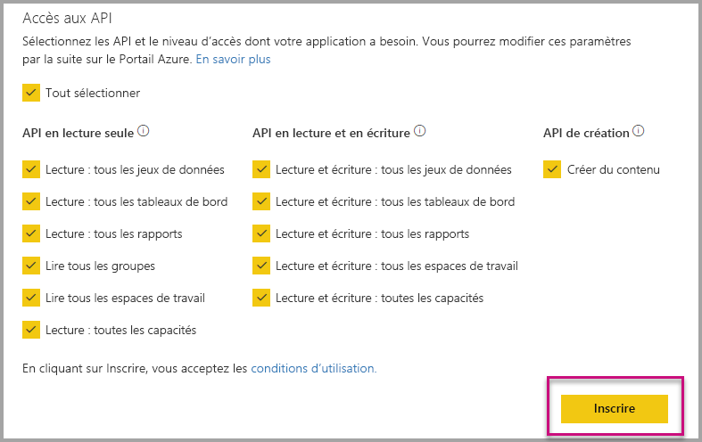
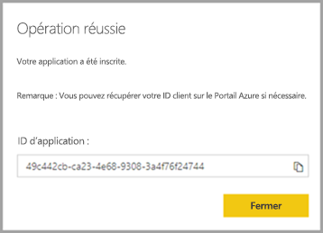

# <a name="register-an-azure-ad-application-to-use-with-power-bi"></a>Inscrire une application Azure AD à utiliser avec Power BI

Découvrez comment inscrire une application dans Azure Active Directory (Azure AD) afin de l’utiliser avec l’incorporation de contenu Power BI.

Vous inscrivez votre application auprès d’Azure AD afin de l’autoriser à accéder aux [API REST Power BI](https://docs.microsoft.com/rest/api/power-bi/). Une fois votre application inscrite, vous pouvez établir une identité pour celle-ci et spécifier des autorisations sur les ressources REST de Power BI.

> [!IMPORTANT]
> Pour pouvoir inscrire une application Power BI, vous devez disposer d’un [locataire Azure Active Directory et d’un utilisateur d’organisation](create-an-azure-active-directory-tenant.md). Si vous n’êtes pas encore inscrit à Power BI avec un utilisateur de votre locataire, l’inscription de l’application échoue.

Vous pouvez inscrire votre application de deux façons. Vous pouvez vous servir de l’[outil d’inscription d’application Power BI](https://dev.powerbi.com/apps/) ou y accéder directement à partir du portail Azure. L’outil d’inscription d’application Power BI est plus pratique à utiliser, car il n’y a que quelques champs à renseigner. Utilisez le portail Azure si vous souhaitez apporter des modifications à votre application.

## <a name="register-with-the-power-bi-application-registration-tool"></a>Inscrire avec l’outil d’inscription d’application Power BI

Inscrivez votre application dans **Azure Active Directory** afin d’établir une identité pour votre application et spécifier des autorisations sur les ressources REST de Power BI. Quand vous inscrivez une application, par exemple une application console ou un site web, vous recevez un identificateur que l’application utilise pour s’identifier auprès des utilisateurs auxquels elle demande des autorisations.

Voici comment inscrire votre application avec l’outil d’inscription d’application Power BI :

1. Accédez à [dev.powerbi.com/apps](https://dev.powerbi.com/apps).

2. Sélectionnez **Connectez-vous avec votre compte existant**, puis sélectionnez **Suivant**.

3. Spécifiez un **Nom d’application**.

4. Spécifiez un **Type d’application**.

    Voici les différences à prendre en compte pour le choix du type d’application **Native** ou **Applications web côté serveur**.

    Native :
    * Vous prévoyez de créer une application qui est [conçue pour vos clients](embed-sample-for-customers.md) utilisant un compte d’utilisateur principal (une licence Power BI Pro utilisée pour la connexion à Power BI) pour s’authentifier.

    Application web côté serveur :
    * Vous prévoyez de créer une application [conçue pour votre organisation](embed-sample-for-your-organization.md).
    * Vous prévoyez de créer une application [conçue pour vos clients](embed-sample-for-customers.md) utilisant un principal du service pour s’authentifier.
    * Vous prévoyez de créer des applications web ou des API web.

    

5. Si vous avez sélectionné **Application web côté serveur** pour le type d’application, continuez en entrant une valeur pour **URL de la page d’accueil** et pour **URL de redirection**. L’**URL de redirection** fonctionne avec n’importe quelle URL valide et doit correspondre à l’application que vous avez créée. Si vous avez sélectionné **Native**, passez à l’étape 6.

6. Choisissez les API Power BI dont votre application a besoin. Pour plus d’informations sur les autorisations d’accès de Power BI, consultez [Autorisations et consentement dans le point de terminaison de la plateforme d’identités Microsoft](https://docs.microsoft.com/azure/active-directory/develop/v2-permissions-and-consent). Sélectionnez ensuite **Inscrire**.

    

    > [!Important]
    > Si vous activez l’utilisation de principaux du service avec Power BI, les autorisations Azure Active Directory n’ont plus d’effet. Les autorisations sont gérées via le portail d’administration de Power BI.

7. Si vous choisissez **Native** pour le type d’application, un **ID d’application** vous est fourni. Si vous sélectionnez **Application web côté serveur** pour le type d’application, vous recevez un **ID d’application** et un **Secret de l’application**.

    > [!Note]
    > Si nécessaire, vous pouvez récupérer l’**ID d’application** sur le portail Azure à un moment ultérieur. Si vous perdez le **Secret de l’application**, vous devez en créer un nouveau dans le portail Azure.

| Natif | Application web côté serveur |
|--------|-----------------------------|
|  |  |

Vous pouvez à présent utiliser l’application inscrite au sein de votre application personnalisée pour interagir avec le service Power BI et avec votre application Power BI Embedded.

## <a name="register-with-the-azure-portal"></a>Inscrire une application par le biais du portail Azure

L’autre option pour l’inscription de votre application consiste à accéder directement au portail Azure. Pour inscrire votre application, procédez comme suit.

1. Acceptez les [conditions d’utilisation de l’API Microsoft Power BI](https://powerbi.microsoft.com/api-terms).

2. Connectez-vous au [portail Azure](https://portal.azure.com).

3. Choisissez votre locataire Azure AD en sélectionnant votre compte dans l’angle supérieur droit de la page.

4. Dans le volet de navigation de gauche, allez dans **Tous les services**, sélectionnez **Inscriptions d’applications**, puis **Nouvelle inscription**.

5. Suivez les invites pour créer une application.

   Pour plus d’informations sur la façon d’inscrire des applications dans Azure Active Directory, consultez [Inscrire une application avec Azure Active Directory](https://docs.microsoft.com/azure/active-directory/develop/quickstart-v2-register-an-app)

## <a name="how-to-get-the-application-id"></a>Comment obtenir l’ID d’application

Quand vous inscrivez une application, vous recevez un [ID d’application](embed-sample-for-customers.md#application-id).  L’**ID d’application** demande des autorisations aux utilisateurs de l’application de s’identifier eux-mêmes.

## <a name="how-to-get-the-service-principal-object-id"></a>Comment obtenir l’ID d’objet de principal du service

Quand vous utilisez des [API Power BI](https://docs.microsoft.com/rest/api/power-bi/), veillez à définir des opérations en utilisant l’[ID d’objet de principal du service](embed-service-principal.md) pour référencer le principal du service, par exemple en appliquant un principal du service comme administrateur à un espace de travail.

## <a name="apply-permissions-to-your-application-within-azure-ad"></a>Appliquer des autorisations à votre application dans Azure AD

Activez des autorisations supplémentaires pour votre application, en plus de ce que fournit la page d’inscription de l’application. Vous effectuez cette tâche via le portail Azure AD ou par programmation.

Vous devez être connecté avec un compte *principal* pour l’incorporation, ou un compte Administrateur général.

### <a name="using-the-azure-ad-portal"></a>Utilisation du portail Azure AD

1. Accédez à [Inscriptions des applications](https://portal.azure.com/#blade/Microsoft_AAD_RegisteredApps/ApplicationsListBlade/quickStartType//sourceType/) dans le portail Azure, puis sélectionnez l’application que vous utilisez pour l’incorporation.

2. Sélectionnez **Autorisations de l’API** sous **Gérer**.

3. Dans **Autorisations d’API**, sélectionnez **Ajouter une autorisation**, puis sélectionnez **Service Power BI**.

    

4. Sélectionnez les autorisations spécifiques dont vous avez besoin sous **Autorisations déléguées**. Sélectionnez-les une par une pour enregistrer les sélections. Lorsque vous avez terminé, sélectionnez **Enregistrer**.

5. Sélectionnez **Accorder le consentement**.

    L’action **Accorder le consentement** a besoin du *compte principal* pour éviter d’être invitée à obtenir le consentement d’Azure AD. Si le compte qui effectue cette action est celui d’un administrateur général, vous pouvez accorder des autorisations pour tous les utilisateurs de votre organisation pour cette application. Si le compte qui effectue cette action est le *compte principal* et pas celui d’un administrateur général, vous accordez des autorisations seulement au *compte principal* pour cette application.

### <a name="applying-permissions-programmatically"></a>Application d’autorisations par programmation

1. Vous devez obtenir les principaux du service (utilisateurs) existants au sein de votre locataire. Pour plus d’informations sur la procédure à suivre, voir [servicePrincipal](https://docs.microsoft.com/graph/api/resources/serviceprincipal?view=graph-rest-beta).

    Vous pouvez appeler l’API *Get servicePrincipal* sans {ID} et celle-ci obtient tous les principaux du service du locataire.

2. Recherchez un principal du service en utilisant l’ID d’application de votre application pour la propriété **appId**.

3. Créez un plan de service s’il n’y en a pas dans votre application.

    ```json
    Post https://graph.microsoft.com/beta/servicePrincipals
    Authorization: Bearer ey..qw
    Content-Type: application/json
    {
    "accountEnabled" : true,
    "appId" : "{App_Client_ID}",
    "displayName" : "{App_DisplayName}"
    }
    ```

4. Accorder les autorisations de l’application à l’API Power BI

   Si vous utilisez un locataire existant et que vous ne voulez pas accorder d’autorisations au nom de tous les utilisateurs de ce locataire, vous pouvez accorder des autorisations à un utilisateur spécifique en remplaçant la valeur de **contentType** par **Principal**.

   La valeur pour **consentType** peut fournir **AllPrincipals** ou **Principal**.

   * **AllPrincipals** peut être utilisé uniquement par un administrateur de locataires pour accorder des autorisations au nom de tous les utilisateurs du locataire.
   * **Principal** est utilisé pour accorder des autorisations au nom d’un utilisateur spécifique. Dans ce cas, une propriété supplémentaire doit être ajoutée au corps de la demande - *principalId={User_ObjectId}* .

     Vous devez *Accorder des autorisations* pour éviter qu’Azure AD exige une confirmation du compte principal, ce qui n’est pas possible avec une connexion non interactive.

     ```json
     Post https://graph.microsoft.com/beta/OAuth2PermissionGrants
     Authorization: Bearer ey..qw
     Content-Type: application/json
     {
     "clientId":"{Service_Plan_ID}",
     "consentType":"AllPrincipals",
     "resourceId":"c78a3685-1ce7-52cd-95f7-dc5aea8ec98e",
     "scope":"Dataset.ReadWrite.All Dashboard.Read.All Report.Read.All Group.Read Group.Read.All Content.Create Metadata.View_Any Dataset.Read.All Data.Alter_Any",
     "expiryTime":"2018-03-29T14:35:32.4943409+03:00",
     "startTime":"2017-03-29T14:35:32.4933413+03:00"
     }
     ```

    Le **resourceId** *c78a3685-1ce7-52cd-95f7-dc5aea8ec98e* n’est pas universel, mais dépendant du locataire. Cette valeur est l’objectId de l’application « Service Power BI » dans le locataire Azure Active Directory (AAD).

    L’utilisateur peut obtenir rapidement cette valeur dans le portail Azure :
    1. https://portal.azure.com/#blade/Microsoft_AAD_IAM/StartboardApplicationsMenuBlade/AllApps

    2. Rechercher « Service Power BI » dans la zone de recherche

5. Accorder les autorisations de l’application à Azure Active Directory (AAD)

   La valeur pour **consentType** peut fournir **AllPrincipals** ou **Principal**.

   * **AllPrincipals** peut être utilisé uniquement par un administrateur de locataires pour accorder des autorisations pour tous les utilisateurs du locataire.
   * La valeur **Principal** est utilisée pour accorder une autorisation pour un utilisateur spécifique. Dans ce cas, une propriété supplémentaire doit être ajoutée au corps de la demande - *principalId={User_ObjectId}* .

   Vous devez *Accorder des autorisations* pour éviter qu’Azure AD exige une confirmation du compte principal, ce qui n’est pas possible avec une connexion non interactive.

   ```json
   Post https://graph.microsoft.com/beta/OAuth2PermissionGrants
   Authorization: Bearer ey..qw
   Content-Type: application/json
   { 
   "clientId":"{Service_Plan_ID}",
   "consentType":"AllPrincipals",
   "resourceId":"61e57743-d5cf-41ba-bd1a-2b381390a3f1",
   "scope":"User.Read Directory.AccessAsUser.All",
   "expiryTime":"2018-03-29T14:35:32.4943409+03:00",
   "startTime":"2017-03-29T14:35:32.4933413+03:00"
   }
   ```

## <a name="next-steps"></a>Étapes suivantes

Maintenant que vous avez inscrit votre application dans Azure AD, vous devez authentifier les utilisateurs dans votre application. Pour plus d’informations, consultez [Authentifier des utilisateurs et obtenir un jeton d’accès Azure AD pour votre application Power BI](get-azuread-access-token.md).

D’autres questions ? [Essayez d’interroger la communauté Power BI](https://community.powerbi.com/)