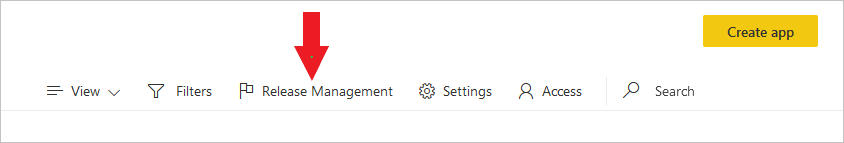
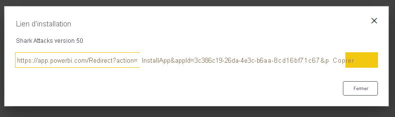
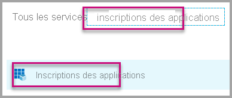
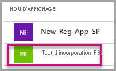
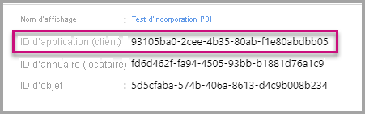
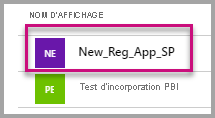
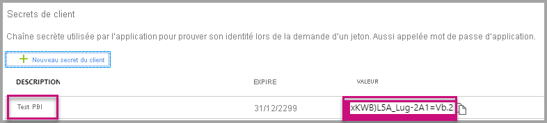

# <a name="tutorial-automate-configuration-of-template-app-installation-using-an-azure-function"></a>Tutoriel : Automatiser la configuration de l’installation d’une application modèle en utilisant une fonction Azure

Les applications modèles sont un excellent moyen pour les clients de commencer à obtenir des insights à partir de leurs données. En les connectant à leurs données, les applications modèles les rendent vite opérationnels. Les applications modèles proposent aux clients des rapports prédéfinis qu’ils peuvent personnaliser s’ils le souhaitent.

Les clients ne savent pas toujours comment se connecter à leurs données. Le fait de devoir leur fournir ces détails au moment où ils installent une application modèle peut être à leurs yeux une contrainte.

Si vous êtes fournisseur de services de données et que vous avez créé une application modèle pour permettre à vos clients d’utiliser leurs données dans votre service, vous pouvez leur faciliter l’installation de votre application modèle. Vous pouvez automatiser la configuration des paramètres de votre application modèle.

Quand le client se connecte à votre portail, il sélectionne un lien spécial que vous avez préparé. Ce lien :

- Lance l’automatisation, qui collecte les informations dont elle a besoin.
- Préconfigure les paramètres de l’application modèle.
- Redirige le client vers son compte Power BI dans lequel il peut installer l’application.

Il lui suffit alors de sélectionner **Installer**, de s’authentifier auprès de sa source de données, et le tour est joué !

L’expérience client est illustrée ici.


Dans ce tutoriel, vous allez utiliser un exemple d’installation automatisée Azure Functions que nous avons créé pour préconfigurer et installer votre application modèle. Cet exemple a été conçu délibérément simple pour faciliter la démonstration. Il encapsule la configuration pour installer une application modèle et la configurer automatiquement pour vos utilisateurs à l’aide d’API Power BI.

Pour plus d’informations sur le flux d’automatisation générale et les API que l’application utilise, consultez [Automatiser la configuration d’une installation d’application modèle](template-apps-auto-install.md).

Notre application simple utilise une fonction Azure. Pour plus d’informations, consultez la [documentation sur Azure Functions](https://docs.microsoft.com/azure/azure-functions/).

## <a name="basic-flow"></a>Flux de base

Le flux de base suivant liste les opérations que l’application effectue quand le client la lance en sélectionnant le lien dans votre portail.

1. L’utilisateur se connecte au portail de l’ISV et sélectionne le lien fourni. Ceci lance le flux. À ce stade, le portail de l’ISV prépare la configuration spécifique de l’utilisateur.

1. L’ISV acquiert un jeton d’*application uniquement* basé sur un [principal de service (jeton d’application uniquement)](../embedded/embed-service-principal.md), qui est inscrit dans le locataire de l’ISV.

1. À l’aide des [API REST Power BI](https://docs.microsoft.com/rest/api/power-bi/), l’ISV crée un *ticket d’installation* qui contient la configuration des paramètres propre à l’utilisateur, telle qu’elle est préparée par l’ISV.

1. L’ISV redirige l’utilisateur vers Power BI en employant une méthode de redirection ```POST``` qui contient le ticket d’installation.

1. L’utilisateur est redirigé vers son compte Power BI avec le ticket d’installation et est invité à installer l’application modèle. Quand l’utilisateur sélectionne **Installer**, l’application modèle s’installe automatiquement.

>[!Note]
>Si les valeurs des paramètres sont configurées par l’ISV pendant la création du ticket d’installation, les informations d’identification liées à la source de données ne sont fournies par l’utilisateur qu’aux ultimes étapes de l’installation. Cette disposition permet d’éviter qu’elles soient exposées à un tiers et garantit une connexion sécurisée entre l’utilisateur et les sources de données de l’application modèle.

## <a name="prerequisites"></a>Prérequis

* Votre propre locataire Azure Active Directory (Azure AD) configuré. Pour savoir comment en configurer un, consultez les instructions dans [Créer un locataire Azure AD](https://docs.microsoft.com/power-bi/developer/embedded/create-an-azure-active-directory-tenant).
* Un [principal de service (jeton d’application uniquement)](https://docs.microsoft.com/power-bi/developer/embedded/embed-service-principal) inscrit dans le locataire précédent.
* Une [application modèle](https://docs.microsoft.com/power-bi/connect-data/service-template-apps-overview) paramétrable prête pour l’installation. L’application modèle doit être créée dans le même locataire que celui où vous inscrivez votre application dans Azure AD. Pour plus d’informations, consultez [Conseils pour les applications modèles](https://docs.microsoft.com/power-bi/connect-data/service-template-apps-tips.md) ou [Créer une application modèle dans Power BI](https://docs.microsoft.com/power-bi/connect-data/service-template-apps-create).
* Une licence Power BI Pro. Si vous n’êtes pas inscrit pour Power BI Pro, [inscrivez-vous pour un essai gratuit](https://powerbi.microsoft.com/pricing/) avant de commencer.

## <a name="set-up-your-template-apps-automation-development-environment"></a>Configurer votre environnement de développement d’automatisation d’applications modèles

Avant de poursuivre la configuration de votre application, suivez les instructions de [Démarrage rapide : Créer une application Azure Functions avec Azure App Configuration](https://docs.microsoft.com/azure/azure-app-configuration/quickstart-azure-functions-csharp) pour développer une fonction Azure avec une configuration d’application Azure. Créez la configuration de votre application comme décrit dans l’article.

### <a name="register-an-application-in-azure-ad"></a>Inscrire une application dans Azure AD

Créez un principal de service comme décrit dans [Incorporer du contenu Power BI avec un principal de service et un secret d’application](https://docs.microsoft.com/power-bi/developer/embedded/embed-service-principal).

Veillez à inscrire l’application en tant qu’**application web côté serveur**. Vous inscrivez une application web côté serveur pour créer un secret d’application.

Enregistrez l’*ID d’application* (ClientID) et le *Secret de l’application* (ClientSecret) pour les étapes ultérieures.

Vous pouvez parcourir l’[outil de configuration de l’incorporation](https://aka.ms/embedsetup/AppOwnsData) pour vous lancer rapidement dans la création d’une inscription d’application. Si vous utilisez l’[outil d’inscription d’application Power BI](https://app.powerbi.com/embedsetup), sélectionnez l’option **Incorporer pour vos clients**.

## <a name="template-app-preparation"></a>Préparation de l’application modèle

Une fois que vous avez créé votre application modèle et qu’elle est prête pour l’installation, enregistrez les informations suivantes pour les prochaines étapes :

* *ID d’application*, *Clé de package* et *ID de propriétaire* tels qu’ils apparaissent dans l’URL d’installation à la fin du processus [Définir les propriétés de l’application modèle](../../connect-data/service-template-apps-create.md#define-the-properties-of-the-template-app) au moment où l’application a été créée.

    Vous pouvez aussi obtenir le même lien en sélectionnant **Obtenir un lien** dans le volet [Release Management](../../connect-data/service-template-apps-create.md#manage-the-template-app-release) de l’application modèle.

* Les *noms des paramètres* tels qu’ils sont définis dans le jeu de données de l’application modèle. Les noms de paramètres respectent la casse. Vous pouvez aussi les récupérer à partir de l’onglet **Valeurs des paramètres** au moment de [définir les propriétés de l’application modèle](../../connect-data/service-template-apps-create.md#define-the-properties-of-the-template-app) ou à partir des paramètres du jeux de données dans Power BI.

>[!NOTE]
>Vous pouvez tester votre application d’installation préconfigurée sur votre application modèle si celle-ci est prête pour l’installation, même si elle n’est pas encore publiquement disponible sur AppSource. Pour permettre aux utilisateurs situés en dehors de votre locataire d’utiliser l’application d’installation automatisée afin d’installer votre application modèle, cette dernière doit être publiquement disponible dans la [Place de marché des applications Power BI](https://app.powerbi.com/getdata/services). Avant de distribuer votre application modèle en utilisant l’application d’installation automatisée que vous créez, veillez à la publier dans l’[Espace partenaires](https://docs.microsoft.com/azure/marketplace/partner-center-portal/create-power-bi-app-offer).


## <a name="install-and-configure-your-template-app"></a>Installer et configurer votre application modèle

Dans cette section, vous allez utiliser un exemple d’installation automatisée Azure Functions que nous avons créé pour préconfigurer et installer votre application modèle. Cet exemple a été conçu délibérément simple pour faciliter la démonstration. Il vous permet d’utiliser une [fonction Azure](https://docs.microsoft.com/azure/azure-functions/functions-overview) et [Azure App Configuration](https://docs.microsoft.com/azure/azure-app-configuration/overview) pour déployer et utiliser facilement l’API d’installation automatisée pour vos applications modèles.

### <a name="download-visual-studio-version-2017-or-later"></a>Télécharger [Visual Studio](https://www.visualstudio.com/) (version 2017 ou ultérieure)

Téléchargez [Visual Studio](https://www.visualstudio.com/) (version 2017 ou ultérieure). Veillez à télécharger le dernier [package NuGet](https://www.nuget.org/profiles/powerbi).

### <a name="download-the-automated-installation-azure-functions-sample"></a>Télécharger l’exemple d’installation automatisée Azure Functions

Pour commencer, téléchargez l’[exemple d’installation automatisée Azure Functions](https://github.com/microsoft/Template-apps-examples/tree/master/Developer%20Samples/Automated%20Install%20Azure%20Function) à partir de GitHub.


### <a name="set-up-your-azure-app-configuration"></a>Configurer votre configuration d’application Azure

Pour exécuter cet exemple, vous devez configurer votre configuration d’application Azure avec les valeurs et les clés décrites ici. Les clés sont l’**ID d’application**, le **Secret de l’application** et les valeurs **AppId**, **PackageKey** et **OwnerId** de votre application modèle. Pour savoir comment obtenir ces valeurs, consultez les sections suivantes.

Les clés sont également définies dans le fichier **Constants.cs**.

| Clé de configuration | Signification           |
|---------------    |-------------------|
| TemplateAppInstall:Application:AppId | Élément **AppId** de l’[URL d’installation](#get-the-template-app-properties) |
| TemplateAppInstall:Application:PackageKey | Élément **PackageKey** de l’[URL d’installation](#get-the-template-app-properties) |
| TemplateAppInstall:Application:OwnerId | Élément **OwnerId** de l’[URL d’installation](#get-the-template-app-properties) |
| TemplateAppInstall:ServicePrincipal:ClientId | [ID d’application](#get-the-application-id) du principal de service |
| TemplateAppInstall:ServicePrincipal:ClientSecret | [Secret de l’application](#get-the-application-secret) du principal de service |
|||


Le fichier **Constants.cs** est présenté ici.


#### <a name="get-the-template-app-properties"></a>Obtenir les propriétés de l’application modèle

Renseignez toutes les propriétés pertinentes de l’application modèle telles qu’elles sont définies pendant la création de l’application. Ces propriétés sont les éléments **AppId**, **PackageKey** et **OwnerId** de l’application modèle.

Pour obtenir les valeurs précédentes, suivez ces étapes :

1. Connectez-vous à [Power BI](https://app.powerbi.com).

1. Accédez à l’espace de travail d’origine de l’application.

1. Ouvrez le volet **Release Management**.

    

1. Sélectionnez la version de l’application pour obtenir son lien d’installation.

    

1. Copiez le lien dans le Presse-papiers.

    

1. Cette URL d’installation contient les trois paramètres d’URL dont les valeurs vous sont nécessaires. Utilisez les valeurs de **appId**, **packageKey** et **ownerId** pour l’application. L’URL sera similaire à l’exemple ci-dessous.

    ```html
    https://app.powerbi.com/Redirect?action=InstallApp&appId=3c386...16bf71c67&packageKey=b2df4b...dLpHIUnum2pr6k&ownerId=72f9...1db47&buildVersion=5
    ```

#### <a name="get-the-application-id"></a>Récupérer l’ID de l’application

Dans le champ **applicationId**, indiquez l’ID d’application d’Azure. La valeur du champ **applicationId** est utilisée par l’application pour s’identifier auprès des utilisateurs auxquels vous demandez des autorisations.

Pour obtenir l’ID d’application, suivez ces étapes :

1. Connectez-vous au [portail Azure](https://portal.azure.com).

1. Dans le volet gauche, sélectionnez **Tous les services** > **Inscriptions d’applications**.

    

1. Sélectionnez l’application qui a besoin de l’**ID d’application**.

    

1. Un ID d’application est listé sous forme de GUID. Utilisez cet ID d’application comme valeur **applicationId** de l’application.

    

#### <a name="get-the-application-secret"></a>Obtenir le secret de l’application

Renseignez les informations **ApplicationSecret** dans la section **Clés** de votre section **Inscriptions d’applications** dans Azure. Cet attribut fonctionne quand vous utilisez un [principal de service](../embedded/embed-service-principal.md).

Pour obtenir le secret de l’application, suivez ces étapes :

 1. Connectez-vous au [portail Azure](https://portal.azure.com).

 1. Dans le volet gauche, sélectionnez **Tous les services** > **Inscriptions d’applications**.

    

1. Sélectionnez l’application qui doit utiliser le **secret de l’application**.

    

1. Sélectionnez **Certificats et secrets** sous **Gérer**.

1. Sélectionnez **Nouvelle clé secrète client**.

1. Entrez un nom dans la zone **Description** et sélectionnez une durée. Sélectionnez ensuite **Enregistrer** pour obtenir la valeur pour votre application. Quand vous fermez le volet **Clés** après avoir enregistré de la valeur de la clé, le champ **Valeur** apparaît uniquement masqué. À ce stade, vous n’êtes pas en mesure de récupérer la valeur de la clé. Si vous perdez la valeur de la clé, créez-en une autre dans le portail Azure.

    

## <a name="test-your-function-locally"></a>Tester votre fonction localement

Suivez les étapes décrites dans [Exécuter la fonction localement](https://docs.microsoft.com/azure/azure-functions/functions-create-your-first-function-visual-studio#run-the-function-locally) pour exécuter votre fonction.

Configurez votre portail pour qu’il émette une requête ```POST``` à l’URL de la fonction. par exemple ```POST http://localhost:7071/api/install```. Le corps de la demande doit être un objet JSON qui décrit les paires clé-valeur. Les clés sont les *noms de paramètres* définis dans Power BI Desktop. Les valeurs sont les valeurs souhaitées à définir pour chaque paramètre de l’application modèle.

>[!Note]
> En production, les valeurs de paramètre sont déduites pour chaque utilisateur selon la logique prévue de votre portail.

Le flux souhaité doit être :

1. Le portail prépare la requête, par utilisateur ou session.
1. La requête ```POST /api/install``` est adressée à votre fonction Azure. Le corps de la demande est constitué de paires clé-valeur. La clé est le nom du paramètre. La valeur est la valeur souhaitée à définir.
1. Si tout est correctement configuré, le navigateur doit rediriger automatiquement vers le compte Power BI du client et afficher le flux de l’installation automatisée.
1. Lors de l’installation, les valeurs des paramètres sont définies telles qu’elles sont configurées aux étapes 1 et 2.
 
## <a name="next-steps"></a>Étapes suivantes

### <a name="publish-your-project-to-azure"></a>Publier votre projet sur Azure

Pour publier votre projet dans Azure, suivez les instructions fournies dans la [documentation Azure Functions](https://docs.microsoft.com/azure/azure-functions/functions-create-your-first-function-visual-studio#publish-the-project-to-azure). Vous pouvez ensuite intégrer les API d’installation automatisée d’application modèle dans votre produit et commencer à les tester dans des environnements de production.
