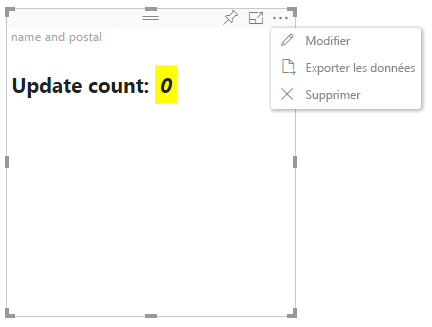

# Mode d’édition avancé dans les visuels Power BI

Si vous souhaitez inclure des contrôles d’interface utilisateur avancés dans votre visuel Power BI, vous pouvez utiliser le mode d’édition avancé. Quand vous êtes en mode d’édition de rapport, vous sélectionnez un bouton **Modifier** pour définir le mode d’édition sur **Avancé**. Le visuel peut utiliser l’indicateur `EditMode`pour déterminer s’il doit afficher ce contrôle d’interface utilisateur.

Par défaut, le visuel ne prend pas en charge le mode d’édition avancé. Si un comportement différent est requis, vous pouvez le spécifier explicitement dans le fichier *capabilities.json* du visuel, en définissant la propriété `advancedEditModeSupport`.

Les valeurs possibles sont les suivantes :

- `0` - NotSupported

- `1` - SupportedNoAction

- `2` - SupportedInFocus

## Entrer le mode d’édition avancé

Un bouton **Modifier** s’affiche dans les cas suivants :

* La propriété `advancedEditModeSupport` est définie dans le fichier *capabilities.json* sur `SupportedNoAction` ou `SupportedInFocus`.

* Le visuel est affiché en mode d’édition de rapport.

Si la propriété `advancedEditModeSupport` n’est pas spécifiée dans le fichier *capabilities.json*, ou si elle y est définie sur `NotSupported`, le bouton **Modifier** n’est pas affiché.

Quand vous sélectionnez **Modifier**, le visuel obtient un appel update() où EditMode est défini sur `Advanced`. Selon la valeur qui est définie dans le fichier *capabilities.json*, les actions suivantes se produisent :

* `SupportedNoAction` : aucune action supplémentaire n’est requise par l’hôte.
* `SupportedInFocus` : l’hôte affiche le visuel en mode Focus.

## Quitter le mode d’édition avancé

Le bouton **Retour au rapport** est affiché dans le cas suivant :

* La propriété `advancedEditModeSupport` est définie dans le fichier *capabilities.json* sur `SupportedInFocus`.
