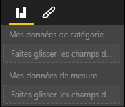

# <a name="capabilities-and-properties-of-power-bi-visuals"></a>Fonctionnalités et propriétés des visuels Power BI 

Vous utilisez des fonctionnalités pour transmettre à l’hôte des informations relatives à votre visuel. Toutes les propriétés du modèle de fonctionnalités sont `optional`.

Les objets racine des fonctionnalités d’un visuel sont `dataRoles`, `dataViewMappings`, etc.

```json
{
    "dataRoles": [ ... ],
    "dataViewMappings": [ ... ],
    "objects":  { ... },
    "supportsHighlight": true|false,
    "advancedEditModeSupport": 0|1|2,
    "sorting": { ... }
}

```

## <a name="define-the-data-fields-that-your-visual-expects-dataroles"></a>Définir les champs de données attendus par votre visuel : dataRoles

Pour définir les champs qui peuvent être liés à des données, utilisez `dataRoles`. `dataRoles` prend un tableau d’objets `DataViewRole`, qui définit toutes les propriétés requises.

### <a name="properties"></a>Propriétés

* **name** : nom interne de ce champ de données (doit être unique).
* **kind** : type du champ :
    * `Grouping` : valeurs discrètes utilisées pour regrouper les champs de mesure.
    * `Measure` : valeurs de données numériques.
    * `GroupingOrMeasure` : valeurs qui peuvent être utilisées comme un regroupement ou une mesure.
* **displayName** : nom affiché à l’utilisateur dans le volet **Propriétés**.
* **description** : brève description du champ (facultatif).
* **requiredTypes** : type de données requis pour ce rôle de données. Les valeurs non valides sont définies sur Null (facultatif).
* **preferredTypes** : type de données par défaut pour ce rôle de données (facultatif).

### <a name="valid-data-types-in-requiredtypes-and-preferredtypes"></a>Types de données valides dans requiredTypes et preferredTypes

* **bool** : valeur booléenne
* **integer** : valeur entière (nombre entier)
* **numeric** : valeur numérique
* **text** : valeur de texte
* **geography** : donnée géographique

### <a name="example"></a>Exemple

```json
"dataRoles": [
    {
        "displayName": "My Category Data",
        "name": "myCategory",
        "kind": "Grouping",
        "requiredTypes": [
            {
                "text": true
            },
            {
                "numeric": true
            },
            {
                "integer": true
            }
        ],
        "preferredTypes": [
            {
                "text": true
            }
        ]
    },
    {
        "displayName": "My Measure Data",
        "name": "myMeasure",
        "kind": "Measure",
        "requiredTypes": [
            {
                "integer": true
            },
            {
                "numeric": true
            }
        ],
        "preferredTypes": [
            {
                "integer": true
            }
        ]
    },
    {
        "displayNameKey": "Visual_Location",
        "name": "Locations",
        "kind": "Measure",
        "displayName": "Locations",
        "requiredTypes": [
            {
                "geography": {
                    "address": true
                }
            },
            {
                "geography": {
                    "city": true
                }
            },
            {
                "geography": {
                    "continent": true
                }
            },
            {
                "geography": {
                    "country": true
                }
            },
            {
                "geography": {
                    "county": true
                }
            },
            {
                "geography": {
                    "place": true
                }
            },
            {
                "geography": {
                    "postalCode": true
                }
            },
            {
                "geography": {
                    "region": true
                }
            },
            {
                "geography": {
                    "stateOrProvince": true
                }
            }
        ]
    }
]
```

Les rôles de données précédents créent les champs affichés dans l’image suivante :



## <a name="define-how-you-want-the-data-mapped-dataviewmappings"></a>Définir le mappage des données : dataViewMappings

Une propriété dataViewMappings décrit de quelle manière les rôles de données sont liés les uns aux autres et vous permet de spécifier des exigences conditionnelles pour les rôles.

La plupart des visuels fournissent un mappage unique, mais vous pouvez fournir plusieurs mappages dataViewMappings. Chaque mappage valide génère une vue de données. 

```json
"dataViewMappings": [
    {
        "conditions": [ ... ],
        "categorical": { ... },
        "table": { ... },
        "single": { ... },
        "matrix": { ... }
    }
]
```

Pour plus d’informations, consultez [Présentation du mappage des vues de données dans les visuels Power BI](dataview-mappings.md).

## <a name="define-property-pane-options-objects"></a>Définir les options du volet de propriétés : objects

Les objets décrivent les propriétés personnalisables qui sont associées au visuel. Chaque objet peut avoir plusieurs propriétés, et chaque propriété est associée à un type. Les types font référence à ce que sera la propriété. 

```json
"objects": {
    "myCustomObject": {
        "displayName": "My Object Name",
        "properties": { ... }
    }
}
```

Pour plus d’informations, consultez [Objets et propriétés des visuels Power BI](objects-properties.md).

## <a name="handle-partial-highlighting-supportshighlight"></a>Gérer la mise en surbrillance partielle : supportsHighlight

Par défaut, cette propriété est définie sur `false`, ce qui signifie que les valeurs sont filtrées automatiquement quand un élément est sélectionné dans la page. Ce filtrage automatique met à jour votre visuel pour y afficher uniquement l’élément sélectionné. Si vous souhaitez afficher toutes les données, mais mettre en surbrillance uniquement les éléments sélectionnés, définissez `supportsHighlight` sur `true` dans votre fichier *capabilities.json*.

Pour plus d’informations, consultez [Mettre en surbrillance des points de données dans les visuels Power BI](highlight.md).

## <a name="handle-advanced-edit-mode-advancededitmodesupport"></a>Gérer le mode d’édition avancé : advancedEditModeSupport

Un visuel peut déclarer sa prise en charge du mode d’édition avancé. Par défaut, un visuel ne prend pas en charge le mode d’édition avancé, mais vous pouvez ajouter cette prise en charge dans le fichier *capabilities.json*.

Pour plus d’informations, consultez [Mode d’édition avancé dans les visuels Power BI](advanced-edit-mode.md).

## <a name="data-sorting-options-for-visual-sorting"></a>Options de tri des données pour un visuel : sorting

Un visuel peut définir son comportement de tri par le biais de ses fonctionnalités. Par défaut, un visuel ne prend pas en charge la modification de son ordre de tri, mais vous pouvez ajouter cette prise en charge dans le fichier *capabilities.json*.

Pour plus d’informations, consultez [Options de tri pour les visuels Power BI](sort-options.md).
