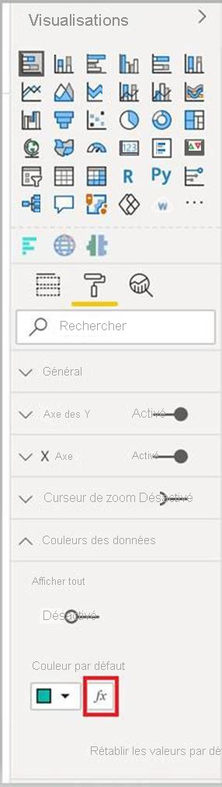

# <a name="add-conditional-formatting"></a>Ajouter une mise en forme conditionnelle

La [mise en forme conditionnelle](../../visuals/service-tips-and-tricks-for-color-formatting.md#conditional-formatting-for-visualizations) permet à un créateur de rapport de spécifier le mode d’affichage des couleurs dans un rapport, en fonction d’une valeur numérique.

Cet article explique comment ajouter la fonctionnalité de mise en forme conditionnelle à votre visuel Power BI.

La mise en forme conditionnelle ne peut être appliquée qu’aux types de propriétés suivants :
* Couleur
* Texte
* Icône
* Web URL

## <a name="add-conditional-formatting-to-your-project"></a>Ajouter une mise en forme conditionnelle à votre projet

Cette section montre comment ajouter une mise en forme conditionnelle à un visuel Power BI existant. L’exemple de code de cet article est basé sur le visuel [SampleBarChart](https://github.com/microsoft/PowerBI-visuals-sampleBarChart). Vous pouvez examiner le code source dans [barChart.ts](https://github.com/microsoft/PowerBI-visuals-sampleBarChart/blob/master/src/barChart.ts).

### <a name="add-a-conditional-color-formatting-entry-in-the-format-pane"></a>Ajouter une entrée de mise en forme des couleurs conditionnelle dans le volet de format

Dans cette section, vous allez apprendre à ajouter une entrée de mise en forme des couleurs conditionnelle à un point de données dans le volet de format.

1. Vous utiliserez le tableau `propertyInstanceKind` dans `VisualObjectInstance`, qui est exposé par `powerbi-visuals-api`. La première étape consiste à vérifier que votre fichier comprend cette importation :

    ```typescript
    import powerbiVisualsApi from "powerbi-visuals-api";
    ```

2. Pour spécifier le type de mise en forme approprié (*Constant*, *ConstantOrRule* ou *Règle*), vous utiliserez l’énumération `VisualEnumerationInstanceKinds`. Ajoutez l’importation suivante à votre fichier :

    ```typescript
    import VisualEnumerationInstanceKinds = powerbiVisualsApi.VisualEnumerationInstanceKinds;
    ```

3. Répertoriez toutes les propriétés pour lesquelles vous souhaitez prendre en charge la mise en forme conditionnelle, sous le tableau `propertyInstanceKind`. Définissez ces propriétés dans la méthode `enumerateObjectInstances`.

    ```typescript
    public enumerateObjectInstances(options: EnumerateVisualObjectInstancesOptions): VisualObjectInstanceEnumeration {
            …
            case 'colorSelector':
                …
                    objectEnumeration.push({
                        objectName: objectName,
                        displayName: barDataPoint.category,
                        properties: {
                            fill: {
                                solid: {
                                    color: barDataPoint.color
                                }
                            }
                        },
                        selector: dataViewWildcard.createDataViewWildcardSelector(dataViewWildcard.DataViewWildcardMatchingOption.InstancesAndTotals),
                        altConstantValueSelector: barDataPoint.selectionId.getSelector(),

                        // List your conditional formatting properties
                        propertyInstanceKind: {
                            fill: VisualEnumerationInstanceKinds.ConstantOrRule
                        }
                    });
                }
            …
    }

    ```

    `VisualEnumerationInstanceKinds.ConstantOrRule` crée l’entrée d’interface utilisateur de mise en forme conditionnelle à côté de l’élément d’interface utilisateur de mise en forme constante.

    >[!div class="mx-imgBorder"]
    >

### <a name="define-how-conditional-formatting-behaves"></a>Définir le comportement de la mise en forme conditionnelle

Définissez la façon dont la mise en forme sera appliquée à vos points de données.

À l’aide de `createDataViewWildcardSelector` déclaré sous `powerbi-visuals-utils-dataviewutils`, spécifiez si la mise en forme conditionnelle sera appliquée aux instances, aux totaux ou aux deux. Pour plus d’informations, consultez [DataViewWildcard](utils-dataview.md#).

Dans `enumerateObjectInstances`, apportez les modifications suivantes aux objets auxquels vous souhaitez appliquer une mise en forme conditionnelle :

 * Remplacez la valeur `selector` par l’appel `dataViewWildcard.createDataViewWildcardSelector(dataViewWildcardMatchingOption)`. `DataViewWildcardMatchingOption` définit si la mise en forme conditionnelle est appliquée aux instances, aux totaux ou aux deux.

* Ajoutez la propriété `altConstantValueSelector` avec la valeur précédemment définie pour la propriété `selector`.

```typescript
case 'colorSelector':
         …
            objectEnumeration.push({
                objectName: objectName,
                displayName: barDataPoint.category,
                properties: {
                    fill: {
                        solid: {
                            color: barDataPoint.color
                        }
                    }
                },

                // Define whether the conditional formatting will apply to instances, totals, or both
                selector: dataViewWildcard.createDataViewWildcardSelector(dataViewWildcard.DataViewWildcardMatchingOption.InstancesAndTotals),

                // Add this property with the value previously defined for the selector property
                altConstantValueSelector: barDataPoint.selectionId.getSelector(),

                propertyInstanceKind: { 
                    fill: VisualEnumerationInstanceKinds.ConstantOrRule
                }
            });
        }

```

## <a name="next-steps"></a>Étapes suivantes

Passez en revue l’article [DataViewUtils](utils-dataview.md).