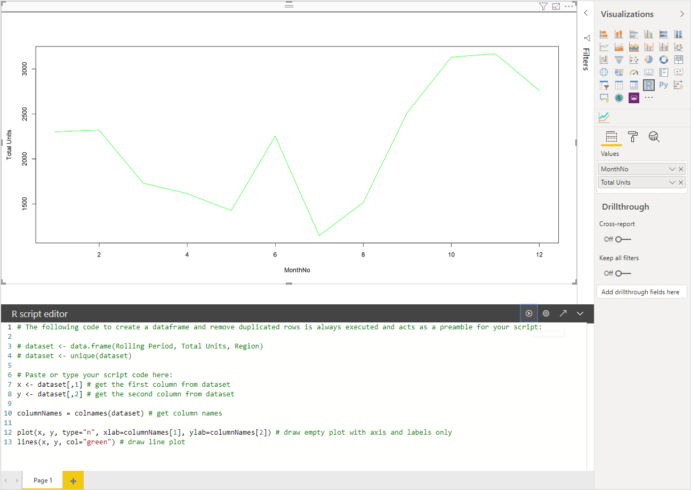
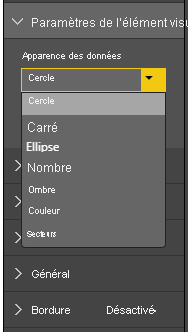

# <a name="tutorial-create-an-r-powered-power-bi-visual"></a>Tutoriel : Créer un visuel Power BI optimisé pour R

Ce didacticiel explique comment créer un visuel optimisé pour R pour Power BI.

Dans ce tutoriel, vous allez découvrir comment :

> [!div class="checklist"]
>
> * Créer un visuel optimisé pour R
> * Modifier le script R dans Power BI Desktop
> * Ajouter des bibliothèques au visuel
> * Ajouter une propriété statique

## <a name="prerequisites"></a>Prérequis

* Un **compte Power BI Pro**. [Inscrivez-vous à un essai gratuit](https://powerbi.microsoft.com/pricing/) avant de commencer.
* Le moteur R. Vous pouvez le télécharger et l’installer gratuitement à partir de nombreux emplacements, dont la [page de téléchargement Revolution Open](https://mran.revolutionanalytics.com/download/) et le [Référentiel CRAN](https://cran.r-project.org/bin/windows/base/). Pour plus d’informations, consultez [Créer des visuels Power BI avec R](../../create-reports/desktop-r-visuals.md).
* [Power BI Desktop](../../fundamentals/desktop-get-the-desktop.md).
* [Windows PowerShell](/powershell/scripting/install/installing-windows-powershell) version 4 ou ultérieure pour les utilisateurs Windows, OU [Terminal](https://macpaw.com/how-to/use-terminal-on-mac) pour les utilisateurs OSX.

## <a name="getting-started"></a>Prise en main

1. Préparez des exemples de données pour le visuel. Vous pouvez enregistrer ces valeurs dans une base de données Excel ou un fichier *.csv* et les importer dans Power BI Desktop.

    | MonthNo | Nombre total d’unités |
    |-----|-----|
    | 1 | 2303 |
    | 2 | 2319 |
    | 3 | 1732 |
    | 4 | 1615 |
    | 5 | 1427 |
    | 6 | 2253 |
    | 7 | 1147 |
    | 8 | 1515 |
    | 9 | 2516 |
    | 10 | 3131 |
    | 11 | 3170 |
    | 12 | 2762 |

1. Pour créer un visuel, ouvrez PowerShell ou Terminal, puis exécutez la commande suivante :

   ```cmd
   pbiviz new rVisualSample -t rvisual
   ```

   Cette commande crée une structure de dossiers basée sur le modèle `rvisual`. Ce modèle comprend un visuel de base et prêt à l’emploi pour R qui exécute le script R suivant :

   ```r
   plot(Values)
   ```

   La trame de données `Values` contiendra des colonnes dans le rôle de données `Values`.

1. Affectez des données au visuel du développeur en ajoutant **NoMois** et **Unités totales** aux **Valeurs** pour le visuel.

   

## <a name="editing-the-r-script"></a>Modification du script R

Lorsque vous utilisez `pbiviz` pour créer le visuel optimisé pour R basé sur le modèle `rvisual`, il crée un fichier appelé *script.r* dans le dossier racine du visuel. Ce fichier contient le script R qui s’exécute pour générer l’image pour un utilisateur. Vous pouvez créer votre script R dans Power BI Desktop.

1. Dans Power BI Desktop, sélectionnez **Élément visuel de script R** :

   

1. Collez ce code R dans l’**éditeur de script R** :

    ```r
    x <- dataset[,1] # get the first column from dataset
    y <- dataset[,2] # get the second column from dataset

    columnNames = colnames(dataset) # get column names

    plot(x, y, type="n", xlab=columnNames[1], ylab=columnNames[2]) # draw empty plot with axis and labels only
    lines(x, y, col="green") # draw line plot
    ```

1. Sélectionnez l’icône **Exécuter le script** pour afficher le résultat.

    

1. Lorsque votre script R est prêt, copiez-le dans le fichier `script.r` de votre projet de visuel créé au cours de l’une des étapes précédentes.

1. Remplacez la `name` de `dataRoles` dans *capabilities.json* par `dataRoles`. Power BI transmet les données en tant qu’objet de trame de données `dataset` pour le visuel de script R, mais le visuel R obtient le nom de trame de données en fonction des noms de `dataRoles`.

    ```json
    {
      "dataRoles": [
        {
          "displayName": "Values",
          "kind": "GroupingOrMeasure",
          "name": "dataRoles"
        }
      ],
      "dataViewMappings": [
        {
          "scriptResult": {
            "dataInput": {
              "table": {
                "rows": {
                  "select": [
                    {
                      "for": {
                        "in": "dataset"
                      }
                    }
                  ],
                  "dataReductionAlgorithm": {
                    "top": {}
                  }
                }
              }
            },
            ...
          }
        }
      ],
    }
    ```

1. Ajoutez le code suivant pour prendre en charge le redimensionnement de l’image dans le fichier *src/visual.ts*.

    ```typescript
      public onResizing(finalViewport: IViewport): void {
          this.imageDiv.style.height = finalViewport.height + "px";
          this.imageDiv.style.width = finalViewport.width + "px";
          this.imageElement.style.height = finalViewport.height + "px";
          this.imageElement.style.width = finalViewport.width + "px";
      }
    ```

## <a name="add-libraries-to-visual-package"></a>Ajouter des bibliothèques au package du visuel

Cette procédure permet à votre visuel d’utiliser le package `corrplot`.

1. Ajoutez la dépendance de bibliothèque pour votre visuel à `dependencies.json`. Voici un exemple de contenu de fichier :

    ```json
    {
      "cranPackages": [
        {
          "name": "corrplot",
          "displayName": "corrplot",
          "url": "https://cran.r-project.org/web/packages/corrplot/"
        }
      ]
    }
    ```

    Le package `corrplot` est une représentation graphique d’une matrice de corrélation. Pour plus d’informations sur `corrplot`, consultez [Présentation du package corrplot](https://cran.r-project.org/web/packages/corrplot/vignettes/corrplot-intro.html).

1. Une fois ces modifications effectuées, commencez à utiliser le package dans votre fichier `script.r`.

    ```r
    library(corrplot)
    corr <- cor(dataset)
    corrplot(corr, method="circle", order = "hclust")
    ```

Le résultat de l’utilisation du package `corrplot` ressemble à l’exemple suivant :


## <a name="adding-a-static-property-to-the-property-pane"></a>Ajout d’une propriété statique au volet Propriétés

Permettez aux utilisateurs de modifier les paramètres de l’interface utilisateur. Pour ce faire, ajoutez des propriétés au volet Propriétés qui modifient le comportement basé sur l’entrée de l’utilisateur du script R.

Vous pouvez configurer `corrplot` à l’aide de l’argument `method` pour la fonction `corrplot`. Le script par défaut utilise un cercle. Modifiez votre visuel pour permettre à l’utilisateur de choisir entre plusieurs options.

1. Définissez l’objet et la propriété dans le fichier *capabilities.json*. Utilisez ensuite ce nom d’objet dans la méthode d’énumération pour récupérer ces valeurs à partir du volet Propriétés.

    ```json
    {
      "settings": {
      "displayName": "Visual Settings",
      "description": "Settings to control the look and feel of the visual",
      "properties": {
        "method": {
          "displayName": "Data Look",
          "description": "Control the look and feel of the data points in the visual",
          "type": {
            "enumeration": [
              {
                "displayName": "Circle",
                "value": "circle"
              },
              {
                "displayName": "Square",
                "value": "square"
              },
              {
                "displayName": "Ellipse",
                "value": "ellipse"
              },
              {
                "displayName": "Number",
                "value": "number"
              },
              {
                "displayName": "Shade",
                "value": "shade"
              },
              {
                "displayName": "Color",
                "value": "color"
              },
              {
                "displayName": "Pie",
                "value": "pie"
              }
            ]
          }
        }
      }
    }
    ```

1. Ouvrez le fichier *src/settings.ts*. Créez une classe `CorrPlotSettings` avec la propriété publique `method`. Le type est `string` et la valeur par défaut est `circle`. Ajoutez la propriété `settings` à la classe `VisualSettings` avec la valeur par défaut :

    ```typescript
    "use strict";

    import { dataViewObjectsParser } from "powerbi-visuals-utils-dataviewutils";
    import DataViewObjectsParser = dataViewObjectsParser.DataViewObjectsParser;

    export class VisualSettings extends DataViewObjectsParser {
      public rcv_script: rcv_scriptSettings = new rcv_scriptSettings();
      public settings: CorrPlotSettings = new CorrPlotSettings();
    }

    export class CorrPlotSettings {
      public method: string = "circle";
    }

    export class rcv_scriptSettings {
      public provider;
      public source;
    }
    ```

    Après ces étapes, vous pouvez modifier la propriété du visuel.

   

    Enfin, le script R doit commencer par une propriété. Si l’utilisateur ne modifie pas la propriété, le visuel n’obtient aucune valeur pour cette propriété.

    Pour les variables de runtime R pour les propriétés, la convention d’affectation de noms est `<objectname>_<propertyname>`, à savoir `settings_method` dans le cas présent.

1. Modifiez le script R dans votre visuel pour qu’il corresponde au code suivant :

    ```r
    library(corrplot)
    corr <- cor(dataset)

    if (!exists("settings_method"))
    {
        settings_method = "circle";
    }

    corrplot(corr, method=settings_method, order = "hclust")
    ```

Votre visualisation finale ressemble à l’exemple suivant :


## <a name="next-steps"></a>Étapes suivantes

Pour en savoir plus sur les visuels optimisés pour R, consultez [Utiliser des visuels Power BI basés sur R dans Power BI](../../create-reports/desktop-r-powered-custom-visuals.md).

Pour plus d’informations sur les visuels optimisés pour R dans Power BI Desktop, consultez [Créer des visuels Power BI avec R](../../create-reports/desktop-r-visuals.md).