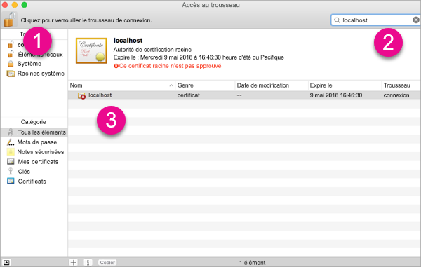
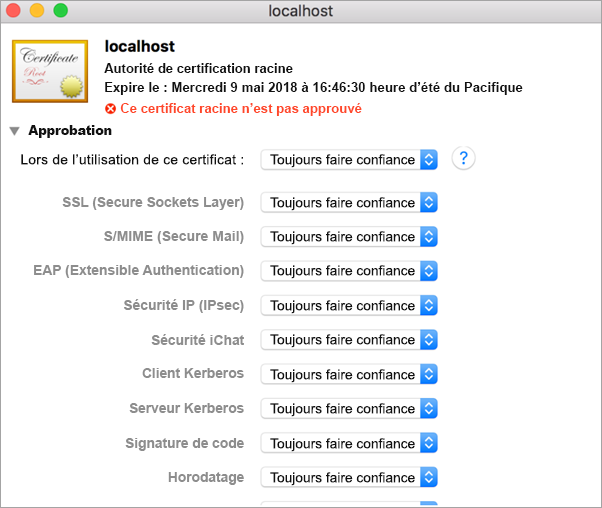
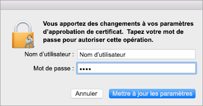
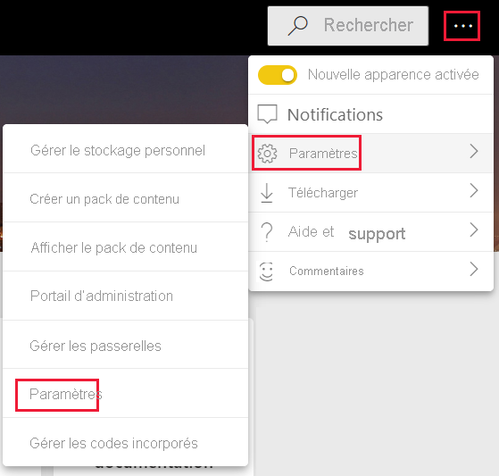
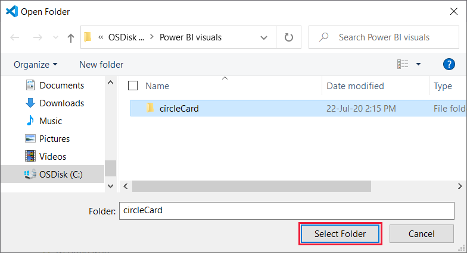

# <a name="set-up-your-environment-for-developing-a-power-bi-visual"></a>Configurer votre environnement pour développer un visuel Power BI

Dans cet article, vous apprendrez à configurer votre environnement pour le développement d’un visuel Power BI.

Avant de commencer le développement, vous devez installer **node.js** et le package **pbiviz**. Vous devez également créer et installer un certificat. Lorsque votre environnement local est configuré, vous devez configurer le service Power BI pour le développement d’un visuel Power BI.

Dans cet article, vous allez apprendre à :
> [!div class="checklist"]
> * Installez *node.js*.
> * Installez *pbiviz*.
> * Créez et installez un certificat.
> * Configurez le service Power BI pour le développement d’un visuel.
> * Installez des bibliothèques supplémentaires (requises pour le développement d’un visuel).

## <a name="install-nodejs"></a>Installer node.js

*node.js* est un runtime JavaScript reposant sur le moteur JavaScript V8 de Chrome. Cela permet aux développeurs d’exécuter n’importe quelle application créée sur JavaScript.

1. Pour installer *Node.js*, dans un navigateur web, accédez à [node.js](https://nodejs.org).

2. Téléchargez la dernière version du programme d’installation MSI.

3. Exécutez le programme d’installation, puis suivez les étapes d’installation. Acceptez les termes du contrat de licence et tous les paramètres par défaut.

4. Redémarrez votre ordinateur.

## <a name="install-pbiviz"></a>Installer pbiviz

L’outil *pbiviz*, qui est écrit en JavaScript, compile le code source du visuel du package *pbiviz*.

Le package *pbiviz* est un projet Visual Power BI compressé, avec tous les scripts et ressources nécessaires.

1. Ouvrez Windows PowerShell et entrez la commande suivante.

    ```powershell
    npm i -g powerbi-visuals-tools
    ```

## <a name="create-and-install-a-certificate"></a>Créer et installer un certificat

Pour qu’un client (votre ordinateur) et un serveur (le service Power BI) interagissent en toute sécurité, un [certificat SSL (Secure Sockets Layer)](create-ssl-certificate.md) est requis. Sans certificat pour garantir des interactions sécurisées, les interactions sont bloquées par le navigateur.

# <a name="windows"></a>[Windows](#tab/windows)

Ce processus décrit l’exécution d’une commande PowerShell qui lance l’**Assistant d’importation de certificat**. Suivez les étapes ci-dessous pour configurer le certificat dans l’assistant.

>[!IMPORTANT]
>Ne fermez pas la fenêtre PowerShell pendant cette procédure.

1. Ouvrez Windows PowerShell et entrez la commande suivante.

    ```powershell
    pbiviz --install-cert
    ```

    Cette commande effectue deux opérations :
    * Elle renvoie une *phrase secrète*. Dans ce cas, la *phrase secrète* est 9765328806094.
    * Elle démarre également l’Assistant Importation de certificat.
    
    >[!div class="mx-imgBorder"]
    >

2. Dans l’Assistant Importation de certificat, vérifiez que l’emplacement du magasin est défini sur *Utilisateur actuel*, puis sélectionnez **Suivant**.

    >[!div class="mx-imgBorder"]
    >

3. Dans la fenêtre **Fichier à importer**, sélectionnez **Suivant**.

4. Dans la fenêtre de **Protection de clé privée**, dans la zone de texte *Mot de passe*, collez la phrase secrète que vous avez reçue lors de l’exécution de la commande PowerShell (étape 1) et sélectionnez **Suivant**. Dans cet exemple, la phrase secrète est 9765328806094.

    >[!div class="mx-imgBorder"]
    >

5. Dans la fenêtre **Magasin de certificats**, sélectionnez l’option **Placer tous les certificats dans le magasin suivant**, puis sélectionnez **Parcourir**.

    >[!div class="mx-imgBorder"]
    >

6. Dans la fenêtre **Sélectionner un magasin de certificats**, sélectionnez **Autorités de certification racines de confiance**, puis **OK**.

    >[!div class="mx-imgBorder"]
    >

7. Sélectionnez *Suivant* dans la fenêtre **Magasin de certificats**.

    >[!div class="mx-imgBorder"]
    >

8. Dans la fenêtre **Exécution de l’Assistant Importation de certificat**, vérifiez vos paramètres, puis sélectionnez **Terminer**.

    >[!NOTE]
    >Si vous recevez un avertissement de sécurité, sélectionnez **Oui**.


# <a name="osx"></a>[OSX](#tab/sdk2osx)

1. Si le verrou dans le coin supérieur gauche est verrouillé, sélectionnez-le pour le déverrouiller. Recherchez *localhost*, puis double-cliquez sur le certificat.

    

2. Sélectionnez **Toujours faire confiance** fermez la fenêtre.

    

3. Entrez votre nom d’utilisateur et votre mot de passe, puis sélectionnez **Mettre à jour les paramètres**.

    

4. Fermez les navigateurs que vous avez ouverts.

> [!NOTE]
> Si le certificat n’est pas reconnu, redémarrez votre ordinateur.

---

## <a name="optional-verify-that-your-environment-is-set-up"></a>(Facultatif) Vérifier que votre environnement est configuré

Confirmez que le package Power BI Visual Tools est installé. Dans PowerShell, exécutez la commande `pbiviz` et examinez la sortie, notamment la liste des commandes prises en charge.

>[!div class="mx-imgBorder"]
>

## <a name="set-up-power-bi-service-for-developing-a-visual"></a>Configurer un service Power BI pour le développement d’un visuel

Pour développer un visuel Power BI, vous devez activer le débogage de visuel personnalisé dans le service Power BI. Suivez les instructions de cette section pour activer cette option.

1. Connectez-vous à [PowerBI.com](https://powerbi.microsoft.com/).

2. Accédez à **Paramètres** > **Paramètres** > **Paramètres**.

    >[!div class="mx-imgBorder"]
    >

3. À partir de l’onglet **Général**, sélectionnez **Développeur**. Dans les **Paramètres de développeur** activez la case à cocher **Activer le débogage de visuel personnalisé à l'aide du visuel de développeur**, puis sélectionnez **Appliquer**.

    >[!div class="mx-imgBorder"]
    >

## <a name="install-development-libraries"></a>Installer les bibliothèques de développement

Pour développer votre propre visuel Power BI, vous devez installer des bibliothèques supplémentaires. Cette section décrit comment installer ces bibliothèques et vérifier que l’installation a réussi.

Pour installer les bibliothèques répertoriées dans cet article, ouvrez PowerShell et entrez la commande d’installation pour chaque composant.

>[!NOTE]
>Une fois que ces bibliothèques sont installées sur votre ordinateur, vous pouvez les utiliser pour n’importe quel projet de visuels Power BI. Il s’agit d’une procédure d’installation unique par machine.


### <a name="d3-javascript-library"></a>Bibliothèque JavaScript D3

[D3](https://d3js.org/) est une bibliothèque JavaScript pour la production de visualisations dynamiques et interactives de données dans les navigateurs web. Elle s’appuie sur les normes largement répandues SVG (Scalable Vector Graphics), HTML5 et CSS.

```powershell
npm i d3@^5.0.0 --save
```

### <a name="typescript-definitions"></a>Définitions TypeScript

Installez les définitions TypeScript pour que vous puissiez développer votre Power BI visuel en [TypeScript](https://www.typescriptlang.org/), un surensemble de JavaScript.

```powershell
npm i @types/d3@^5.0.0 --save
```

### <a name="core-js"></a>core-js

[core-js](https://www.npmjs.com/package/core-js) est une bibliothèque standard modulaire pour JavaScript qui comprend des polyremplissages pour ECMAScript.

```powershell
npm i core-js@3.2.1 --save
```

### <a name="powerbi-visual-api"></a>powerbi-visual-api

Installez les définitions d’API de visuels Power BI.

```powershell
npm i powerbi-visuals-api --save-dev
```

### <a name="optional-verify-that-the-d3-library-is-installed"></a>(Facultatif) Vérifier que la bibliothèque D3 est installée

[Visual Studio Code](https://code.visualstudio.com/) (VS Code) est un environnement de développement intégré (IDE) idéal pour le développement d’applications TypeScript. Dans cette section, nous allons utiliser VS Code pour vérifier que la bibliothèque D3 dont vous avez besoin pour développer votre visuel Power BI est correctement installée.

>[!NOTE]
>Le processus de vérification décrit dans cette section suppose que vous disposez d’un projet de visuels Power BI existant. Si vous n’avez pas de projet de visuels Power BI, vous pouvez en créer un en suivant les instructions de [création d’un projet de carte ronde](develop-circle-card.md#create-a-development-project).

1. Ouvrez Visual Studio Code.

    >[!TIP]
    >Vous pouvez ouvrir VS Code à partir de PowerShell en exécutant la commande suivante :
    >
    >```powershell
    >code .
    >```
2. Dans VS Code, ouvrez le menu **Fichier**, puis sélectionnez **Ouvrir le dossier**.

    >[!div class="mx-imgBorder"]
    >

3. Dans la fenêtre **Ouvrir le dossier**, sélectionnez le dossier qui contient votre projet de visuel Power BI, puis sélectionnez **Sélectionner un dossier**.

    >[!div class="mx-imgBorder"]
    >

4. Dans le **volet Explorateur**, développez le dossier **node_modules** et vérifiez que la **bibliothèque d3** a été installée.

    >[!div class="mx-imgBorder"]
    >

5. Dans le volet **Explorateur**, développez **node_modules > @types > d3** et vérifiez que le fichier **index.t.ds** est installé.

    >[!div class="mx-imgBorder"]
    >

## <a name="next-steps"></a>Étapes suivantes

> [!div class="nextstepaction"]
> [Créer un visuel de carte ronde Power BI](develop-circle-card.md)

> [!div class="nextstepaction"]
> [Créer un visuel de graphique à barres Power BI](create-bar-chart.md)
