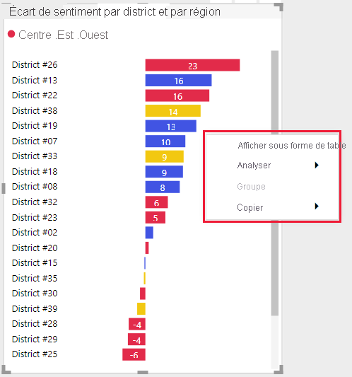

# Marche à suivre pour les visuels Power BI
Avant de [publier](office-store.md) votre visuel Power BI sur Microsoft AppSource pour que d’autres utilisateurs puissent le découvrir et l’utiliser, veillez à suivre les instructions pour créer une expérience de qualité pour vos utilisateurs.

## Visuels Power BI avec achats supplémentaires

Vous pouvez envoyer des visuels Power BI gratuits à la Place de marché (Microsoft AppSource). Vous pouvez également envoyer à Microsoft AppSource des visuels Power BI qui ont une étiquette de prix « un achat supplémentaire peut être requis ». Les visuels Power BI de type « Un achat supplémentaire peut être requis » sont similaires aux compléments d’achat dans l’application (IAP, in-app purchase) de l’Office Store. 

À l’instar d’un visuel Power BI gratuit, un visuel Power BI IAP peut être certifié. Avant d’envoyer votre visuel Power BI IAP à des fins de certification, vérifiez qu’il est conforme aux [critères de certification](power-bi-custom-visuals-certified.md).

### Qu’est-ce qu’un visuel Power BI avec des fonctionnalités IAP ?

Un visuel Power BI IAP est un visuel *gratuit* qui offre des *fonctionnalités gratuites*. Il a également des fonctionnalités avancées pour lesquelles des frais supplémentaires peuvent être facturés. Dans la description du visuel Power BI, les développeurs doivent attirer l’attention des utilisateurs sur les fonctionnalités dont le fonctionnement nécessite des achats supplémentaires. À l’heure actuelle, Microsoft ne fournit pas d’API natives pour prendre en charge l’achat d’applications et de compléments.

Les développeurs peuvent utiliser n’importe quel système de paiement tiers pour ces achats. Pour plus d’informations, consultez notre [magasin de stratégies](https://docs.microsoft.com/legal/marketplace/certification-policies#11002-displaying-ads).

>[!IMPORTANT]  
> Si vous mettez à jour votre visuel Power BI en le faisant passer de gratuit à « Un autre achat peut être requis », les utilisateurs doivent recevoir le même niveau de fonctionnalités gratuites qu’avant la mise à jour. Vous pouvez compléter les fonctionnalités gratuites existantes par des fonctionnalités avancées payantes facultatives.

### Filigranes

Vous pouvez utiliser des filigranes pour que les clients continuent à utiliser les fonctionnalités IAP avancées sans payer. 

Les filigranes peuvent être utilisés pour présenter les fonctionnalités complètes du visuel Power BI, avant qu’un achat soit effectué. 

* Les filigranes peuvent être employés uniquement dans les fonctionnalités payantes qui sont utilisées sans licence valide.
* Les filigranes ne sont pas autorisés dans les visuels Power BI avec une étiquette de prix *gratuit*.
* Les filigranes ne sont pas autorisés dans les visuels IAP, quand l’utilisateur utilise des fonctionnalités gratuites. 

### Fenêtre indépendante

Vous pouvez utiliser une fenêtre indépendante pour expliquer comment acheter une licence, quand une licence non valide (ou ayant expiré) est utilisée avec votre visuel Power BI IAP.

### Processus d’envoi

Suivez le [processus de soumission](office-store.md#submitting-to-appsource), accédez à l'onglet *Programme d’installation du produit*, puis cochez la case *Mon produit nécessite l'achat d'un service*.

Une fois le visuel Power BI validé et approuvé, l’entrée Microsoft AppSource correspondant au visuel Power BI IAP indique « Un autre achat peut être requis » sous les options de prix.

## Menu contextuel
Le menu contextuel est le menu qui s’affiche quand l’utilisateur pointe sur un visuel et clique avec le bouton droit.
Tous les visuels Power BI doivent activer le menu contextuel pour offrir une expérience unifiée.
Consultez [cet article](https://github.com/Microsoft/PowerBI-visuals/blob/gh-pages/tutorials/building-bar-chart/adding-context-menu-to-the-bar.md) pour découvrir comment ajouter un menu contextuel.

>[!div class="mx-imgBorder"]
>

## Logo commercial
Cette section décrit les spécifications relatives à l’ajout de logos commerciaux dans les visuels Power BI. Les logos commerciaux ne sont pas obligatoires. S’ils sont ajoutés, ils doivent suivre ces instructions.

> [!NOTE]
> * Dans cet article, « logo commercial » se réfère à n’importe quelle icône de marque commerciale, comme décrit dans les images ci-dessous.
> * Le logo commercial Microsoft n’est utilisé dans cet article qu’à titre d’exemple. Utilisez votre propre logo commercial avec votre visuel Power BI.

> [!IMPORTANT]
> Les logos commerciaux sont autorisés en *mode édition uniquement*. Les logos commerciaux ne peuvent *pas* être affichés en mode Affichage.

### Type de logos commerciaux

Il existe trois types de logos commerciaux :
* **Logo** : un logo est composé de deux éléments indissociables : une icône et un nom.

    

* **Symbole** : image sans texte.

    

* **Logotype** : logo sans icône, composé uniquement de texte.

    

### Couleur des logos commerciaux

Quand vous utilisez un logo commercial, la couleur du logo doit être grise (couleur hexadécimale #C8C8C8). N’ajoutez pas d’effets tels que des dégradés au logo commercial.

* **Logo**

    

* **Symbole** : image sans texte.

    

* **Logotype** : logo sans icône, composé uniquement de texte.

    

> [!TIP]
> * Si votre visuel Power BI contient une image, ajoutez un arrière-plan blanc avec des marges de 10 px à votre logo.
> * Ajoutez une ombre portée à votre logo (en noir avec 30 % d’opacité).

### Taille des logos commerciaux

Un visuel Power BI nécessite deux logos commerciaux, un pour les grandes vignettes et un pour les petites. Placez le logo à l’intérieur d’un cadre englobant placé en haut ou en bas à droite, avec des marges de 4 px.

Le tableau suivant décrit les considérations relatives à la taille des visuels Power BI.

|Paramètres  |Petit Visuel Power BI  |Grand Visuel Power BI  |
|---------|---------|---------|
|*Largeur du logo*    |Jusqu’à 240 px         |Supérieure à 240 px         |
|*Hauteur du logo*     |Jusqu’à 160 px         |Supérieure à 160 px         |
|*Taille du cadre englobant*     |40 x 15 px         |101 x 30 px         |
|*Exemple de logo commercial*     |         |         |
|*Exemple de cadre englobant*    |         |         |
|    |         |         |

### Comportement des logos commerciaux

Les logos commerciaux sont autorisés en mode édition. Quand vous cliquez sur un logo commercial, il ne peut inclure que les fonctionnalités suivantes :

* Un clic sur le logo commercial redirige vers votre site web.

* Un clic sur le logo commercial ouvre une fenêtre indépendante comportant des informations supplémentaires. La fenêtre indépendante doit être divisée en deux sections :
    * Une zone marketing qui peut inclure le logo commercial, un visuel et des évaluations commerciales.
    * Une zone d’informations qui peut inclure des informations et des liens.    

### Pratiques à éviter

* Les logos commerciaux ne peuvent pas être affichés en mode Affichage.

* Un logo commercial animé peut afficher une animation pendant cinq secondes maximum.

* Si votre visuel Power BI contient des icônes informatives (i) en mode lecture, il doit être conforme à la couleur, à la taille et à la position du logo commercial, comme décrit plus haut.

* Évitez un logo commercial en couleurs ou noir. Le logo commercial doit être gris (couleur hexadécimale #C8C8C8).

     

* Un logo commercial avec des effets tels que des dégradés ou des ombres fortes.

    

## Meilleures pratiques

Quand vous publiez un visuel Power BI, tenez compte des recommandations suivantes afin de procurer aux utilisateurs une expérience de qualité.

### Page d’arrivée du visuel

Utilisez la page d’arrivée pour indiquer aux utilisateurs comment utiliser votre visuel Power BI et où se procurer la licence. N’incluez pas de vidéos qui se déclenchent automatiquement. Ajoutez uniquement des documents permettant d’améliorer l’expérience utilisateur, comme des informations ou des liens vers les détails d’achat de la licence et la manière d’utiliser les fonctionnalités IAP.

### Jeton et clé de licence

Par souci pratique pour l’utilisateur, ajoutez les champs liés au jeton ou à la clé de licence en haut du volet de format.

## Questions fréquentes (FAQ)

Pour plus d’informations sur les visuels Power BI, consultez [Questions fréquentes sur les visuels Power BI avec achats supplémentaires](power-bi-custom-visuals-faq.md#visuals-with-additional-purchases).

## Étapes suivantes

Découvrez comment publier votre visuel Power BI sur Microsoft AppSource pour que d’autres utilisateurs puissent le trouver et l’utiliser.

>[!div class="nextstepaction"]
>[Publier des visuels Power BI](office-store.md)