# Bien démarrer avec Power BI Desktop
Bienvenue dans le guide de démarrage de Power BI Desktop ! Dans cette visite guidée, vous allez voir comment fonctionne Power BI Desktop, ce qu’il peut faire et comment créer des modèles de données fiables et des rapports incroyables pour améliorer votre prise de décision.

Pour obtenir un bref aperçu du fonctionnement de Power BI Desktop et de son utilisation, vous pouvez parcourir les écrans de ce guide en quelques minutes. Pour approfondir vos connaissances, lisez chaque section intégralement, effectuez les opérations listées et créez votre propre fichier Power BI Desktop que vous pourrez ensuite publier dans le [service Power BI](https://app.powerbi.com/) et partager avec d’autres utilisateurs.

Vous pouvez également regarder la vidéo [Bien démarrer avec Power BI Desktop](https://www.youtube.com/watch?v=Qgam9M8I0xA) et télécharger le classeur Excel [Financial Sample](https://go.microsoft.com/fwlink/?LinkID=521962) pour suivre la vidéo.

> [!IMPORTANT]
> Power BI Desktop est mis à jour et publié tous les mois, en incorporant les commentaires client et de nouvelles fonctionnalités. Seule la version la plus récente de Power BI Desktop est prise en charge ; les clients qui contactent le support technique de Power BI Desktop sont invités à effectuer la mise à niveau vers la version la plus récente. Vous pouvez obtenir la version la plus récente de Power BI Desktop à partir du [Windows Store](https://aka.ms/pbidesktopstore), ou en tant qu’exécutable contenant toutes les langues prises en charge que vous [téléchargez](https://www.microsoft.com/download/details.aspx?id=58494) et installez sur votre ordinateur.

## Fonctionnement de Power BI Desktop
Avec Power BI Desktop, vous pouvez :
1. Connecter des données, notamment plusieurs sources de données.
1. Mettre en forme les données avec des requêtes qui génèrent des modèles de données pertinents et convaincants.
1. Utiliser les modèles de données pour créer des visualisations et des rapports. 
1. Partager vos fichiers de rapport pour que d’autres utilisateurs puissent les exploiter, les développer et les partager. Vous pouvez partager un fichier Power BI Desktop ( *.pbix*) comme n’importe quel autre fichier, mais la méthode la plus intéressante consiste à le charger sur le [service Power BI](https://preview.powerbi.com/). 

Power BI Desktop intègre le moteur de requête éprouvé de Microsoft ainsi que des technologies de modélisation et de visualisation des données. Un analyste de donnée ou toute autre personne peut créer des regroupements de requêtes, des connexions de données, des modèles et des rapports et les partager facilement avec d’autres utilisateurs. Le fait de combiner Power BI Desktop et le service Power BI facilite la modélisation, la création, le partage et le développement de nouveaux insights issus du monde des données.

Power BI Desktop centralise, simplifie et rationalise le processus de conception et de création de rapports et de référentiels décisionnels, qui serait autrement éclaté, déconnecté et difficile.
Prêt à essayer ? Commençons.

> [!NOTE]
> Pour les données et les rapports qui doivent rester en local, il existe une version spécialisée et distincte de Power BI appelée [Power BI Report Server](../report-server/get-started.md). Power BI Report Server utilise une version spécialisée et distincte de Power BI Desktop appelée Power BI Desktop pour Power BI Report Server, qui fonctionne uniquement avec la version Report Server de Power BI. Cet article décrit la version standard de Power BI Desktop.

## Installer et exécuter Power BI Desktop
Pour télécharger Power BI Desktop, accédez à la [page de téléchargement de Power BI Desktop](https://powerbi.microsoft.com/desktop) et sélectionnez **Téléchargement gratuit**. Ou, pour accéder aux options de téléchargement, sélectionnez [Voir les options de téléchargement ou de langue](https://www.microsoft.com/download/details.aspx?id=58494). 

Vous pouvez également télécharger Power BI Desktop à partir du service Power BI. Sélectionnez l’icône **Télécharger** dans la barre de menus supérieure, puis **Power BI Desktop**.

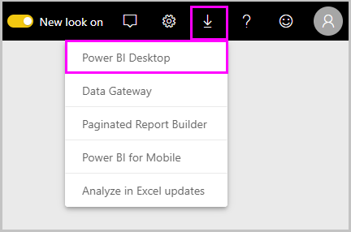

Dans la page du Microsoft Store, sélectionnez **Obtenir** et suivez les invites pour installer Power BI Desktop sur votre ordinateur. Démarrez Power BI Desktop à partir du menu **Démarrer** de Windows ou de l’icône dans la barre des tâches Windows.

Quand vous démarrez Power BI Desktop pour la première fois, l’**écran d’accueil** s’affiche.

Dans l’**écran d’accueil**, vous pouvez **obtenir des données**, voir les **sources récentes**, ouvrir des rapports récents, **ouvrir d’autres rapports** ou encore sélectionner d’autres liens. Vous pouvez également choisir de toujours afficher l’**écran d’accueil** au démarrage. Sélectionnez l’icône de fermeture pour fermer l’**écran d’accueil**.

Sur le côté gauche se trouvent les icônes correspondant aux trois vues de Power BI Desktop : **Rapport**, **Données**et **Relations**(de haut en bas). La vue actuelle est indiquée par une barre jaune à gauche. Pour changer de vue, sélectionnez simplement l’une des icônes. 

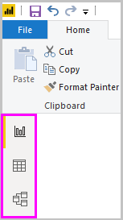

La vue par défaut est la vue **Rapport**. 

Power BI Desktop comprend également un **Éditeur Power Query** qui s’ouvre dans une fenêtre distincte. L’**Éditeur Power Query** permet de créer des requêtes et de transformer des données, puis de charger le modèle de données affiné dans Power BI Desktop pour créer des rapports.

## Se connecter aux données
Une fois Power BI Desktop installé, vous pouvez vous connecter au monde en perpétuelle expansion des données. Pour voir les différents types de sources de données disponibles, sélectionnez **Obtenir des données** > **Plus** sous l’onglet **Accueil** de Power BI Desktop. Ensuite, dans la fenêtre **Obtenir des données**, faites défiler la liste de **toutes** les sources de données. Dans le cadre de cette présentation rapide, vous allez vous connecter à deux sources de données **Web** différentes.

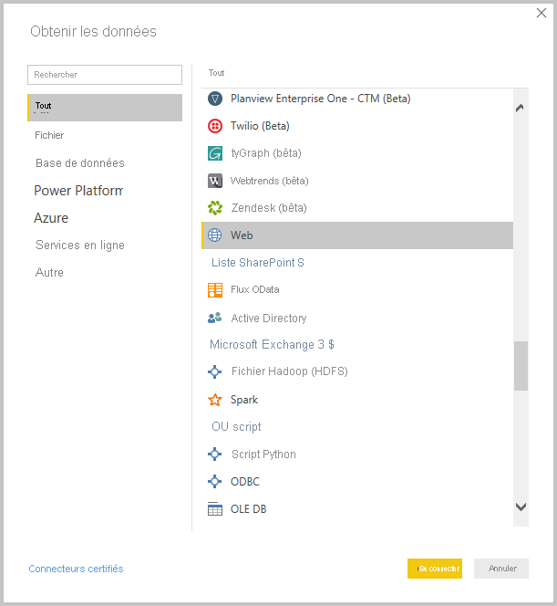

Prenons un exemple. Vous êtes actuellement analyste de données pour le compte d’une enseigne de lunettes de soleil. Vous voulez aider votre client à cibler ses ventes de lunettes de soleil là où l’ensoleillement est maximal. Disponible sur Bankrate.com, le [classement des meilleurs États américains où prendre sa retraite](https://www.bankrate.com/retirement/best-and-worst-states-for-retirement/) propose des données intéressantes à ce sujet.

Sous l’onglet **Accueil** de Power BI Desktop, sélectionnez **Obtenir des données** > **Web** pour vous connecter à une source de données web. 

Dans la boîte de dialogue **À partir du web**, collez l’adresse *https:\//www.bankrate.com/retirement/best-and-worst-states-for-retirement/* dans le champ **URL**, puis sélectionnez **OK**. 

Si vous y êtes invité, dans l’écran **Accéder au contenu web**, sélectionnez **Connecter** pour utiliser un accès anonyme. 

La fonctionnalité de requête de Power BI Desktop se met au travail et contacte la ressource web. La fenêtre **Navigateur** retourne ce qu’elle a trouvé sur la page web, à savoir une table intitulée **Ranking of best and worst states for retirement** et un document. Comme cette table nous intéresse, sélectionnez-la pour en voir un aperçu.

À ce stade, vous pouvez sélectionner **Charger** pour charger la table ou **Transformer les données** pour apporter des modifications à la table avant de la charger.

Le fait de sélectionner **Transformer les données** lance l’Éditeur Power Query avec une vue représentative de la table. Le volet **Paramètres de requête** se trouve à droite. Si ce n’est pas le cas, vous pouvez l’afficher en sélectionnant **Paramètres de requête** sous l’onglet **Affichage** de l’Éditeur Power Query. 

Pour plus d’informations sur la connexion à des données, consultez [Se connecter à des données dans Power BI Desktop](../connect-data/desktop-connect-to-data.md).

## Mettre en forme les données
À présent que vous êtes connecté à une source de données, vous pouvez ajuster les données en fonction de vos besoins. Pour *mettre en forme* des données, vous devez fournir à l’Éditeur Power Query des instructions pas à pas qui lui permettront d’ajuster les données durant leur chargement et leur présentation. La mise en forme n’affecte pas la source de données d’origine, mais uniquement cette vue particulière des données. 

> [!NOTE]
> Les données de table utilisées dans ce guide peuvent changer au fil du temps. Les étapes que vous devez suivre peuvent donc varier, ce qui vous oblige à être créatif quant à la façon dont vous ajustez les étapes ou les résultats : ceci fait partie du plaisir de l’apprentissage. 

Mettre en forme peut signifier *transformer* les données, c’est-à-dire renommer des colonnes ou des tables, supprimer des lignes ou des colonnes ou encore changer des types de données. L’Éditeur Power Query capture ces étapes de manière séquentielle sous **Étapes appliquées** dans le volet **Paramètres de requête**. Ces étapes sont effectuées chaque fois que la requête se connecte à la source de données, si bien que les données sont toujours mises en forme comme vous le spécifiez. Ce processus se produit quand vous utilisez la requête dans Power BI Desktop ou quand quelqu’un utilise votre requête partagée, comme dans le service Power BI. 

Notez que la section **Étapes appliquées** dans **Paramètres de requête** contient déjà quelques étapes. Vous pouvez sélectionner chaque étape pour voir son effet dans l’Éditeur Power Query. Vous avez commencé par spécifier une source web, puis vous avez affiché un aperçu de la table dans la fenêtre **Navigateur**. À la troisième étape, **Type modifié**, Power BI a reconnu des données au format nombre entier lors de l’importation et a remplacé automatiquement le *type de données* **Texte** par **Nombre entier**. 

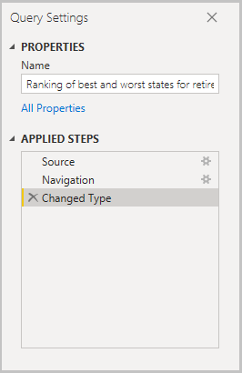

Si vous avez besoin de changer un type de données, sélectionnez la ou les colonnes à changer. Maintenez enfoncée la touche **Maj** pour sélectionner plusieurs colonnes adjacentes ou la touche **Ctrl** pour sélectionner des colonnes non adjacentes. Cliquez avec le bouton droit sur un en-tête de colonne, sélectionnez **Modifier le type** et choisissez un nouveau type de données dans le menu. Vous pouvez également sélectionner un nouveau type de données dans la liste déroulante en regard de **Type de données** dans le groupe **Transformer** de l’onglet **Accueil**.

> [!NOTE]
> L’Éditeur Power Query dans Power BI Desktop utilise le ruban ou les menus contextuels pour les tâches disponibles. Pour accéder à la plupart des tâches disponibles sous les onglets **Accueil** ou **Transformer** du ruban, vous pouvez également cliquer avec le bouton droit sur un élément et choisir une option dans le menu qui s’affiche.

Vous pouvez maintenant appliquer vos propres modifications et transformations aux données et les voir dans **Étapes appliquées**. 

Par exemple, pour les ventes de lunettes de soleil, le classement des États en fonction de leurs conditions climatiques vous intéresse. Vous décidez donc de trier la table en fonction de la colonne **Weather** (Conditions climatiques) et non de la colonne **Overall rank** (Classement global). Sélectionnez **Tri croissant** dans la liste déroulante en regard de l’en-tête **Weather**. Les données sont désormais triées en fonction du classement des conditions climatiques et l’étape **Lignes triées** apparaît dans **Étapes appliquées**. 

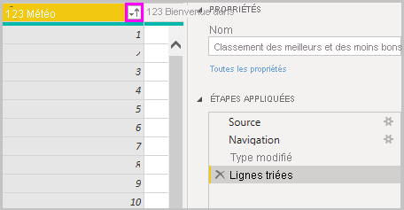

Comme la vente de lunettes de soleil dans les États où les conditions climatiques sont les plus rudes présente peu d’intérêt, vous décidez de supprimer ces États de la table. Dans le groupe **Réduire les lignes** de l’onglet **Accueil**, sélectionnez **Supprimer les lignes** > **Supprimer les lignes du bas**. Dans la boîte de dialogue **Supprimer les lignes du bas**, entrez *10*, puis sélectionnez **OK**. 

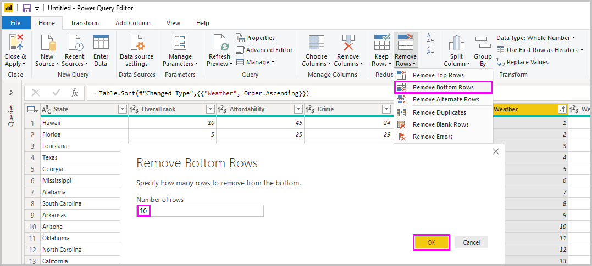

Les 10 lignes du bas correspondant aux États ayant les conditions climatiques les plus rudes sont supprimées de la table. L’étape **Dernières lignes supprimées** apparaît alors sous **Étapes appliquées**.

Vous réalisez que la table contient beaucoup d’informations dont vous n’avez pas besoin et décidez de supprimer les colonnes **Affordability** (Coût de la vie), **Crime**, **Culture** et **Wellness** (Bien-être). Sélectionnez l’en-tête de chaque colonne que vous souhaitez supprimer. Maintenez enfoncée la touche **Maj** pour sélectionner plusieurs colonnes adjacentes ou la touche **Ctrl** pour sélectionner des colonnes non adjacentes. 

Ensuite, dans le groupe **Gérer les colonnes** de l’onglet **Accueil**, sélectionnez **Supprimer les colonnes**. Vous pouvez également cliquer avec le bouton droit sur l’un des en-têtes de colonne sélectionnés et choisir **Supprimer les colonnes** dans le menu. Les colonnes sélectionnées sont supprimées et l’étape **Colonnes supprimées** apparaît dans **Étapes appliquées**.

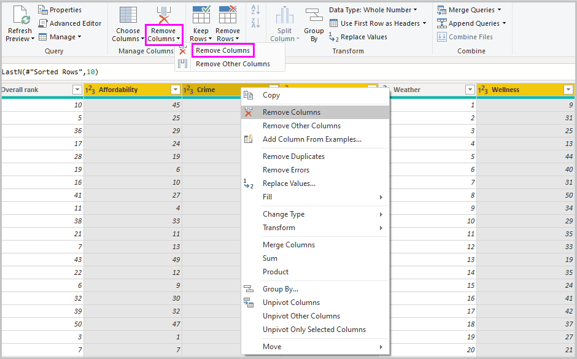

Mais après réflexion, vous vous dites que la colonne **Affordability** peut présenter un intérêt pour les ventes de lunettes de soleil. Vous aimeriez donc faire réapparaître cette colonne. Vous pouvez facilement annuler la dernière étape dans le volet **Étapes appliquées** en sélectionnant l’icône de suppression (**X**) en regard de l’étape. Répétez à présent l’étape en sélectionnant uniquement les colonnes que vous souhaitez supprimer. Pour plus de flexibilité, vous pouvez supprimer chaque colonne dans le cadre d’une étape distincte. 

Vous pouvez cliquer avec le bouton droit sur n’importe quelle étape du volet **Étapes appliquées** et choisir de la supprimer, de la renommer, de la déplacer vers le haut ou vers le bas dans la séquence ou encore d’ajouter ou de supprimer des étapes après celle-ci. Pour les étapes intermédiaires, Power BI Desktop vous avertit si un changement peut avoir des répercussions sur les étapes suivantes et provoquer le dysfonctionnement de votre requête.  

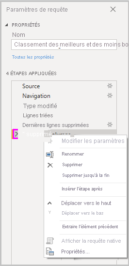

Par exemple, si vous n’avez plus besoin de trier la table en fonction des conditions climatiques (**Weather**), vous pouvez essayer de supprimer l’étape **Lignes triées**. Power BI Desktop vous avertit que la suppression de cette étape peut provoquer le dysfonctionnement de la requête. En effet, vous avez supprimé les 10 dernières lignes après avoir trié les lignes en fonction des conditions climatiques. Si vous supprimez le tri, différentes lignes seront donc supprimées. Vous recevez également un avertissement si vous sélectionnez l’étape **Lignes triées** et que vous essayez d’ajouter une nouvelle étape intermédiaire à ce stade.  

Enfin, vous changez le titre de la table pour qu’il reflète les ventes de lunettes de soleil et non le lieu de retraite. Sous **Propriétés** dans le volet **Paramètres de requête**, remplacez l’ancien titre par *Best states for sunglass sales*.

La requête terminée pour vos données mises en forme ressemble à ceci :

Pour plus d’informations sur la mise en forme des données, consultez [Mettre en forme et combiner des données dans Power BI Desktop](../connect-data/desktop-shape-and-combine-data.md).

## Combiner des données
Les données sur les différents États sont intéressantes et pourront servir à des analyses complémentaire ou à créer d’autres requêtes. Toutefois, elles posent un problème : la plupart de ces données utilisent des abréviations à deux lettres pour les codes d’États, et non les noms complets des États. Pour utiliser ces données, vous devez trouver un moyen d’associer les noms des États à leurs abréviations.

C’est votre jour de chance ! Une autre source de données publique fait exactement cela. Toutefois, les données nécessitent un travail important de mise en forme importante avant que vous ne puissiez les *combiner* avec votre table de lunettes de soleil.

Pour importer les abréviations des États dans l’Éditeur Power Query, sélectionnez **Nouvelle source** > **Web** dans le groupe **Nouvelle requête** sous l’onglet **Accueil** du ruban. 

Dans la boîte de dialogue **À partir du web**, entrez l’URL du site contenant les abréviations des États : *https:\//en.wikipedia.org/wiki/List_of_U.S._state_abbreviations*.

Dans la fenêtre **Navigateur**, sélectionnez la table **Codes and abbreviations for U.S. states, federal district, territories, and other regions**, puis sélectionnez **OK**. La table s’ouvre dans l’Éditeur Power Query.

Supprimez toutes les colonnes à l’exception des suivantes : **Name and status of region**, **Name and status of region2** et **ANSI**. Pour conserver uniquement ces colonnes, maintenez la touche **Ctrl** enfoncée et sélectionnez les colonnes. Ensuite, cliquez avec le bouton droit sur l’un des en-têtes de colonne et sélectionnez **Supprimer les autres colonnes**. Vous pouvez également sélectionner **Supprimer les autres colonnes** dans le groupe **Gérer les colonnes** sous l’onglet **Accueil**. 

Dans la liste déroulante en regard de l’en-tête de colonne **Name and status of region2**; sélectionnez **Filtres** > **Est égal à**. Dans la boîte de dialogue **Filtrer les lignes**, sélectionnez **State** dans la liste déroulante **Entrez ou sélectionnez une valeur** en regard de **est égal à**. 

Sélectionnez **Ou**, puis en regard du deuxième champ **est égal à**, sélectionnez **State ("Commonwealth")** . Sélectionnez **OK**. 

Une fois les valeurs inutiles supprimées, comme **Federal district** et **island**, vous disposez d’une liste des 50 États et de leurs abréviations officielles à deux lettres. Vous pouvez renommer les colonnes pour les rendre plus explicites, par exemple **State name**, **Status** et **Abbreviation**. Pour cela, cliquez avec le bouton droit sur les en-têtes de colonne et sélectionnez **Renommer**.

Notez que toutes ces étapes sont enregistrées sous **Étapes appliquées**  dans le volet **Paramètres de requête**.

Votre table mise en forme se présente maintenant comme ceci :

Renommez la table *State codes* dans le champ **Propriétés** de **Paramètres de requête**. 

Une fois la table **State codes** mise en forme, vous pouvez *combiner* ces deux tables en une seule. Dans la mesure où les tables dont vous disposez à présent proviennent de requêtes que vous avez appliquées aux données, elles sont également appelées *requêtes*. Il existe deux façons principales de combiner des requêtes : par *fusion* et par *ajout*. 

Pour ajouter une ou plusieurs colonnes à une autre requête, vous *fusionnez* les requêtes. Pour ajouter des lignes de données à une requête existante, vous les *ajoutez* à la requête.

Dans le cas présent, vous souhaitez *fusionner* la requête **State codes** dans la requête **Best states for sunglasses**. Pour fusionner les requêtes, passez à la requête **Best states for sunglasses**. Pour cela, sélectionnez-la dans le volet **Requêtes** à gauche de l’Éditeur Power Query. Ensuite, sélectionnez **Fusionner des requêtes** à partir du groupe **Combiner** sous l’onglet **Accueil** du ruban.

Dans la fenêtre **Fusionner**, sélectionnez **State codes** dans la liste déroulante des autres requêtes disponibles. Sélectionnez la colonne à mettre en correspondance dans chaque table : **State** de la requête **Best states for sunglass sales** et **State name** de la requête **State codes**. 

Si une boîte de dialogue **Niveaux de confidentialité** s’affiche, sélectionnez **Ignorer les contrôles des niveaux de confidentialité pour ce fichier** et **Enregistrer**. Sélectionnez **OK**. 

Une nouvelle colonne nommée **State codes** s’affiche à droite de la table **Best states for sunglass sales**. Elle contient la requête State codes que vous avez fusionnée avec la requête Best states for sunglass sales. Toutes les colonnes de la table fusionnée sont condensées dans la colonne **State codes**. Vous pouvez *développer* la table fusionnée et inclure uniquement les colonnes souhaitées. 

Pour développer la table fusionnée et sélectionner les colonnes à inclure, sélectionnez l’icône **Développer** dans l’en-tête de colonne. Dans la boîte de dialogue **Développer**, sélectionnez uniquement la colonne **Abréviation**. Décochez **Utiliser le nom de la colonne d’origine comme préfixe**, puis sélectionnez **OK**. 

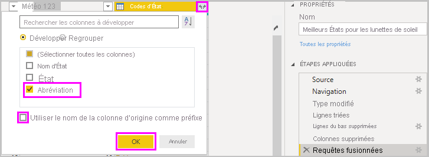

> [!NOTE]
> Prenez le temps de vous familiariser avec les différents modes d’introduction de la table **State codes**. Faites des essais. Si les résultats ne vous satisfont pas, supprimez simplement cette étape de la liste **Étapes appliquées** dans le volet **Paramètres de la requête**. Vous pouvez faire cela autant de fois que vous le voulez jusqu’à ce que le processus de développement vous convienne.

Pour obtenir une description plus complète de chacune de ces étapes de mise en forme et combinaison de données, consultez [Mettre en forme et combiner des données dans Power BI Desktop](../connect-data/desktop-shape-and-combine-data.md).

Vous disposez à présent d’une table de requête unique qui combine deux sources de données, chacune ayant été mise en forme selon vos besoins. Cette requête peut servir de base pour un grand nombre d’autres connexions de données intéressantes au niveau d’un État : situation démographique, niveaux de richesse, loisirs, etc.

Pour le moment, vous disposez de suffisamment de données pour créer un rapport intéressant dans Power BI Desktop. Étant donné qu’il s’agit d’une étape majeure, appliquez les modifications dans l’**Éditeur Power Query** et chargez-les dans Power BI Desktop. Pour cela, sélectionnez **Fermer & appliquer** sous l’onglet **Accueil** du ruban. Vous pouvez également sélectionner **Appliquer** pour garder la requête ouverte dans l’Éditeur Power Query pendant que vous travaillez dans Power BI Desktop. 

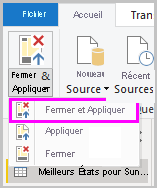

Vous pouvez continuer de modifier une table une fois celle-ci chargée dans Power BI Desktop, puis recharger le modèle pour appliquer les modifications apportées. Pour rouvrir l’**Éditeur Power Query** à partir de Power BI Desktop, sélectionnez **Modifier les requêtes** sous l’onglet **Accueil** du ruban Power BI Desktop. 

## Créer des rapports
Dans la vue **Rapport** de Power BI Desktop, vous pouvez générer des visualisations et des rapports. La vue **Rapport** comporte six zones principales :

1. Le ruban, dans la partie supérieure, qui affiche les tâches courantes associées aux rapports et aux visualisations.
2. Le canevas, au centre, où vous créez et organisez des visualisations.
3. La zone d’onglets, dans la partie inférieure, qui vous permet de sélectionner ou d’ajouter des pages de rapport.
4. Le volet **Filtres**, dans lequel vous pouvez filtrer les visualisations de données.
5. Le volet **Visualisations**, dans lequel vous pouvez ajouter, modifier ou personnaliser des visualisations et appliquer une extraction.
6. Le volet **Champs**, qui affiche les champs disponibles dans vos requêtes. Pour créer ou modifier des visualisations, vous pouvez faire glisser ces champs sur le canevas, le volet **Filtres** ou le volet **Visualisations**.

Vous pouvez développer et réduire les volets **Filtres**, **Visualisations** et **Champs** à l’aide des flèches situées en haut de chaque volet. Le fait de réduire les volets libère de l’espace sur le canevas pour créer des visualisations intéressantes. 

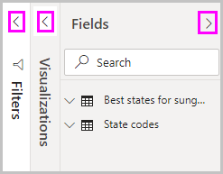

Pour créer une visualisation simple, il vous suffit de sélectionner un champ dans la liste de champs ou de le faire glisser sur le canevas à partir de la liste **Champs**. Par exemple, faites glisser le champ **State** de la table **Best states for sunglass sales** sur le canevas et observez ce qui se passe.

Regardez ça ! Power BI Desktop a détecté que le champ **State** contenait des données de géolocalisation et a automatiquement créé une visualisation sous forme de carte. La visualisation affiche des points de données pour les 40 États de votre modèle de données. 

Le volet **Visualisations** donne des informations sur la visualisation et vous permet de les modifier. 

1. Les icônes indiquent le type de visualisation créé. Vous pouvez changer le type d’une visualisation sélectionnée en sélectionnant une autre icône. Vous pouvez également créer une visualisation en sélectionnant une icône sans aucune visualisation existante sélectionnée. 
2. L’option **Champs** du volet **Visualisations** vous permet de faire glisser des champs de données vers la zone **Légende** et d’autres zones de champs dans le volet. 
3. L’option **Format** vous permet d’appliquer une mise en forme et d’autres contrôles aux visualisations. 

Les options disponibles dans les zones **Champs** et **Format** dépendent du type de visualisation et des données dont vous disposez.

Vous souhaitez que votre visualisation sous forme de carte affiche uniquement le top 10 des États en fonction des conditions climatiques. Pour afficher uniquement le top 10 des États, dans le volet **Filtres**, pointez sur **State est (Tout)** et développez la flèche qui apparaît. Sous **Type de filtre**, sélectionnez **N premiers** dans la liste déroulante. Sous **Afficher les éléments**, sélectionnez **Bas** car vous souhaitez afficher les éléments associés aux valeurs numériques les plus faibles, puis entrez *10* dans le champ suivant.

Faites glisser le champ **Weather** du volet **Champs** vers le champ **Par valeur**, puis sélectionnez **Appliquer le filtre**. 

Seuls les 10 premiers États classés en fonction des conditions climatiques apparaissent sur la visualisation sous forme de carte. 

Renommez votre visualisation. Pour cela, sélectionnez l’icône **Format** dans le volet**Visualisations**, sélectionnez **Titre**, puis tapez *Top 10 weather states* sous **Texte du titre**. 

Pour ajouter une visualisation présentant les noms des 10 premiers États classés de 1 à 10 en fonction des conditions climatiques, sélectionnez une zone vide du canevas, puis sélectionnez l’icône **Histogramme** dans le volet **Visualisations**. Dans le volet **Champs**, sélectionnez **State** et **Weather**. Un histogramme affiche les 40 États de votre requête, classés numériquement par ordre décroissant. Les États avec les conditions climatiques les plus rudes apparaissent donc en premier. 

Pour changer l’ordre du classement de manière à ce que le numéro 1 apparaisse en premier, sélectionnez les points de suspension (**Plus d’options**) en haut à droite de la visualisation, puis sélectionnez **Tri croissant** dans le menu. 

Pour limiter le tableau aux 10 premiers États, appliquez le filtre Bas avec la valeur 10 (le même filtre que pour la visualisation sous forme de carte). 

Renommez l’histogramme en suivant la même procédure que celle utilisée pour la visualisation sous forme de carte. Pour plus de clarté, dans la section **Format** du volet **Visualisations**, remplacez **Weather** par *Weather ranking* dans **Axe Y** > **Titre de l’axe**. Ensuite, placez le sélecteur **Axe Y** en position **Désactivé** et le sélecteur **Étiquettes de données** en position **Activé**.

Les 10 premiers États classés en fonction des conditions climatiques apparaissent avec leur classement numérique.

Vous pouvez créer des visualisations similaires ou autres pour les champs **Affordability** et **Overall ranking** ou combiner plusieurs champs en une seule visualisation. Vous pouvez créer toutes sortes de visualisations et de rapports intéressants. Ces visualisations **Table** et **Graphique en courbes et histogramme groupé** présentent le top 10 des États en fonction des conditions climatiques avec leur classement en termes de coût de la vie et leur classement général :

Vous pouvez afficher différentes visualisations dans différentes pages du rapport. Pour ajouter une nouvelle page, sélectionnez le symbole **+** en regard des pages existantes dans la barre des pages. Vous pouvez également sélectionner **Insérer** > **Nouvelle page** sous l’onglet **Accueil** du ruban. Pour renommer une page, double-cliquez sur le nom de la page dans la barre des pages ou cliquez dessus avec le bouton droit et sélectionnez **Renommer la page**, puis tapez le nouveau nom. Pour accéder à une autre page du rapport, sélectionnez la page dans la barre des pages. 

Vous pouvez ajouter des zones de texte, des images et des boutons à vos pages de rapport à partir du groupe **Insérer** de l’onglet **Accueil**. Pour définir les options de mise en forme des visualisations, sélectionnez une visualisation, puis l’icône **Format** dans le volet **Visualisations**. Pour configurer les tailles des pages, les arrière-plans et d’autres informations relatives aux pages, sélectionnez l’icône **Format** sans aucune visualisation sélectionnée.

Quand vous avez terminé de créer vos pages et vos visualisations, sélectionnez **Fichier** > **Enregistrer** pour enregistrer votre rapport. 

Pour plus d’informations sur les rapports, consultez [Vue Rapport dans Power BI Desktop](../create-reports/desktop-report-view.md).

## Partager votre travail
Vous disposez à présent d’un rapport Power BI Desktop que vous pouvez partager avec d’autres utilisateurs. Il existe plusieurs moyens de partager votre travail. Vous pouvez le publier directement sur le service Power BI à partir de Power BI Desktop, distribuer le fichier *.pbix* du rapport comme n’importe quel autre fichier ou encore charger le fichier *.pbix* à partir du service Power BI. Vous devez disposer d’un compte Power BI pour pouvoir publier ou charger des rapports sur le service Power BI. 

Pour publier sur le service **Power BI** à partir de Power BI Desktop, sélectionnez **Publier** sous l’onglet **Accueil** du ruban.

Vous pouvez être invité à vous connecter à Power BI ou à sélectionner une destination.

Une fois le processus de publication terminé, la boîte de dialogue suivante s’affiche :

Quand vous sélectionnez le lien pour ouvrir le rapport dans Power BI, votre rapport s’ouvre dans votre site Power BI sous **Mon espace de travail** > **Rapports**. 

Un autre moyen de partager votre travail consiste à le charger à partir du service **Power BI** . Accédez à *https:\//app.powerbi.com* pour ouvrir Power BI dans un navigateur. Dans votre page **Accueil** Power BI, sélectionnez **Obtenir des données** en bas à gauche pour démarrer le processus de chargement de votre rapport Power BI Desktop.

Dans la page suivante, sélectionnez **Obtenir** dans la section **Fichiers**.

Dans la page suivante, sélectionnez **Fichier local**. Recherchez et sélectionnez votre fichier *.pbix* Power BI Desktop, puis sélectionnez **Ouvrir**. 

Une fois le fichier importé, vous pouvez le voir sous **Mon espace de travail** > **Rapports** dans le volet gauche du service Power BI.

Quand vous sélectionnez le fichier, la première page du rapport s’affiche. Vous pouvez sélectionner des pages différentes à partir des onglets situés à gauche du rapport. 

Vous pouvez apporter des modifications à un rapport dans le service **Power BI**. Pour cela, sélectionnez **Plus d’options** > **Modifier** dans la partie supérieure du canevas du rapport. Pour enregistrer vos modifications, sélectionnez **Enregistrer une copie**.

Vous pouvez créer toutes sortes de visuels intéressants dans le service **Power BI** et les épingler à un *tableau de bord*. Pour en savoir plus sur les tableaux de bord dans le service **Power BI**, passez en revue les [conseils pour la conception d’un tableau de bord réussi](../create-reports/service-dashboards-design-tips.md). Pour plus d’informations sur la création, le partage et la modification de tableaux de bord, consultez [Partager un tableau de bord](../collaborate-share/service-share-dashboards.md).

Pour partager un rapport ou un tableau de bord, sélectionnez **Partager** en haut de la page d’ouverture d’un rapport ou d’un tableau de bord ou sélectionnez l’icône **Partager** en regard du nom d’un rapport ou d’un tableau de bord dans les listes **Mon espace de travail** > **Rapports** ou **Mon espace de travail** > **Tableaux de bord**.

Pour envoyer un e-mail ou obtenir un lien pour partager votre rapport ou tableau de bord avec d’autres utilisateurs, renseignez l’écran **Partager le rapport** ou **Partager le tableau de bord**. 

Vous pouvez réaliser toutes sortes de combinaisons et de visualisations remarquables de données à l’aide de Power BI Desktop et du service Power BI. 

## Étapes suivantes
Power BI Desktop prend en charge la connexion à un port de diagnostic. Le port de diagnostic permet à d’autres outils de se connecter et d’effectuer des suivis pour établir un diagnostic. Quand vous utilisez le port de diagnostic, *l’apport de changements au modèle n’est pas pris en charge. Les changements apportés au modèle peuvent entraîner une altération et une perte de données.*

Pour plus d’informations sur les nombreuses fonctionnalités de Power BI Desktop, consultez les ressources suivantes :

* [Présentation des requêtes dans Power BI Desktop](../transform-model/desktop-query-overview.md)
* [Sources de données dans Power BI Desktop](../connect-data/desktop-data-sources.md)
* [Se connecter aux données dans Power BI Desktop](../connect-data/desktop-connect-to-data.md)
* [Tutoriel : Mettre en forme et combiner des données avec Power BI Desktop](../connect-data/desktop-shape-and-combine-data.md)
* [Tâches courantes relatives aux requêtes dans Power BI Desktop](../transform-model/desktop-common-query-tasks.md)   
