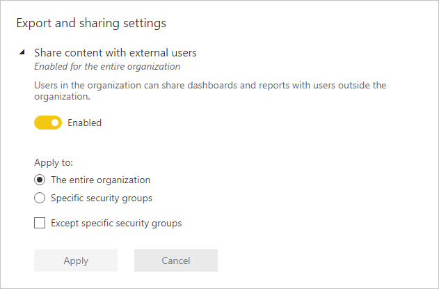
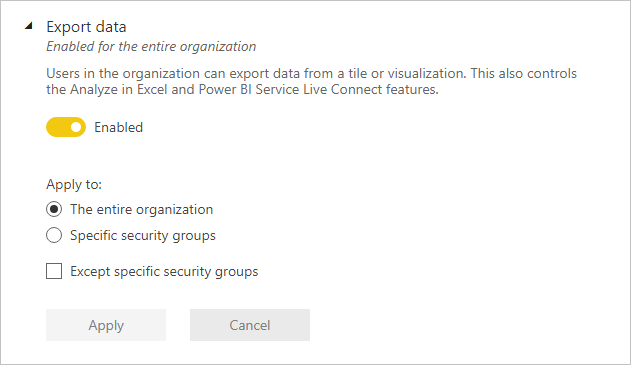
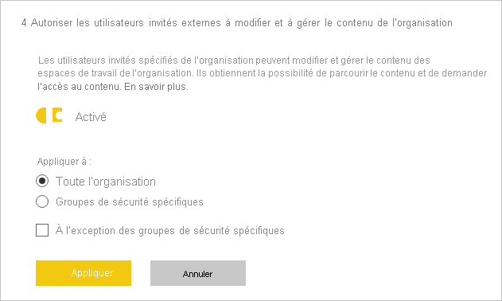

# Indications concernant les paramètres d’administration de locataire

Cet article s’adresse aux administrateurs Power BI chargés d’installer et de configurer l’environnement Power BI dans leur organisation.

Nous donnons des indications concernant des paramètres de locataire spécifiques qui contribuent à améliorer l’expérience Power BI ou qui peuvent éviter d’exposer votre organisation à des risques. Nous vous recommandons de toujours configurer votre locataire en respectant la logique des stratégies et des processus de votre organisation.

Les [paramètres du locataire](../admin/service-admin-portal.md#tenant-settings) sont gérés sur le [portail d’administration](https://app.powerbi.com/admin-portal/tenantSettings) et peuvent être configurés par un [administrateur de service Power BI](../admin/service-admin-administering-power-bi-in-your-organization.md#administrator-roles-related-to-power-bi). De nombreux paramètres de locataire peuvent limiter les capacités et les fonctionnalités à un ensemble limité d’utilisateurs. Nous vous recommandons donc de commencer par vous familiariser avec les paramètres pour planifier les groupes de sécurité dont vous aurez besoin. Vous découvrirez peut-être que vous pouvez appliquer le même groupe de sécurité à plusieurs paramètres.

## Améliorer l’expérience Power BI

### Publier des informations « Obtenir de l’aide »

Nous vous encourageons à configurer des sites internes relatifs à Power BI à l’aide de [Microsoft teams](/microsoftteams) ou d’une autre plateforme de collaboration. Ces sites peuvent servir à stocker de la documentation de formation, à accueillir des discussions, à demander des licences ou à répondre à des demandes d’aide.

Dans ce cas, nous vous recommandons d’activer le paramètre **Publier des informations « Obtenir de l’aide »** _pour l’ensemble de l’organisation_. Il se trouve dans le groupe **Paramètres d’aide et de support**. Vous pouvez définir une URL pour les éléments suivants :

- Documentation de formation
- Forum de discussion
- Demandes de licences
- Support technique

Ces URL deviennent alors disponibles dans le menu d’aide de Power BI et se présentent sous forme de liens.

> [!NOTE]
> Le fait de fournir l’URL **Requêtes de licences** empêche les utilisateurs individuels d’acheter une licence Power BI Pro. Au lieu de cela, ils sont dirigés vers votre site interne qui les renseigne sur la façon d’acquérir une licence. Le paramètre **Autoriser les utilisateurs à essayer Power BI Pro** est activé par défaut et sépare les expériences d’achat et d’évaluation gratuite. Pour en savoir plus sur la façon dont ces paramètres fonctionnent ensemble, consultez [Autoriser les utilisateurs à essayer Power BI Pro](../admin/service-admin-portal.md#allow-users-to-try-power-bi-pro).
>
>

Pour plus d'informations, consultez [Paramètres d'aide et de support](../admin/service-admin-portal.md#help-and-support-settings).

## Gérer le risque.
Les paramètres de gestion des risques peuvent vous aider à établir des stratégies de gouvernance dans votre locataire Power BI. Gardez cependant à l’esprit que les paramètres de gouvernance ne sont pas une mesure de sécurité. Par exemple, la désactivation du paramètre **Exporter des données** supprime la fonctionnalité de l’interface utilisateur Power BI et aide de cette façon les utilisateurs Power BI à travailler en conformité avec les stratégies de gouvernance de votre organisation sans toutefois les empêcher d’exporter les données en utilisant d’autres options. Du point de vue de la sécurité, un utilisateur Power BI disposant d’un accès en lecture à un jeu de données a l’autorisation d’interroger ce jeu de données et peut conserver les résultats, quelles que soient les fonctionnalités disponibles dans l’interface utilisateur de Power BI.
### Recevoir des notifications par e-mail pour les pannes de service ou des incidents

Vous pouvez être notifié par e-mail si votre locataire subit une panne de service ou un incident. De cette façon, vous pouvez répondre de manière proactive aux incidents.

Nous vous recommandons d’activer le paramètre **Recevoir des notifications par e-mail pour les pannes de service ou des incidents**. Il se trouve dans le groupe **Paramètres d’aide et de support**. Affectez un ou plusieurs groupes de sécurité à _extension messagerie_.

### Information Protection

Information Protection permet d’appliquer des paramètres de protection, comme le chiffrement ou les filigranes, au moment d’exporter des données à partir du service Power BI.

Les paramètres de locataire liés à la protection des informations sont au nombre de deux. Par défaut, ces deux paramètres sont désactivés pour l’ensemble de l’organisation.

Nous vous recommandons de les activer quand vous avez besoin de gérer et protéger des données sensibles. Pour plus d’informations, consultez [Protection des données dans Power BI](../admin/service-security-data-protection-overview.md).

### Créer des espaces de travail

Vous pouvez empêcher les utilisateurs de créer des espaces de travail. Vous pouvez ainsi réglementer ce qui peut être créé dans votre organisation.

> [!NOTE]
> Actuellement, il existe une période de transition entre l’ancienne expérience d’espace de travail et la nouvelle. Ce paramètre de locataire s’applique uniquement à la nouvelle expérience.

Le paramètre **Créer des espaces de travail** est activé par défaut pour l’ensemble de l’organisation. Il se trouve dans le groupe **Paramètres d’espace de travail**.

Nous vous recommandons d’affecter un ou plusieurs groupes de sécurité. L’autorisation de créer des espaces de travail peut être accordée _ou refusée_ à ces groupes.

Veillez à inclure des instructions dans votre documentation pour indiquer aux utilisateurs (qui n’ont pas de droits de création d’espaces de travail) comment ils peuvent demander un nouvel espace de travail.

### Partager le contenu avec des utilisateurs externes

Les utilisateurs peuvent partager des rapports et des tableaux de bord avec des personnes extérieures à votre organisation.

Le paramètre **Partager du contenu avec des utilisateurs externes** est activé par défaut pour l’ensemble de l’organisation. Il se trouve dans le groupe **Paramètres d’exportation et de partage**.

Nous vous recommandons d’affecter un ou plusieurs groupes de sécurité. L’autorisation de partager du contenu avec des utilisateurs externes peut être accordée _ou refusée_ à ces groupes.

### Publier sur le web

La fonctionnalité [Publier sur le web](../collaborate-share/service-publish-to-web.md) permet de publier des rapports publics sur le web. Si elle est utilisée de façon inappropriée, le risque existe que des informations confidentielles soient divulguées sur le web.

Si le paramètre **Publier sur le web** est activé par défaut pour l’ensemble de l’organisation, les utilisateurs non administrateurs sont limités dans leur aptitude à créer des codes incorporés. Il se trouve dans le groupe **Paramètres d’exportation et de partage**.

S’il est activé, nous vous recommandons d’affecter un ou plusieurs groupes de sécurité. L’autorisation de publier des rapports peut être accordée _ou refusée_ à ces groupes.

Par ailleurs, il existe une option permettant de choisir le mode de fonctionnement de vos codes incorporés. Par défaut, elle est définie sur **Autoriser uniquement les codes existants**. Cela signifie que les utilisateurs seront invités à contacter un administrateur Power BI pour créer un code incorporé.

Nous vous recommandons aussi de consulter régulièrement [publier des codes incorporés sur le web](https://app.powerbi.com/admin-portal/embedCodes). Supprimez les codes s’ils entraînent la publication d’informations privées ou confidentielles.

### Exporter des données

Vous pouvez empêcher les utilisateurs d’exporter des données à partir de vignettes de tableau de bord ou de visuels de rapport.

Le paramètre **Exporter des données** est activé par défaut pour l’ensemble de l’organisation. Il se trouve dans le groupe **Paramètres d’exportation et de partage**.

Nous vous recommandons d’affecter un ou plusieurs groupes de sécurité. L’autorisation de publier des rapports peut être accordée _ou refusée_ à ces groupes.

> [!IMPORTANT]
> La désactivation de ce paramètre limite également l’utilisation des fonctionnalités [Analyser dans Excel](../collaborate-share/service-analyze-in-excel.md) et [connexion active](../connect-data/desktop-report-lifecycle-datasets.md#using-a-power-bi-service-live-connection-for-report-lifecycle-management) du service Power BI.

> [!NOTE]
> Si des utilisateurs autorisent d’autres utilisateurs à exporter des données, vous pouvez ajouter une couche de protection en appliquant la [protection des données](../admin/service-security-data-protection-overview.md). Quand elle est configurée, les utilisateurs non autorisés ne peuvent pas exporter de contenu assorti d’étiquettes de sensibilité.

### Autoriser les utilisateurs invités externes à modifier et à gérer le contenu de l’organisation

Il est possible d’autoriser des utilisateurs invités externes à modifier et gérer du contenu Power BI. Pour plus d’informations, consultez [Distribuer du contenu Power BI à des utilisateurs invités externes avec Azure AD B2B](../admin/service-admin-azure-ad-b2b.md).

Le paramètre **Autoriser les utilisateurs invités externes à modifier et à gérer le contenu de l’organisation** est désactivé par défaut pour l’ensemble de l’organisation. Il se trouve dans le groupe **Paramètres d’exportation et de partage**.

Si vous avez besoin d’autoriser des utilisateurs externes à modifier et gérer du contenu, nous vous recommandons d’affecter un ou plusieurs groupes de sécurité. L’autorisation de publier des rapports peut être accordée _ou refusée_ à ces groupes.

### Paramètres de développement

Il existe deux paramètres de locataire associés à l’[incorporation de contenu Power BI](../developer/embedded/embedding.md). Il s'agit de :

- Incorporer du contenu dans des applications (activé par défaut)
- Autoriser les principaux de service à utiliser les API Power BI (désactivé par défaut)

Si vous n’avez pas l’intention d’utiliser les API de développeur pour incorporer du contenu, nous vous recommandons de les désactiver. Ou bien, configurez au moins des groupes de sécurité spécifiques qui seront chargés d’effectuer ce travail.

## Étapes suivantes

Pour plus d’informations en rapport avec cet article, consultez les ressources suivantes :

- [Présentation de l’administration de Power BI](../admin/service-admin-administering-power-bi-in-your-organization.md)
- [Administration de Power BI dans le portail d’administration](../admin/service-admin-portal.md)
- Vous avez des questions ? [Essayez d’interroger la communauté Power BI](https://community.powerbi.com/)
- Vous avez des suggestions ? [Envoyez-nous vos idées pour améliorer Power BI](https://ideas.powerbi.com)