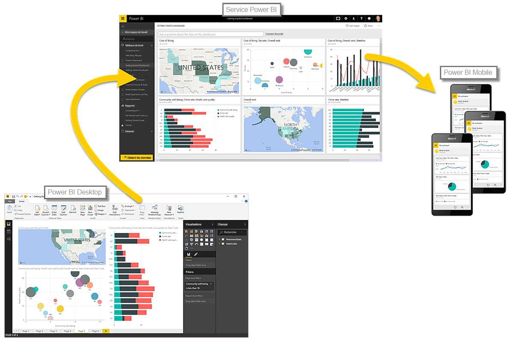

Maintenant que vous connaissez les principes de base de Power BI, passons à des expériences pratiques et à une visite guidée. Cette vidéo vous est présentée par **Will Thompson**, responsable de programme dans l’équipe Power BI de Microsoft. D’autres intervenants invités prendront également la parole un peu plus loin dans ce cours.

Pendant que Will vous expliquera les nombreuses possibilités offertes par Power BI, gardez à l’esprit que l’ensemble des activités et des analyses que vous pouvez effectuer à l’aide de Power BI suivent généralement un flux commun. Le **flux d’activité commun** dans Power BI est le suivant :

* intégrer les données dans Power BI Desktop et créer un rapport ;
* publier dans le service Power BI, où vous créez les visualisations et générez les tableaux de bord ;
* partager vos tableaux de bord avec d’autres personnes, notamment celles qui sont en déplacement ;
* consulter les rapports et les tableaux de bord partagés dans les applications Power BI Mobile et interagir.

Comme nous l’avons vu précédemment, il se peut que vous passiez tout votre temps dans le **service Power BI** à obtenir des données et à créer des tableaux de bord. Cela ne pose aucun problème. Une autre personne de votre équipe peut passer tout leur temps dans **Power BI Desktop**, ce qui est correct. Pour vous aider à cerner l’ensemble des possibilités offertes par Power BI, nous allons tout vous montrer... c’est à vous qu’il reviendra de déterminer comment l’exploiter au mieux.

Laissons maintenant Will nous guider à travers cette expérience. Il convient dans un premier temps de se familiariser avec les blocs de construction de base de Power BI. Ainsi, vous comprendrez mieux comment Power BI transforme les données en rapports et en éléments visuels séduisants.

