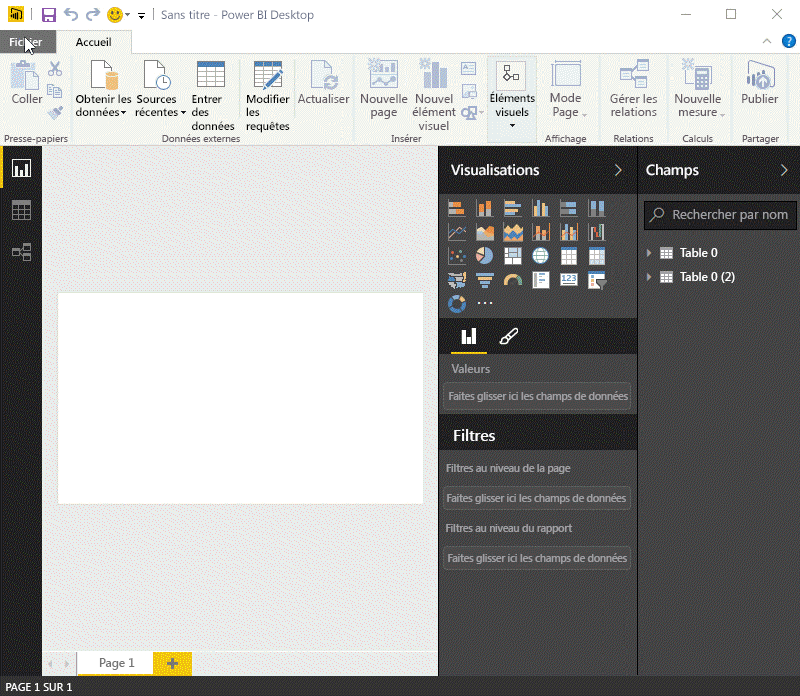
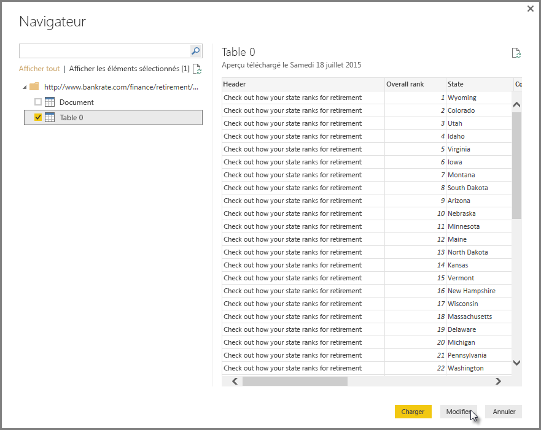
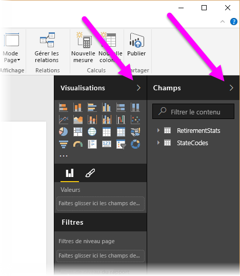
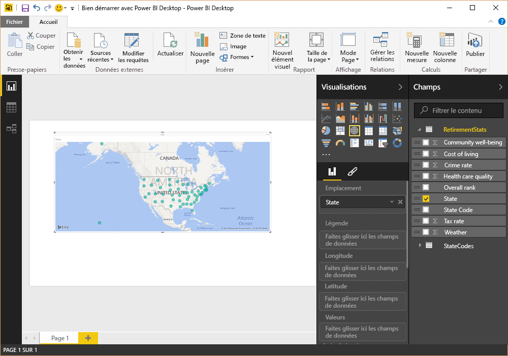
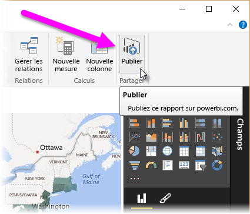
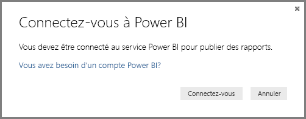
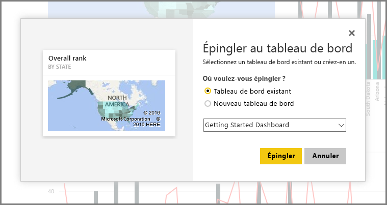

Dans cette rubrique, nous allons examiner d’un peu plus près la façon dont les deux premières parties de Power BI s’articulent :

* Créer un rapport dans **Power BI Desktop**
* Publier le rapport dans le **service Power BI**

Dans Power BI Desktop, commençons par sélectionner **Obtenir des données**. Les différentes sources de données s’affichent, ce qui vous permet d’en choisir une. L’illustration suivante présente la sélection d’une page web en tant que source. Dans la vidéo ci-dessus, Will a sélectionné un classeur **Excel**.

Quelle que soit la source de données que vous choisissez, Power BI se connecte à cette source de données et vous en présente les données disponibles. L’illustration suivante est un autre exemple, qui concerne une page web qui analyse différents États et certaines statistiques intéressantes sur les retraites.

Dans la vue **Rapport** de Power BI Desktop, vous pouvez commencer à générer des rapports.

La vue **Rapport** comporte cinq zones principales :

1. Le ruban, qui affiche les tâches courantes associées aux rapports et aux visualisations.
2. La vue **Rapport** , ou canevas, où les visualisations sont créées et organisées.
3. La zone d’onglets **Pages** le long de la partie inférieure, qui vous permet de sélectionner ou d’ajouter une page de rapport.
4. Le volet **Visualisations** , dans lequel vous pouvez modifier les visualisations, personnaliser les couleurs ou les axes, appliquer des filtres, faire glisser des champs, etc.
5. Le volet **Champs** , à partir duquel vous pouvez faire glisser des éléments de requête et des filtres jusque dans la vue **Rapport** ou dans la zone **Filtres** du volet **Visualisations** .

Il est possible de réduire les volets **Visualisations** et **Champs** en sélectionnant la petite flèche située le long du bord, pour agrandir la vue **Rapport** afin de créer des visualisations intéressantes. Quand vous modifiez des visualisations, vous remarquerez aussi la présence de flèches pointant vers le haut ou vers le bas, ce qui signifie que vous pouvez développer ou réduire cette section.

Pour créer une visualisation, faites glisser simplement un champ de la liste **Champs** dans la vue **Rapport** . Dans le cas présent, faisons glisser le champ State à partir de *RetirementStats*, puis voyons ce qu’il se passe.

Regardez... Power BI Desktop a créé automatiquement une visualisation cartographique, car il a détecté que le champ State contenait des données de géolocalisation.

Maintenant, avançons un peu. Après avoir créé un rapport avec quelques visualisations, nous sommes prêts à le publier dans le service Power BI. Sur le ruban **Accueil** de Power BI Desktop, sélectionnez **Publier**.

Vous êtes invité à vous connecter à Power BI.

Une fois que vous êtes connecté et que le processus de publication est terminé, la boîte de dialogue suivante s’affiche. Vous pouvez sélectionner le lien (sous **Opération réussie !**) pour accéder au service Power BI et consulter le rapport que vous venez de publier.

Le fichier Power BI Desktop que vous venez de publier dans le service s’affiche dans Power BI au moment où vous vous y connectez. Dans l’illustration ci-dessous, le rapport créé dans Power BI Desktop figure dans la section **Rapports**.

Dans ce rapport, vous pouvez cliquer sur l’icône **Épingler** pour épingler cet élément visuel à un tableau de bord. Dans l’illustration suivante, l’icône d’épingle est mise en évidence par un cadre et une flèche de couleur vive.

Dès lors, la boîte de dialogue suivante s’affiche, laquelle permet d’épingler l’élément visuel à un tableau de bord existant ou de créer un tableau de bord.

Les éléments épinglés à partir du rapport s’affichent dans le tableau de bord.

Bien entendu, Power BI vous permet de faire bien plus de choses, comme partager les tableaux de bord que vous créez. Nous aborderons la question du partage plus loin dans ce cours.

Pour l’heure, nous allons examiner une fonctionnalité qui permet de créer automatiquement des tableaux de bord en se connectant simplement à un service cloud, tel que Facebook, Salesforce et bien d’autres.

