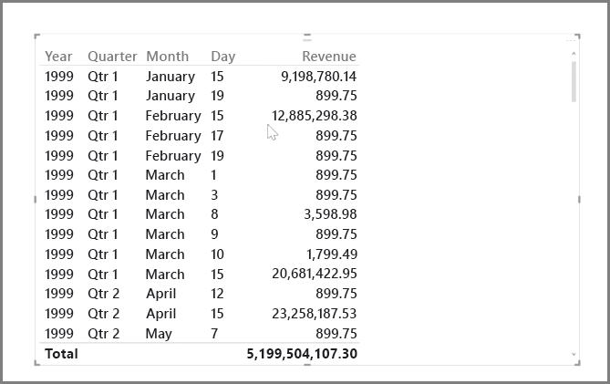
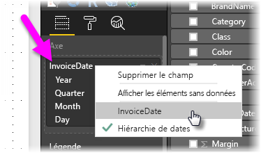

Il est facile d’analyser les données temporelles avec Power BI. Les outils de modélisation dans Power BI Desktop incluent automatiquement les champs générés grâce auxquels vous pouvez explorer les années, trimestres, mois et jours d’un simple clic.  

Quand vous créez une visualisation de la table dans votre rapport à l’aide d’un champ de date, Power BI Desktop inclut automatiquement les répartitions par période de temps. Par exemple, l’unique champ de date dans la table **Date** a été automatiquement fractionné en champs Année, Trimestre, Mois et Jour par Power BI, comme illustré dans l’image suivante.

Par défaut, les visualisations affichent les données au niveau *année* par défaut, mais vous pouvez modifier ce comportement en activant **Explorer au niveau du détail** dans le coin supérieur droit de l’élément visuel.

À présent, quand vous cliquez sur les barres ou les lignes de votre graphique, l’exploration progresse d’un niveau dans la hiérarchie de temps, passant par exemple d’*années* à *trimestres*. Vous pouvez continuer à descendre jusqu’au niveau de hiérarchie le plus granulaire, en l’occurrence *jours*. Pour remonter dans la hiérarchie de temps, cliquez sur **Explorer en remontant d’un niveau** dans le coin supérieur gauche de l’élément visuel.

Vous pouvez également explorer l’ensemble des données affichées dans l’élément visuel, plutôt qu’une période sélectionnée, à l’aide de la double flèche **Explorer tout jusqu’au niveau suivant**, qui se trouve dans le coin supérieur gauche de l’élément visuel.

Tant que votre modèle comporte un champ de date, Power BI génère automatiquement des vues différentes pour différentes hiérarchies de temps.

Pour revenir à des dates spécifiques plutôt qu’à la hiérarchie de dates, cliquez simplement avec le bouton droit sur le nom de colonne dans la zone **Champs** (dans l’image suivante, le nom de la colonne est *InvoiceDate*), puis sélectionnez le nom de colonne dans le menu qui s’affiche, au lieu de **Hiérarchie de dates**. Votre visuel affiche alors les données en fonction des données de cette colonne, sans utiliser la hiérarchie de dates. Vous avez besoin de revenir à la hiérarchie de dates ? Cliquez encore une fois avec le bouton droit et sélectionnez **Hiérarchie de dates** dans le menu.

## Étapes suivantes
**Félicitations !** Vous avez terminé cette section du cours **Formation guidée** pour Power BI. La *modélisation* des données n’ayant plus de secret pour vous, vous pouvez vous pencher sur le contenu amusant de la section suivante : **Visualisations**.

Comme mentionné précédemment, la formation dispensée dans ce cours suit le flux de travail courant dans Power BI :

* intégrer les données dans **Power BI Desktop** et créer un rapport ;
* Publier sur le service Power BI, où vous créez des **visualisations** et générez des tableaux de bord.
* **Partager** vos tableaux de bord, notamment avec les personnes en déplacement.
* Afficher les rapports et tableaux de bord partagés dans les applications **Power BI Mobile** et interagir avec eux.

Même si vous n’effectuez pas tout ce travail vous-même, vous allez *comprendre* comment ces tableaux de bord ont été créés, et comment ils ont été connectés aux données... Une fois que vous aurez terminé ce cours, vous serez en mesure d’en créer un vous-même.

Rendez-vous à la section suivante !

