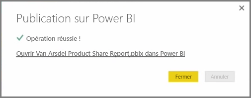

La publication de vos rapports dans le service Power BI est simple et rapide.

Une fois la création de votre rapport terminée dans **Power BI Desktop**, sélectionnez simplement le bouton **Publier** sous l’onglet **Accueil** de Power BI Desktop. Le processus commence alors.

Votre rapport et vos données, notamment les visualisations, les requêtes et les mesures personnalisées, sont regroupés et téléchargés vers le service Power BI.

> REMARQUE : Il est courant de faire référence aux rapports Power BI Desktop en tant que fichiers **.pbix**, ce qui correspond à l’extension qui leur est donnée dans Windows.
> 
> 

Une fois le chargement terminé, une boîte de dialogue vous indique que le processus de publication a réussi, et un lien est fourni dans cette boîte de dialogue pour vous permettre d’accéder directement, dans un navigateur web, à votre rapport dans le service Power BI.

Et c’est tout. Il est facile de publier des rapports à partir de Power BI Desktop dans le service Power BI.

