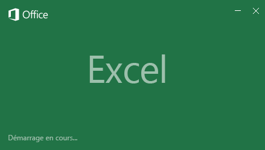

Bienvenue dans la section**Power BI et Excel** du cours **Formation guidée** pour Power BI.

Vous avez très probablement déjà utilisé **Excel**. Vous avez peut-être utilisé Excel pour créer ou afficher des rapports, ou pour créer des graphiques en secteurs ou d’autres éléments visuels. Vous avez peut-être même utilisé **Power Pivot** ou **Power Query** pour créer des solutions qui étaient un peu plus techniques. Dans ce cas, vous serez tout à fait à l’aise dans Power BI et vos classeurs y seront également à leur place.

Cette section vous montre simplement combien il est facile de placer des classeurs Excel dans Power BI et illustre l’excellent partenariat que forment Power BI et Excel.

## Présentation de l’utilisation de données Excel dans Power BI
*Regarder une présentation du fonctionnement conjoint d’Excel et du service Power BI*

Avec Power BI, il est facile d’obtenir vos données Excel dans Power BI.

Les rubriques suivantes vous guident tout au long du chargement d’un classeur Excel comprenant un tableau simple dans Power BI. Vous allez ensuite découvrir comment charger des classeurs créés à l’aide des fonctionnalités de modélisation de données BI et de création de rapport plus avancées d’Excel, telles que Power Pivot et Power View.

Vous découvrirez également certains avantages que présente l’enregistrement de vos fichiers de classeur Excel dans OneDrive Entreprise. Quand vous vous connectez à des fichiers Excel sur OneDrive à partir de Power BI, vos rapports et tableaux de bord dans Power BI sont mis à jour et actualisés automatiquement quand vous apportez des modifications à votre travail et que vous l’enregistrez.

