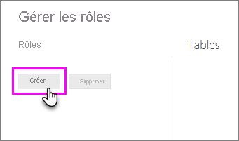

## Définir des rôles et des règles dans Power BI Desktop
Vous pouvez définir des rôles et des règles dans Power BI Desktop. Quand vous publiez sur Power BI, les définitions de rôles sont aussi publiées.

Pour définir des rôles de sécurité, effectuez les étapes suivantes.

1. Importez les données dans votre rapport Power BI Desktop ou configurez une connexion DirectQuery.
   
   > [!NOTE]
   > Vous ne pouvez pas définir de rôles dans Power BI Desktop pour les connexions actives Analysis Services. Vous devez le faire dans le modèle Analysis Services.
   > 
   > 
1. Sélectionnez l’onglet **Modélisation**.
2. Sélectionnez **Gérer les rôles**.
   
   
4. Sélectionnez **Créer**.
   
   
5. Donnez un nom au rôle. 
6. Sélectionnez la table à laquelle vous souhaitez appliquer une règle DAX.
7. Entrez les expressions DAX. Cette expression doit renvoyer vrai ou faux. Par exemple : [ID d’entité] = « Valeur ».
   
   > [!NOTE]
   > Vous pouvez utiliser *username()* dans cette expression. N’oubliez pas que *username()* est au format *DOMAINE\nom_utilisateur* dans Power BI Desktop. Dans le service Power BI et Power BI Report Server, c’est le nom d’utilisateur principal (UPN) de l’utilisateur qui est employé. Vous pouvez également utiliser *userprincipalname()*, qui retourne systématiquement l’utilisateur au format de son nom d’utilisateur principal (*username@contoso.com*).
   > 
   > 
   
   
8. Après avoir créé l’expression DAX, vous pouvez activer la case à cocher au-dessus de la zone d’expression pour valider l’expression.
   
   
9. Sélectionnez **Enregistrer**.

Vous ne pouvez pas attribuer d’utilisateurs à un rôle dans Power BI Desktop. Vous devez le faire dans le service Power BI. Dans Power BI Desktop, vous pouvez activer la sécurité dynamique en utilisant les fonctions DAX *username()* ou *userprincipalname()* et en configurant les relations appropriées. 

