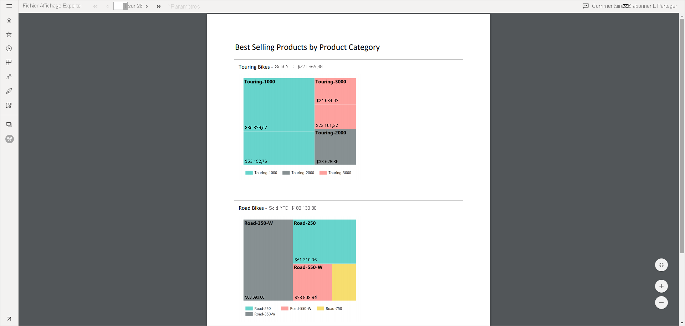
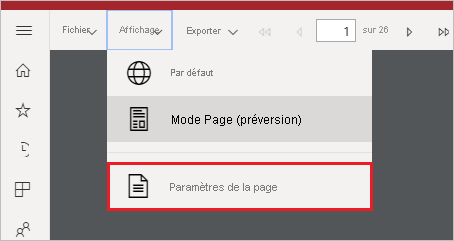

# Définir des vues de rapport pour les rapports paginés dans le service Power BI

[!INCLUDE [applies-to](../includes/applies-to.md)] [!INCLUDE [yes-service](../includes/yes-service.md)] [!INCLUDE [yes-paginated](../includes/yes-paginated.md)] [!INCLUDE [yes-premium](../includes/yes-premium.md)] [!INCLUDE [no-desktop](../includes/no-desktop.md)] 

Quand vous rendez un rapport paginé dans le service Power BI, la vue par défaut est basée sur HTML et elle est interactive. La nouvelle option Mode Page est une autre vue de rapport pour les formats de page fixes comme le format PDF.

**Vue interactive par défaut**

**Mode Page**

En mode Page, le rapport rendu est différent de la vue par défaut. Certaines propriétés et certains concepts des rapports paginés s’appliquent seulement aux pages fixes. La vue est similaire à ce que vous voyez quand le rapport est imprimé ou exporté. Vous pouvez néanmoins encore modifier certains éléments, comme les valeurs de paramètres, mais elle n’a pas d’autres fonctionnalités interactives comme le tri des colonnes et les boutons de bascule.

Le mode Page prend en charge toutes les fonctionnalités prises en charge par la visionneuse PDF du navigateur, comme Zoom avant, Zoom arrière et Ajuster à la page.

## Basculer en mode Page

Quand vous ouvrez un rapport paginé, il est rendu par défaut dans une vue interactive. Si le rapport a des paramètres, sélectionnez des paramètres, puis visualisez le rapport.

1. Sélectionnez **Afficher** dans la barre d’outils > **Mode Page**.

    

2. Vous pouvez modifier les paramètres du mode Page en sélectionnant **Paramètres de la page** dans menu **Affichage** de la barre d’outils. 

    
    
    La boîte de dialogue **Paramètres de la page** contient des options permettant de définir la **Taille de la page** et l’**Orientation** pour le mode Page. Une fois les paramètres de page appliqués, les mêmes options s’appliquent quand vous imprimez la page ultérieurement.
   
    

3. Pour revenir à la vue interactive, sélectionnez **Par défaut** dans la zone de liste déroulante **Affichage**.

## Navigateurs pris en charge

Le mode page est pris en charge dans les navigateurs Google Chrome et Microsoft Edge. Vérifiez que l’affichage des PDF est activé dans le navigateur. C’est l’option par défaut pour ces navigateurs.

Le mode Page n’est pas pris en charge dans Internet Explorer et dans Safari : l’option est donc désactivée. Il n’est pas non plus pris en charge dans les navigateurs sur les appareils mobiles, ni dans les applications mobiles Power BI natives.  

## Étapes suivantes

- [Afficher un rapport paginé dans le service Power BI](../consumer/paginated-reports-view-power-bi-service.md)
- [Présentation des rapports paginés dans Power BI Premium](paginated-reports-report-builder-power-bi.md)
