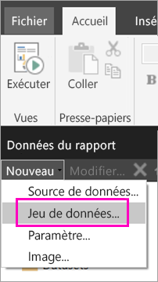
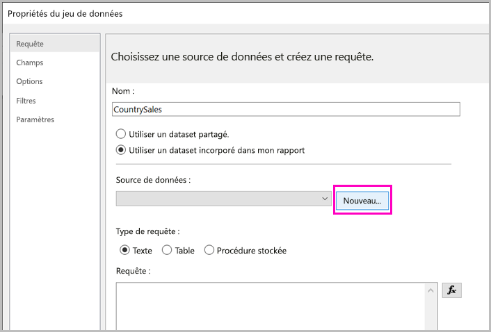
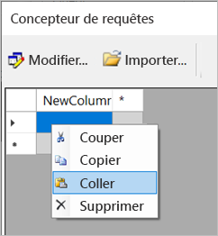
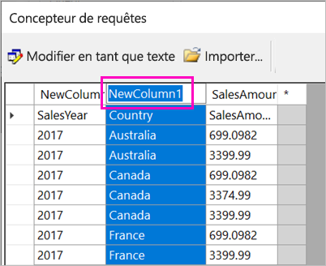
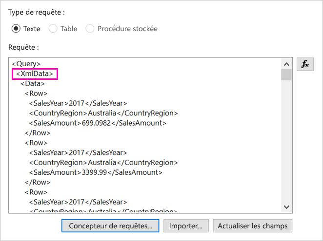
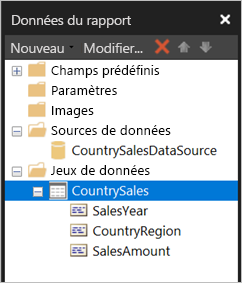

# <a name="enter-data-directly-in-a-paginated-report-in-report-builder---power-bi"></a>Entrer des données directement dans un rapport paginé dans le Générateur de rapports - Power BI

Cet article traite de la nouvelle version de Microsoft Power BI Report Builder, et plus particulièrement d’une fonctionnalité qui vous permet d’entrer des données directement dans un rapport RDL sous forme de jeu de données incorporé.  Cette fonctionnalité est similaire à Power BI Desktop. Vous pouvez taper des données directement dans un jeu de données dans votre rapport ou les coller dans un autre programme tel que Microsoft Excel. Si vous créez un jeu de données en entrant des données, vous pouvez l’utiliser comme n’importe quel autre jeu de données incorporé dont vous êtes l’auteur. Vous pouvez également ajouter plusieurs tables et en utiliser une comme filtre pour l’autre. Cette fonctionnalité est particulièrement utile pour les petits jeux de données statiques dont vous pouvez avoir besoin dans votre rapport, comme des paramètres de rapport.
 
## <a name="prerequisites"></a>Prérequis

- Pour entrer des données directement dans un rapport paginé, [téléchargez et installez Power BI Report Builder](https://aka.ms/pbireportbuilder). 
- Pour enregistrer votre rapport paginé dans le service Power BI, vous devez disposer d’un [compte Power BI Pro](../fundamentals/service-self-service-signup-for-power-bi.md) et avoir accès en écriture à un espace de travail accessible dans une [capacité Power BI Premium](../admin/service-premium-what-is.md).
- Pour enregistrer votre rapport paginé sur un serveur de rapports, vous devez être autorisé à [modifier le fichier RsReportServer.config](#upload-the-paginated-report-to-a-report-server).

## <a name="create-a-data-source-and-dataset"></a>Créer une source de données et un jeu de données

Après avoir téléchargé et installé le Générateur de rapports, procédez de la même façon que pour ajouter une source de données et un jeu de données incorporés à votre rapport. Dans la procédure suivante, sous **Sources de données** vous voyez une nouvelle option : **Entrer des données**.  Cette source de données ne doit être configurée qu’une seule fois dans un rapport. Après cela, vous pouvez créer plusieurs tables de données entrées sous forme de jeux de données distincts utilisant tous la même source de données.

1. Dans le volet **Données du rapport**, sélectionnez **Nouveau** > **Jeu de données**.

    

1. Dans la boîte de dialogue **Propriétés du dataset**, sélectionnez **Utiliser un dataset incorporé dans mon rapport**.

1. En regard de **Source de données**, sélectionnez **Nouveau**.

    

1. Dans la boîte de dialogue **Propriétés de la source de données**, sélectionnez **Utiliser une connexion incorporée dans mon rapport**.
2. Dans la zone **Sélectionner un type de connexion**, sélectionnez **ENTRER DES DONNÉES** > **OK**.

    

1. De retour dans la boîte de dialogue **Propriétés du dataset**, sélectionnez **Concepteur de requêtes**.
2. Dans le volet **Concepteur de requêtes**, cliquez avec le bouton droit et collez vos données dans la table.

    

1. Pour définir les noms des colonnes, double-cliquez sur chaque **NewColumn** et tapez le nom de la colonne.

    

1. Si la première ligne contient des en-têtes de colonne issus des données d’origine, cliquez avec le bouton droit et supprimez-les.
    
9. Par défaut, le type de données de chaque colonne est Chaîne. Pour changer le type de données, cliquez avec le bouton droit sur l’en-tête de colonne > **Modifier le type**, puis choisissez un autre type de données (comme Date ou Flottant).

    

1. Quand vous avez terminé de créer la table, sélectionnez **OK**.  

    La requête générée est la même que celle obtenue avec une source de données XML. En coulisses, nous utilisons XML comme fournisseur de données.  Nous l’avons transformé pour prendre également en charge ce scénario.

    

12. Dans la boîte de dialogue **Propriétés du dataset**, sélectionnez **OK**.

13. Votre source de données et votre jeu de données apparaissent dans le volet **Données du rapport**.

    

Vous pouvez utiliser votre jeu de données comme base pour les visualisations de données dans votre rapport. Vous pouvez également ajouter un autre jeu de données et utiliser la même source de données pour celui-ci.

## <a name="design-the-report"></a>Concevoir le rapport

Maintenant que vous disposez d’une source de données et d’un jeu de données, vous êtes prêt à créer votre rapport. La procédure suivante crée un rapport simple basé sur les données de la section précédente.

1. Dans le menu **Insertion**, sélectionnez **Table** > **Assistant Table**.

    :::image type="content" source="media/paginated-reports-enter-data/paginated-table-wizard.png" alt-text="Capture d’écran de la sélection de l’option Assistant Table.":::

1. Sélectionnez le jeu de données que vous venez de créer > **Suivant**.

    :::image type="content" source="media/paginated-reports-enter-data/paginated-choose-dataset.png" alt-text="Capture d’écran de la boîte de dialogue Choisir un dataset.":::

2.  Dans la page Organiser les champs, faites glisser les champs de regroupement de la zone **Champs disponibles** vers la zone **Groupes de lignes**. Dans cet exemple :

    - CountryRegion
    - SalesYear

3.  Faites glisser les champs que vous souhaitez agréger de la zone **Champs disponibles** vers la zone **Valeurs**. Dans cet exemple :

    - SalesAmount

    Par défaut, Report Builder additionne les champs de la zone **Valeurs**, mais vous pouvez choisir une autre agrégation.

    :::image type="content" source="media/paginated-reports-enter-data/paginated-select-aggregation.png" alt-text="Capture d’écran des différentes agrégations disponibles.":::
 
1. Sélectionnez **Suivant**.
4.  Dans la page **Choisir la disposition**, conservez tous les paramètres par défaut, mais désactivez **Développer/Réduire les groupes**. Le développement et la réduction des groupes sont souvent très utiles, mais cette fois nous souhaitons voir toutes les données.

5.  Sélectionnez **Suivant** > **Terminer**. La table apparaît sur le canevas de conception.

    :::image type="content" source="media/paginated-reports-enter-data/paginated-design-view-matrix.png" alt-text="Capture d’écran du rapport dans la Vue design.":::

### <a name="run-the-report"></a>Exécuter le rapport

Pour voir les valeurs réelles et un aperçu du rapport, vous devez l’exécuter.

1. Sélectionnez **Exécuter** dans le ruban **Accueil**.

    :::image type="content" source="media/paginated-reports-enter-data/paginated-run-report.png" alt-text="Capture d’écran de la sélection de l’option Exécuter dans le ruban Accueil.":::

    Vous voyez maintenant les valeurs. La matrice comporte plus de lignes que dans la Vue design !  Vous pouvez mettre en forme la page ou décider d’utiliser les paramètres par défaut avant d’enregistrer sur votre ordinateur local ou de publier sur le service.

1. Pour voir à quoi ressemblera votre rapport quand vous l’imprimerez, sélectionnez **Mode Impression**.

    :::image type="content" source="media/paginated-reports-enter-data/paginated-select-print.png" alt-text="Capture d’écran de la sélection du mode Impression.":::

    À présent, vous le voyez tel qu’il apparaîtra sur une page imprimée.

    :::image type="content" source="media/paginated-reports-enter-data/paginated-print-layout.png" alt-text="Capture d’écran du rapport en mode Impression.":::

## <a name="upload-the-paginated-report-to-the-power-bi-service"></a>Charger le rapport paginé sur le service Power BI

Les rapports paginés étant désormais pris en charge dans le service Power BI, vous pouvez charger votre rapport paginé sur une capacité Premium. Pour plus d’informations, consultez [Charger un rapport paginé](paginated-reports-save-to-power-bi-service.md).

## <a name="upload-the-paginated-report-to-a-report-server"></a>Charger le rapport paginé sur un serveur de rapports

Vous pouvez également charger votre rapport paginé sur un serveur de rapports Power BI Report Server ou SQL Server Reporting Services 2016 ou 2017. Avant de procéder, vous devez ajouter l’élément suivant à votre fichier RsReportServer.config comme extension de données supplémentaire. Sauvegardez votre fichier RsReportServer.config avant d’effectuer le changement, au cas où vous rencontriez des problèmes.

```xml
<Extension Name="ENTERDATA" Type="Microsoft.ReportingServices.DataExtensions.XmlDPConnection,Microsoft.ReportingServices.DataExtensions">
    <Configuration>
        <ConfigName>ENTERDATA</ConfigName>
    </Configuration>
</Extension>
```

Une fois le changement apporté, voici à quoi doit ressembler la liste des fournisseurs de données dans le fichier de configuration :


Voilà, vous pouvez désormais publier des rapports qui utilisent cette nouvelle fonctionnalité sur votre serveur de rapports.

## <a name="next-steps"></a>Étapes suivantes

- [Présentation des rapports paginés dans Power BI Premium](paginated-reports-report-builder-power-bi.md)
- [Présentation de Power BI Report Server](../report-server/get-started.md)
