# Créer un rapport paginé sur la base d’un jeu de données partagé Power BI

[!INCLUDE [applies-to](../includes/applies-to.md)] [!INCLUDE [yes-service](../includes/yes-service.md)] [!INCLUDE [yes-paginated](../includes/yes-paginated.md)] [!INCLUDE [yes-premium](../includes/yes-premium.md)] [!INCLUDE [yes-desktop](../includes/yes-desktop.md)] 

Vous pouvez utiliser un jeu de données créé dans Power BI Desktop comme source de données pour des rapports paginés du générateur de rapports Power BI. Imaginez ce scénario : Vous avez créé un rapport de Power BI dans Power BI Desktop. Vous avez passé beaucoup de temps à concevoir le modèle de données, créé un beau rapport Power BI avec toutes sortes d’excellents éléments visuels. Votre rapport possède une matrice avec de nombreuses lignes. vous devez donc les faire défiler pour les afficher tous. Les lecteurs de votre rapport veulent un rapport qu’ils peuvent imprimer, qui affiche toutes les lignes de cette matrice. Un rapport paginé Power BI peut le faire : imprimer une table ou une matrice qui s’exécute sur plusieurs pages, avec des en-têtes et des pieds de page et une mise en page parfaite que vous concevez vous-même. Il complète le rapport de Power BI Desktop. Vous souhaitez qu’ils soient basés sur les mêmes données, aucune incohérence, afin d’utiliser le même jeu de données.

Le jeu de données ne doit pas nécessairement se trouver dans un espace de travail d’une capacité Premium, et vous n’avez pas besoin d’être membre de cet espace de travail. Vous devez simplement disposer de [l’autorisation Build](../connect-data/service-datasets-build-permissions.md) pour le jeu de données. Pour publier votre rapport paginé, vous avez besoin d’une licence Power BI Pro. Vous avez également besoin d’un rôle contributeur au minimum pour un espace de travail dans une capacité Premium.

## Ce dont vous avez besoin

Voici une liste de ce dont vous avez besoin et ce dont vous n’avez pas besoin pour utiliser un jeu de données partagé dans un générateur de rapports Power BI.

- Générateur de rapports Power BI. [Télécharger et installer le générateur de rapports Power BI](https://aka.ms/pbireportbuilder).
- Pour accéder à un jeu de données Power BI, vous devez disposer de l’autorisation Build pour le jeu de données. En savoir plus sur [l’autorisation de génération](../connect-data/service-datasets-build-permissions.md).
- Vous n’avez pas besoin d’une licence Power BI Pro pour créer un rapport paginé dans le générateur de rapports. 
- Pour publier votre rapport paginé, vous avez besoin d’une licence Power BI Pro. Vous avez également besoin d’un rôle contributeur au minimum pour un espace de travail dans une capacité Premium. 
- Facultatif : Si vous souhaitez suivre cet article, téléchargez le fichier exemple [Retail Analysis sample.pbix](https://download.microsoft.com/download/9/6/D/96DDC2FF-2568-491D-AAFA-AFDD6F763AE3/Retail%20Analysis%20Sample%20PBIX.pbix) de Power BI Desktop, ouvrez-le dans Power BI Desktop et ajoutez une table avec un grand nombre de colonnes. Dans le volet **Format**, désactivez **Totals**. Publiez-le ensuite dans un espace de travail du service Power BI.

    

## Se connecter au jeu de données Power BI

1. Ouvrez le Générateur de rapports Power BI.
1. Sélectionnez **Se connecter** dans le coin supérieur droit du générateur de rapports pour vous connecter à votre compte Power BI.
1. Dans le volet des données de rapport, sélectionnez **Nouveau** > **Connexion de jeu de données Power BI**.

    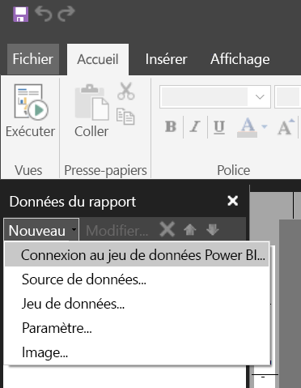

    > [!NOTE]
    > Vous ne pouvez pas créer la source de données ou un jeu de données pour un jeu de données Power BI à l’aide des assistants de table, de matrice ou de graphique du générateur de rapports. Une fois que vous les avez créés, vous pouvez utiliser les assistants pour créer des tables, des matrices ou des graphiques basés sur ces derniers.

1. Recherchez ou naviguez jusqu’au jeu de données ou à l’espace de travail où il réside > **Sélectionner**.
    Le générateur de rapports remplit le nom du jeu de données.

    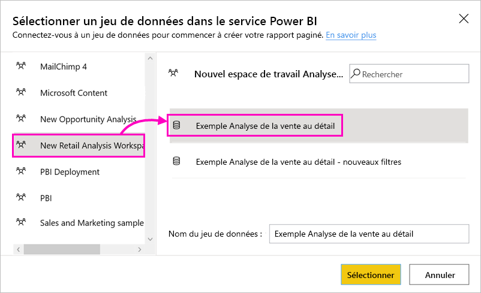
    
1. Le jeu de données est listé sous Sources de données dans le volet des données de rapport.

    

    N’oubliez pas que vous pouvez vous connecter à plusieurs jeux de données Power BI et à d’autres sources de données dans le même rapport paginé.

## Obtenir la requête DAX pour le jeu de données

Lorsque vous souhaitez que les données présentes dans votre rapport Power BI et dans votre rapport du générateur de rapports soient identiques, il ne suffit pas de vous connecter au jeu de données. Vous avez également besoin de la requête générée sur ce jeu de données.

### Vidéo : Obtenir la requête DAX

Dans la vidéo suivante, Chris Finlan montre comment obtenir la requête DAX dont vous avez besoin pour votre rapport paginé.

<iframe width="400" height="450" src="https://www.youtube.com/embed/NfoOK4QRkhI" frameborder="0" allowfullscreen></iframe>

### Étapes à suivre pour obtenir la requête DAX

Voici à présent les étapes à suivre pour obtenir la requête.

1. Ouvrez le rapport Power BI (.pbix) dans Power BI Desktop.
1. Vérifiez que vous disposez d’une table dans votre rapport contenant toutes les données que vous souhaitez dans votre rapport paginé. La table doit répondre à ces deux exigences :
    - Il doit s’agir d’une table plate, et non d’une matrice ou d’un autre visuel. S’il ne s’agit pas d’une table, effectuez une conversion en table, suivez les étapes de l’Analyseur de performances ci-après, puis reconvertissez-la en visuel de votre choix.
    - Pour vos champs numériques, vous devez utiliser des *mesures prédéfinies*. Ils ont un symbole de calculatrice affiché en regard de chacun d’eux. Apprenez-en plus sur la [création de mesures](../transform-model/desktop-measures.md). 

        

1. Sur le ruban **Affichage**, sélectionnez **Analyseur de performances**.

    

1. Dans le volet **Analyseur de performances**, sélectionnez **Démarrer l’enregistrement**, puis **Actualiser les éléments visuels**.

    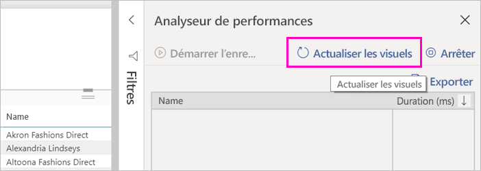

1. Développez le signe plus ( **+** ) à côté du nom de la table, puis sélectionnez **Copier une requête**. La requête est la formule DAX dont vous avez besoin pour le jeu de données dans le générateur de rapports Power BI.

    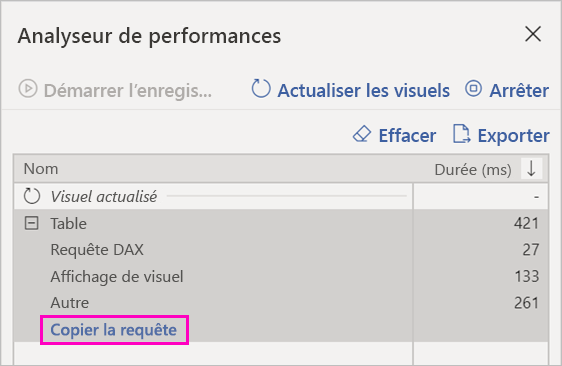

## Créer le jeu de données avec la requête

1. Retournez au générateur de rapports Power BI.
1. Faites un clic droit sur le jeu de données sous **Source de données**, puis sélectionnez **Ajouter un jeu de données**.

    

1. Dans les propriétés du jeu de données, attribuez-lui un nom et sélectionnez **Concepteur de requêtes**.

4. Vérifiez que **DAX** est sélectionné, puis désélectionnez l’icône **Mode Création**.

    

1. Dans la zone supérieure, collez la requête que vous avez copiée depuis Power BI Desktop.

    > [!NOTE]
    > Si votre requête contient la fonction TOPN, supprimez-la de votre requête.

1. Sélectionnez **Exécuter la requête** (le point d’exclamation rouge, !) pour vous assurer que votre requête fonctionne. 

    

    Les résultats de la requête s’affichent dans la zone inférieure.

    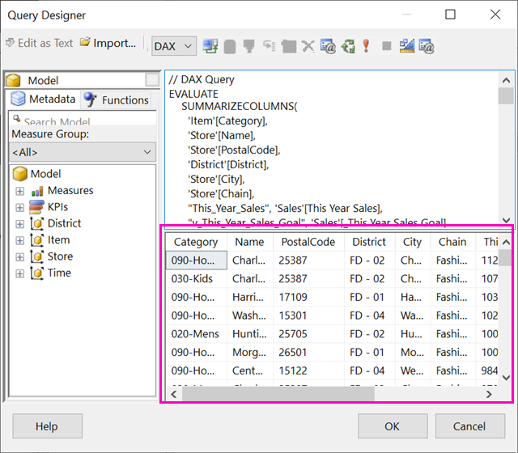

1. Sélectionnez **OK**.

    Vous voyez votre requête dans la fenêtre **Requête** de la boîte de dialogue **Propriétés du jeu de données**.

    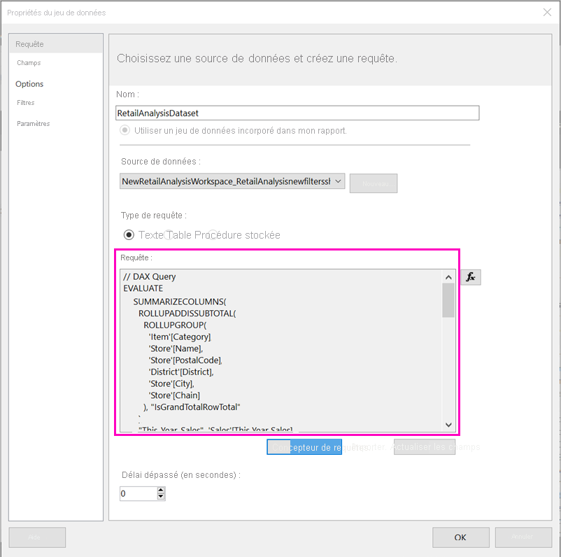

1. Sélectionnez **OK**.

    Vous voyez maintenant votre nouveau jeu de données avec une liste de ses champs dans le volet des données de rapport.

    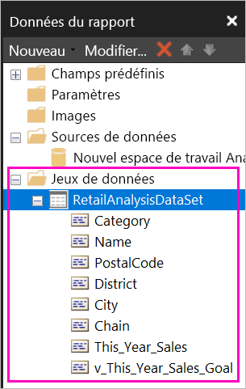

## Créer une table dans le rapport

Un moyen rapide de créer une table consiste à utiliser l’Assistant Table.

1. Dans le ruban **Insertion**, sélectionnez **Table** > **Assistant Table**.

    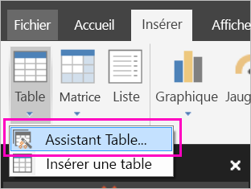

1. Choisissez le jeu de données que vous avez créé avec la requête DAX > **Suivant**.

    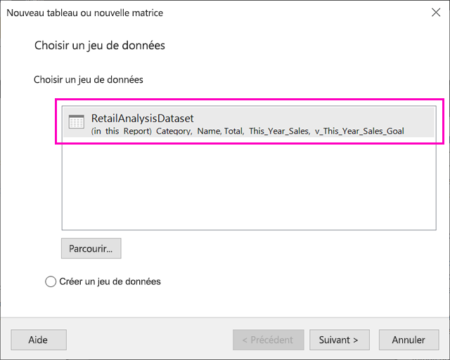

1. Pour créer un tableau à deux dimensions, sélectionnez les champs souhaités dans les **champs disponibles**. Vous pouvez sélectionner plusieurs champs à la fois en sélectionnant le premier que vous souhaitez, en maintenant la touche Maj enfoncée et en sélectionnant le dernier.

    

1. Faites glisser les champs vers la zone **Valeurs** > **Suivant**.

    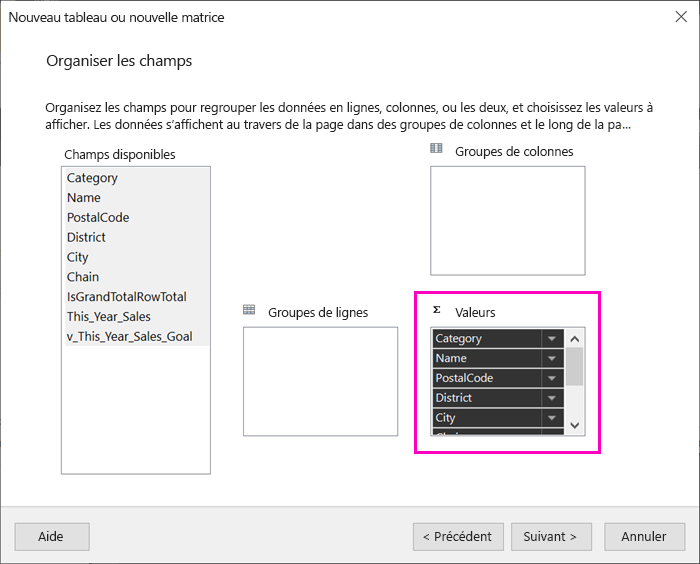

1. Choisissez les options de disposition souhaitées > **Suivant**.

1. Sélectionnez **Terminer**.
    Vous voyez votre table en mode Conception.

    

1. Sélectionnez **Cliquer pour ajouter un titre** et ajoutez un titre.

1. Sélectionnez **Exécuter** pour afficher un aperçu de votre rapport.

    

1. Sélectionnez **Disposition d’impression** pour afficher l’apparence de votre rapport. 

    Cette mise en page du rapport nécessite un travail. Il contient 54 pages, car les colonnes et les marges engendrent une table de deux pages de largeur.

    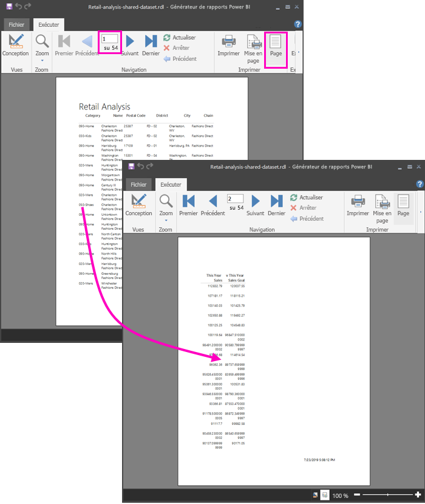

## Mettre en forme le rapport

Vous avez plusieurs options de mise en forme pour que votre tableau tienne sur une seule page. 

1. Vous pouvez affiner les marges de page dans le volet Propriétés. Si vous ne voyez pas le volet Propriétés, dans le ruban **Affichage**, activez la case à cocher **Propriétés**.

1. Sélectionnez le rapport, et non la table ou le titre.
1. Dans le volet **Propriétés du rapport**, sous **Page**, développez **Marges** et remplacez-les par **0,75 pouce**.

    

1. Vous pouvez également rendre les colonnes plus étroites. Sélectionnez la bordure de la colonne et faites glisser le côté droit vers la gauche.

    

1. Une autre option consiste à s’assurer que les valeurs numériques sont correctement mises en forme. Sélectionnez une cellule avec une valeur numérique. 
    > [!TIP]
    > Vous pouvez mettre en forme plusieurs cellules à la fois en maintenant la touche Maj enfoncée tout en sélectionnant les autres cellules.

    

1. Sur le ruban **Accueil**, dans la section **Nombre**, remplacez le format **Par défaut** par un format numérique tel que **Devise**.

    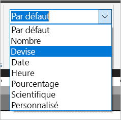

1. Remplacez le style **Espace réservé** par **Exemples de valeurs** pour afficher la mise en forme dans la cellule. 

    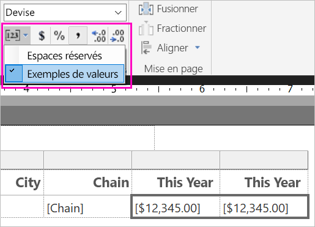

1. Le cas échéant, dans la section **Nombre**, diminuez les décimales pour économiser de l’espace.

### Récupération des pages vides

Même si vous avez rendu les marges et les colonnes de table plus étroites, vous risquez de vous retrouver avec des pages vierges. Pourquoi ? C’est mathématique. 

Lorsque vous ajoutez les marges de page que vous définissez, en plus de la largeur du *corps* du rapport, elle doit être inférieure à la largeur du format du rapport.

Par exemple, imaginons que votre rapport a un format 8,5 pouces x 11 pouces et que vous avez défini les marges latérales sur 0,75 pouce chacune. Les deux marges forment 1,5 pouce ensemble, de sorte que la largeur du corps doit être inférieure à 7 pouces.

1. Sélectionnez le bord droit de la surface de conception du rapport, puis faites-le glisser afin qu’il soit inférieur au nombre souhaité sur la règle. 

    > [!TIP]
    > Vous pouvez le définir de manière plus précise dans les propriétés du **corps**. Sous **Taille**, définissez la propriété **largeur**.

    

1. Sélectionnez **Exécuter** pour afficher un aperçu de votre rapport et vous assurer que vous avez bien éliminé les pages vides. Ce rapport ne contient désormais 26 pages, et non plus 54 comme au départ. Opération réussie.

    

## Considérations et limitations 

- Pour les jeux de données qui utilisent une connexion active à Analysis Services, vous pouvez vous connecter directement à l’aide de la connexion Analysis Services sous-jacente au lieu d’un jeu de données partagé.
- Si vous voulez utiliser un jeu de données Power BI qui utilise DirectQuery dans Power BI Report Builder, le jeu de données doit inclure une mesure, même si vous ne prévoyez pas d’utiliser la mesure dans votre rapport. Sans la mesure, le jeu de données ne retourne pas les données correctes dans les résultats.
- Les jeux de données avec des mentions Promues ou Certifiées apparaissent dans la liste des jeux de données disponibles, mais ils ne sont pas marqués comme tels. 
- Vous ne pouvez pas incorporer des rapports paginés basés sur des jeux de données partagés Power BI dans le scénario « App Owns Data ».

## Étapes suivantes

- [Présentation des rapports paginés dans Power BI Premium](paginated-reports-report-builder-power-bi.md)
