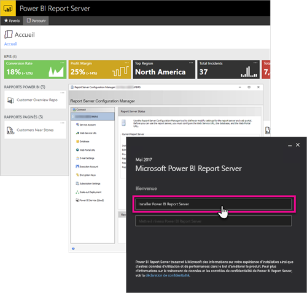

# Présentation du Manuel de l’administrateur, Power BI Report Server
Bienvenue dans le Manuel de l’administrateur pour Power BI Report Server, un emplacement local destiné au stockage et à la gestion de vos rapports Power BI mobiles et paginés.

Ce manuel explique les concepts relatifs à la planification, au déploiement et à la gestion de Power BI Report Server.

## Installation et migration
Vous allez devoir installer Power BI Report Server pour pouvoir commencer à l’utiliser. Nous disposons d’informations qui vous permettront de gérer cette tâche.

Avant de d’installer, de mettre à niveau ou de migrer vers Power BI Report Server, examinons la [configuration requise](system-requirements.md) pour le serveur de rapports.

### Installation
Si vous déployez un nouveau Power BI Report Server, les documents suivants peuvent vous aider. Une procédure de démarrage rapide vous permet de vous lancer immédiatement. Pour plus de détails, vous pouvez également consulter le document relatif à l’installation.

* [Démarrage rapide : installer Power BI Report Server](quickstart-install-report-server.md)
* [Installer Power BI Report Server](install-report-server.md)

### Migration
Il n’existe pas de mise à niveau en place pour SQL Server Reporting Services. Si vous disposez d’une instance SQL Server Reporting Services existante que vous souhaitez remplacer par Power BI Report Server, vous devez effectuer une migration. D’autres raisons peuvent également justifier une migration. Pour plus de détails, voir le document relatif à la migration.

[Migrer une installation de serveur de rapports](migrate-report-server.md)

## Configuration de votre serveur de rapports
Lors de la configuration de votre serveur de rapports, vous disposez de nombreuses options. Allez-vous utiliser SSL ? Configurez-vous un serveur de courrier ? Souhaitez-vous une intégration avec le service Power BI pour pouvoir épingler des visualisations ?

L’essentiel de la configuration doit s’effectuer dans le Gestionnaire de configuration du serveur de rapports. Pour plus de détails, voir la documentation du [Gestionnaire de configuration](https://docs.microsoft.com/sql/reporting-services/install-windows/reporting-services-configuration-manager-native-mode).

## Sécurité
La sécurité et la protection sont importantes pour toute organisation. Pour découvrir l’authentification, l’autorisation, les rôles et les permissions, voir la documentation relative à la [sécurité](https://docs.microsoft.com/sql/reporting-services/security/reporting-services-security-and-protection).

## Étapes suivantes
[Démarrage rapide : installer Power BI Report Server](quickstart-install-report-server.md)  
[Trouver la clé de produit de votre serveur de rapports](find-product-key.md)  
[Installer Power BI Desktop optimisé pour Power BI Report Server](install-powerbi-desktop.md)  
[Installer le Générateur de rapports](https://docs.microsoft.com/sql/reporting-services/install-windows/install-report-builder)  
[Télécharger SQL Server Data Tools (SSDT)](http://go.microsoft.com/fwlink/?LinkID=616714)

D’autres questions ? [Essayez d’interroger la communauté Power BI](https://community.powerbi.com/)

