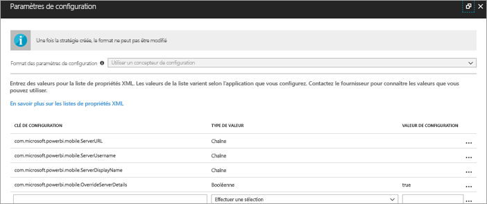
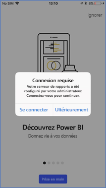

# Configurer à distance l’accès d’une application mobile iOS Power BI à un serveur de rapports

Dans cet article, découvrez comment utiliser l’outil MDM de votre organisation pour configurer l’accès de l’application mobile iOS Power BI à un serveur de rapports. Pour le configurer, les administrateurs informatiques créent une stratégie de configuration d’application avec les informations nécessaires à envoyer (par push) à l’application. 

 Une fois la connexion au serveur de rapports déjà configurée, les utilisateurs d’application mobile Power BI iOS peuvent se connecter plus facilement au serveur de rapports de leur organisation. 

## Créer la stratégie de configuration d’application dans l’outil MDM 

En tant qu’administrateur, utilisez les étapes suivantes dans Microsoft Intune pour créer la stratégie de configuration d’application. Les étapes et l’expérience de conception de la stratégie de configuration d’application peuvent être différentes dans d’autres outils MDM. 

1. Connectez votre outil MDM. 
2. Créez et nommez une stratégie de configuration d’application. 
3. Choisissez les utilisateurs auxquels distribuer cette stratégie de configuration d’application. 
4. Créez des paires clé-valeur. 

Le tableau suivant détaille les paires.

|Key  |Type  |Description  |
|---------|---------|---------|
| com.microsoft.powerbi.mobile.ServerURL | Chaîne | URL du serveur de rapports   Doit commencer par http/https |
| com.microsoft.powerbi.mobile.ServerUsername | Chaîne | [facultatif]   Nom d’utilisateur à utiliser pour la connexion du serveur.   Si ce nom n’est pas renseigné, l’application demande à l’utilisateur de taper le nom d’utilisateur pour la connexion.| 
| com.microsoft.powerbi.mobile.ServerDisplayName | Chaîne | [facultatif]   La valeur par défaut est « Report server »   Nom convivial utilisé dans l’application pour représenter le serveur | 
| com.microsoft.powerbi.mobile.OverrideServerDetails | Booléen | La valeur par défaut est True  Quand la valeur est « True », cela remplace toute définition de serveur de rapports déjà présente dans l’appareil mobile. Les serveurs existants qui sont déjà configurés sont supprimés.   Override défini sur True empêche également l’utilisateur de supprimer cette configuration.   La valeur « False » ajoute les valeurs envoyées (push), en conservant les paramètres existants.   Si la même URL de serveur est déjà configurée dans l’application mobile, l’application laisse la configuration en l’état. L’application ne demande pas à l’utilisateur de se réauthentifier pour le même serveur. |

Voici un exemple de définition de stratégie de configuration avec Intune.

## Utilisateurs finaux se connectant à un serveur de rapports

 Supposons que vous publiez la stratégie de configuration d’application pour une liste de distribution. Quand les utilisateurs et les appareils figurant sur cette liste de distribution démarrent l’application mobile iOS, ils ont l’expérience suivante. 

1. Ils voient un message indiquant que leur application mobile est configurée avec un serveur de rapports, puis ils appuient sur **Se connecter**.

    

2.  Dans la page **Se connecter au serveur**, les détails du serveur de rapports sont déjà renseignés. Ils appuient sur **Se connecter**.

    

3. Ils tapent un mot de passe pour s’authentifier, puis appuient sur **Se connecter**. 

    

Ils peuvent désormais afficher et interagir avec les indicateurs de performance clés et les rapports Power BI stockés sur le serveur de rapports.

## Étapes suivantes
[Vue d’ensemble de l’administrateur](admin-handbook-overview.md)  
[Installer Power BI Report Server](install-report-server.md)  

D’autres questions ? [Essayez d’interroger la communauté Power BI](https://community.powerbi.com/)

