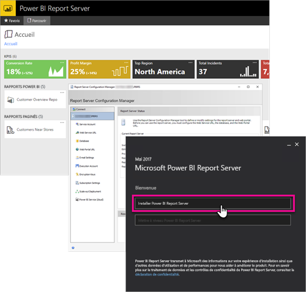

# Présentation du Manuel du développeur, Power BI Report Server
Bienvenue dans le Manuel du développeur pour Power BI Report Server, un emplacement local destiné au stockage et à la gestion de vos rapports Power BI mobiles et paginés.

Ce manuel met en évidence les options dont vous disposez, en tant que développeur, pour travailler avec Power BI Report Server.

## Incorporation
Dans Power BI Report Server, vous pouvez incorporer tout rapport dans un iFrame en ajoutant le paramètre QueryString `?rs:Embed=true` à l’URL. Cela fonctionne avec les rapports Power BI ainsi qu’avec d’autres types de rapports.

### Contrôle Visionneuse de rapports
Pour les rapports paginés, vous pouvez tirer parti du contrôle Visionneuse de rapports. Vous pouvez placer celui-ci dans une fenêtre ou une application web .NET. Pour plus d’informations, voir [Prise en main du contrôle Visionneuse de rapports](https://docs.microsoft.com/sql/reporting-services/application-integration/integrating-reporting-services-using-reportviewer-controls-get-started).

## API
Vous disposez de plusieurs options d’API permettant d’interagir avec Power BI Report Server. Celles-ci offrent les possibilités suivantes.

* [API REST](rest-api.md)
* [Accès URL](https://docs.microsoft.com/sql/reporting-services/url-access-ssrs)
* [Fournisseur WMI](https://docs.microsoft.com/sql/reporting-services/wmi-provider-library-reference/reporting-services-wmi-provider-library-reference-ssrs)

Vous pouvez également utiliser des [utilitaires PowerShell](https://github.com/Microsoft/ReportingServicesTools) open source pour gérer votre serveur de rapports.

> [!NOTE]
> Les utilitaires PowerShell ne prennent pas en charge actuellement les fichiers Power BI Desktop (.pbix).
> 
> 

## Extensions personnalisées
La bibliothèque d’extensions est un ensemble de classes, d’interfaces et de types de valeurs inclus dans Power BI Report Server. Cette bibliothèque donne accès à des fonctionnalités système et est conçue pour être le fondement sur lequel des applications Microsoft .NET Framework peuvent être utilisées pour étendre des composants de Power BI Report Server.

Vous pouvez créer plusieurs types d’extensions.

* Extensions de traitement des données
* Extensions de remise
* Extensions de rendu pour les rapports paginés
* Extensions de sécurité

Pour plus d’informations, voir [Bibliothèque d’extensions](https://docs.microsoft.com/sql/reporting-services/extensions/reporting-services-extension-library).

## Étapes suivantes
[Prise en main du contrôle Visionneuse de rapports](https://docs.microsoft.com/sql/reporting-services/application-integration/integrating-reporting-services-using-reportviewer-controls-get-started)  
[Création d’Applications à l’aide du service web et de .NET Framework](https://docs.microsoft.com/sql/reporting-services/report-server-web-service/net-framework/building-applications-using-the-web-service-and-the-net-framework)  
[Accès URL](https://docs.microsoft.com/sql/reporting-services/url-access-ssrs)  
[Bibliothèque d’extensions](https://docs.microsoft.com/sql/reporting-services/extensions/reporting-services-extension-library)  
[Fournisseur WMI](https://docs.microsoft.com/sql/reporting-services/wmi-provider-library-reference/reporting-services-wmi-provider-library-reference-ssrs)

D’autres questions ? [Essayez d’interroger la communauté Power BI](https://community.powerbi.com/)

