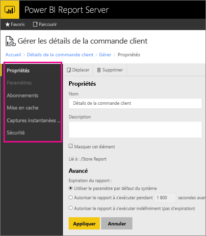

# Gérer le contenu dans le portail web 
Le portail web Power BI Report Server est un emplacement local destiné à l’affichage, au stockage et à la gestion de vos rapports mobiles et paginés, ainsi que de vos indicateurs de performance clés Power BI.

Vous pouvez afficher le portail web dans tout navigateur moderne. Dans le portail web, rapports et les indicateurs de performance clés sont organisés en dossiers, et vous pouvez les marquer en tant que favoris. Vous pouvez également y stocker des classeurs Excel. À partir du portail web, vous pouvez lancer les outils nécessaires pour créer des rapports :

* **Rapports Power BI** créés avec Power BI Desktop : consultez-les dans le portail web et les applications mobiles Power BI.
* **Rapports paginés** créés dans le Générateur de rapports : documents d’aspect moderne à disposition fixe optimisés pour l’impression.
* **Indicateurs de performance clés** créés directement dans le portail web.

Dans le portail web, vous pouvez parcourir les dossiers du serveur de rapports ou rechercher des rapports spécifiques. Vous pouvez consulter un rapport, ses propriétés générales et ses anciennes versions capturées dans l’historique de rapport. Selon les autorisations dont vous disposez, vous pouvez également vous abonner à des rapports afin de recevoir ceux-ci dans votre boîte de réception ou de pouvoir y accéder dans un dossier partagé sur le système de fichiers.

## Rôles et autorisations du portail web
L’application du portail web s’exécute dans un navigateur. Lorsque vous démarrez le portail web, les pages, les liens et les options accessibles varient selon les autorisations dont vous disposez sur le serveur de rapports. Si le rôle qui vous est attribué dispose de toutes les autorisations, vous avez accès à l’ensemble complet des menus et pages de l’application pour gérer un serveur de rapports. Si le rôle qui vous est attribué dispose des autorisations de consultation et d’exécution des rapports, vous avez accès uniquement aux menus et aux pages donc vous avez besoin pour mener ces activités. Vous pouvez avoir différentes attributions de rôle pour différents serveurs de rapports, voire pour divers rapports et dossiers sur un même serveur de rapports.

## Démarrez le portail web
1. Ouvrez votre navigateur web.
   
    Consultez la liste des [navigateurs web et des versions pris en charge](browser-support.md).
2. Dans la barre d’adresse, tapez l’URL du portail web.
   
    Par défaut, l’URL est <em>http://[NomOrdinateur]/reports</em>.
   
    Le serveur de rapports peut être configuré pour utiliser un port spécifique. Par exemple, <em>http://[NomOrdinateur]:80/reports</em> ou <em>http://[NomOrdinateur]:8080/reports</em>.
   
    Vous voyez les éléments des groupes du portail web dans les catégories suivantes :
   
   * indicateurs de performance clés (KPI) ;
   * rapports mobiles ;
   * rapports paginés ;
   * rapports Power BI Desktop ;
   * classeurs Excel ;
   * jeux de données ;
   * sources de données ;
   * Ressources

## Gérer les éléments dans le portail web
Power BI Report Server vous permet de contrôler avec précision sur les éléments que vous stockez sur le portail web. Par exemple, vous pouvez configurer les abonnements, la mise en cache, les instantanés et la sécurité de chaque rapport paginé.

1. Sélectionnez les points de suspension (...) dans l’angle supérieur droit d’un élément, puis choisissez **Gérer**.
   
    
2. Choisissez la propriété ou une fonctionnalité à définir.
   
    
3. Sélectionnez **Appliquer**.

Pour en savoir plus, voir [Gestion des abonnements via le portail web](https://docs.microsoft.com/sql/reporting-services/working-with-subscriptions-web-portal).

## Étapes suivantes
[Présentation de Power BI Report Server](get-started.md)

D’autres questions ? [Essayez d’interroger la communauté Power BI](https://community.powerbi.com/)

