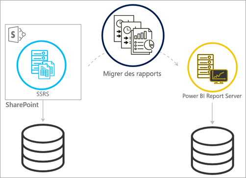

# <a name="migrate-a-report-server-installation"></a>Migrer une installation de serveur de rapports
Découvrez comment migrer votre instance de SQL Server Reporting Services (SSRS) vers une instance de Power BI Report Server.

Une migration se définit comme le déplacement de fichiers de données d’application vers une nouvelle instance Power BI Report Server. Voici des raisons courantes de migrer une installation :

* Vous voulez passer de SQL Server Reporting Services à Power BI Report Server.
  
  > [!NOTE]
  > Il n’y a pas de mise à niveau en place de SQL Server Reporting Services vers Power BI Report Server. Une migration est nécessaire.
  > 
  > 
* Vous avec des besoins de déploiement ou de mise à jour à grande échelle.
* Vous modifiez le matériel ou la topologie de votre installation.
* Vous rencontrez un problème qui bloque la mise à niveau.

## <a name="migrating-to-power-bi-report-server-from-ssrs-native-mode"></a>Migration vers Power BI Report Server à partir de SSRS (en mode natif)
La migration d’une instance SSRS (en mode natif) vers Power BI Report Server s’effectue en quelques étapes.


> [!NOTE]
> SQL Server 2008 Reporting Services et versions ultérieures sont pris en charge pour la migration.
> 
> 

* Sauvegardez les fichiers de base de données, d’application et de configuration.
* Sauvegardez la clé de chiffrement.
* Clonez votre base de données de serveur de rapports hébergeant vos rapports.
* Installez Power BI Report Server. Si vous utilisez le même matériel, vous pouvez installer Power BI Report Server sur le même serveur que l’instance SSRS. Pour plus d’informations sur l’installation de Power BI Report Server, voir [Installer Power BI Report Server](install-report-server.md).

> [!NOTE]
> Le nom d’instance de Power BI Report Server sera *PBIRS*.
> 
> 

* Configurez le serveur de rapports à l’aide du Gestionnaire de configuration du serveur de rapports et connectez-vous à la base de données clonée.
* Effectuez tout nettoyage nécessaire pour l’instance SSRS (en mode natif).

## <a name="migration-to-power-bi-report-server-from-ssrs-sharepoint-integrated-mode"></a>Migration vers Power BI Report Server à partir de SSRS (en mode intégré SharePoint)
Une migration d’un SSRS (en mode intégré SharePoint) vers Power BI Report Server n’est pas aussi simple qu’en mode natif. Bien que les étapes décrites ici fournissent des instructions, il se peut que vous ayez d’autres fichiers et ressources dans SharePoint qui doivent être gérés par ailleurs.



Vous devez migrer le contenu spécifique du serveur de rapports de SharePoint vers votre Power BI Report Server. Cela suppose que vous ayez déjà installé Power BI Report Server quelque part dans votre environnement. Pour plus d’informations sur l’installation de Power BI Report Server, voir [Installer Power BI Report Server](install-report-server.md).

Si vous souhaitez copier le contenu du serveur de rapports à partir de votre environnement SharePoint vers Power BI Report Server, vous devez vous servir d’outils tels que **rs.exe**. Voici un exemple de script permettant de copier le contenu du serveur de rapports de SharePoint vers Power BI Report Server.

> [!NOTE]
> L’exemple de script devrait fonctionner avec SharePoint 2010 et versions ultérieures ainsi qu’avec SQL Server 2008 Reporting Services et versions ultérieures.
> 
> 

### <a name="sample-script"></a>Exemple de script
```
Sample Script
rs.exe
-i ssrs_migration.rss -e Mgmt2010
-s http://SourceServer/_vti_bin/reportserver
-v st="sites/bi" -v f="Shared Documents“
-u Domain\User1 -p Password
-v ts=http://TargetServer/reportserver
-v tu="Domain\User" -v tp="Password"
```

## <a name="migrateing-from-one-power-bi-report-server-to-another"></a>Migration d’un Power BI Report Server vers un autre
Le processus de migration d’un Power BI Report Server est le même que le processus de migration d’un SSRS (en mode natif).


* Sauvegardez les fichiers de base de données, d’application et de configuration.
* Sauvegardez la clé de chiffrement.
* Clonez votre base de données de serveur de rapports hébergeant vos rapports.
* Installez Power BI Report Server. Vous *ne pouvez pas* installer Power BI Report Server sur le même serveur que celui à partir duquel vous opérez la migration. Pour plus d’informations sur l’installation de Power BI Report Server, voir [Installer Power BI Report Server](install-report-server.md).

> [!NOTE]
> Le nom d’instance de Power BI Report Server sera *PBIRS*.
> 
> 

* Configurez le serveur de rapports à l’aide du Gestionnaire de configuration du serveur de rapports et connectez-vous à la base de données clonée.
* Effectuer tout nettoyage nécessaire pour l’ancienne installation de Power BI Report Server.

## <a name="next-steps"></a>Étapes suivantes
[Manuel de l’administrateur](admin-handbook-overview.md)  
[Démarrage rapide : installer Power BI Report Server](quickstart-install-report-server.md)  
[Script avec l’utilitaire rs.exe et le service web](https://docs.microsoft.com/sql/reporting-services/tools/script-with-the-rs-exe-utility-and-the-web-service)

D’autres questions ? [Essayez d’interroger la communauté Power BI](https://community.powerbi.com/)

