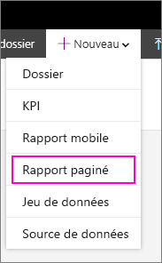
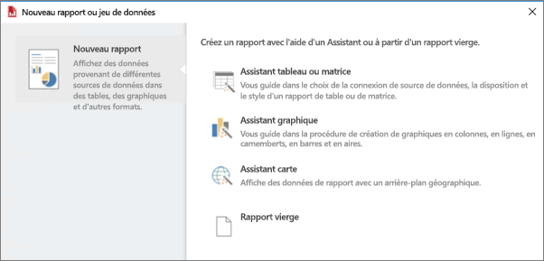
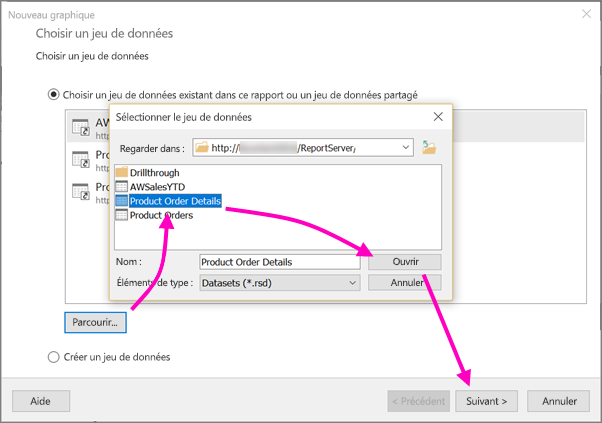
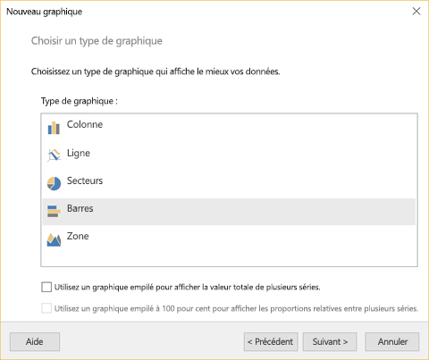
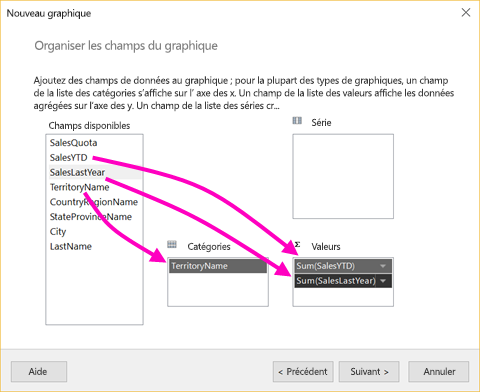
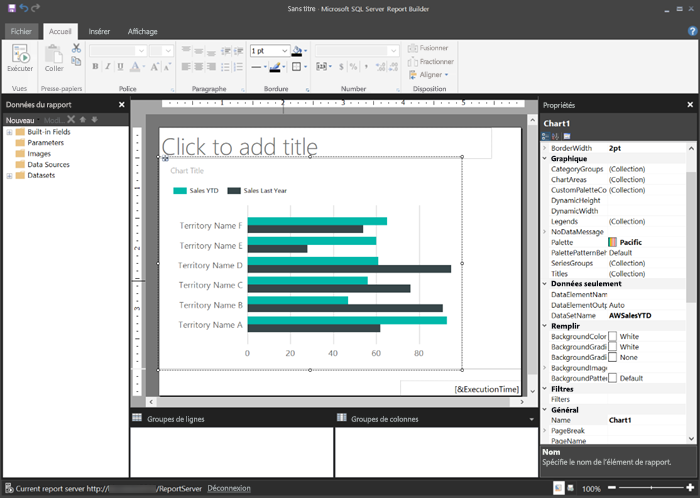
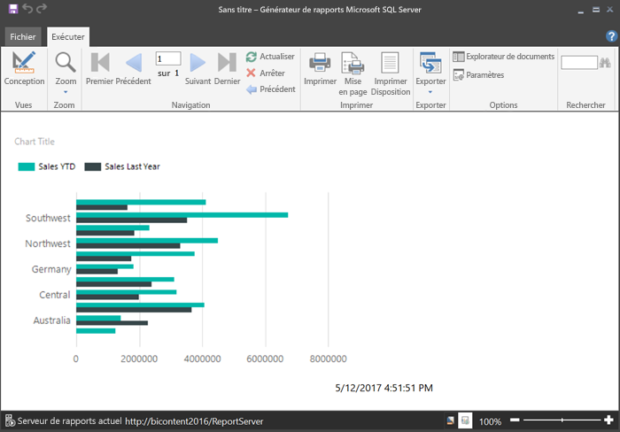

# Créer un rapport paginé pour Power BI Report Server
Comme le suggère leur intitulé, les rapports paginés peuvent s’étendre sur plusieurs pages. Ils sont dans un format fixe et permettent une personnalisation précise. Les rapports paginés sont des fichiers .rdl.

Vous pouvez stocker et gérer des rapports paginés dans le portail web Power BI Report Server de la même façon que dans le portail web SQL Server Reporting Services (SSRS). Créez-les et modifiez-les dans le Générateur de rapports ou le Concepteur de rapports dans SQL Server Data Tools (SSDT), puis publiez-les vers l’un des portails web. Les lecteurs au sein de votre organisation peuvent alors les consulter dans un navigateur ou dans une application mobile Power BI sur leur appareil mobile.

Si vous avez déjà créé des rapports paginés à l’aide du Générateur de rapports ou du Concepteur de rapports, vous êtes prêt à créer des rapports paginés pour Power BI Report Server. Dans ce cas, voici quelques étapes rapides pour vous démarrer.

## Étape 1 : installer et démarrer le Générateur de rapports
Vous avez peut-être déjà installé le Générateur de rapports afin de créer des rapports pour un serveur SSRS. Vous pouvez utiliser la même version ou le Générateur de rapports pour créer des rapports pour Power BI Report Server. Si vous ne l’avez pas installé, le processus est simple.

1. Dans le portail web Power BI Report Server, sélectionnez **Nouveau** > **Rapport paginé**.
   
    
   
    Si l’application le Générateur de rapports n’est pas installé, vous êtes guidé dans le processus d’installation.
2. Une fois installé, le Générateur de rapports affiche l’écran **Nouveau rapport ou dataset**.
   
    
3. Sélectionnez l’Assistant pour le type de rapport que vous voulez créer :
   
   * Table ou matrice
   * Graphique
   * Carte
   * Vide
4. Commençons par l’Assistant Graphique.
   
    L’Assistant Graphique vous guide dans le processus de création d’un graphique de base dans un rapport. À partir de là, vous pouvez personnaliser votre rapport pratiquement sans limité.

## Étape 2 : exécuter l’Assistant Graphique
L’Assistant Graphique vous guide dans les étapes de base de création d’une visualisation dans un rapport.

Les rapports paginés peuvent se connecter à un vaste éventail de sources de données, de Microsoft SQL Server et Microsoft Azure SQL Database à Oracle, Hyperion et bien plus encore. Pour en savoir plus, voir [Sources de données prises en charge par les rapports paginés](connect-data-sources.md).

Dans la première page de l’Assistant Graphique, **Choisir un dataset**, vous pouvez créer un dataset ou choisir un dataset partagé sur un serveur. Les *Datasets* retournent des données de rapport à partir d’une requête sur une source de données externe.

1. Sélectionnez **Parcourir** > sélectionner un dataset partagé sur un serveur > **Ouvrir** > **Suivant**.
   
    
   
     Vous devez créer un dataset ? Voir [Créer un dataset partagé ou incorporé](https://docs.microsoft.com/sql/reporting-services/report-data/create-a-shared-dataset-or-embedded-dataset-report-builder-and-ssrs).
2. Choisissez un type de graphique, en l’occurrence, un graphique à barres.
   
    
3. Organisez les champs en les faisant glisser vers les zones **Catégories**, **Série** et **Valeurs**.
   
    
4. Sélectionnez **Suivant** > **Terminer**.

## Étape 3 : créer votre rapport
Vous êtes maintenant en mode Création de rapport. Notez que les données sont des données d’espace réservé, pas vos données.

* Pour afficher vos données, sélectionnez **Exécuter**.
  
     
* Pour revenir en mode Création, sélectionnez **Création**.

Vous pouvez modifier le graphique que vous venez de créer, en changeant sa disposition, ses valeurs, se légende, tout ce que vous voulez.

Vous pouvez ajouter toutes sortes d’autres visualisations : jauges, tables, matrices, tableaux, mappages et bien plus encore. Vous pouvez ajouter des en-têtes et pieds de page pour plusieurs pages. Pour essayer par vous-même, voir [Didacticiels du Générateur de rapports](https://docs.microsoft.com/sql/reporting-services/report-builder-tutorials).

## Étape 4 : enregistrer votre rapport sur le serveur de rapports
Une fois le rapport prêt, enregistrez-le sur Power BI Report Server.

1. Dans le menu **Fichier**, sélectionnez **Enregistrer sous**, puis enregistrez le rapport dans le serveur de rapports. 
2. Vous pouvez à présent l’afficher dans le navigateur.
   
    

## Étapes suivantes
Il existe de nombreuses ressources excellentes pour la création de rapports à l’aide du Générateur de rapports et du Concepteur de rapports dans SQL Server Data Tools. Les didacticiels du Générateur de rapports constituent un bon point de départ.

* [Didacticiels du Générateur de rapports](https://docs.microsoft.com/sql/reporting-services/report-builder-tutorials)
* [Manuel de l’utilisateur Power BI Report Server](user-handbook-overview.md)  

D’autres questions ? [Essayez d’interroger la communauté Power BI](https://community.powerbi.com/)

