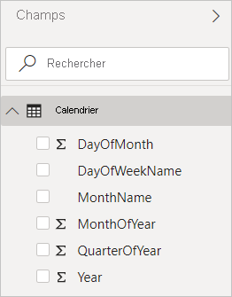
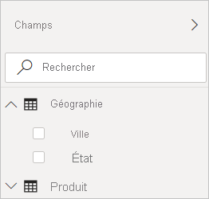
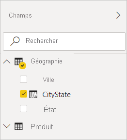

# Créer des colonnes calculées dans Power BI Desktop
Les colonnes calculées vous permettent d’ajouter de nouvelles données à une table déjà présente dans votre modèle. Toutefois, au lieu d’interroger et de charger les valeurs dans votre nouvelle colonne à partir d’une source de données, vous créez une formule DAX (Data Analysis Expressions) qui définit les valeurs de la colonne. Dans Power BI Desktop, les colonnes calculées sont créées à l’aide de la fonctionnalité de nouvelle colonne dans la vue **Rapport**.

Contrairement aux colonnes personnalisées qui sont créées dans le cadre d’une requête à l’aide de l’option **Ajouter une colonne personnalisée** dans l’Éditeur de requête, les colonnes calculées qui sont créées dans la vue **Rapport** ou **Données** sont basées sur les données que vous avez déjà chargées dans le modèle. Par exemple, vous pouvez choisir de concaténer des valeurs de deux colonnes différentes figurant dans deux tables différentes mais associées, d’effectuer une addition ou d’extraire des sous-chaînes.

Les colonnes calculées que vous créez apparaissent dans la liste **Champs** comme n’importe quel autre champ, mais elles possèdent une icône spéciale indiquant que leurs valeurs sont le résultat d’une formule. Vous pouvez nommer vos colonnes comme vous le souhaitez et les ajouter à une visualisation de rapport comme d’autres champs.

 
Les colonnes calculées calculent les résultats en utilisant DAX, un langage de formule conçu pour fonctionner avec des données relationnelles comme dans Power BI Desktop. DAX inclut une bibliothèque de plus de 200 fonctions, opérateurs et constructions. Elle offre une flexibilité considérable pour créer des formules afin d’effectuer les calculs nécessaires pour quasiment tout type d’analyse de données. Pour en savoir plus sur DAX, consultez [Principes fondamentaux de DAX dans Power BI Desktop](desktop-quickstart-learn-dax-basics.md).

Les formules DAX sont similaires aux formules Excel. En fait, DAX possède de nombreuses fonctions identiques à celles d’Excel. Les fonctions DAX, cependant, sont destinées à opérer sur des données segmentées ou filtrées de manière interactive dans un rapport, comme dans Power BI Desktop. Dans Excel, vous pouvez avoir une formule différente pour chaque ligne d’un tableau. Dans Power BI, quand vous créez une formule DAX pour une nouvelle colonne, elle calcule un résultat pour chaque ligne de la table. Les valeurs de colonne sont recalculées si nécessaire, comme quand les données sous-jacentes sont actualisées et que les valeurs ont changé.

## Examinons un exemple
Jeff est responsable des expéditions chez Contoso et souhaite créer un rapport indiquant le nombre d’expéditions effectuées vers différentes villes. Il possède une table **Geography** avec des champs distincts pour la ville et l’État. Toutefois, Jeff souhaite que ses rapports indiquent les valeurs de ville et d’État sous la forme d’une valeur unique sur la même ligne. À ce stade, la table **Geography** de Jeff ne contient pas le champ souhaité.

Cependant, avec une colonne calculée, Jeff peut réunir les villes de la colonne **City** avec les États de la colonne **State**.

Jeff clique avec le bouton droit sur la table **Geography**, puis il sélectionne **Nouvelle colonne**. Il entre ensuite la formule DAX suivante dans la barre de formule :

Cette formule crée simplement une colonne nommée **CityState**. Pour chaque ligne de la table **Geography**, elle prend la valeur de la colonne **City**, elle ajoute une virgule et un espace, puis elle concatène la valeur de la colonne **State**.

Jeff dispose désormais du champ souhaité.

Il peut l’ajouter au canevas du rapport avec le nombre d’expéditions. Avec un minimum d’efforts, Jeff a maintenant un champ **CityState** qu’il peut être ajouté à peu près à tout type de visualisation. Quand Jeff crée une carte, Power BI Desktop sait déjà lire les valeurs de ville et d’État dans la nouvelle colonne.

## Étapes suivantes
Nous vous avons fourni ici une brève introduction seulement aux colonnes calculées. Pour plus d’informations, consultez les ressources suivantes :

* Pour télécharger un exemple de fichier et obtenir des indications pas à pas sur la création de colonnes supplémentaires, consultez le [Tutoriel : Créer des colonnes calculées dans Power BI Desktop](desktop-tutorial-create-calculated-columns.md)

* Pour en savoir plus sur DAX, consultez [Principes fondamentaux de DAX dans Power BI Desktop](desktop-quickstart-learn-dax-basics.md).

* Pour en savoir plus sur les colonnes que vous créez dans le cadre d’une requête, consultez la section **Créer des colonnes personnalisées** dans [Tâches courantes relatives aux requêtes dans Power BI Desktop](desktop-common-query-tasks.md).  

