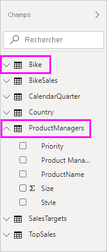
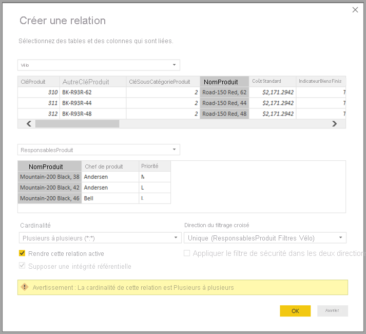
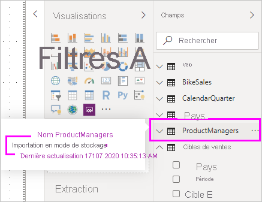

# Utiliser des modèles composites dans Power BI Desktop

Dans Power BI Desktop, lorsque l’on utilisait le mode DirectQuery dans un rapport, aucune autre connexion de données (DirectQuery ou d’importation) n’était autorisée pour ce rapport. Avec les modèles composites, cette restriction est levée. Un rapport peut inclure en toute transparence des connexions de données provenant de plusieurs connexions de données DirectQuery ou d’importation, dans la combinaison de votre choix.

La fonctionnalité des modèles composites dans Power BI Desktop se compose de trois fonctionnalités connexes :

* **Modèles composites** : permet à un rapport d’avoir plusieurs connexions de données à partir de différents groupes sources, par exemple une ou plusieurs connexions DirectQuery et une connexion d’importation, plusieurs connexions DirectQuery ou toute combinaison de ces connexions. Cet article décrit en détail les modèles composites.

* **Relations plusieurs à plusieurs** : avec les modèles composites, vous pouvez établir des *relations plusieurs à plusieurs* entre les tables. Cette approche supprime la nécessité d’avoir des valeurs uniques dans les tables. Les solutions de contournement précédentes, comme la présentation de nouvelles tables uniquement pour établir des relations, sont également supprimées. Pour plus d’informations, consultez [Appliquer des relations plusieurs à plusieurs dans Power BI Desktop](desktop-many-to-many-relationships.md).

* **Mode de stockage** : il est maintenant possible d’indiquer quels visuels interrogent les sources de données back-end. Les visuels qui ne nécessitent pas une requête sont importés même s’ils sont basés sur DirectQuery. Cette fonctionnalité permet d’améliorer les performances et de réduire la charge du back-end. Avant, même les visuels simples, comme les segments, lançaient des requêtes à des sources back-end. Pour plus d’informations, consultez [Gérer le mode de stockage dans Power BI Desktop](desktop-storage-mode.md).

## Utiliser des modèles composites

Avec les modèles composites, vous pouvez vous connecter à différentes sortes de sources de données quand vous utilisez Power BI Desktop ou le service Power BI. Vous pouvez établir ces connexions aux données de deux façons :

* En important des données dans Power BI, ce qui est la méthode la plus courante pour obtenir des données.
* En vous connectant directement aux données dans leur dépôt source d’origine à l’aide de DirectQuery. Pour en savoir plus sur DirectQuery, consultez [Utiliser DirectQuery dans Power BI](../connect-data/desktop-directquery-about.md).

Avec DirectQuery, les modèles composites permettent de créer un modèle Power BI, par exemple un unique fichier Power BI Desktop *.pbix*, qui effectue l’une des actions suivantes, ou les deux :

* Combine les données d’une ou de plusieurs sources DirectQuery.
* Combine les données de sources DirectQuery et d’importation.

Par exemple, avec des modèles composites, il est possible de générer un modèle qui combine les types de données suivants :

* Données de ventes d’un entrepôt de données d’entreprise.
* Données de cibles de ventes d’une base de données SQL Server d’un service.
* Données importées à partir d’une feuille de calcul.

Un modèle combinant les données de plusieurs sources DirectQuery ou DirectQuery avec des données d’importation est appelé modèle composite.

Vous pouvez créer des relations entre les tables comme vous le faites habituellement, même si ces tables proviennent de différentes sources. Toutes les relations entre les sources sont créées avec une cardinalité plusieurs-à-plusieurs, indépendamment de leur cardinalité réelle. Vous pouvez changer la cardinalité initiale à un-à-plusieurs, plusieurs-à-un ou un-à-un. Quelle que soit la cardinalité définie, les relations entre les sources ont un comportement différent. Il n’est pas possible d’utiliser des fonctions DAX (Data Analysis Expression) pour récupérer des valeurs du côté `one` à partir du côté `many`. Vous pouvez également constater un impact sur les performances par rapport aux relations plusieurs-à-plusieurs au sein de la même source.

> [!NOTE]
> Dans le contexte des modèles composites, toutes les tables importées sont en fait une source unique, indépendamment de la source de données sous-jacente réelle.

## Exemple de modèle composite

Comme exemple de modèle composite, prenons un rapport connecté à un entrepôt de données d’entreprise dans SQL Server à l’aide de DirectQuery. Dans cet exemple, l’entrepôt de données contient les données des ventes par pays (**Sales by Country**), trimestre (**Quarter**) et vélo (**Bike (Product)** ), comme illustré dans l’image suivante :

À ce stade, vous pouvez générer des visuels simples à l’aide des champs de cette source. L’image suivante montre le total des ventes par *ProductName* d’un trimestre sélectionné.

Mais que se passe-t-il si vous avez des données dans une feuille de calcul Office Excel sur le chef de produit assigné à chaque produit, avec une priorité de marketing ? Si vous voulez voir le montant des ventes (**Sales Amount**) par chef de produit (**Product Manager**), il n’est peut-être pas possible d’ajouter ces données locales à l’entrepôt de données d’entreprise. Ou cela prendrait plusieurs mois dans le meilleur des cas.

Il peut être possible d’importer ces données de ventes à partir de l’entrepôt de données, au lieu d’utiliser DirectQuery. Les données de ventes peuvent ensuite être combinées aux données importées à partir de la feuille de calcul. Toutefois, cette approche est déconseillée pour les raisons qui préconisent l’utilisation de DirectQuery. Les raisons sont notamment :

* Combinaison des règles de sécurité appliquées dans la source sous-jacente.
* Nécessité de pouvoir afficher les données les plus récentes.
* Échelle des données.

C’est ici que les modèles composites entrent en jeu. Les modèles composites vous permettent de vous connecter à l’entrepôt de données à l’aide de DirectQuery, puis d’utiliser **Obtenir des données** pour trouver des sources supplémentaires. Dans cet exemple, nous établissons d’abord la connexion DirectQuery à l’entrepôt de données d’entreprise. Nous utilisons **Obtenir des données**, choisissons **Excel**, puis accédons à la feuille de calcul contenant nos données locales. Enfin, nous importons la feuille de calcul contenant les valeurs *Product Names* (Noms des produits), **Sales Manager** (Responsable commercial) et **Priority** (Priorité).  

Dans la liste **Champs**, vous pouvez voir deux tables : la table **Bike** d’origine provenant de SQL Server et une nouvelle table **ProductManagers**. La nouvelle table contient les données importées à partir d’Excel.

De même, dans le champ **Relationship view** (Vue de la relation) dans Power BI Desktop, nous voyons à présent une nouvelle table appelée **Product Managers**.

Nous devons maintenant associer ces tables aux autres tables du modèle. Comme toujours, nous créons une relation entre la table **Bike** à partir de SQL Server et la table **ProductManagers** importée. Autrement dit, la relation est établie entre **Bike[ProductName]** et **ProductManagers[ProductName]** . Comme nous l’avons vu précédemment, toutes les relations entre sources ont par défaut la cardinalité plusieurs à plusieurs.

Une fois cette relation établie, elle s’affiche comme prévu dans **Vue de la relation** dans Power BI Desktop.

Nous pouvons maintenant créer des visuels à l’aide de l’un des champs de la liste **Champs**. Cette approche fusionne facilement les données de plusieurs sources. Par exemple, le montant total des ventes (*SalesAmount*) pour chaque chef de produit (*Product Manager*) s’affiche dans l’image suivante :

L’exemple suivant montre un cas courant de table de *dimension*, comme **Product** ou **Customer**, étendue avec des données supplémentaires importées à partir d’un autre emplacement. Des tables peuvent également utiliser DirectQuery pour se connecter à différentes sources. Pour étendre notre exemple, imaginez que les tables **Sales Targets** (Cibles de ventes) par **Country** (Pays) et **Period** (Période) sont stockées dans une base de données distincte d’un service. Comme d’habitude, vous pouvez utiliser **Obtenir des données** pour vous connecter à ces données, comme l’illustre l’image suivante :

Comme nous l’avons fait précédemment, nous pouvons créer des relations entre la nouvelle table et d’autres tables du modèle, puis créer des visuels qui combinent leurs données. Examinons à nouveau **Vue de la relation**, où nous avons établi les nouvelles relations :

L’image suivante est basée sur les nouvelles données et les relations que nous avons créées. Le visuel en haut à gauche affiche le montant total des ventes (*Sales Amount*) par rapport aux cibles de ventes (*Target*), et le calcul de la variance montre la différence. Les données **Sales Amount** et **Target** proviennent de deux bases de données SQL Server différentes.

## Définir le mode de stockage

Chaque table d’un modèle composite comporte un mode de stockage qui indique si la table est basée sur DirectQuery ou une importation. Le mode de stockage peut être affiché et modifié dans le volet **Propriété**. Pour afficher le mode de stockage, cliquez avec le bouton droit sur une table dans la liste **Champs**, puis sélectionnez **Propriétés**. L’illustration suivante montre le mode de stockage pour la table **SalesTargets**.

Le mode de stockage peut également être consulté dans l’info-bulle de chaque table.

Pour tout fichier Power BI Desktop (fichier *.pbix*) contenant des tables provenant de DirectQuery et des tables d’importation, la barre d’état affiche un mode de stockage appelé **Mixte**. Vous pouvez cliquer sur ce terme dans la barre d’état et basculer facilement toutes les tables sur Importation.

Pour plus d’informations sur le mode de stockage, consultez [Gérer le mode de stockage dans Power BI Desktop](desktop-storage-mode.md).  

> [!NOTE]
> Vous pouvez utiliser le mode de stockage *Mixte* dans Power BI Desktop et dans le service Power BI.

## Tables calculées

Vous pouvez ajouter des tables calculées à un modèle qui utilise DirectQuery. Le langage DAX (Data Analysis Expressions) qui définit la table calculée peut référencer des tables importées ou DirectQuery, ou une combinaison des deux.

Les tables calculées sont toujours importées, et leurs données sont actualisées en même temps que les tables. Si une table calculée référence une table DirectQuery, les visuels faisant référence à la table DirectQuery affichent toujours les valeurs les plus récentes dans la source sous-jacente. Autrement, les visuels faisant référence à la table calculée affichent les valeurs au moment de la dernière actualisation de la table calculée.

## Implications en matière de sécurité

Les modèles composites ont des implications sur la sécurité. Une requête envoyée à une source de données peut inclure des valeurs de données qui ont été récupérées à partir d’une autre source. Dans l’exemple précédent, le visuel qui montre le montant des ventes (**SalesAmount**) par chef de produit (**ProductManagers**) envoie une requête SQL à la base de données relationnelle Sales. Cette requête SQL peut contenir le nom des chefs de produit (ProductManagers) et leurs produits (Products).

Pour cette raison, les informations stockées dans la feuille de calcul sont désormais incluses dans une requête envoyée à la base de données relationnelle. Si ces informations sont confidentielles, vous devez tenir compte des implications en matière de sécurité. En particulier, tenez compte des points suivants :

* Tout administrateur de la base de données capable d’afficher les traces ou les journaux d’audit peut voir ces informations, même s’il ne dispose pas des autorisations pour accéder aux données de la source d’origine. Dans cet exemple, l’administrateur a besoin d’autorisations pour le fichier Excel.

* Les paramètres de chiffrement pour chaque source doivent être considérés. Il est préférable d’éviter que les informations ne soient récupérées à partir d’une source par une connexion chiffrée, puis incluses par inadvertance dans une requête envoyée à une autre source par une connexion non chiffrée.

Afin de confirmer que les implications en matière de sécurité ont bien été prises en compte, Power BI Desktop affiche un message d’avertissement lors de la création d’un modèle composite.  

En outre, si un auteur ajoute *Table1* de *Modèle A* à un modèle composite (nous l’appellerons *Modèle C* à des fins de référence), un utilisateur qui consulte un rapport basé sur *Modèle C* pourra interroger **n’importe quelle table** dans *Modèle A* qui n’est pas protégée par la sécurité au niveau des lignes.

Pour des raisons similaires, vous devez faire attention quand vous ouvrez un fichier Power BI Desktop envoyé à partir d’une source non fiable. Si ce fichier contient des modèles composites, cela signifie que les informations récupérées à partir d’une source en utilisant les informations d’identification de l’utilisateur qui ouvre le fichier sont envoyées vers une autre source de données dans le cadre de la requête. Les informations peuvent être vues par l’auteur malveillant du fichier Power BI Desktop. La première fois que vous ouvrez un fichier Power BI Desktop contenant plusieurs sources, Power BI Desktop affiche un avertissement. Cet avertissement est similaire à l’avertissement affiché lors de l’ouverture d’un fichier contenant des requêtes SQL natives.  

## Impact sur les performances  

Quand vous utilisez DirectQuery, tenez toujours compte des performances pour garantir avant tout que la source backend dispose de ressources suffisantes pour assurer une bonne expérience aux utilisateurs. Une bonne expérience signifie que les visuels doivent s’actualiser en cinq secondes ou moins. Pour obtenir des conseils sur les performances, consultez [À propos de l’utilisation de DirectQuery dans Power BI](../connect-data/desktop-directquery-about.md).

L’utilisation des modèles composites implique de nouvelles considérations sur les performances. Un seul visuel peut entraîner l’envoi de requêtes vers plusieurs sources, souvent en passant les résultats d’une requête à une deuxième source. Cette situation peut se produire dans les scénarios d’exécution suivants :

* **Une requête SQL incluant un grand nombre de valeurs littérales** : Par exemple, un visuel demandant le montant total des ventes (**Sales Amount**) pour un groupe spécifique de chefs de produit (**Product Managers**) doit d’abord identifier les produits **(Products)** gérés par ces chefs de produit. Cette séquence doit se produire avant que le visuel n’envoie une requête SQL contenant tous les ID produit dans une clause `WHERE`.

* **Une requête SQL effectuée à un faible niveau de granularité, les données étant par la suite agrégées localement** : comme le nombre de produits (**Products**) qui correspondent aux critères de filtre sur les chefs de produit (**ProductManagers**) est de plus en plus important, il peut s’avérer inefficace ou impossible d’inclure tous les produits dans une clause `WHERE`. Interrogez plutôt la source relationnelle au niveau inférieur des produits **Products**, puis agrégez les résultats localement. Si la cardinalité des **produits** dépasse une limite de 1 million, la requête échoue.

* **Plusieurs requêtes SQL, une par groupe et par valeur** : lorsque l’agrégation utilise des données **DistinctCount** regroupées par une colonne d’une autre source, si la source externe ne gère pas une transmission efficace des nombreuses valeurs littérales qui définissent le regroupement, il est nécessaire d’envoyer une requête SQL par groupe et par valeur.

   Un visuel demandant un décompte distinct de la valeur **CustomerAccountNumber** de la table SQL Server par chef de produit (**ProductManagers**) importée de la feuille de calcul doit passer les détails de la table **ProductManagers** dans la requête envoyée à SQL Server. Avec d’autres sources, par exemple Redshift, cette action n’est pas possible. Une requête SQL serait envoyée pour chaque responsable commercial (**Sales Manager**) jusqu’à une limite pratique, à laquelle la requête échouerait.

Chacun de ces cas comporte ses propres implications en termes de performances, et les détails exacts varient pour chaque source de données. Même si la cardinalité des colonnes utilisées dans la relation qui unit les deux sources reste faible (quelques milliers), les performances ne devraient pas être affectées. À mesure que cette cardinalité augmente, vous devez examiner de plus près l’impact sur les performances.

Par ailleurs, avec les relations plusieurs à plusieurs, il faut envoyer des requêtes distinctes à la source sous-jacente pour chaque niveau total ou sous-total, au lieu d’agréger localement les valeurs détaillées. Un simple visuel de table avec des totaux envoie deux requêtes SQL plutôt qu’une.

## Considérations et limitations

Cette version de modèles composites présente quelques limitations :

Pour l’instant, l’[actualisation incrémentielle](../admin/service-premium-incremental-refresh.md) est prise en charge pour les modèles composites qui se connectent aux sources de données SQL, Oracle et Teradata uniquement.

Les sources multidimensionnelles Live Connect suivantes ne peuvent pas être utilisées avec les modèles composites :

* SAP HANA
* SAP Business Warehouse
* SQL Server Analysis Services
* Jeux de données Power BI
* Azure Analysis Services

Quand vous vous connectez à ces sources multidimensionnelles à l’aide de DirectQuery, vous ne pouvez pas vous connecter à une autre source DirectQuery ou la combiner avec des données d’importation.

Les limitations existantes concernant DirectQuery s’appliquent toujours quand vous utilisez des modèles composites. Plusieurs de ces limitations sont désormais appliquées par table, selon le mode de stockage de la table. Par exemple, une colonne calculée d’une table d’importation peut faire référence à d’autres tables, mais une colonne calculée d’une table DirectQuery ne peut faire référence qu’à des colonnes de la même table. D’autres limitations s’appliquent au modèle dans son ensemble, si aucune des tables du modèle n’est de type DirectQuery. Par exemple, les fonctionnalités QuickInsights et Questions et réponses ne sont pas disponibles sur un modèle si l’une des tables qu’il contient a un mode de stockage de type DirectQuery.

## Étapes suivantes

Pour plus d’informations sur les modèles composites et DirectQuery, consultez les articles suivants :

* [Relations plusieurs à plusieurs dans Power BI Desktop](desktop-many-to-many-relationships.md)
* [Mode de stockage dans Power BI Desktop](desktop-storage-mode.md)
* [Utiliser DirectQuery dans Power BI](../connect-data/desktop-directquery-about.md)
* [Sources de données prises en charge par DirectQuery dans Power BI](../connect-data/power-bi-data-sources.md)
* [Utilisation de DirectQuery pour jeux de données Power BI et Azure Analysis Services (préversion)](../connect-data/desktop-directquery-datasets-azure-analysis-services.md)
