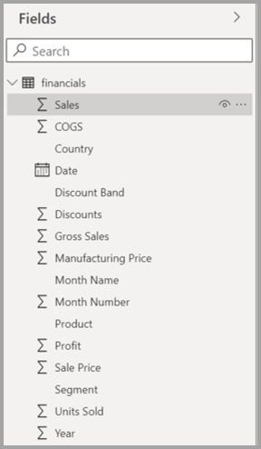
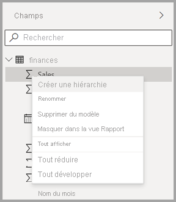
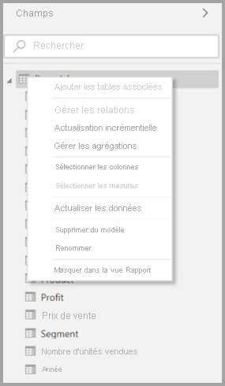
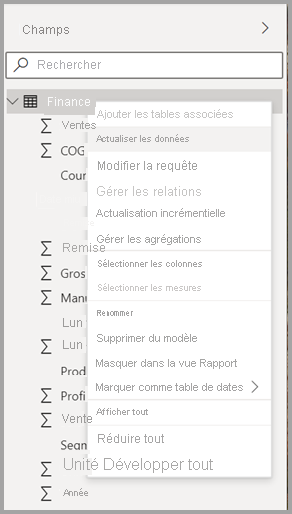
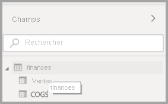
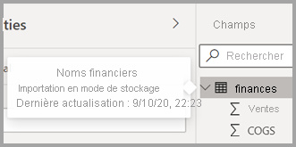

# Utilisation de la liste de champs dans Power BI Desktop (préversion)

À partir de la mise à jour de novembre 2020, nous centralisons les listes de **champs** dans la vue Modèle, la vue Données et la vue Rapport de Power BI Desktop. La centralisation de ces vues crée une cohérence en termes de fonctionnement et d’interface utilisateur, en réponse aux commentaires reçus des clients.

Les changements que vous noterez dans les vues sont les suivants :

* Iconographie
* Fonctionnalité de recherche
* Éléments de menu contextuel
* Comportement de glisser-déplacer similaire
* Info-bulles
* Améliorations de l’accessibilité

L’objectif est d’améliorer la facilité d’utilisation de Power BI Desktop. Les changements devraient avoir un impact minimal sur votre workflow de données classique.

## Activation de la nouvelle liste de champs (préversion)

La liste de champs centralisée va commencer par la vue **Modèle**, puis sera appliquée aux autres vues par la suite. Pour activer la vue Champ centralisée, dans Power BI Desktop, accédez à **Fichier > Options et paramètres > Options**, puis sélectionnez **Fonctionnalités en préversion** dans le volet gauche. Dans la section Fonctionnalités en préversion, cochez la case à côté de **Nouvelle liste de champs**.

Vous êtes invité à redémarrer Power BI Desktop pour que la sélection prenne effet.

## Changements dans la liste de champs

Les tableaux suivants indiquent les mises à jour apportées à la liste de champs. 

|**Liste de champs d’origine (vue Modèle)**  | **Nouvelle liste de champs (vue Modèle)**  |
|:---------:|:---------:|
|**Ressource d’origine** |**Nouveau** |
|**Icônes et interface utilisateur**       ||
|     |    |
|**Menu contextuel - Champ**       ||
|     |    |
|**Menu contextuel - Table**       ||
|     |    |
|**Info-bulles**       ||
|     |    |

## Icônes de la liste de champs

Il existe également de nouvelles icônes de liste de champs. Le tableau suivant présente les icônes d’origine et leur nouvel équivalent, puis fournit une brève description de chacune d’elles. 

|Icône d’origine  |Icône Nouveau  |Description  |
|:---------:|:---------:|:---------|
|     |           |Dossier dans la liste Champs         |
|     |         |Champ numérique : Les champs numériques sont des agrégats qui sont utilisés dans le cadre d’additions ou de calculs de moyenne, par exemple. Les agrégats sont importés avec les données et sont définis dans le modèle de données sur lequel votre rapport est basé. Pour plus d’informations, consultez [Agrégats dans des rapports Power BI](../create-reports/service-aggregates.md).         |
|     |         |Colonne calculée avec type de données non numérique : Nouvelle colonne non numérique que vous créez avec une formule DAX (Data Analysis Expressions) qui définit les valeurs de la colonne. En savoir plus sur les [colonnes calculées](desktop-calculated-columns.md)        |
|     |          |Colonne calculée numérique : Nouvelle colonne que vous créez avec une formule DAX (Data Analysis Expressions) qui définit les valeurs de la colonne. En savoir plus sur les [colonnes calculées](desktop-calculated-columns.md)         |
|     |          |Mesure : Chaque mesure a sa propre formule codée en dur. Les visionneuses de rapports ne peuvent pas changer le calcul ; par exemple, s’il s’agit d’une somme, il peut uniquement s’agir d’une somme. Les valeurs ne sont pas stockées dans une colonne. Elles sont calculées à la volée, en fonction uniquement de leur emplacement dans le visuel. Pour plus d’informations, lisez [Présentation des mesures](desktop-measures.md).         |
|     |         |Groupe de mesures.         |
|     |         |KPI : Indice visuel qui permet de voir la progression réalisée vers un objectif mesurable. Découvrez-en plus sur les visuels d’[indicateur de performance clé (KPI)](../visuals/power-bi-visualization-kpi.md).         |
|     |           |Hiérarchie des champs : Sélectionnez la flèche pour afficher les champs qui composent la hiérarchie. Pour plus d’informations, regardez cette vidéo Power BI sur YouTube concernant la [création et l’utilisation des hiérarchies](https://www.youtube.com/watch?v=q8WDUAiTGeU).         |
|     |         |Données géographiques : Ces champs d’emplacement peuvent être utilisés pour créer des visualisations de cartes.         |
|     |          |Champ Identité : Les champs portant cette icône sont des champs uniques, configurés pour afficher toutes les valeurs, y compris les doublons. Par exemple, vos données peuvent comprendre des enregistrements pour deux personnes nommées « Robin Smith », et chaque enregistrement sera traité comme étant unique. Ils ne seront pas additionnés.         |
|     |          |Paramètre : Configurez les paramètres pour que certaines parties de vos rapports et modèles de données (filtre de requête, référence à une source de données, définition de mesure, etc.) dépendent d’une ou de plusieurs valeurs de paramètres. Pour plus d’informations, consultez ce billet de blog Power BI sur les [paramètres de requête](https://powerbi.microsoft.com/blog/deep-dive-into-query-parameters-and-power-bi-templates/).         |
|     |         |Champ de date de calendrier avec une table de dates intégrée.         |
|     |          |Table calculée : Table créée à l’aide d’une formule DAX (Data Analysis Expressions) basée sur les données déjà chargées dans le modèle. Ces tables conviennent mieux aux calculs intermédiaires que vous voulez stocker dans le cadre du modèle.         |
|     |         |Avertissement : Champ calculé avec une erreur. Par exemple, la syntaxe de l’expression DAX peut être incorrecte.         |
|     |         |Groupe : Les valeurs de cette colonne sont basées sur des valeurs de regroupement d’une autre colonne, déterminées à l’aide de la fonctionnalité des groupes et classes. Vous pouvez apprendre à [utiliser le regroupement et le binning](../create-reports/desktop-grouping-and-binning.md).         |
| Aucune icône d’origine    |          |Mesure de détection des changements : Quand vous configurez une page pour qu’elle s’actualise automatiquement, vous pouvez configurer une [mesure de détection des changements](../create-reports/desktop-grouping-and-binning.md) qui est interrogée pour déterminer si le reste des visuels de la page doit être mis à jour.         |

## Étapes suivantes

Les articles suivants pourraient également vous intéresser :

* [Créer des colonnes calculées dans Power BI Desktop](desktop-calculated-columns.md)
* [Utiliser le regroupement et le compartimentage dans Power BI Desktop](../create-reports/desktop-grouping-and-binning.md)
* [Utiliser le quadrillage et l’alignement sur la grille dans les rapports Power BI Desktop](../create-reports/desktop-gridlines-snap-to-grid.md)

