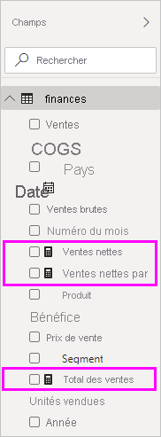
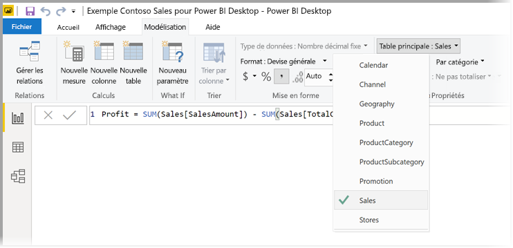

# <a name="create-measures-for-data-analysis-in-power-bi-desktop"></a>Créer des mesures pour une analyse de données dans Power BI Desktop

Power BI Desktop vous aide à créer des analyses de vos données en quelques clics seulement. Mais parfois, ces données n’incluent pas tout ce dont vous avez besoin pour répondre à certaines de vos questions les plus importantes. Les mesures peuvent vous y aider.

Les mesures sont utilisées dans certaines des analyses de données les plus courantes. Vous pouvez définir des résumés simples comme des sommes, des moyennes, des valeurs minimales et maximales ainsi que des décomptes via le volet **Champs**. Les résultats calculés des mesures changent toujours en réponse à votre interaction avec vos rapports, favorisant ainsi l’exploration rapide et dynamique des données appropriées. Examinons cela de plus près. Pour plus d’informations, consultez [Création de mesures](/learn/modules/model-data-power-bi/4b-create-calculated-measures).

## <a name="understanding-measures"></a>Présentation des mesures

Dans Power BI Desktop, les mesures sont créées et affichées dans la *vue Rapport* ou la *vue Données*. Les mesures que vous créez vous-même apparaissent dans la liste **Champs** avec une icône de calculatrice. Vous pouvez nommer les mesures comme vous le souhaitez et les ajouter à une visualisation nouvelle ou existante comme tout autre champ.



> [!NOTE]
> Les *mesures rapides* peuvent également vous intéresser. Il s’agit de mesures prédéfinies que vous pouvez sélectionner à partir de boîtes de dialogue. C’est un bon moyen de créer rapidement des mesures, mais aussi d’apprendre la syntaxe DAX (Data Analysis Expressions), car les formules DAX créées automatiquement peuvent être examinées. Pour plus d’informations, consultez [mesures rapides](desktop-quick-measures.md).
> 
> 

## <a name="data-analysis-expressions"></a>Langage DAX (Data Analysis Expressions)

Les mesures calculent un résultat à partir d’une formule d’expression. Vous utilisez le langage de formule DAX ([Data Analysis Expressions](/dax/)) pour créer vos propres mesures. DAX inclut une bibliothèque de plus de 200 fonctions, opérateurs et constructions. Sa bibliothèque offre ainsi une flexibilité considérable pour créer des mesures afin d’effectuer les calculs nécessaires pour quasiment tout type d’analyse de données.

Les formules DAX sont similaires aux formules Excel. DAX a même de nombreuses fonctions identiques à celles d’Excel, comme `DATE`, `SUM` et `LEFT`. Cependant, les fonctions DAX sont censées fonctionner avec des données relationnelles comme celles qui se trouvent dans Power BI Desktop.

## <a name="lets-look-at-an-example"></a>Examinons un exemple.

Diane est responsable des ventes chez Contoso. Elle a été chargée de fournir les prévisions de ventes des revendeurs au cours du prochain exercice. Diane décide de baser ses estimations sur les montants des ventes de l’année précédente, en appliquant une augmentation annuelle de 6 % résultant des différentes promotions planifiées au cours des six prochains mois.

Pour établir un rapport sur ces estimations, Diane importe les données des ventes de l’année précédente dans Power BI Desktop. Elle trouve le champ **SalesAmount** dans la table **Reseller Sales** (Ventes des revendeurs). Comme les données importées contiennent seulement les montants des ventes de l’année précédente, Diane renomme le champ **SalesAmount** (Montant des ventes) en *Last Years Sales* (Ventes de l’année précédente). Diane fait ensuite glisser le champ **Last Years Sales** sur le canevas de rapport. Il apparaît dans une visualisation de graphique en tant que valeur unique correspondant à la somme de toutes les ventes des revendeurs réalisées l’année précédente.

Diane remarque que même sans spécifier de calcul, il y a en a un qui est fourni automatiquement. Power BI Desktop a créé sa propre mesure en faisant la somme de toutes les valeurs du champ **Last Years Sales**.

Or, Diane a besoin d’une mesure pour calculer les prévisions de ventes pour l’année à venir, qui sont basées sur les ventes de l’année précédente multipliées par 1,06 pour tenir compte de la hausse attendue de 6 % de l’activité. Pour ce calcul, elle doit créer une mesure. À l’aide de la fonctionnalité *Nouvelle mesure*, elle crée une nouvelle mesure, puis entre la formule DAX suivante :

```dax
    Projected Sales = SUM('Sales'[Last Years Sales])*1.06
```

Diane fait ensuite glisser la nouvelle mesure Projected Sales (Ventes prévues) vers le graphique.


Rapidement et avec un minimum d’efforts, Diane a obtenu une mesure pour calculer les ventes prévues. Diane peut aller plus loin dans l’analyse de ses prévisions en filtrant sur des revendeurs spécifiques ou en ajoutant d’autres champs au rapport.

## <a name="data-categories-for-measures"></a>Catégories de données pour les mesures

Vous pouvez également choisir des catégories de données pour les mesures.

Entre autres choses, les catégories de données vous permettent d’utiliser des mesures pour créer dynamiquement des URL et marquer la catégorie de données en tant qu’URL web.

Vous pouvez créer des tableaux qui affichent les mesures comme URL web, puis cliquer sur l’URL qui est créée en fonction de votre sélection. Cette approche est particulièrement utile quand vous voulez créer un lien vers d’autres rapports Power BI avec des [paramètres de filtre d’URL](../collaborate-share/service-url-filters.md).

## <a name="organizing-your-measures"></a>Organisation de vos mesures

Les mesures ont une *table principale* qui définit leur emplacement dans la liste des champs. Vous pouvez choisir un autre emplacement dans les tables de votre modèle.



Vous pouvez également organiser les champs d’une table en *dossiers d’affichage*. Sélectionnez **Modèle** à l’extrême gauche de Power BI Desktop. Dans le volet **Propriétés**, sélectionnez le champ que vous voulez déplacer de la liste des champs disponibles. Attribuez un nom au nouveau dossier dans **Afficher le dossier** pour créer un dossier. La création d’un dossier a pour effet de déplacer le champ sélectionné dans ce dossier.


Vous pouvez créer des sous-dossiers à l’aide d’une barre oblique inverse. Par exemple, *Finance\Currencies* crée un dossier *Finance*, et dans celui-ci, un dossier *Currencies*.

Vous pouvez faire apparaître un champ dans plusieurs dossiers en utilisant un point-virgule pour séparer les noms des dossiers. Par exemple, *Products\Names;Departments* fait apparaître le champ dans un dossier *Departments* et un dossier *Names* à l’intérieur d’un dossier *Products*.

Vous pouvez créer une table spéciale qui contient uniquement des mesures. Cette table apparaît toujours en haut de **Champs**. Pour ce faire, créez une table avec une seule colonne. Vous pouvez utiliser **Entrer des données** pour créer cette table. Déplacez ensuite vos mesures vers cette table. Enfin, masquez la colonne, mais pas la table, que vous avez créée. Sélectionnez la flèche située en haut de **Champs** pour fermer et rouvrir la liste de champs et voir vos modifications.


## <a name="learn-more"></a>En savoir plus

Nous vous avons fourni ici une brève présentation des mesures. Il existe bien d’autres ressources pour vous apprendre à créer les vôtres. Pour plus d’informations, consultez [Didacticiel : Créer ses propres mesures dans Power BI Desktop](desktop-tutorial-create-measures.md). Vous pouvez télécharger un exemple de fichier et suivre pas à pas des leçons vous expliquant comment créer des mesures supplémentaires.  

Pour vous immerger un peu plus dans DAX, consultez [Principes fondamentaux de DAX dans Power BI Desktop](desktop-quickstart-learn-dax-basics.md). La page [Informations de référence sur DAX (Data Analysis Expressions)](/dax/) propose des articles détaillés sur chaque fonction, syntaxe, opérateur et convention d’affectation de noms. DAX est présent depuis déjà plusieurs années dans Power Pivot dans Excel et dans SQL Server Analysis Services. Il existe de nombreuses autres ressources utiles. Veillez à consulter [DAX Resource Center Wiki](https://social.technet.microsoft.com/wiki/contents/articles/1088.dax-resource-center.aspx), où des membres influents de la communauté BI partagent leurs connaissances sur DAX.
