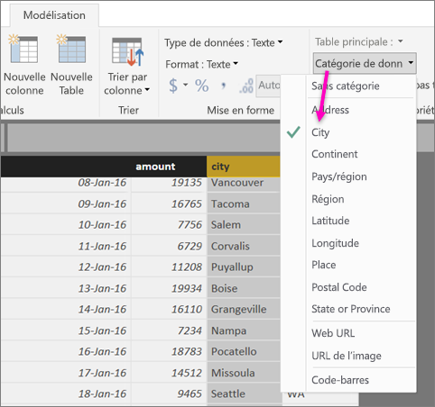
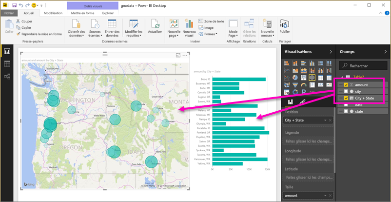
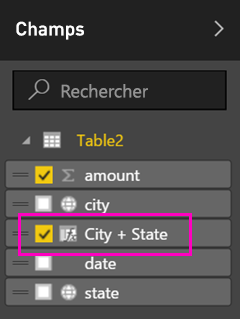

# Définir des filtres géographiques dans Power BI Desktop en vue de les utiliser dans une application mobile
Dans Power BI Desktop, vous pouvez [catégoriser les données géographiques](desktop-data-categorization.md) dans une colonne pour que Power BI Desktop sache comment traiter les valeurs des éléments visuels d’un rapport. Qui plus est, quand vous et vos collègues affichez ensuite ce rapport dans l’application mobile Power BI, Power BI fournit automatiquement les filtres géographiques correspondant à votre emplacement. 

Par exemple, supposons que vous soyez responsable des ventes et en déplacement pour rendre visite à des clients et que vous souhaitiez filtrer rapidement le total des ventes et des profits pour le client avec lequel vous avez rendez-vous. Vous souhaitez détailler les données pour votre emplacement actuel, que ce soit par département, ville ou adresse réelle. Plus tard, vous souhaitez rendre visite à d’autres clients situés à proximité si vous en avez le temps. Vous pouvez [filtrer le rapport en fonction de votre emplacement pour rechercher ces clients](../consumer/mobile/mobile-apps-geographic-filtering.md).

> [!NOTE]
> Dans l’application mobile, vous ne pouvez filtrer par emplacement que si les noms géographiques qui figurent dans le rapport sont en anglais, par exemple « New York City » ou « Germany ».
> 
> 

## Identifier les données géographiques de votre rapport
1. Dans Power BI Desktop, passez à Vue de données .
2. Sélectionnez une colonne de données géographiques, par exemple une colonne Ville.
   
    
3. Dans l’onglet **Modélisation**, sélectionnez **Catégorie de données**, puis la catégorie appropriée, c’est-à-dire **Ville** pour notre exemple.
   
    
4. Définissez des catégories de données géographiques pour tous les autres champs du modèle. 
   
   > [!NOTE]
   > Vous pouvez définir plusieurs colonnes pour chaque catégorie de données dans un modèle, mais dans ce cas le modèle ne peut pas effectuer de filtrage géographique dans l’application mobile Power BI. Pour utiliser le filtrage géographique dans les applications mobiles, définissez une seule colonne pour chaque catégorie de données, par exemple une colonne **Ville**, une colonne **Département ou région** et une colonne **Pays**. 
   > 
   > 

## Créer des visuels avec vos données géographiques
1. Passez au mode Rapport , puis créez des visuels qui utilisent les champs géographiques de vos données. 
   
    
   
    Dans cet exemple, le modèle contient également une colonne calculée qui affiche la ville et l’État dans une même colonne. En savoir plus sur la [création de colonnes calculées dans Power BI Desktop](desktop-calculated-columns.md).
   
    
2. Publiez le rapport dans le service Power BI.

## Afficher le rapport dans l’application mobile Power BI
1. Ouvrez le rapport dans une [application mobile Power BI](../consumer/mobile/mobile-apps-for-mobile-devices.md).
2. Si vous êtes dans un emplacement géographique avec des données dans le rapport, vous pouvez le filtrer automatiquement en fonction de votre emplacement.
   
    

En savoir plus sur le [filtrage d’un rapport par emplacement dans les applications mobiles Power BI](../consumer/mobile/mobile-apps-geographic-filtering.md).

## Étapes suivantes
* [Catégorisation des données dans Power BI Desktop](desktop-data-categorization.md)  
* Des questions ? [Essayez d’interroger la communauté Power BI](https://community.powerbi.com/)
