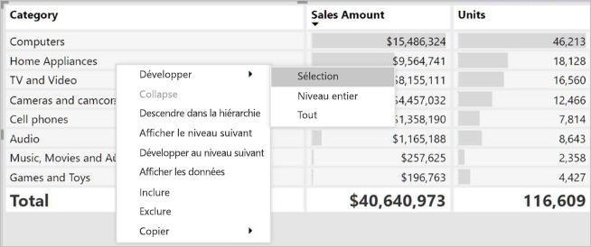
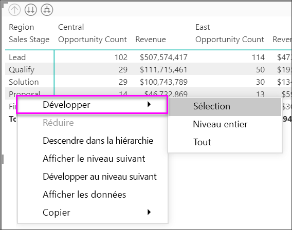
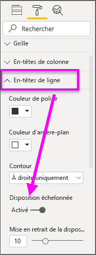

# Utiliser le visuel de matrice dans Power BI
Le **matrice** visual est similaire à un **table**.  Une table prend en charge 2 dimensions et les données sont plates, les valeurs en double sens sont affichés et non agrégées. Une matrice rend plus facile afficher des données de manière significative entre plusieurs dimensions, il prend en charge une disposition échelonnée. La matrice agrège les données automatiquement et permet l’exploration vers le bas. 

Vous pouvez créer des visuels de matrice dans **Power BI Desktop** et **service Power BI** rapports et éléments de mise en surbrillance croisée dans la matrice avec d’autres visuels sur cette page de rapport. Par exemple, vous pouvez sélectionner des lignes, colonnes et cellules et croisée. En outre, les cellules individuelles et plusieurs sélections de cellule peuvent être copiées et collées dans d’autres applications. 

De nombreuses fonctionnalités sont associées à la matrice, que nous allons passer en revue dans les sections suivantes de cet article.

## Comprendre comment Power BI calcule les totaux

Avant de passer à l’utilisation du visuel **Matrice**, il est important de comprendre comment Power BI calcule les valeurs des totaux et des sous-totaux dans les tables et les matrices. La mesure des totaux et des sous-totaux est évaluée sur toutes les lignes dans les données sous-jacentes : il ne s’agit *pas* d’une simple addition des valeurs des lignes visibles ou affichées. Les valeurs obtenues dans la ligne du total peuvent donc être différentes de ce à quoi on pourrait s’attendre. 

Examinons les éléments visuels de matrice suivants. 

Dans cet exemple, chaque ligne dans la visuel plus à droite de la matrice affiche le *quantité* pour chaque combinaison vendeur/date. Toutefois, dans la mesure où chaque vendeur apparaît sur plusieurs dates, les chiffres sont susceptibles de s’afficher plusieurs fois. C’est pourquoi le total exact calculé à partir des données sous-jacentes n’est pas égal à la simple addition des valeurs visibles. Il s’agit d’un modèle courant, selon lequel la valeur additionnée correspond à l’élément de l’ensemble de départ dans une relation multivoque.

Lorsque vous étudiez les totaux et les sous-totaux, n’oubliez pas que ces valeurs sont basées sur les données sous-jacentes, et pas seulement sur les valeurs visibles. 

<!-- use Nov blog post video

## Expanding and collapsing row headers
There are two ways you can expand row headers. The first is through the right-click menu. You’ll see options to expand the specific row header you clicked on, the entire level or everything down to the very last level of the hierarchy. You have similar options for collapsing row headers as well.

You can also add +/- buttons to the row headers through the formatting pane under the row headers card. By default, the icons will match the formatting of the row header, but you can customize the icons’ color and size separately if you want. 
Once the icons are turned on, they work similarly to the icons from PivotTables in Excel.

The expansion state of the matrix will save with your report. It can be pinned to dashboards as well, but consumers will need to open up the report to change the state. Conditional formatting will only apply to the inner most visible level of the hierarchy. Note that this expand/collapse experience is not currently supported when connecting to AS servers older than 2016 or MD servers.

Watch the following video to learn more about expand/collapse in the matrix:

-->
## À l’aide d’exploration vers le bas avec le visuel de matrice
Avec le visuel de matrice, vous pouvez effectuer toutes sortes d’intéressant d’extraction vers le bas les activités qui n’étaient pas disponibles avant. Vous pouvez notamment descendre dans la hiérarchie en utilisant les lignes, les colonnes, voire des sections et cellules individuelles. Voyons comment ces opérations fonctionnent.

### Descendre dans la hiérarchie sur des en-têtes de ligne
Dans le volet **Visualisations**, lorsque vous ajoutez plusieurs champs à la section **Lignes** du puits **Champs**, vous permettez la descente dans la hiérarchie sur les lignes du visuel Matrice. Cette opération est similaire à la création d’une hiérarchie, qui vous permet de descendre (et remonter) dans cette hiérarchie et d’analyser les données à chaque niveau.

Dans l’image suivante, le **lignes** section contient *Sales stage* et *taille d’opportunité*, création d’un regroupement (ou hiérarchie) dans les lignes qui nous pouvons extraire.

Lorsque le visuel comporte un regroupement créé dans la section **Lignes**, le visuel lui-même affiche les icônes *Explorer* et *Développer* dans l’angle supérieur gauche du visuel.

À l’instar du comportement des fonctions Explorer et Développer dans d’autres visuels, ces boutons permettent de descendre (ou remonter) dans la hiérarchie. Dans ce cas, nous pouvons descendre de *Sales stage* à *taille d’opportunité*, comme illustré dans l’image suivante, où le zoom à l’icône d’un niveau (hiérarchie forme de fourche) a été sélectionné.

Outre l’utilisation de ces icônes, vous pouvez sélectionner un de ces en-têtes de ligne et descendre en choisissant dans le menu qui s’affiche.

Notez que ce menu affiche quelques options qui produisent des résultats différents :

En sélectionnant **Descendre** développe la matrice pour *qui* niveau de ligne *à l’exclusion* tous les autres en-têtes de ligne à l’exception de l’en-tête de ligne qui a été sélectionné. Dans l’image suivante, **proposition** > **Descendre** a été sélectionné. Vous pouvez constater que d’autres lignes de niveau supérieur n’apparaissent plus dans la matrice. Cette manière d’explorer est utile et s’avèrera particulièrement appréciable lorsque nous aborderons la section **Sélection croisée**.

Sélectionnez le **monter** icône revenir à la vue de niveau supérieur précédente. Si vous sélectionnez ensuite **proposition** > **afficher le niveau suivant**, vous obtenez une liste croissante de tous les éléments de niveau suivant (dans ce cas, le *taille d’opportunité* champ), sans la catégorisation de hiérarchie de niveau supérieur.

Sélectionnez le **monter** icône dans le coin supérieur gauche pour que la matrice affiche toutes les catégories de niveau supérieur, puis sélectionnez **proposition** > **développer au prochain niveau**, à voir toutes les valeurs pour les deux niveaux de la hiérarchie - *Sales stage* et *taille d’opportunité*.

Vous pouvez également utiliser le **Expand** élément de menu afin de contrôler davantage l’affichage.  Par exemple, sélectionnez **proposition** > **Expand** > **sélection**. Power BI affiche une ligne de total pour chaque *Sales stage* et tout le *taille d’opportunité* options pour *proposition*.

### Descendre dans la hiérarchie sur des en-têtes de colonne
Similaire à la capacité à parcourir des lignes, vous pouvez également rechercher dans **colonnes**. Dans l’image suivante, il existe deux champs dans le **colonnes** zone des champs, la création d’une hiérarchie similaire à ce que nous avons utilisé pour les lignes plus haut dans cet article. Dans le **colonnes** puits du champ, nous avons *région* et *Segment*. Dès que le deuxième champ a été ajouté à **colonnes**, un nouveau menu de liste déroulante affiché sur l’élément visuel, il affiche actuellement **lignes**.

Pour Explorer sur les colonnes, sélectionnez **colonnes** à partir de la *Explorer* menu se trouve dans le coin supérieur gauche de la matrice. Sélectionnez le *East* région et choisissez **Descendre**.

Lorsque vous sélectionnez **Descendre**, le niveau suivant de la hiérarchie de colonne pour *région > East* affiche, qui dans ce cas est *nombre d’opportunités*. L’autre région affiche, mais est grisée.

Le reste des éléments de menu opèrent sur les colonnes de la même façon que pour les lignes (voir la section précédente, **examen approfondi d’en-têtes de lignes**). Vous pouvez **afficher le niveau suivant** et **développer au prochain niveau** avec des colonnes, comme vous pouvez le faire avec les lignes.

> [!NOTE]
> Les icônes Descendre dans la hiérarchie et Monter dans la hiérarchie dans l’angle supérieur gauche du visuel de matrice s’appliquent uniquement aux lignes. Pour descendre dans la hiérarchie sur des colonnes, vous devez utiliser le menu contextuel.
> 
> 

## Disposition échelonnée avec des visuels de matrice
Le visuel **Matrice** met automatiquement en retrait les sous-catégories dans une hiérarchie sous chaque parent. C’est ce qu’on appelle une **Disposition échelonnée**.

Dans la version *d’origine* du visuel de matrice, les sous-catégories s’affichaient dans une colonne tout à fait distincte, occupant beaucoup plus d’espace que le visuel. L’image suivante présente le tableau dans le visuel **Matrice** d’origine. Vous pouvez constater que les sous-catégories apparaissent dans une colonne distincte.

Dans l’image suivante, vous voyez un visuel **Matrice** avec une **Disposition échelonnée** en action. Notez que les sous-catégories (Accessoires d’ordinateur, Ordinateurs de bureau, ordinateurs portables, Moniteurs, etc.) de la catégorie *Ordinateurs* apparaissent légèrement en retrait, produisant un visuel plus clair et plus concentré.

Vous pouvez aisément ajuster les paramètres de la disposition échelonnée. Le visuel **Matrice** étant sélectionné, dans la section **Format** (icône de rouleau à peinture) du volet **Visualisations**, développez la section **En-têtes de ligne**. Vous avez deux options : la bascule **Disposition échelonnée** (qui active ou désactive cette option) et le **retrait de la disposition échelonnée** (qui spécifie l’importance du retrait en pixels).

Si vous désactivez l’option **Disposition échelonnée**, les sous-catégories s’affichent dans une autre colonne au lieu de s’afficher en retrait sous la catégorie parente.

## Sous-totaux avec les visuels Matrice
Vous pouvez activer ou désactiver des sous-totaux dans les visuels Matrice, aussi bien pour les lignes que les colonnes. Dans l’image suivante, vous pouvez voir que les sous-totaux de ligne sont définis sur **On (Activé)** .

Dans la section **Format** du volet **Visualisations**, développez la carte **Sous-totaux** et définissez le curseur **Sous-totaux des lignes** sur **Off (Désactivé)** . Lorsque vous procédez ainsi, les sous-totaux ne sont pas affichés.

Le même processus s’applique pour les sous-totaux des colonnes.

## Sélection croisée avec des visuels de matrice
Avec le visuel **Matrice**, tous les éléments de la matrice peuvent être sélectionnés comme base pour une sélection croisée. Lorsque vous sélectionnez une colonne dans un visuel **Matrice**, cette colonne s’affiche en surbrillance, comme tous les autres visuels sur la page de rapport. Ce type de sélection croisée est une fonctionnalité courante d’autres visuels et sélections de point de données et est à présent également disponible pour le visuel **Matrice**.

De plus, la combinaison Ctrl+Clic fonctionne également pour la sélection croisée. Par exemple, dans l’image suivante, une collection de sous-catégories a été sélectionnée dans le visuel **Matrice**. Notez comment les éléments non sélectionnés dans le visuel sont grisés, et comment les autres visuels de la page reflètent les sélections opérées dans le visuel **Matrice**.

## Copie des valeurs à partir de Power BI pour une utilisation dans d’autres applications

Votre matrice ou votre table peuvent avoir un contenu que vous aimeriez utiliser dans d’autres applications, comme Dynamics CRM, Excel et même d’autres rapports Power BI. Avec le clic droit Power BI, vous pouvez copier une cellule unique ou une sélection de cellules dans votre Presse-papiers et les coller dans l’autre application.

* Pour copier la valeur d’une cellule unique, sélectionnez la cellule, cliquez avec le bouton droit, puis choisissez **Copier la valeur**. Avec la valeur de cellule non mise en forme dans votre Presse-papiers, vous pouvez maintenant la coller dans une autre application.

    

* Pour copier plusieurs cellules, sélectionnez une plage de cellules ou utilisez la touche CTRL pour sélectionner une ou plusieurs cellules. La copie inclut les en-têtes de colonne et de ligne.

    

## Couleurs d’ombrage et de police avec les visuels Matrice
Avec le visuel de matrice, vous pouvez appliquer **mise en forme conditionnelle** (couleurs et ombrage et barres de données) à l’arrière-plan des cellules de la matrice et vous pouvez appliquer la mise en forme conditionnelle au texte et aux valeurs elles-mêmes.

Pour appliquer la mise en forme conditionnelle, sélectionnez la matrice visual et ouvre le **Format** volet. Développez le **mise en forme conditionnelle** carte et pour **couleur d’arrière-plan**, **couleur de police**, ou **barres de données**, définissez le curseur à **Sur**. Une des options suivantes sous tension affiche un lien pour *contrôles avancés*, qui vous permet de personnaliser les couleurs et les valeurs pour la couleur de mise en forme.
  
  

Sélectionnez *contrôles avancés* pour afficher une boîte de dialogue qui vous permet d’effectuer des ajustements. Cet exemple montre la boîte de dialogue pour **barres de données**.

## Étapes suivantes

[Nuages de points et graphiques en bulles dans Power BI](power-bi-visualization-scatter.md)

[Types de visualisation dans Power BI](power-bi-visualization-types-for-reports-and-q-and-a.md)